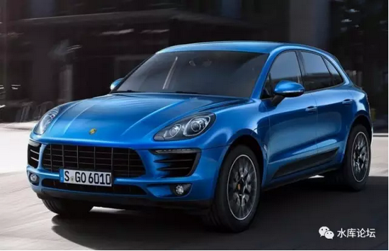
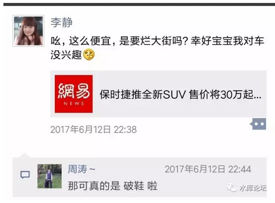
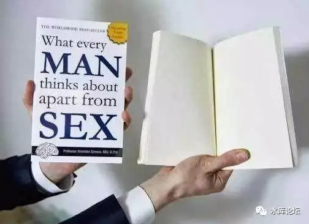
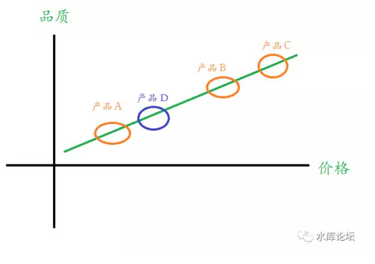

# 怎样把品牌做死掉 \#F1180

原创： yevon\_ou [水库论坛](/) 2017-06-24

怎样把品牌做死掉 ~\#F1180~
==========================

 

讲一下"品牌延伸线"的道理。

 

 

一）       断更

 

看了一下，六月份一共只"推送"了二篇文章。汗涔涔啊。

不更新就不涨粉，广告收入也少了。哥哥也不想的。

 

 

其实写文的篇幅不算少。写了《没有买卖，就有杀戮》

《社保划算，还是商业保险划算》

《正本清源说奥派》1\~4更。

 

只不过这些文章都没有推送。因为近期"气氛"实在不好。风声鹤吠。

继上周大规模封号之后，昨天早上又有一个兄弟号被封。

在这个战火纷飞的岁月里，还能坚持和各位打个招呼。就算敬业的了。

 

 

想了一想，楼市是万万不敢写。咖啡太苦，您点菜，我也不敢写啊。

"历史"其实也不能写，禁讳太多。

要不我写"科幻"吧，硬物理哥哥也是好手。但是《一千万个幸运》还是不能发表。

 

思来想去，本篇我们写Marketing.

 

 

 

二）       保时捷

 

前二天，一条新闻吸引了我的注意。

 

 

学marketing的人，真心人生毫无乐趣。

看个电影吧，还能联想到《[美国大片加速走向屌丝化](http://mp.weixin.qq.com/s?__biz=MzAxNTMxMTc0MA==&mid=2651015767&idx=1&sn=2d215e47b437a8bcbb486a51ce09a83f&chksm=80721c44b705955299c939cee9ddf496172ef91d4a3c4315f10d0887c1b31776339795c7558e&scene=21#wechat_redirect)》~\#F1030~

看了这条新闻，懂企业管理的人都心知肚明。保时捷要搞Line Extension了。

简称LE。

 

 

什么叫Line Extension呢。我们先讲个故事。

话说2013年4月份的时候，有位叫Robert Galbreith的作者，写了一本新书《The
Cuckoo\'s Calling》

这本书在英国的网站上，被评为4星。成绩也不算太差。二个月卖了1500本。\[1\]

 

眼看惨淡，出版社坐不住了。有一个员工"意外"地泄露了，罗伯特是一个笔名。真正的作者，却是大名鼎鼎的J.K.罗琳。

 

当周周末，这本书的销量，已经翻了150000%倍。

涨到2250000本，位列Amazon第一位。

 

这是一个非常有趣的故事。它告诉了我们，怎样才能"成功"。

为什么同样的商品，小说。

冠以无名作家Robert时就卖不动，署J.K.罗琳名字，立刻就疯狂大卖呢。

-   因为消费者吃品牌。

-   消费者吃J.K.罗琳的品牌。

 

 

如果你出差商旅客，你常常会看见"长得出奇"的酒店名字。

-   重庆[万达] [艾美]酒店

-   北京海淀 [永泰] [福朋] [喜来登]{.underline}酒店

-   漳州 [融信] [皇冠假日]酒店

 

双拼还算好了。甚至有三拼，四拼。

从学术上来讲，这被称为"子品牌"策略。

 

卖的是喜来登，可是又和万达合作。融信则是地方财团，一般是持固定资产的大房东。

 

 

三）       Line Extension

 

"子品牌"有非常大的好处。一个显而易见的优点，子品牌很容易活下来。

 

J.K.罗琳 \-\-\--\> 哈利波特

J.K.罗琳 \-\-\--\> 杜鹃呼唤

 

"哈利波特"是一个非常成功的产品。连带着，J.K.罗琳也是一个非常成功的品牌。

用AB带AC，"杜鹃呼唤"因此也可以卖几百万本。

 

 

许多人对商场的"残酷性"没有概念。以为创业如温室里的花朵。

目前在中国市场，如果你想创造一个"知名"品牌，无论任何品牌，只要你说得出[名字]。

 

任何一款产品，哪怕象"浪奇""小熊猫"这样你完全没有美誉度，也绝对不可能去购买的品牌。

只要十亿人民都喊得出名字，他的成本就是：￥5亿元

 

 

能让消费者，在Walmart数以千计的货架上，留下记忆的任何一个品牌。

它的成本，就是5亿元。

广告投放，至少要达到5亿元的数量级。

 

 

广告这玩意，就是一麻袋一麻袋钞，钞票当火烧。

你做一个App，指望全中国的人都知道。光这个"名气"，你就得拿5亿去烧。

 

 

为了节约"品牌"名气，所有的厂商，都绞尽脑汁降低着成本。

一个最常见的做法，就是以"母品牌\-\--子品牌"，大带小的方式去推广。

 

好比说，"四川长虹"是以电视机起家的。长虹TV口碑不错。

但是你上京东搜一下，长虹空调，长虹冰箱，长虹洗衣机，长虹电风扇，甚至还有长虹手机............

 

 

在欧美几个大牌中，LV以包包出名，Dior主要做繁饰，Chanel香水，Hermes皮制品。

可是Dior现在也出香水，LV做女装，Hermes甚至卖家居。

 

大家的产品线，都是"彩电+冰箱+洗衣机+空调"，白色家电齐全。

奢侈品大牌，也是特色混淆。再看不清主营业务。

为什么？

 

 

原因就是，你首先要有一个很成功的品牌。第一个成功是最难的，而且要靠运气。

但是在原有的品牌基础上，你再搞一个LineExtension，子品牌延伸，就会容易很多。\[2\]

-   Dior香水

-   Dior唇膏

-   Dior腕表

-   Dior珠宝

-   Dior手袋

 

 

 

四）       LE的好处和坏处

 

Line Extension的好处和坏处一样明显。

好处是：极易赚钱，几乎就是棵摇钱树。

坏处是：损害核心品牌。

 

 

香港的倪匡当年被誉为"白字天书"。意思是，因为在《卫斯理》系列的巨大成功。粉丝们衷心拥护。

哪怕倪匡的下一部作品是白纸，照样都会全城热销。

 

 

听起来很伟大。倪匡也的确这么干的。

为了赚钱，他以光速般的写作速度，又出了《原振侠系列》《花木兰系列》。

大烂书，连我都看不下去。倪匡的名誉也砸了。

 

 

同样道理，"哈利波特"是一部巨大的成功作品。围拢起了庞大的粉丝群。死忠骨灰粉丝，衍生了无数周边。

这保证了J.K.罗琳的名誉。和她下一部作品的热销。

 }

但是J.K.罗琳 \-\-\--\> 杜鹃呼唤，并不是一部很成功的作品。

在收获了250万册销量及金钱版税的同时，也在消耗着自己的粉丝基础。

 

 

让我们看Porsche。

保时捷无疑在中国车迷心目中，拥有非常崇高的地位。极高的美誉度。

 

Porsche如果出30万元"低端"的入门级产品；

一定可以大卖，为集团赚一大笔钱。

但是会损害到保时捷"尊贵体面"的核心商誉。\[3\]

 

懂Marketing的人一看到这新闻，顿时心知肚明。

公司里一定是CFO压倒了CEO，又或者某些基金公司插手。

KPI变成了主要考核指标。

 

 

 

五）       市场营销中LE的地位

 

"市场部"是整间公司的大脑。对于市场部，我们通常会画这样一张表格。

 

横轴表示"价格"，竖轴表示"品质"。

绿线依次由低到高。

 

通常情况下，任何企业都不可能靠一款"产品"，来覆盖全部的市场。

譬如汽车市场，A，B，C，E，S就是不同汽车等级。

100W和10W，绝对不是同一款车

 

 

 

此外，资本家都是很贪婪的。

华尔街都是很残酷的。对业绩的索取，分秒都不会停止。

 

时间久了，Line
Extension不可避免。公司迟早要把所有的"细分市场"都填满。[\[4\]]

 

对于市场部而言，他唯一真正头疼的，是Line
Extension要不要用回母公司的名字。

 

我们知道，小米手机雷军在刚刚起步的时候，小米的卖点是"超高性价比"。

1499元的定位，但是小米手机可以做到"低价高配"。性价比远远抛出竞争对手一个时代。

 

这个巨大的创意，带给小米公司惊人的成功，海量的销售额和利润。以及一大群Geek级别的粉丝拥趸者。

 

 

可是此后"小米"又成立了一整打的事业部，进入了一系列新的行业领域。甚至诞生了所谓"小米全家桶"，包括但不限于；\[5\]

 

净水器，空气净化器，台灯，电视机，电灯泡，插线板，乳胶弹簧床垫，沙发，枕头，袜子，电动牙刷，滤水壶，咖啡机，儿童手表，加湿器，投影仪，小冰箱，无人机............

 

 

这些东西，都属于典型的Line Extension。

当一个"平平无奇"的代工品牌，贴上"小米"的招牌，再加一个Wifi芯片，顿时可以卖出几倍的毛利。

 

所有的外围"毛利"。都靠母品牌拉动。

弄砸了就吸母品牌的血。

 

 

我相信，当一个品牌经理，看到"咖啡壶""热水器"事业部。也过来要求使用"小米咖啡壶""小米热水器"品牌名。

心里一定是翻江倒海，恨不得砍人的。

 

这些平庸无奇的产品，严重伤害了"小米"的品牌价值。

但是却提升了集团的总利润。

 

 

 

六）       公司的态度

 

许许多多年之前，当我作为Marketing的培训生，在上企业级的Trainin培训课时。教官就提了一个问题：

 

-   Windows基本是被鲍尔默玩死掉的。他在Windows上捆绑了太多的目标，为了带动微软其他产品线。

-   QQ基本是被腾讯玩死掉的。为了带动"腾讯全家桶"，QQ才变得如此臃肿不堪。

-   支付宝是给马云玩死掉的，可怜的支付宝社交。

-   只有微信，因为张小龙的一再坚持。还能保持简练。

 

教官问："对核心品牌的伤害，和LE扩展利润之间，企业应该选哪一个"。

 

 

长期利益，和短期利润之间，应该选择哪一个。

作为一个中国人，我几乎不假思索地，立刻按照[东方文化]给出了答案:

"各有千秋。如果一定要选择的话，捍卫长期利益"。

嗯，因此我就毫不客气地，被吃了一个叉✘。

 

 

请记住教官的教导。这个问题的正确答案是：

把品牌做死掉！

当我第一次知道这个答案时，俺直接从凳子上摔了下来。太过于震惊，以至于十几年后记忆犹新。

 

 

教官对此的解释是，"品牌"并不是真正的财富，品牌并不是美金。

就好比上次去爱建园朋友家。朋友有一块光绪二十六年的普洱茶饼。价值200W人民币。

 

这么珍贵的茶饼，你是否应该捧着跪着，好好奉献在保险箱里供着呢。

不是的。我去了以后，李先生把茶饼掰碎了喝茶，请大家喝茶。

这样连续喝了二十几天，渐渐地也喝光了。

 

 

对此，李先生的解释是："茶饼并不是真正的财富，茶才是"。

把大块的茶饼，以最合理的热水，最典雅的茶具，和朋友们一起喝光，这才是对"老茶"的最大化利用。

而如果你把茶饼跪着奉着，锁在保险箱里。则你的生活水平并没有任何提高。

-   这才是东方思维和西方思维的核心差异。

-   饥饿民族和商业民族的三观迥异啊。

 

 

同样道理，对于"品牌"这样东西。如果你细心维护，Bigger格很高，则他并不能带给你很高的利润。

就象"茶饼"一样。你要把茶饼掰碎了，一点一点泡茶喝到肚子里。茶饼最终消失殆尽，这才是消费最大化的做法。\[6\]

 

 

对于品牌运作，要一点点抽母品牌的血。有序地，精致地，把无形品牌卖成有形金钱，最终把品牌做死掉。这样才是利益最大化的做法。

 

 

今天诸位喜爱的LV，Prada，Gucci等诸大品牌。

终有一点，也会沦为街货烂大街，没有任何品牌价值。

如果在公司倒闭之前\[7\]，品牌没有卖到零。这才是对公司最大的不负责任。

 

 

七）       彩蛋时间

 

铺垫了这么久，真心辛苦。其实我们只想说一句话：

 

各位，水库要搞一个轻微的Line Extension。

 

薪火相传，部分也是因为微信太危险，太容易封号。

具体是什么东西，下篇再讲。谢谢各位。

 

 

 

（yevon\_ou\@163.com，2017年6月23日晚）

 

要不是为了发这篇广告，这个月都不想露头

\[1\] 还记得电影《2012》么。里面被笑成渣的作者卖了420本。

\[2\] 1947年2月，二战结束后第一个时装展。当时欧洲刚经历了二战，以短裤短袖节约布料为主。Dior大胆地使用法国宫廷式极端繁复奢靡的时装设计，获得轰动。奠定了时装界的地位。

\[3\] 上一个牺牲者是华晨宝马。

\[4\] 在这方面，最臭名昭著的是Dell。甚至有人说Dell的细分市场，比汉字还多。

\[5\] 《当所有人都知道小米全家桶有多少，需要多少钱的时候......》https://www.zhihu.com/question/61155255/answer/185353971

\[6\] 一条蓝鳍金枪鱼，可以价值\$20000美金。可是只有切成刺身，卖给赏识的消费者，才算是真正的回收和安全。

一块茶饼，只有泡成3000杯\*1000元/杯的茶，才是真正的安全。

\[7\] 这一代消费者死光之前。产业变迁之前。
