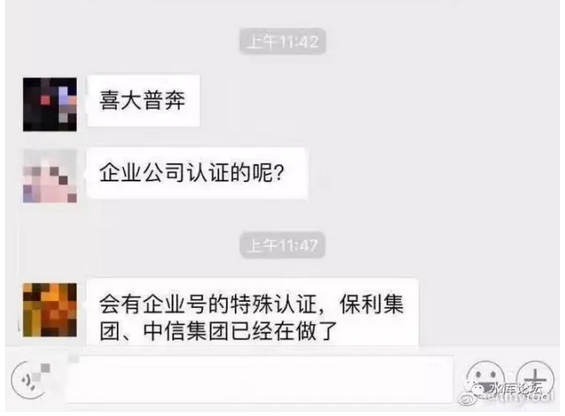
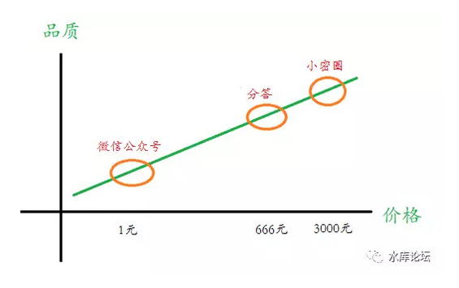

# 水库赚钱之道 \#F1190

yevon\_ou [水库论坛](/) 2017-07-03

水库赚钱之道 ~\#F1190~
======================

水库论坛怎样赢利

 

首先，给大家看一个网络传言。只转不评，不负责鉴别真假。

因为六月的"封号风波"，我们已尽量克制。整个六月一共只推送了三篇文章。

目前，水库拼命地扩充产品线，添加备份号。也是为了防失联。

说不定哪一天网络上的人，熟悉的角落，就再也找不到了。

望切记！

 

一）       小龙虾

 

话说这二天好吃懒做，晚上跑到甜水园吃小龙虾。1.5两/个嚼起来美味。

吃完之后买单，店员再三殷勤地要求我"加会员"，说是有考核指标。

 

我看了一下，吃了500元的小龙虾。

-30元：会员价九四折

-60元：首次注册优惠券

=410元，实际支付。

 

也就是说，店家为了获取一个"会员"。成本已经飙升至不可思议的90元。

而店家的收益呢，仅仅是一个"微信号码+手机号码"罢了。

 

 

回来的路上，俺不由得感慨。"移动互联网"野蛮生长时代真的已经过去了。

手机越来越饱和，流量越来越昂贵。

人们最终不需要一大堆的订阅号，人们只需要最棒的几个号就可以了。

 

 

二）       产品线

 

 "水库论坛"是房地产领域的绝对大号。从任何一个方面看，都肯定进全国前三。

 

如果，假设，咳咳，出于某种财务目的。

我们想要P2P（Path to profit），请问应该如何处理。

 

方法无非二个：

拓展用户基数 \* 扩大单个消费

 

 

如图。我们来看一下"水库"的产品线。

水库的基础，是一个"微信公众号"。目前大约有22W用户。但是打开率非常高，平均有近6W阅读。

微信的公众号，是完全免费的。65%的订阅者来自于"北上广深"一线城市。

 

 

但是，"公众号"其实是一门不赚钱的生意。众多想在微信中掘金的群主，最终都以惨淡收场。

微信最核心的"打赏"功能，惨淡到什么程度呢。

 

象水库这么"篇篇上乘"，而且有一群核心粉丝的拥趸。

我们一年1700万次阅读。打赏一共只有：140000元。

每次阅读0.01元都不到。

 

 

在奥派的好友中，有一位"冯学荣"老师。他的《冯学荣读史》也是赫赫有名的经典。书都出了好几本。

 

可是冯老师痛苦的是，"微信名望"和现实生活中的金钱，完全不能挂钩。

无论冯老师的阅读量再高，"微信名望"并不能轻易转换成RMB。

学历史固然是好东西，可是又有谁会花钱去听"历史"呢。

 

 

三）       房地产

 

幸运的是，水库的行业，是"房地产"。

在奥派聚会几个人之中，搞"学术"都挺清贫的。只有庸俗的房地产最赚钱。

 

一直有人问，"水库"教了那么多的东西。

而且都是真经，保证都是真话。毫无保留的全套心法。

你把技巧都教完了，你拿什么赚钱。

 

其实不用担心。

学问之道，就象这个圆。

 

你知道的越多，你不知道的越多。

圆的面积越大。"不知道"的接触，周长反而更大。

 

 

就以"房产"为例。

一个从来没有接触过水库的人，幼稚会说："房产，最没有科技含量了。跑到售楼处买一套即可"。

 

而你接触了水库之后，你才知道有"板块轮动"。现在热门的板块，未来未必再热门。甚至有可能买在最热最高位。

 

 

又譬如说，户型价位段如何选择。"品牌"开发商涨得快，还是CEO坑盘。

本地人/外地人/外国人，消费购买人群的划分。

贷款的应用。

筹款的方法。

 

你越是接触得多，你越是发现，里面学问无穷。

到后来简直浩瀚如烟海，每一寸每一个角落都可以优化。

 

 

"贷款办不下来，信贷员突然说85折升为95折，该如何应对"。

"广佛地区，哪家评估最高"。

"建行放款要晚三个月，房东快要爆炸。该如何哭晕认怂"。

 

你知道的越多，你不知道的越多。

 

 

在这个基础上，才有了水库第二，和第三个产品。[\[1\]]

即"分答"和"小密圈"。

 

  -- --
     
  -- --

 

 

 

如图，"分答"目前是666一个问题。含一分钟回复+一分钟追问。

去年一年，回答了1000个问题，700000偷听。

收入远远超过"微信打赏"N倍。

 

"小密圈"则是另一个产品。相当于"微信收费群"。

目前群费是3000元/年，排名遥遥领先。

 

 

 

四）       产品线的缺陷

 

-   "微信公众号"+"分答"+"小密圈"。

-   免费+666一个问题+3000包年

 

这样的产品线，缺点是什么呢。

对的，明眼人一眼就看出：太贵！

 

 

如图，我们其实缺乏一个"低端"产品，来覆盖299元/半年的市场。

一直都有人问我：

 

**"老师，你们的水库论坛很好。我也有很多问题想要学习"。**

**\
**

**"但是3000元/年的费用实在太贵了。我还是个学生，消费不起"。**

 

最简单的说，"知乎"上面的人，就肯定一个都不是目标客户。

能花3000元入"虚拟社区"的人，自然是社会有钱有闲阶层。

 

目前水库核心小密圈，A8.5\~A9满天飞，妖魔鬼怪。

前天"金融八卦女"还转了一个年薪400W的帖子。

 

 

出于某些特殊的原因，水库近期想开拓"低端"市场。

覆盖尽可能多的弱势群体。

 

-   居住在三四线城市为主

-   从未接触A8以上异形

-   对房地产彻底一无所知

-   年薪80000以下

 

 

 

五）       十动然拒

 

"分答"上一个产品"小讲",并不是很成功的产品。

姬十三突围之余，也想搞小密圈一样的付费社群。

 

 

分答的小妹妹找到我，画图加解释，详细描述了水库"产品线"的缺陷。苦口婆心要求我开299/半年初级班。

哥哥十分动心，然后拒绝了她。

 

{暖暖照片}

 

哥哥拒绝的理由十分简单；

Line Extension第一条准则：LE绝不可以损伤到现有产品。

 

哥哥目前在小密圈的日子很滋润，每天也有好几笔粉丝入会收入。

躺着数钱，肥肠满脑。

无论如何，我也不想得罪掉小密圈的客户。

小密圈才是核心。才是尊贵金主。VIP尊享待遇无可撼动。

 

 

再说我答小密圈也很累了。

哪怕再开第二个圈，都没有精力。哥哥人工很贵的，让我伺候屌丝，没门！

 

 

分答回去想了很久，小妹妹皱着眉头给我提了第二条建议：

让你徒弟教！

哥哥从椅子上摔了下来。

 

 

就好比你去"少林寺"武术班学习的话，真正的大师是不出面的。

虽然挂了一个名头。

教拳，只让大师兄教。

 

 

《分答付费房产社区》遵循同样的道理。

我们知道，"水库微信群"里，一直有这样一个组织，叫做"共读社"。

 

[阿懒]，[杨荷]，[海川]{.underline}诸人，每当有一篇新的"水库文章"发表。他们就会聚集在一起，互相讨论；

"这个案例我也经历过"。

"原来还可以这样"。

"那下一次我们可以............"

 

 

这样一个组织，相当于一个"读后感"的组织。

 

因为水库所有的文章，都已经是公开的。

你如果想再卖一遍，就只能卖读后感。

 

 

六）       分答付费社区

 

各位：

《分答付费社群》目前定下来的架构是：

1）           收费299元/半年。

2）           以yevon\_ou挂名，并承诺时常来看看。

3）           承诺有专门为"分答"写的原创文章。

4）           由阿懒（朱业胜）老师主笔，负责主要管理

5）           面对三四线小白，从第一课讲起。

6）           原课程公开。卖点是"读后感"和"理论结合实际"。帮助初学者更好的理解。

7）           我们会另邀请二位重量级的嘉宾，常驻驻场。

 

 

可见，这是一款和"小密圈"完全隔离的产品。我最最最注重的，就是不要得罪小密圈的VIP们。

 

 

Line Extension从来不是一件好事。

任何一件LE的背后，收获了商业的"金钱费"。却遭来一堆骂名，以及其他产品线的不满意。

 

小心翼翼地跨出了这一小步。因为我真的很想，把奥派传进三四线小城市。

 

 

分答第一轮，一共五个圈子：Papi，科学家种太阳，水库，诸明宇，孙圈圈。

6月26日公测，7月3日上线。

 

 {分答二维码，前500名有补贴}

 

 

（小密圈用户不要点，有VIP专用1元链接）

 

 

 

（yevon\_ou\@163.com，2017年6月25日晚）\[2\]

\[1\] 其实还有个BBS是Shuiku.net，但BBS流量很小。基本忽略。

\[2\] 封面图片是一张没有PS的照片。它看似四宫格，但却是同一张照片。参见：

https://www.zhihu.com/question/51233589/answer/188168324

意喻水库产品线四象限位，其实是一体。
