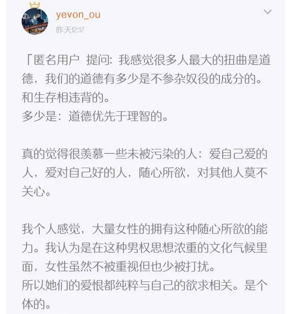
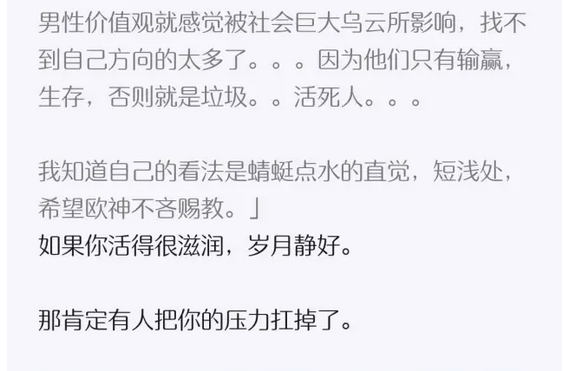
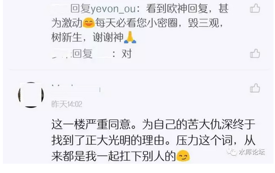

# 租售同权，租售同艰难 \#F1210

原创： yevon\_ou [水库论坛](/) 2017-07-19

 租售同权，租售同艰难 ~\#F1210~
===========================================================================================================================

希望在远方

 

 

一）租售同权

 

昨天楼市的眼球焦点，毫无疑问是广州"租售同权"。

 

哥哥统计了一下，大概被问了20次。其中《分答付费社群》8次，小密圈8次，隔壁邻居的小密圈4次。微信群杂七杂八的就不算了。

 

通常而言，哥哥的回答还是很质朴的。充满了乡村田园气息。例如隔壁圈里，哥哥做嘉宾时：

 

今天中午我在剥碧根果，一边剥一边想。

猛的一拍大腿，"哎呀，全错了"。

 

我知道我错在哪里了，也知道热心的网友，为什么不惜叨扰问20次了。

也知道痛点错在哪里。

如果不纠正的话，肯定还会再问第21次。

 

因为俺实在太质朴少年了，网友们真正问的，其实是：

 

有没有可能，

用3000元的租赁价格，

解决800W元的学区房问题？

 

 

 

二）学区房

 

北京什么最贵。是国贸CBD的黄金地段，还是金融街，码农的发财之地。

还是藏在深山密林里的别墅，霄云路8号。

都不是。

 

北京最贵的，是"学区房"。

甚至有30平米1200W的天价成交，论单价远远秒杀一切CBD。论总价也差不多。

 

 

学区房不仅仅贵，而且是"刚需"。

天子脚下，如果你找不到门路，你就只能千军万马走公立。

北京民营教育特别的少，菜小又是妈妈圈一致口碑不佳，华北的母亲们又特别迷信官本位。

如果你想在北京待下去，您就乖乖地怂买学区房吧。

 

 

在北京，有一个说法，"任何生物均有天敌"。

譬如码农投行，滴滴，阿里，ofo单车。

靠风口你是可以赚很多钱，甚至一些IT公司，批量制造产生"千万级富人"。

 

可是没用的。别以为那钱是你的。你只不过一个过路财神。

这钱归根到底是房东的。

你终身奋斗，好运加创业，历经幸存者偏差。[最终，按揭+首付，买了望京一套房子。]

 

你的全部财产，你的全部奋斗，你在地球上的一切成绩；

最终结算为：望京一套房子。

 

 

另一方面，绝大讽刺的，"房租"从来都不贵。

从资产回报比来说，"房租"简直低得吓死人。

譬如万柳一套学区房吧，按120000/m单价，怎么说也得1000W总价。

房租呢，能收10000就不错了。

 

年租金回报不到1%，住房是压力，房租远远不是压力。

因为房租始终便宜，房价始终还不是太大的民生问题。

 

 

所以，哥哥写了500字的废话，网友们问的其实是：

"可不可以以廉价的房租形式，解决房价捆绑的教育，医疗，养老补助金等大城市福利"。

可不可以就付3000元，[你把这些"大城市的福利"全部都给我打包兜售了。]

 

-   孩子上学学区，租售同权

-   社保养老金，租售同权

-   顶级医疗，租售同权。

 

俺内陆人来到你大北京，付3000元包吃包住包医疗。您把我所有的终身福利都给负责了。

这个才是提问人的核心诉求！

 

 

然后你再看哥哥文初"回答"的问题。

那都是回答什么个鬼啊！

难怪网友们不满意，难怪网友们问了一遍又一遍。

他们不就是指望从你嘴中听到一个"Yes"么。

 

 

 

三）人生苦难

 

好吧，我们再来看水库小密圈昨天一个长贴；

 

当年读大学时，有一个假段子。

万隆会议有人问周董："为什么中国人都低着头走路"。

周："因为我们在走上坡路"。

 

人活在这世上，谁都不容易。

香港几乎没有什么税收。但是香港的"地价"很高。明眼人都知道，这是一种"隐性税收"。维持了政府的运作。

 

中国的房价运行规律，与此类似。普通人如果吃吃喝喝，那肯定卡路里过剩。

天天晒美食，晒旅行，生活美滋滋好似文青。

唯独在"买房"这一关上被卡住了。

也是政府一种"隐性税收"。

 

既然是税收，最多能漏网几只小鱼小虾，大部分必要被卡住的。你不扛枪，我不扛枪，谁保卫咱妈妈，谁保护国家。

因此愿望是美好的，现实是残酷的。

指望"租售同权"卸掉你头上的房价压力，幼稚版痴人说梦，这钱省不了。

 

 

从技术的角度来说，北京的"学区房"，其实是可以租的。

目前的行情，中关村一小二小，学区每6年产生一次。

则6年的"租费"，大约是人民币100万元左右。

 

你付上一百万，总有种种操作手法。让你享受"学区房"的名额。

但房东也象人参果一样，三千年一开花，三千年一结果。熬六年结一枚果实。

 

 

回复到广州"租售同权"的政策。如果"租赁"真的有效，而且没有任何的歧视。

相当于把北京学区房"六年人参果"[公开售卖]了。

 

 

我们知道，北京的"天价过道学区房"，其实是没什么"使用价值"的。

学区房 = 房屋价值 + 学票价值。

房屋价值接近于零，你要租此房，一二千就可以了。

 

但是，一旦"租售同权"，就意味着"学票的出租价值"。

学区房租金 = 房屋租金 + 学票租金

 

按照六年100W的学票行情，再加上公开交易，总有溢价；

这6㎡的房子，您看，租金2W行不行啊？

 

（一次性预收六年，中途不退款）

 

 

 

四）公允价值之移动

 

另外分析一下"买卖/租赁"之间的关系。

 

假设政府管制，或者收取很重的税收，导致"租赁"很不流畅甚至违法。

则购买力会涌入"买卖市场"，推高买卖价格，降低租赁价格。

 

 

反之，如果租赁取消"管制"。则买卖价格会下降，租赁价格会上升，"买卖/租赁比"会回归均衡利率。

因此，如果"租售同权"，彻底贯彻执行的话；

 

-   学区房中"学票"的溢价会降低。学区房更贴近普通住宅价格。

-   租赁费会上升。由每六年100W升到每六年150W

 

 

 

五）实战之关注

 

见我最初在"一亩瓜田"（武汉小密圈）的回复。

中国的事情，文件是文件，实操是实操。文件精神和基层实践还有很大不同。

 

对于"租售同权"这种事，还需要问一下；

究竟是真同权，还是假同权。

执法部门的一丝丝摇晃，都会涉及到学区房的估值，都会涉及到资产价格的变动。

 

 

譬如说，业内一直都心知肚明。哪怕在北京算"入学资格"，他实际也是排队的。

第一等：人户合一

第二等：人户不合一

第三等：工作居住证

第四等：租赁关系

 

北京根本不谈什么"租售同权"，北京早就是租售同权了。租客享有同等的法律定义。

只不过在实际操作中，分为1,2,3,4等。

而大家都知道，3等4等，您就不用等了。

 

 

如果我们拉一条线的话。

  （房东有权，租客没地位）   \<\-\-\-\-\--\>   （绝对的租售同权）
  -------------------------- ----------------- --------------------
  学区房贵，租金很低         \<\-\-\-\-\--\>   学区房便宜，租金高

 

 

实际的执行，应该介于二者之间。是0\~100%间的一个数字。

这也是我在小密圈说，要先观察一下。看看具体"疍吏"的本意。

 

 

 

六）屌丝翻身

 

最后还有一些篇幅，我们讲讲"屌丝翻身"的常见问题。

例如昨天，前天的小密圈提问；

 

 

 

我们要说的是，这个世界上的事，99%都是"细水长流"的事情。

若你从2003年开始看空房产，连错了14把。

若你从2008开开始看空地产，就是连错了10把。

 

如果你错了14把，那是很难很难追的。

你妄想"一把翻身"，[一把抵14把]，这是很难实现。而且也[不公平]的。

 

 

人家家里是十几代的老牌贵族,"四世三公"。

而你妄想一把就王侯将相，宁有种乎。

这是不现实的，而且也是对累世积累的不公平。

 

我们从来不奢望任何黑天鹅事件。

 

房地产问题，可以用四个字来形容"积重难返"。

种种弊端，是十几年累积调控，不断削弱自由，而累积起来的。

市场割裂，交易缺失，杀死信使。病去如抽丝，需慢慢调养。

 

别的不说，"新增供应"难道是一朝一夕的事么。

你知道CY梁想要多造几套房子，有多难么。

 

 

我们对于"断崖论"向来嗤之以鼻。

什么"北京下跌30%，上海下跌50%"，坏人骗子骗傻子。

 

宏观调控既然已经持续了十年，那么任何让房价"速跌"的方法都已经失效。

 

任何一个政策，都只会有轻微的渐进式的效果。

压在你头上的养老房价医疗负担，你千万别想逃。速效都是骗子。

人生哪有这么容易。

 

 

 

(yevon\_ou\@163.com，2017年7月19日暮)
