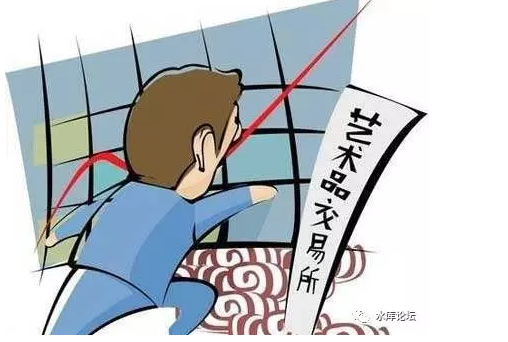

# 正本清源比特币（三）\-\-\--文交所 \#F1250
-----------------------------------------

原创： yevon\_ou [[水库论坛]](/) 2017-08-15

正本清源比特币（三）\-\-\--文交所 ~\#F1250~
===========================================

 

你对于财富的理解，一无所知。

 

 

 

一）币圈

 

我错了

 

之前俺曾经多次表示，"知乎，雪球，集思录"是三大屌丝圈。水平极低极低，简直不能看。

现在我要修正我的观点。

 

[[《正本清源比特币》（2）]](http://mp.weixin.qq.com/s?__biz=MzAxNTMxMTc0MA==&mid=2651016118&idx=1&sn=7a582a38bc0828e389f97bc75a89d31d&chksm=80721da5b70594b32c5f80d801df0aaae13f0eb8985916982fd494ffe551c53853dd9d1733c9&scene=21#wechat_redirect)出台之后，哥哥手贱，在微博上也发了一份。

地址在：http://weibo.com/1853047530/FgJk91g6d

 

众所周知，微博是一个非常"开放"的系统。

微信需要订阅，转发仅限于朋友圈。知乎要看时间线。

可是微博不同，每个碎片都能链接。文章一转到"币圈"，顿时炸了。

 

哥哥眼睁睁地看着一条微博，上百条留言。五味杂陈。

怎么可以这么Low啊。

蠢货，蠢货，猪货。

 

 

感觉就好像你拉着一辆板车，穿过大街。

然后马路二边的SB，就象是"SB雨"一样。一箩筐一箩筐的往下掉。

天底下怎么会有素质这么低的人。

全盘智障，父母生出来不心疼么。

和微博相比，知乎妥妥的就是"精！英！"

 

 

微博，才是投资界的一股清流。投资界的"杀马特"。

币圈=SB大列表。

二）文交所

 

2009年时，天津"文交所"设立。

其时间，大概和"昆明泛亚有色金属交易所"，"P2P狂潮"，"万众创业"属同一个时期。

 

文交所主要的业务，是买卖"文物股份"。

 

举个例子，假设有一幅"石涛"的画，工墨山水图。

请问这幅画，值多少钱。

 

艺术是无价之宝，书画品的估值，向来难以衡量。

很多人会看一下"索斯比"的拍卖纪录。假设200W元/幅吧。上下挺大。

 

 

现在问题来了，若是你想投资"中国艺术品"。

非常看好"八大山人"的升值潜力。同时想修正价值体系中，某些"估值"不合理的部分。

 

-   但是，你又拿不出200W现金。

-   即使拿得出，也不想赌这么大。

-   就算想赌，别人也不卖。

-   就算是卖了，你也没有专业的恒温箱保藏。

 

请问，有没有什么"金融创新"的方法，可以改善。

 

 

 

答案就是"文交所"，这个天才创意的举动。

文交所把一幅字画"切碎"了出售。

 

好比一幅王翚的画，我以这幅画做基础，发行ABS（Asset-backed Securities）

份额2000000份。

每一份，定价1元。

集齐200万份，你就可以来我这里，兑换这幅画。

 

 

这样一来，字画就由一种"大型的不可分割难以估值艺术品"，变化成为了一张"有价证券"。

 
文交所有电子盘。每天都有报价。"周臣仕女图""文征明字贴""汝窑青花瓷""唐代佛首像"。

每一天，1.23,2.34,3.45.........各种电子股票报价，上下起落，岂不快哉。 

 

-   普通人，拿300\~500元出来，就有了投资传世艺术品的可能。

-   通过市场模拟价格，给出更佳的艺术评判信号。

-   增加艺术品流动性

-   dT\>0，分散了资产风险

从字面上看，再没有比"文交所"更聪明的想法了。

 

课后习题：文交所和比特币投机相比，有什么优缺点。

 

答："文交所"远好于比特币。因为人家根本就是"合法"的，可以光天化日走在大街上。连伪装都不用。

 

 

三）文交所的高级玩法

 

上周国贸"慕道社"聚会，我问一个提问者，假设一幅价值180万元的画，分割成200W股股份。

"请问，在文交所交易的时候，它的股价大致是多少"。

 

那个纯良的小伙，左思右想。犹豫了半天。

脸憋得通红。最后才勉强答出来，"我觉得1元吧，涨了10%是因为流动性溢价"。

我哈哈大笑，说"真的涨了多少，得看文交所的历史事实"。

在真实的历史上，都发生了什么事呢。

 

 

愿望是良好的。

实践是残酷的。

 

一幅￥180W的字画，"文交所"绝对不会把它切割成200万份。

那分多少份呢，1000W份。

如果更过分呢，1亿份。

如果更更过分，10亿份。

 

 

切成200万份。股价：1元/股。

切成1000万份。股价：1元股。

切成10000万份。股价：1元股。

切成100000万份。股价：还是1元股。

 

 

文交所到了后期，发生了"奇异"的事。

如果一手是500股的话，则无论你"切碎"到多少比例。"一手"永远都是RMB
500元左右。

伍佰元啥意思，那就是老头老太买小菜的金额！

 

你这个字画是唐寅的，还是张大千的。不重要。

你这瓷器是汝窑，还是钧窑，不重要。

你这釉面很可疑，是不是赝品。还是不重要。

到了后期，很多"文物"估值都要上10亿元了。如果以"股数\*股价"来算的话。

 

 

为什么，为什么会这样。

因为"文交所"的证券。它的真实价值，其实为零。

 

文物，还是保藏在博物馆里。哪怕你是"股东"，你既不能吃，也不能闻。

而"回购"，其实是一句空话。你永远也集不全200万股\~全部的股份的。

11%的股份，偷偷就藏在xx本人手里。

"文物"又是没有分红的。你也不用指望什么租金，红利。

 

 

中国股票，不代表股东。

文物股份，不代表文物。

你手里拿的，就是一张废纸。任何价值都没有的。合理价格为0.

 

而中国人是怎样面对"价值为0"的呢。

是时候祭出这张图片来了。

有过一次，CCAV采访"营业厅股民"。

其中一位40岁男士说，"我和他们不同，我是做长线的"。

也怪小编资历浅，不懂规则，口贱追问了一句："大叔，您的长线，是多长呀"。

"那怎么也得二个星期吧"。

 

 

对于中国股民来说，他们根本不在乎"毫无价值，长线归零"。

春蝉夏虫，一生三季而不知冰。

 

对于中国股民来说，最最受欢迎的是"T+0"。

恨不得二个小时一轮行情，一天之内三次大涨大跌。

这才是紧张，精彩，刺激的人生。

 

 

你要说"没价值"，中国A股一样没价值。尤其是"创业板"，几乎99%都是垃圾。新三板99.99%垃圾。

但是挡不住有"创业板敢死队"。

他们需要的，仅仅是大起大落的波动。

千万分之一，出人头地的希望。

中国股民们，真正关心的是"K线图"。

公司基本面是不重要的。他们唯一关心的，是K线"又涨了10%"

 

股民们需要的，仅仅是一个公平的赌场

股民们需要的，仅仅是一个公平的赌场

股民们需要的，仅仅是一个公平的赌场

 

 

澳门的博彩业，赔率大概是97%。如果你仔细研究所有的博彩规则，庄家都有3%左右的抽头。每次赌钱亏3%

 

香港的赛马，回彩是75%

中国的体育彩票，公开字面，也不过是50%的回彩率，堪称杀人快刀。但即使这样，仍然挡不住"2元钱"买个翻身的指望。每季还能卖几千亿。

 

 

比特币可以提供给你的，是一个类似于"50%：50%"的赌局。

一个无人监管，可以T+0的博彩场。

文交所的市价，是毫无意义的。

它只是给你一个赌大小的地方。

 

 

 

四）财富的幻觉

 

"文交所"导致另一个结果，是"发财的幻觉"。一条分岔科技树。

 

前面说过，随着"文物"的炒作。字画"股"的价格开始疯长。

从最初的1元/股，总市值200万元/画。

 

然后股份可以一拆十，十拆百。

股价依然维持一元。

 

到了后期，不乏有"50亿股，每股1元"的案例。

一个花瓶，价值50亿元人民币。

 

就总体而言，"文交所"虽然只不过是一场庞氏骗局。

但身在局中，却会给人一种幻觉。"赚钱了，赚钱了"。

老庄股也是鸦片烟。

 

 

"你知道吗，我们家二狗，买了200股五彩龙凤双耳六棱瓶。结果，翻倍了"。

"哎呀，他怎么这么能干"。

"光是昨天晚上，又涨了10%"

"哇塞，好厉害"

 

"古董是不可复制的。你想，上千年的东西，砸一件少一件"。

"同意"

"艺术是不可估量的。随着人们文化水平的提高，艺术品还要走一波大牛市"。

"太对了"。

 

"搞什么投资嘛，还不如跟我们买文交所"。

"以后一个瓷瓶，换一幢万达广场"。

 

 

你看看这样的对话，是不是很熟悉。

当年创业板新上市时，说过。

新三板刚开始搞的时候，也说过。

昨天晚上币圈的SB留言，又说了一遍。

 

SB们死不光的，简直一箩筐一箩筐往下掉。

 

 

人类分二种：

愚人用"股价\*股数"来计算[财富]。

聪明人用"三维价格"来计算[财富]。

 

水库曾经有《价格三篇》[[\#550]](http://mp.weixin.qq.com/s?__biz=MzAxNTMxMTc0MA==&mid=400843201&idx=1&sn=136663aca45745f53d2fae1722ae372f&scene=21#wechat_redirect)，[[\#560]](http://mp.weixin.qq.com/s?__biz=MzAxNTMxMTc0MA==&mid=400859133&idx=1&sn=ebfd14aa922fec8cd5dfa82cf641e5b8&scene=21#wechat_redirect)，[[\#570]{.underline}](http://mp.weixin.qq.com/s?__biz=MzAxNTMxMTc0MA==&mid=400883094&idx=1&sn=13e1458bbee6d54c23e4e6f021755416&scene=21#wechat_redirect)

里面说得很清楚，价格是"三维"的。没有Price
Depth（价格深度）的市值，一文不值。

 

 

 

五）操纵文交所 

 

如果你仅仅想追求"账面上"的身家。

那简直再容易不过了。

 

 

举个例子。

哪天哥哥心情好了，掏个几百万元。自己包件文物，书画或者花瓶。

然后就可以发行"文物股票"。

 

我完全可以把90%的筹码，捏在自己手里。

甚至99%，甚至99.9%

剩下的1%，放出去在市场上交易。流通盘仅几千股。

 

然后哥哥还有一笔现金。几十万元。

我就对着你打，老庄股随便拉。

拉到5元，10元，50元，100元，1000元，5000元，还不是随便我说么。

 

 

草草算算，1000元\*200万股\*99%，这市值也20亿了。

难道你就是一个20亿富豪啦？

开什么玩笑。

你要这种"老庄股"的富豪，有屁用啊。

太Low的游戏，上等人甚至都懒得下场。

 

在我后台的留言中，整天都有"币圈"的SB，跑进来问：

"昨天又涨停了10%，你有没有后悔踏空"。

"前天又涨停了10%，你有没有后悔踏空"。

 

哥哥翻翻白眼，如果哥哥要做庄一个"清乾隆粉彩镂空"瓷瓶的话。

我可以把你的价格，从5元拉到5000元。

一口气拉200个涨停板。

 

你是不是要把全世界每一个涨幅商机都抓住。

你是不是这辈子从来没见过赚钱的机会，稀缺得要命。

 

讲这种话的人，就好比富士康绝望的底层厂妹。

看见一个路过厂区的金链子，都觉得是救命稻草。

 

币圈Low过厂妹。

 

 

 

六）初次发币游戏

 

理解了"文交所"的脉络，我们才可以理解ICO（山寨币首次发行）的游戏规则。

 

 

ICO（Initial Coin Offer）是指这样一门生意：

你好好在家里睡懒觉，突然被大学寝室的同学叫醒。

他严肃地和你说，你知道嘛"沙比币"要开始上线了。

 

什么叫"沙比币"，这是一种数字货币。牵涉到区块链技术，巴拉巴拉......

总而言之，你不需要懂。你只需要知道，数字货币满足：匿名，不可增发，不可跟踪，可用于枪枝毐品等就可以了。

 

人类未来的世界，是政府法币向数字货币转化的全面趋势。

数字货币，将来将是千亿，万亿的估值。

而现在，仅仅只卖1元钱，只卖1元钱！

 

你迷迷糊糊，还是没有听懂。

室友推攮着你，"不用懂了，把你这个月2000元的生活费拿出来，去买2000个币就可以了"。

 

 

那么，你花了半个月的生活费，买回来的这一堆U盘，到底是什么东西呢。

所谓"沙比币"。

很可能就是抠脚大汉，昨天一个晚上，在工作室里独立编出来的。成本为零。

 

 

如果我们研究这个业务模式，会发现，ICO是"无本万利"的。

成本=0

卖掉多少币，都是净赚。

 

无论是卖了2000元人民币，10\*2000元人民币，100\*2000元人民币。

坑学生坑了一个算一个。

 

 

我很喜欢知乎上一个贴：《比毒品还暴利的产品有哪些？》,尤其是它第一个回答：

氪金手游很赚钱，但也许没有[传销手游]赚钱；如果你发现身边亲戚朋友有玩类似的游戏，能劝就劝吧。

https://zhihu.com/question/30171430/answer/203041845

丧尽天良，ICO可以算一个。

 

 

那么，如此"暴利"的行业，它的"瓶颈"在哪里呢。

你设想一下，假设你雇佣一个程序员，昨天晚上设计了一个"沙比币"。

 

你在自己家杂货店门口挂一块黑板，上书："本店有沙比币出售，1元/个，升值潜力无限，欲购从速"。

搬个小板凳，从早守到晚。你说你能卖几个。

 

答案是一个也卖不了。

走过路过，根本不会有人关心。

 

 

如果你开淘宝小店，自己注册一个京东账户。能卖多少。

淘宝估计销量还是为零，天猫/京东可能有十几枚的"尝试销量"。但天猫/京东本身是要收柜台费的。

 

如果你到大学城里吆喝，卖得掉么。完全卖不动。

如果你买通了系主任，让系主任帮你"背书"一下。"这个币啊，我看是很有前途的。各位同学不妨研究一下"。

"没有研究的，下学期别想通过我的课"。

 

如果系主任肯这样说，那肯定大卖。卖个2000元\*50人，估计问题不大。

 

我们唠唠叨叨说了这么多，这其实是一个"流量"问题。

 

 

卖币是需要"流量"的。你也可以称之为眼球，也可以称为"广告"。也可以称为KOL。

总而言之，没有流量，你就卖不动。

有了流量，哪怕一分不值的东西，也能卖几千个（尽管转化率不好）

 

所谓的ICO产业，其实就是KOL流量变现。

 

 

 

李笑来博得"罗辑思维"的信任，开讲比特币，获取了"名声"的第一桶金。

但他志不在此。很快推销起了自己的ICO："比特沙和币付宝"

 

对于这种"数字货币"，你完全可以认为它是"抠脚大汉"昨天晚上在电脑上"创设"出来的。

成本为0，价值也为0。

可以无限复制。

 

 

李笑来狂卖了2400W的销售额。当他拿到这笔钱后，他有三个选择。

1）投在电视媒体广告，为"比特沙"做宣传。山寨币打开一定的知名度，未来二手市场或许还能卖0.1元。

2）为自己做广告，这样他可以去骗下一场ICO

3）奔驰宝马，拉菲红酒，消费挥霍掉。

 

 

 

七）结语

 

"数字货币"的实质，其实和"文交所"是一样的。

 

"数字货币"的市值，不可以用"股数\*股价"计算。这就是一个老庄股，轻易就会崩塌。

它真正的估值，应该是：总市值=知名度

 

卖币的钱 -- 知名度 = 被卷走的钱。

 

 

 

（未完待续）

 

（yevon\_ou\@163.com，2017年8月14日午）
