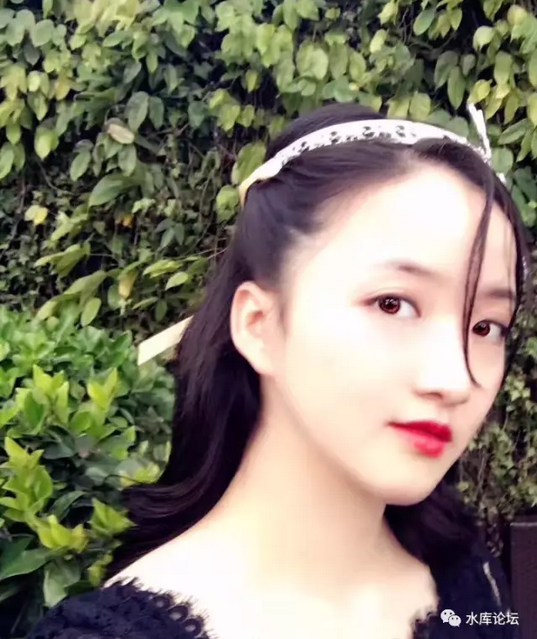
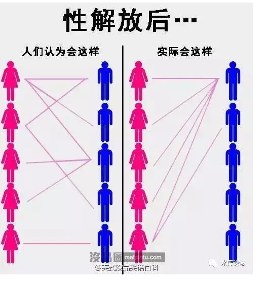
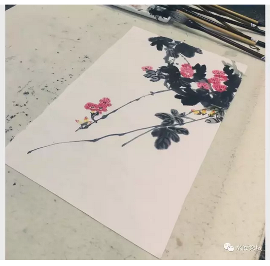
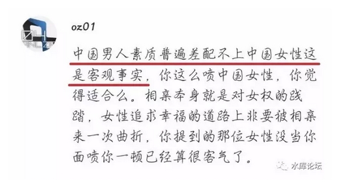

# 新一代低值女 \#F1280 
---------------------

原创： yevon\_ou [[水库论坛]](/)

**水库论坛**

微信号 Shuiku-net

功能介绍 科学尚未普及

2017-09-11

新一代低值女 ~\#F1280~

冒险发一篇板砖文......

 

 

一）女权

 

这二天在"知识星球"和女权份子撕得昏天暗地，连微信号都缓更了。

作为一名"肤浅鄙薄狂妄自大抠脚大汉低等进化无脊椎类爬行动物"，无可救药直男癌。俺觉得，俺需要为"直男癌"说几句话。

 

 

首先，我们要澄清一点，"为什么你嫁不出去"。

 

嫁不出去，就和我们抱怨"为什么这么穷"，没赶上买认购证，下海创业，IT泡沫，地产狂潮，五百万彩票.........

这二个抱怨是一模一样的。

 

"为什么你这么穷"，答案有且仅有一个：你自己的错。

100%都是你自己的原因。和时代无关，和机遇无关，和运气无关。

谁也不欠你的。可怜之人必有可恨之处。你身边的人都买房发财了，只有你始终坚信谢国忠。那么有罪的，就是你的"三观"。

 

 

同样道理，为什么你嫁不出去。

有一个女权份子问我，"我名校毕业，成绩一流，貌美如花，能歌善舞。钢琴，瑜伽，素食，半马，对内爱护小动物，对外关心环保地球变暖。象我这么优秀的女孩子，为什么就找不到男友！"

 

哥哥一边抠着脚，一边懒洋洋回答：因为你理解错了，你根本不是A级女，你是C类女

 

 

 

二）C类女

 

A：0.1%

B：1%

C：10%

D：51%

F：

 

解释一下分类体系。我问你，玄彬你喜欢么。

霸道总裁，多金富二代，韩剧欧巴，总裁你喜欢么。

身份高贵象王子，在家捶背象孙子，出门花钱象败子，"潘驴邓小闲"你喜欢么。

喜欢，喜欢，台下一群小姑娘眼睛里冒星星。

 

"霸道总裁爱上我，任我虐他千百遍，总裁待我如初恋"。

 

好了，这类男一号，就是A类男。

 

 

 

和A类男相对应的，称为A类女。

千百万男性梦寐以求的，楼下弹吉他，摆蜡烛，排队二个加强连追，就是A类女。

少说也是校花，院花，陆家嘴之花之类的。

我这里贴一个啊。

 

（静流.JPG）

通常而言，女性会高估自己的容貌。直男行规，取平方。

例如女性宣称自己是8分女，男性心算0.8 \* 0.8 = 6.4分。

女性宣称自己6分中美，实际3.6分 

 

1957年美国做了一场市场调查："你觉得你的智商，是否超过了社会平均水平"。结果91%的美国人选择"是"。

 

反映到相亲市场，至少91%的女性，认为自己是"平均以上"。AB

稍微有一点姿色的女性，都认为自己是A。

其实A才0.1%，和马路上撞见上海"一亿富人"概率差不多。

 

 

 

三）卖点

 
每一个女性，都希望嫁给霸道总裁。最好总裁还具有杨洋的外貌+彭于晏的身材+哥哥的好脾气。

 

这个世界，是很残酷的。残酷之处在于，ABCDF，如果你想要婚配，则大概率在同级之内。想要跨级的运气，千难万难。

换言之，你想嫁给A男。最佳方法，你是A女。

 

Q：怎样迅速获得一个亿万富翁的真心尊敬。

A：你也是一个亿万富翁。

 

 

《新一代的低值女》真心想探讨的，怎样才算A类女。

-   读Top2的名校，家世清白

-   会英语和法语

-   读世界名著

-   钢琴

-   仪态和礼仪，懂得喝下午茶

-   瑜伽

-   有机食品，素食，绝不吃烤串

-   对小动物表示爱心

-   世界和平，环保，义工

 

请问，以上的"女性素质提高计划"，哪一项是真正帮助你达到A类女的。

恭喜你，答案是："以上全错"。

 

 

我想是时候祭出这篇短文了。

　　一个男人要在三位女郎中选择。

　　他给了每一位女郎五千元

　　第一位女郎从头到脚重新打扮

　　第二位女郎采购了许多礼物，送给男士

第三位女郎把钱投资到证卷市场，赚了几倍。

最后，他娶了.........胸最大那个

这个故事告诉我们的是，了解客户的"真实需求"最重要。

 

 

为什么你嫁不出去，    

因为你根本没有针对客户的[需求]，改善产品！

 

 

为什么会有剩女，因为你HARD SALES。

生产了一堆不符合市场需求的产品，然后强行推销。

 

你根本不是Soft marketing.

先根据消费者口味，再来设计产品。

 

 

 

如果一个人有marketing品牌经理的经验。

然后他又是一个"无耻混蛋"，一切的礼义廉耻，在他眼里毫无意义。

他看待整个社会和人群，就象冷冰冰地看待洗发水、护发素没有区别。就象外科医生看待病人。

 

那么整件事，"逻辑"是非常清晰的。

为什么滞销，因为不符合消费者的胃口。

该采取什么措施：立即停产，调整配方，已生产的降价大促销。

 

 

"剩女"们目前做的事，在marketing上叫做HARD SALES。

这是在五六零年代，早已被骂得口诛笔伐，连渣都不剩的行为。

 

意思就是，"完全不顾"消费者的喜好。蒙头生产。

各种功能堆上去，成本越来越昂贵，价格越来越昂贵。

最后计划经济都堆在仓库里，根本卖不出去。

 

 

 

中国男人的梦是什么，是双儿，是小昭，是[[狐狸精]](http://mp.weixin.qq.com/s?__biz=MzAxNTMxMTc0MA==&mid=2651014809&idx=1&sn=5f6aadb6fb4c54249fbe9f4d087728aa&scene=21#wechat_redirect)。

你去采访一下，双儿小昭会愁嫁么。99%不愁嫁，市场大得很。抢不应求。

 

中国男人的梦想，是红袖添香，巧笑嫣然。

"温柔"才是女性第一大王牌。

楚楚可怜，公子这辈子就跟定你了。又有几个男人可以拒绝。

 

手如柔荑，肤如凝脂，颈如蝤蛴，齿如瓠犀；

螓首蛾兮，巧笑倩兮，美目盼兮； 

为什么你卖不动，因为你培养的产品不对。

尖酸刻薄，研究生女博士又什么用。你就是峨嵋派丁敏君，神龙岛毛东珠。

 

每当一个"高学历"女性向哥哥痛斥："男人都瞎了眼睛，A级女找不到玄彬"。

哥哥不由得冷笑。"你算什么A类女，在男人的评级中就是C"。

 

 

 

四）齐天大剩

 

前二天和女权份子们搏斗，对女权份子的嚣张，可真是开了眼界了。

 

女权份子的要价，已经到了什么地步呢。"总裁+外星人+夜华"，非得等上四百年或者四万年，三生三世只爱你一人。

而且女主，偏偏不甩面子。要教养没教养，要素质没素质。

要智商没智商。男人还得继续犯贱。

 

如果你一旦扯上"生孩子"这个话题。乖乖，要价更是直线飞起。

往前数十八代，你家给她做牛做马。往后数十七八代，侍候她为仆为奴，大少奶奶不干活整天只修指甲。曰："弥补女性生育的[不可替代]的巨大付出"。

这让我们想起了《嘉莉妹妹》里的一个故事。

 

嘉莉妹妹和小伙伴们去乡下玩，住在57岁的姑妈家里。

姑妈一辈子都没嫁出去，老处女。

嘉莉妹妹和小伙伴们，在地窖里发现了姑妈发黄的裹脚布。

 

没想到姑妈大发雷霆，"这里是高贵的史蒂芬奇·珍妮小姐"。

"她的尊贵和优雅，教养和贞洁"

"年轻人想一亲芳泽的话，至少得准备2000英镑的礼品。提前三个月预约"。

"珍妮小姐可以考虑和他共进下午茶"。

 

 

对于57岁的老处女，我想还是算了吧。没什么男士愿意买单的。

37岁的也一样。

 

所谓"漫天讨价，就地还钱"。我们不能阻止女权分子们失心疯般的乱开价。

可是你滞销啊。

 

哪怕你唱"独立，自尊的女性，不需要结婚"。自我麻醉。

可你还是滞销啊。没人给你盖被子啊。

 

 

现在北京上海等城市，涉外（地）婚姻是越来越多了。哪怕第一流贵胄级的男孩子，也愿意优选内省的女性。

真正滞销的，反倒是那些留过洋的"白骨精"。自诩为精英的新女性。

 

她们常常扼腕叹息，为什么"霸道总裁"好猪都被白菜拱了。

精英男子最终选择的，往往是出身，教育"匮乏"。但秉承传统价值观"养儿护家"的结发。

 

霸道总裁的智商胜你百倍，他们怎会不懂得挑选。

Nonono，是你自己的"评分"体系出了问题。

你以为你是A，其实你是C。

你以为丫鬟是C，其实是A。

你要认啊，低值渣你别不承认啊！剩女的总体素质，配不上中国男性。

都市里的"齐天大剩"们，我们称之为《新一代的低值女》。

不会八爪章鱼，妖精一样爬上身的，就是毫无价值。

不肯生孩子的，对男人就毫无价值。

消费者说你没价值，你就是没价值。成本不代表任何事。

 

 

《新一代低值女》的悲哀在于。她们的父母，往往是"穷一代"。

工薪阶层的父母，[受于本身眼界和阅历限制]，并不知道真正的"Top
0.1%" 社会长什么样子。

工薪父母们，按照自己的想象去培养子女。西贝的"[[全民富二代]](https://mp.weixin.qq.com/s?__biz=MjM5ODM5NDE3Mw==&mid=2652535942&idx=2&sn=68e1ea55a49cee03eb9b4eabdbe9d5d8&chksm=bd25bcd48a5235c274c48f7677ff0ae34965f8a8794a7e6639524f0350ee67e7d27ee3daef19&mpshare=1&scene=1&srcid=09117LRhhNaliRpFsYfdULG3&pass_ticket=3gCUm6UzTw7eEjgaBOATd645RoGLzlsHtSCTUtKXZ%2FGJI5QUIfTHXonn%2B0L8PkOR#rd)"。

 

其结果，是灾难性的。

穷人的弱，是全方位的弱。不仅资源少，而且资源的转化率极低。

 

我们看看"工薪父母"列出的培养计划，无外乎"学区房，钢琴，出国"。

这些，都不是通往上流社会的阶梯。甚至可以说："[[娼妓之道]](http://mp.weixin.qq.com/s?__biz=MzAxNTMxMTc0MA==&mid=208528829&idx=1&sn=c64de8b46c112e438bbab0877f48f1ae&scene=21#wechat_redirect)"。

 

 

当一个[[中产阶级]](http://mp.weixin.qq.com/s?__biz=MzAxNTMxMTc0MA==&mid=2651015300&idx=1&sn=b33d804f1c0495327b3e899e83574930&chksm=80721e97b70597819a2451d5eefffa736cb7a0c4929e067e9b239df0c6edd1883315ab658744&scene=21#wechat_redirect)的家庭，倾家荡产，从小无数的补习班学起。

历经二十几年，最终堆积起一个"有文化"的女儿。

这个女儿却是C级品。

真是再讽刺不过了。

 

 

 

（yevon\_ou\@163.com，2017年9月11日午）
