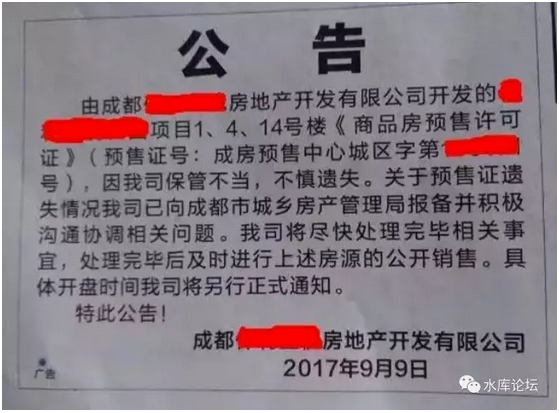
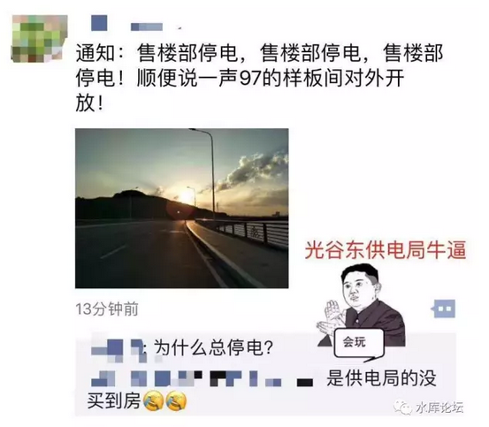
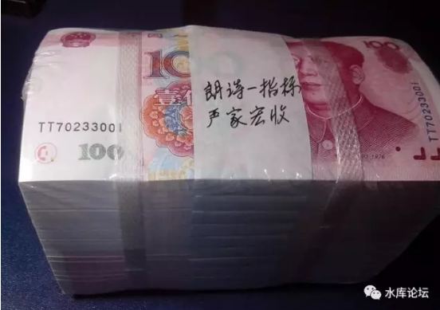
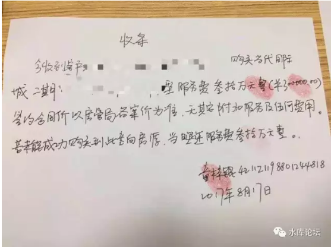
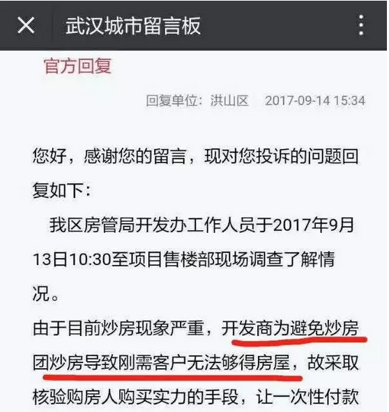
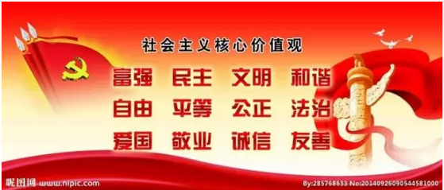

# 全款的请向里走 \#F1290

原创： yevon\_ou [水库论坛](/)

**水库论坛**

微信号 Shuiku-net

功能介绍 科学尚未普及

2017-09-20

全款的请向里走 ~\#F1290~

 

吴晓波频道至Yevon\_ou老师采访函：

 

打扰了，我是吴晓波频道的编辑李梦清。想采访您一个关于房产的问题，不知道是否可以，十分感谢！

 

近来，杭州、成都、武汉、广州、无锡等城市买房难，甚至形成了所谓的买房"鄙视链"，有人编成了一个段子："全款买房的往里走，按揭的不要堵门口，公积金贷款的请把共享单车挪一挪。"

 

1.  
一个很奇怪的现象是，开发商的要求很高，许多楼盘需要全款才能买到，但开盘后依旧分秒售罄，这是为什么？（买方：哪来这么多付全款的？刚需多还是投资客多？卖方：房源太少？政府限价？急着回款，要求全款者优先买房甚至直接要求全款才能买，这样的做法合理吗？是否违反规定？）

 

2．在这样的局势之下，再加上另一个背景：全国首套房贷平均利率升破5%，为连续第8个月上升，这对于真正的刚需来说非常不利。那么，刚需在当前的状况下，到底该怎么办？

 

3．相比前几年，今年的形势是不是不太利于房产投资客？投资客该怎么走？

 

4、您的其他观点。

 

 

最近一周更新得很少，主要是在看书。看一些"心灵控制"与操纵方面的书。

吴晓波频道这个问题，非常容易解答。主要就二个字：

 

限价

 

 

一）全款

 

按照一般普通的买房流程。在"下定"之日，支付20\~50W不等的定金。

约定三个月过户。过户之日付足30%首期。

贷款70%

 

 

对于KFS来说，他的资金成本是[有利息的。而且还很高]。

中国的房地产市场，普遍"资金成本"都在二位数以上。

 

"诸神围剿绿城"那年，宋胖子掘地三尺，最低的资金也要28%

十面埋伏，走投无路。

当时就是联手做局，非得要趁你病拿你控股权。

 

历年来，关于KFS"高利贷"的传闻不绝于耳。傻空小白一直指望着"付利息"能压垮无良奸商。

简单点，我们就取12%的资金成本，或者月率1%

 

 

以一套500W元的房产为例。

第0个月，付定金50W

第2个月，首付付清100W，少得利息2W

第4个月，贷款结清350W，少得利息3.5W\*4=14W

 

可见，如果消费者以"贷款"方式买房。资金晚到。

相对于"全款拍在桌子上"的土豪行径，KFS是少赚钱的。

 

 

这个数字，从金额上讲，是16w/500W=3.2%

我们出门买房子，常常喜欢讨价还价。拉着售楼处经理，"小弟啊，我全款付，可不可以便宜点"。

 

这其中的原理，就在于"全款拍在桌子"上，KFS可以提早拿到钱。节省利息。

相应的，销售经理也会故作肉痛状。再让利1\~2%

 

 

我们出去买卖二手房，也喜欢问"付款方式好的话，能不能再便宜一点"。

只不过"民间"利率一般远远低于12%，余额宝不过四点几。

因此民间"全款"和"贷款"，房东砍价余地不大。

 

 

 

二）限价

 

上文说到了，在T+0日，就一口气"几百万扣在桌子上"，相对于KFS节省了利息。大概是3.2%的样子。

 

接下来第二个现象，就是"限价"。

 

限价是政府制定一个"最高"指导价。譬如武汉汉江这种地方，只许卖28000元/m，再高就不发预售证。

 

 

限价这事，其实是很没有道理的。在水库文章《[车匪路霸话限购](http://mp.weixin.qq.com/s?__biz=MzAxNTMxMTc0MA==&mid=402835543&idx=1&sn=b7c0ec5309db06b424238e35fef26710&scene=21#wechat_redirect)》\#870中已有说明。

限价的本质，其实是"抢劫"。对国家[商业秩序危害巨大]。

 

 

-   我明明可以卖500W的房子，答应卖给李四。您情我愿。

-   你非得限制我只能300W，卖给村口的泼皮王五。这不是抢钱是什么。

 

价格管制是一件非常非常邪恶的事。1970年代美国"白左"们搞出来的事情。

美利坚因此而衰弱，逐渐失去了世界第一大国的位置。

政客们为了一时短期的选举利益，损害长远的国力。

我们不要学他们。

 

 

 

言归正传，假设一定要"限价"。那KFS就不乐意了。

你们这个地方"投资环境"这么差。以后商人都不来了。

 

而在短期之内，已建成/在建项目，则要想办法脱身。

第一种办法，是"不卖了"。300W卖给泼皮王五，我不卖还不行么。

 

 

哎呀呀，你看，预售证这么严肃的事，居然让临时工给弄丢了。

按照工商管理条例，预售证补办需要半年的时间。而且作为"惩罚"，工商局半年内都不会再让卖了。

 

 

 

第二个办法，是收"茶水费"。

 

譬如说，9月5日的时候，爆出了武汉"长江凯旋城":

 

77万的房子，首付88万

 

 

为什么会有这样神奇的事呢。因为77万总价的房子，首付23.1W。

需要捆绑2000元/㎡的KFS精装修

需要捆绑25万元的"品牌家具"

需要捆绑7W元的"俱乐部会籍"。

 

他其实是一套127W的房子，被强行限价到77W。

购房者满怀雀跃地去买77W房子，结果发现除了"少贷款"。他们什么也没捞到。

 

 

当然，在政府一而再的"严厉执法"重拳扫荡之下。

"茶水费"现象已大为收敛。

 

 

第三种：

-   最惨的某一类KFS。

-   他们既不是国企。民企毛利就是身家性命

-   他们资金链也不雄厚。耗不起，一定得开盘。

-   想收茶水费，被严打。

-   跪在关二爷跟前，"俺下次再买高价地做KFS，我是你孙子"。

 

对于这类KFS，他们就是"实打实"地损失了。

就是真掏心掏肺"打土豪，被分田"了。

  

 

当然，在这最后的战役中，KFS还是可以想一点办法，挽回3.2%损失的。

您也知道是什么了。

 

"全款买房的往里走，按揭的不要堵门口，公积金贷款的请把共享单车挪一挪"。

 

 

 

三）刚需

 

Q：要求全款者优先买房甚至直接要求全款才能买，这样的做法合理吗？是否违反规定？

 

Ｑ：全国首套房贷平均利率升破5%，为连续第8个月上升，这对于真正的刚需来说非常不利。到底该怎么办？

 

 

对于某些文科生小编来说，他们总以为全世界都是欠他的。

当别人辛辛苦苦啃白馒头凉开水，读《高等数学》挂在树上时。他们出去浪浪浪和买新衣服。

当别人踏踏实实认真工作攒月供时，他们在"诗和远方"。转眼还嘲笑你土。

 

玩了十几年，现在快30了。

抬起头来一看，差距大得不得了。

别人都开始买第二套房子了。你的存款还没有超过五位数。

 

 

买不起房子怎么办。学"白左"啊。抱着了白左们"精神领袖"宝宝的大腿哭。

宝宝再寡廉鲜耻地喂养寄生虫。

 

对于某些"诗和远方"的文艺青年来说，自己不勤奋工作，然后去政府吼"房价太高"。

政府已经很尽力帮他们了。连"限价"这种反噬力很强的政策都出来了（破坏投资环境）。

他们还哭诉"抢不到"。

 

 

按照白左寄生虫的逻辑链：

首付少 ===\>穷人 ===\> 应该帮助，是不是这样的思路？

 

 

遗憾的事，经济学是一门"反直观"的科学。经济学原理，和人类的第一反应并不相同。

经济学认为，一个人肯出500W，一个人只肯出150W。请问哪个人对房子的"需求"更为强烈。谁没房子就活不了。

答案是：500W那个。

 

 

经济学的逻辑在于，"这500W并不是从天上掉下来的，而是牺牲别的换取来的"。

你有多大的需求，关键不是看你喊得有多响，而是看你为此付出多少牺牲。

 

 

为了这500W，你每天要上班8个小时。

你的顶头主管是一个混蛋。不仅愚蠢透顶，而且还有口臭。

每天看着主管大放厥词，放屁狗狗放屁放狗屁。对你是一种巨大的折磨。

可是这一切你都忍了。因为你需要这20000/月的工资。你要养家糊口，你要攒钱买房子。

 

而另一方面呢，小文青每天睡到11:00起。

去街道工厂打工三天，借口说太累，不肯去了。

天天宅家里打"亡者农药"。

存款永远不超过五位数。看见一支YSL的唇膏，就忍不住买下来。

这种人嘴上喊得响，拍个访谈痛哭流涕，其实都是演技。

 

 

就好比说女孩子如果要选配偶。

你绝不能看凤凰男嘴上吹得天花乱坠，爱你到海枯石烂。

你老老实实地教育他，给你买100天的早餐。每天早起，风里来雨里去。

看看他能否坚持再说。

 

 

因此买房这种事，"肯出500W"就是比你"肯出150W"要真心。

人家才是急需这房子，为此不惜大学格斗高等代数，职场忍受蠢猪领导。

 

拿500W抢房子的，才是真刚需！

 

 

"限价"是一种扭曲，是白左对我们国家的残害。

"预售证遗失""茶水费"，都是对限价的反应。哪里有压迫，哪里就有反抗。

因为你开始了一条扭曲，你就必须再叠加100条扭曲。就象漏水的气球。

 

如果我们不能阻止"限价"。至少我们不应该赞赏"第101条管制"。

dT\>0，市场化在任何角落，都是好事。

 

 

（最后附一条官方对此事的看法。尽管他和我们谈的，并不是同一回事）。

 

 

四）投资客

 

Q．相比前几年，今年的形势是不是不太利于房产投资客？投资客该怎么走？

 

答：限价其实加大了利差。意味着只要你能绕过"抢筹"，你就可以获得丰厚得多的回报。

这在《[炒楼业黄金时代](http://mp.weixin.qq.com/s?__biz=MzAxNTMxMTc0MA==&mid=403391036&idx=1&sn=2416ee9f1731daca3905e605fbfbe55a&scene=21#wechat_redirect)》~\#930~中已有阐述。

 

在人山人海的排队潮中，如何开后门拿到内部房源，这一向是专业人士更擅长的事。

 

不说了，因为我要加强学习去了。今天不喝茶，再见。

 

 

愿：国运昌祚

 

 

 

（yevon\_ou\@163.com，2017年9月20日）
