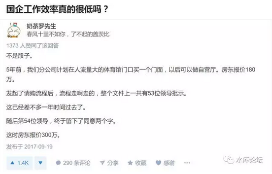

# 楼市停更，本篇是职场类

 

前二天看了一篇肛锯先生写的《未来5年的中国中产阶级生活价值观走势》\[1\]

手痒想写一篇中产阶级束手待毙的分析。

 

写着写着，有点偏掉了。

不是很满意，将就着看看吧。

 

 

一）全球标准

 

道理比较长。首先，我们要讲三个小故事，作为引子。

 

 

第一个故事。混过外企的人都知道，外企有一句非常著名的口号，叫做Global
Standard。意思是全球一体。

全球使用统一的品牌形象，宣传口径，工艺配方。甚至同一个供应商，同一套商业手法。恨不得全球开32000家标准化的"麦当劳"门店。

 

是不是听着很美妙。抱歉，GlobalStandard和"政治正确"一样。

唱起来好听，实际操作全错的。

 

 

真正在外企混得久，老油条们还知道。Global
Standard另有一种读法，叫做Global Stupid。翻译是全球愚蠢。

 

 

因为"全球划一"真的是很不好用。

从美国跟过来的广告设计公司DY&R，真的很不好用。动辄一个稿子收费\$3000美金。

它飞快地被业务部门炒了，换成了800元/件的中国廉价画图屌丝。

 

 

B&Q曾经花了25%的卖场面积，专卖"花园打理工具"。英国总部来的鬼佬，还咕哝着说不满意。说远远低于英国的水准和比例。

其结果，当然是一场大灾难。

 

中国人根本没有"草坪"。大家都住高层，谁奢侈到能拥有一幢独栋别墅。而且还要买你的专业滤网式松土铲。

1840年鸦片战争后，口岸打开。英国人高高兴兴地跑过来卖银制刀叉餐具。怎么就不长记性呢。

 

全球一致化，就意味着处处不优化

 

MNC（Multi-NationCompany）从来不是管理完善的典范。

大家都知道，外企的真正竞争力，来自于跨代碾压的产品。很多拳头产品，的确好。中国生产不出来，卖天价和毳利。

 

至于管理，就只能呵呵了。

外企的行政成本，比起江浙草台班子的乡镇企业，多个零吧。

 

 

 

二）独当一面

 

我们讲的第二个故事，是一个人。一段地产界的传奇。

 

绿地的武汉分公司，基本是李明总一个人打下来的。

当年他捏着机票来到武汉，可以说一片蛮荒。下飞机后，连个接机的人都没有。

 

此后他在江汉路租了办公室，登报纸招聘了第一批员工，武汉第一美女。

甄别并挑选了建筑公司，销售公司，广告公司。

递名刺结交政府官员。拍卖拿到了土地。606华中第一高楼。

 

最后绿地武汉实现了近百亿的销售额。可以说，绿地除了输出品牌和资金，什么事都没干。

撒下一把麦穗，拉出一个农庄。

 

好了，现在问题来了。

如果要按劳酬佣，象李明这样"一个人拉出一间分公司"的，应该给他多少钱。

100亿该分多少亿。

 

 

 

三）新蛋

 

第三个故事，是一家今天已经快被人遗忘的公司：新蛋Newegg.com

 

和现京东的如日中天，超级巨型巨无霸不同。早在十年之前，"电商"这块领域，是有三家公司在竞争的。

No.1   京东

No.2   新蛋

No.3   易迅

 

京东最大，份额大概是后者的一倍。

新蛋No.2，作为挑战者，自然追得分外吃力，苦苦支撑。

 

几家电商，都是亏钱的。靠背后金主爸爸，不停烧钱来养活。

其中的区别，京东刘强东是个人大股东，具有很强的话语权。

而新蛋基本是美国资本，要听美国基金经理们的脸色。

 

 

在这个时候，新蛋犯了一个致命的，战略性的错误。

因为电商总是亏钱，有时候简直是"烧钱"。例如搞个大彩电，"1元秒杀"。

时间久了，美国人心里起了疑心。"这个团队会不会正在贪污"。

 

因为很多账，真的没法解释。美国人要求，更深入地"涉足"管理。

从此以后，新蛋21:00开会就多了。

 

美国总部把"决策权"上收。更多的会议，要在US绕一个大大的圈，才能下发。

这样，不仅导致新蛋的决策流程非常缓慢。

而且美国人不了解中国市场，做出了许多错误决定。

 

二年之后，新蛋终于亏不起。含泪解散公司。化为尘土。

今天京东市值600亿美金。相比之下，令人不胜唏嘘。

 

 

 

四）博弈

 

刘伯承说，"分散指挥打野猪，集中指挥打死猪"。

 

这三个故事串起来，其实是一个道理。

 

"加强控制"和"分散效率"，是一对矛盾。

 

你越是把决策权上收，越是整齐划一。则效率往往不高。

但是分公司过度自治，会导致"军阀化""贪污化"。对总部大老板的利益不利。

 

 

 

整家公司，一直在"放松"和"收紧"之间摇摆。

对于大老板来说，他肯定是恨不得"利出一孔"。最好一切的决策，都由总部发起。一切的桃子，都由总部先摘。

 

权力就代表利益。尤其是"第一胎小羊"的利益。\[2\]

不仅仅是失控和腐败的问题。哪怕绝对忠诚，主上对臣子的剥削还是存在的。

 

卡扎菲上飞机时，还能优先带二箱，央行储备美钞。

主子先逃，臣子弃子。

 

 

另一方面。如果总部管得过死。象这个帖子《国企工作效率真的很低吗？》\[3\]，会极大削弱竞争力。

许多人都对公司里的"死太监""死衙内"恨得咬牙切齿。

"太监文化"盛行的原因。就是总部扩张。

哪怕连007《幽灵眼》，都咬牙切齿地痛骂："典型的中央政府官僚"。

 

一个公司的"总部扩张""太监文化"，劣币淘汰凉币，Global Stupid。

在企业市场，就会官僚臃肿，企业破产。

在政务市场，就会产生《逐梦演艺圈》。

 

\*有人联想到计划经济，市场经济之类的。咳咳，咳咳咳，我什么也没说过。

 

逐梦演艺圈SNH48 - 逐梦演艺圈
 

 

五）薪酬

 

将这个概念再延伸一步，"总部"和"分权"的平衡，意味着什么。

他其实意味着"老板/经理"之间的利益划分。

换言之，你的薪酬，股权，分红，社会地位......一切的一切。

 

 

这里面的概念就复杂了。因为绝大多数人，从小受的教育就是错的。

底层屌丝圣母，看待世界的方式，还停留在"忠臣奸臣""好人坏人"的水准。

 

"小孩子才分对错，成年人只讲利弊"。

长线利益的划分，其实并不是靠忠诚或者苦难。流泪流汗，永远不是加薪的理由。

加薪，主要靠你的"讨价还价"能力。

 

 

唐末的节度使制度，是一定会失控的。

因为节度使"既有其土地，又有其人民。既有其军队，又有其财政"。

即使最初几任的节度使，忠心于朝廷。长期博弈的结果，一定是小割据的。

 

朱元璋极度厌恶宰相篡位。因此他废除了延续千年的"丞相"制度。

可是后代子孙，无力每天14小时处理政务。

最终明代建立了"内阁大学士"制度。权柄甚至比宰相更重。

 

一项制度的存在，关键还是看生产力。

 

 

 

说回到企业级市场。"职业经理人"和"老板"讨价还价的基础。就是"混乱度"。

你在千里之外成立一家分公司，晚上和政府官员吃饭。

怎么运作，什么尺度，肯定不能早请示，晚汇报的。

 

你这么多的工程项目，基建支出，也不可能每一件都审计的。

"鞭长莫及"就是你讨价还价的基础。

 

 

山东"三联"集团，曾经提出一个著名的理论。

企业管理分公司的能力，和距离的四次方成反比。

 

总部可以换一个经理。

可是不管哪个经理上台，遥远的湖北分公司，都是不可控的。

还不如老人。

 

 

 

六）管理

 

前二天"肛里拉出个电锯"写了篇文章《未来5年的中国中产阶级生活价值观走势》

 

他提出了一个观点;

-   现代科技的发展，对中层管理人员不利。

-   信息和交通的简便，使得老板控制的范围增加。

-   阶级会分化，老板收入变成经理百倍

 

 

肛锯认为，目前我们身处的社会，可以称为"全球停滞"。

生产力，创新，重大发明，已经停滞很久了。

除了互联网，二战之后，几乎就没有改变文明的创新。

 

"全球停滞"的一个负作用，是"混乱度"大大下降。

同样的业务，做了几十年。依样画葫芦。

那还需要什么"管理"。需要什么精英。

 

 

当大老板对于整个流程烂熟于心。当你每天重复完全相同的工作。

大老板就可以用更廉价的人力来取代你。把更多的职能上收到总部。

中层管理人员，在利益分配的格局中。讨价还价，处于越发不利的局面。

 

肛锯哈哈大笑道；

"如果公司的市值，突然暴增十倍。需要拿多少的钱，分红给手下的骨干呢"。

"少，很少，非常少"。

"甚至说，公司利润翻了十倍。连给你加薪的待遇，都不必要"。

  

未来的时代，必然是大老板拿大头。

贫富分化急剧，阶层相差百倍。

 

-   董事长：100亿

-   总经理：100万

 

"混乱度"越小，总经理就越没有讨价还价的地位。公司缺了你没事。轻易可以找人替代。

而董事长，处于所有信息流的终点位置。职业经理人几乎没有创业Copy的能力。

 

这件事，是信息技术，生产力导致的。

因此，贫富差距不可逆转。

 

 

 

感谢各位看到这里。

我们耗费篇幅，总算把道理复述清楚了。

最后说一下我对肛锯这篇论文的评语："以上全错"。

 

 

 

（yevon\_ou\@163.com，2017年10月3日子）

 

 

 

 

\[1\]《未来5年的中国中产阶级生活价值观走势》https://zhuanlan.zhihu.com/p/28249981

\[2\]你看过犹太教圣典，例如《Bible》之类的。祭司们动辄要求献祭的，永远是第一胎小羊。

因为古代死亡率很高，母羊寿命有限。第二第三胎，可能就难产死了。

"第一胎小羊"比喻优先索取权。

\[3\]《国企工作效率真的很低吗？》https://www.zhihu.com/question/22977065/answer/236152323
