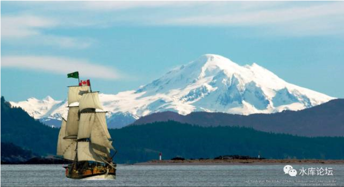
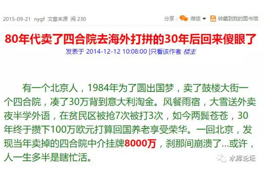
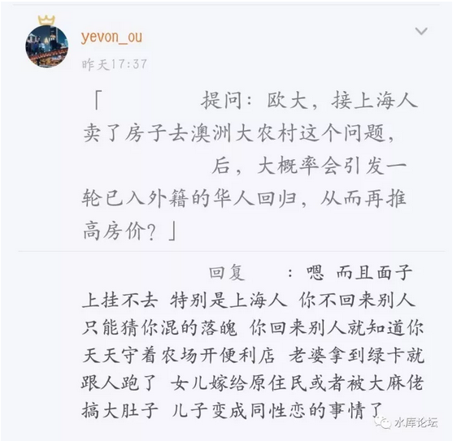

# 迁徙力 \#F1330

原创： yevon\_ou [水库论坛](/) 2017-10-14

迁徙力 ~\#F1330~

   当前浏览器不支持播放音乐或语音，请在微信或其他浏览器中播放

带你去旅行

我想要带你去浪漫的土耳其

然后一起去东京和巴黎

其实我特别喜欢迈阿密

和有华人的洛杉矶

 

  

一）风口

 

前二天买了一个音乐魔盒，而俺又是那种，喜欢开着音乐，一直开到天亮，来治理不良失眠的人。

于是校长这首《带你去旅行》，就听了无数遍。

 

 

怎样赚取金钱，谋求个人和子孙的富裕幸福。

《穷爸爸富爸爸》里面，认为追逐现金流，而不是专业知识。

逼格高一点《巴菲特致股东的信》，巴郡强调公司基本面和赢利情况。

我显然认为他们都是错的。

 

如果有一天，让我来写一本《水库致富指南》。

则我第一条要写的，应该是"选国家"。

 

 

没错，就是选国家。

Marketing有一个讲法，一件产品的成本，80%在它设计时就已经定下来了。以后所有的改进，无非是修修补补。

一个人的命运，80%在他生下来那一天，就已经注定了。此后的个人挣扎，也无非是20%的概率和运气。

 

 

在过去的40年中，"投资"中国，随着中国的崛起而成长，是最大的话题。

按照我们的计算，1976年m去世的时候，全国的存款总额是220亿。

今天金融业总资产超过250万亿。

增长10000倍，年化23%

 

也就是说，在过去的40年中，每一个中国人，他们的财富，平均都在按23%速度增长着。

每一个中国人，都堪比巴菲特。都比巴菲特发财更快。

 

-   1976年时，Warren Buffet拥有600万美金。可以买下中国一座地级市。

-   今天，他有600亿美金。还是可以买下中国一座地级市。

 "选国家"就是最大的风口。我们常常听见身边的人扼腕叹息。说自己错过了认购证的风口，错过了房地产的风口，错过了BAT的风口，错过了滴滴打车的风口。

其实这是不对的。

 

你待在"中国"，中国就是最大的风口。

 

中国就是最大的IP。

每一个中国人，都分享了国力增长，民族复兴，平均五年一次的暴富机会。

 

 

如果还有人不服气的话，你可以设想一下。

假如你出生在日本。日本是"失去的20年"。年轻人变成"三低男士"。低工资，低出生，低欲望。连人都不想做了。

日本萧条颓废之深，年轻人看不到任何的希望。等级制板结，新生代没一个出头的。

 

如果你"出生"在法国呢。法国女性奉信X/2+10的公式。35岁女性，普遍找55年男性。

年轻人失业率25%，西班牙年轻人失业率50%。和父母合住，女朋友都被爷爷抢走。

 

然后你再想想，如果你出生在"叙利亚"呢。

无论你是一个再勤奋，再智慧，再努力的有志青年。Syria等待你的又是什么命运。

 

 

 

二）城市

 

和"选国家"类似的，第二步就是选城市。

一个产品，80%的成本，在它设计的时候，就已经定下来了。

你出生的城市，决定了你80%的命运。

人的一生，当然要靠自我奋斗,但也要考虑历史的进程

 

 

在"选城市"方面，如果你出生在大凉山，青海藏羌，大兴安岭猎虎，云南老少边穷，则想要出头，千难万难。

如果你出生在甘肃油田，东北大院，山西煤矿，三江平原，则你的一生，基本也被锁死了。

 

我想要带你去浪漫的土耳其

然后一起去东京和巴黎

其实我特别喜欢迈阿密

和有华人的洛杉矶

 

听到这首歌，特别地有感触。因为我想讲一个"迁徙力"的道理。

投胎不顺利，你还有一次"更改城市"的机会。机会不常有，需许多限制条件。

 

 

首先，我们要问，什么样的人，才可以"带你去到浪漫的土耳其"。

这里说的旅行，当然不是春秋航空包团，10天"七国游"这种中产阶级的消费陷阱。

我们说的，是真正意义上的人生旅行。 

 

真正的贵族旅行，如果在路上飞12个小时。则到了当地，少说得睡上15天吧。

否则坐红眼航班，那叫赶鸭子上架。

 

去到一个城市，自然不是巴黎圣母院门口，匆匆摆拍二张"到此一游"。

那都是典型的穷人阶级，发朋友圈一看就是"瘪三"。

 

真正的深度游，应该可以有充裕的时间，细细用双足穿梭旧城小巷。听音识味。

高档点的，还要有二个当地的朋友地接。市区通和地头蛇。

带你去最好吃的饭馆，最特色的簋街，晚上泡最劲霸的酒吧，外人不得而知的隐秘会馆。参加收获季的踢踏舞，赤着脚踩踏葡萄汁。

你想一想，朋友来北京，你会带他们逛哪些地方。

 

我想要带你去浪漫的土耳其这件事，是用时间和金钱堆起来的。

大把的时间，大把的金钱。

几个月的时间，几十万的金钱。

 

 

那我们再想一想，哪些人，有这样的"时间和金钱"，可以带你去到浪漫的土耳其呢。

"男朋友"大概率是不满足这个条件的。屌丝女找的屌丝男，只有蜜月的时候带你去参加"七天十国团"。

几十万，几个月的人生挥霍，想也不要想。

 

 

因为我们这个社会，是非常非常残酷的。

"职场全脱产几个月"，是一件超级超级奢侈的事。

 

前二天有一个京东的高级（女）副总裁，随刘强东一起打天下的老部下。

怀孕了，面对CCAV直播采访的时候，突然问："能不能保留我的位置"。

（下克上，逼宫了）

东哥皱着眉头，喝了一口酒，"同事们都很能干，你放心休假去好了"。

 

 

在我们这个职场上，竞争非常残酷。每一个"位置"都充满了明争暗斗。办公室政治，刀枪剑影。

有一个说法，凡是去西藏"洗涤心灵"的，都是Loser。

至少也是公司底层员工。低得不能再低的行政，前台。

 

因为一个有着"正当职业"，尤其是公司内部"骨干岗"角色的人。他是绝对不可能无缘无故失踪几个月的。

职业生涯要断掉的。一断，就得重新开机。

婚假可以，公司批你15天。如果想再长的话，恐怕得请丧假了。

 

我想要带你去浪漫的土耳其

然后一起去东京和巴黎

这是一个高不可及的奢望。只有0.0001%的S级人士，才可以享受到。

 

 

 

三）根系

 

人的一生，大约只有一次迁徙的机会。

在水库"知识星球"圈里，常常有人问，京沪深大城市前途无量，三四线地级市注定消亡。

那么要不要举家迁移，搬到京沪深去。

 

对于这样的问题，我们一般询问；

-   你几岁

-   有没有小孩

-   目前担当什么职务

基本上，你年龄＞25岁，有小孩，主任级以上职务。您就别迁了，没法迁。

 

"树挪挪死，人挪挪活"。换Base这种事，和"请假三个月去土耳其"一样，只有最底层的员工才可以办到。

只有你足够年轻，了无牵挂，你才有"迁徙力"。

 

 

设想一下，等你到了30岁，结婚，有小孩。做到"经理级"的职务。

这个社会上的饭碗，99%不是靠"手艺"，而是靠"人脉"吃饭的。

 

你一个做销售的，上下游客户不要了。跑到异乡城市。

你的老师，同学，同乡，亲戚，都在这个小城市。也全部都割舍了。赤手空拳去京沪？

 

你已结婚的话。你的爱人怎么办。工作如何调动。异地恋如何协调。

你有小孩，小孩上学怎么办。北京学区房出了名的苛刻。

 

 

马克思说，只有无产阶级才是了无牵挂的。

当你活到了"经理级"，你在原有的城市，就已经是一棵参天大树。人际网络，根系深深地扎入土壤中。千丝万缕，树大根深。

 

如果你想"迁徙"，想换一个好的开局。

最佳的方案，是在你22岁大学毕业的时候，直接就去北漂。

手里的资源越少越好，家庭人口越少越好。

 

"三次搬家，等于一次火烧"。

换一次城市，等于积分槽清零。

 

 

 

四）迁徙

 

人的一生，框架重于勤奋，机遇重于努力。

如果你不幸出生在阿富汗，无论你怎么努力，你也不可能成为"马化腾"。

 

MKT里面，一件产品的80%命运，在设计阶段已经决定。

我们常常看见一些妈妈，让孩子上补习班，学钢琴，学芭蕾，买学区房，读名小，最后海外留学当liberal白领。

这些子女的命运，在这一刻也已经注定，80%概率是可以"开篇看见结局"的。 

我想，[在"职业选择"这个领域，许多人可能低估了"楼市多军"。]

选择以"投资"为生，有很多额外的好处。

 

其中一个好处，你的人生生涯，是具有"流动性"的。

投资有三性，安全性，收益性，流动性。

道理相通，你的人生具备流动性。

 

 

如果你在一个地级市，30岁做到经理级。则你的人生，其实是被"锁死"的。你无法轻易地更换Base，这意味着放弃一切，从基层做起。

 

如果你身处某个行业，某家公司，更加不幸地是成了某一个行业的"细分专家"。曾接触几个IBM的AS/400专家。枯瘦老头子，可以说出Ver
1.0\~7.0汇编语言核心进程的细微区别。

 

则你的人生，算是被"彻底毁了"。

意味着你完全丧失了"流动性"。只能在这家公司，这个行业做到底。

薪酬的讨价还价方面，也处于不利位置。

 

 

迁徙是一种力量。在茫茫的上风口，永远处于最有利的位置。

选择最合适的国家，城市，行业。

可移动者为王。

 

 

 

（yevon\_ou\@163.com，2017年10月14日子）
