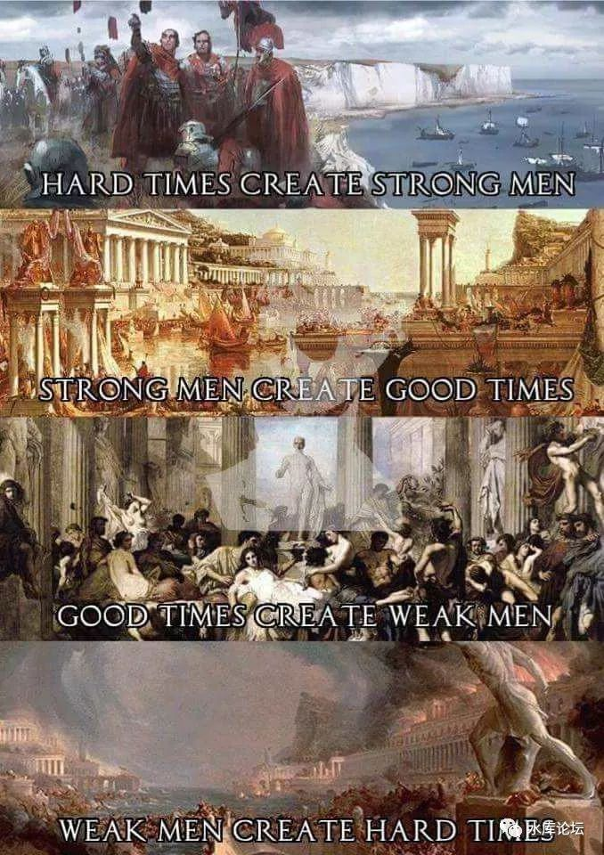
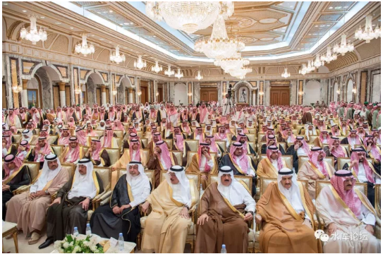
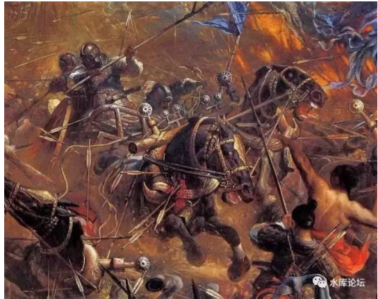
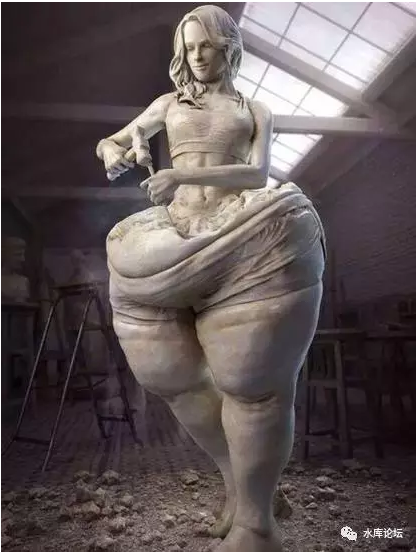
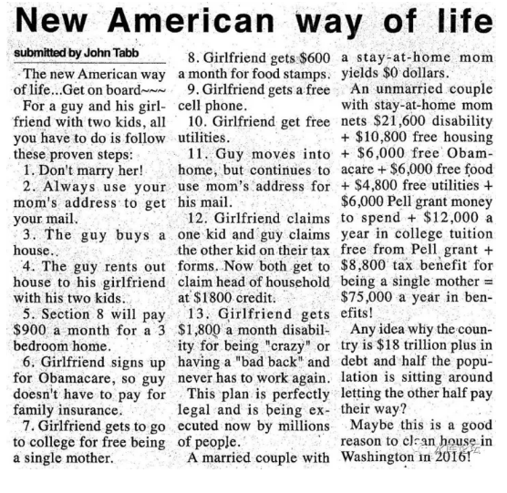
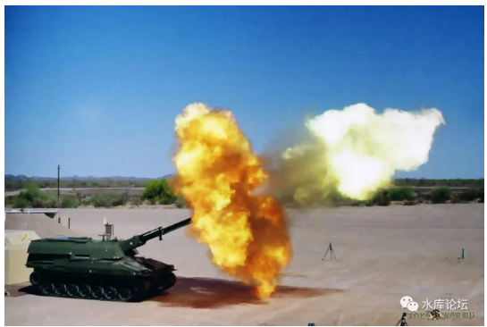
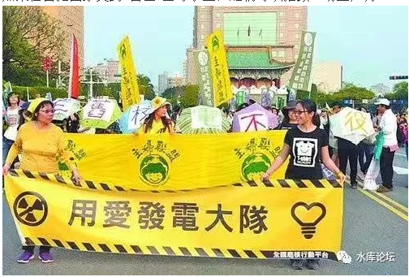

# 六国论 \#F1370 
---------------

原创： yevon\_ou [[水库论坛]](/)
2017-11-01

 六国论 ~\#F1370~
====================================================================================================================================================================================================================================================================================

心血来潮，写了篇12000字的纯历史。

试使山东之国与陈涉度长絜大，比权量力，则不可同年而语矣。然秦以区区之地，致万乘之势，序八州而朝同列，百有余年矣；然后以六合之家，崤函为宫；一夫作难而七庙隳，身死人手，为天下笑者，何也？仁义不施而攻守之势异也
\-\-\-\-\-- 贾谊《过秦论》

 

 

一）第一重

 

我少年读书，强闻博记。课本中不懂的地方不多。

《过秦论》是少数几篇，严重桎梏，想了许久都不明白的课文。

 

最最令我抓狂的，是"秦国"为什么会灭亡。

 

 

当时，俺正没日没夜地玩游戏，KOEI的《三国志》。

《三国志》是一款三观严重不正的游戏。小孩子千万别玩。绝对把你带歪了。\[1\]

哥哥就是掉入三国志的大坑。连续十几年没有明白。历史，政治，社科，全部都晚悟了。

 

 

因为《三国志》，它基本是一款单向变强的游戏。

 

最早开局的时候，你只有刘备，一座小小的城市，2000兵力。几个将领。

随着时间的推移，城市等级越来越高，户外农田产量狂升。

兵力积累，武将如云。

 

最神奇的是，武将"忠诚度"也是可以提高的。只要赏赐200金，就可以提到100。而且永远都不会下降。

"城池"忠诚度也能升。不断地开仓放粮，城池忠诚度也到100，而且持久不降。

 

没有贪污，没有腐败。

没有九品中正制，没有府兵制破产。也没有结党和权臣。

 

 

《三国志》系列只要你坚持玩下去，你就会变得很强很强。各项指数修满。

从一座小城，到席卷河北。再到统一天下。指数增长。

 

因此我对于"秦朝末年，民不聊生。黄巾军起义此起彼伏，朝廷无法控制"这句话，是无论如何不能理解的。

 

为什么你会[越混越回去]了。为什么当你只有一座小城的时候，你可以席卷天下。

等你变成大一统王朝了，可以调度全天下的资源。

反而PK不过一座小城？

 

《三国志》玩得多了，你是无论如何不能理解，一个王朝为何会崩溃的。

 

当我把所有的资源，城池，都抢到手里。造兵，造粮，都是超级大。

我为什么反而灭亡了。谁能灭了我。

 

 

 

当年看《过秦论》，哥哥感到极大的困扰。

秦军强悍，横扫六国。

 

六国拥有山东之地，2/3的人口，2/3的土地。还是被秦国团灭。

秦国大一统后，没有变更强，反而变弱了。

连义军都打不过。

我去问当年的老师，老师含含糊糊说。

"仁义不施"，指的是施政要仁道，要做好人，要做仁君。得道多助失道寡助。别人都帮你，你才能打赢。

 

哥哥向来三观极歪。您骗小孩子么。

这个解释，显然是不满意的。

 

 

 

二）第二重

 

后来我看史书，写《三代之治》~\#F129~。

秦国的灭亡，虽说是秦政餐暴，但其实很大要归咎运气。

Victor Chan，Broad Wu，历史再走一次，未必如此。

 

关键是，当时秦军的主力，并不在国内。

秦始皇灭六国之后，非常奇异地，秦军并没有回归咸阳。也没有"军转民"化。

 

 

后世的大一统王朝，一般的做法，是有一支精锐的中央职业军。驻扎首都。

可以叫御林军，羽林军，神策军，近卫军。

 

在各地关键节点，核心城市，再有小型的警备司令部。

除此之外，小城基本没有驻军。国家也负担不起常备军团。

 

 

但是BC214年的秦军结构，并不是这样的。

史记记载："秦已并天下，乃使蒙恬将三十万众北逐戎狄，收河南。筑长城，因地形，用制险塞，起临洮，至辽东，延袤万余里。于是渡河，据阳山，逶蛇而北。暴师于外十余年，[居上郡]。"

 

"发诸尝逋亡人、赘婿、贾人为兵，略取南越陆梁地，置[桂林、南海、象郡]；以谪徙民五十万人戍五岭，与越杂处"。

 

 

秦始皇在BC221年统一天下，BC214年开始南北二支大型的军团活动，BC210年死于河北邢台。

-   BC209年7月，陈涉，吴广，在大泽乡发动起义

-   BC209年9月，部将周文，就已经打到了函谷关

 "大泽乡"在安徽宿县，离徐州不远。

简单地在地图上看一下，二个月时间，按照古代的行军速度，从徐州走到洛阳还差不多。

 

如果算上大型军团，基本上从无到有组建。还涉及到士兵的招募，组织，粮草，后勤，铠甲。则周文这一路西进，几乎可以用"如入无人之地"来形容了。

 

 

而事实上，也的确是如此。

"陈涉"起义之后，传统山东六国的膏腴之地，如陈留，颍川，谯县，纷纷响应。项梁，刘邦，都在那时候崭露头角。

而他们的共同点是"无人干涉"。

 

如果是后世的唐宋元明清等王朝，这样"大摇大摆"的起事，早就被卫戎部队干掉了。公安干警奋勇制服，毫不手软。

 

可是在秦末，为什么一下子野火燎原了呢。是什么让义军获得了最初的六个月，黄金般的时间窗口呢。

因为秦军主力根本不在国内。

 

 

百战百胜，虎狼成性的秦军主力，精锐的野战兵团。分为二支。

一支在长城沿线，抵抗匈奴。首府上郡（包头），得到消息以后匆匆南下。

古代时候交通不便，使者先跑到九原。

然后王离再带着大军南下。拖家带口，带上全部辎重。

参考千年之后，"安史之乱"唐军安西都护府精锐军团的回调速度。

 

"南下"这支大军，最终和咸阳章邯军团，会合在一起。

巨鹿之战，20万秦军意外被2万楚军击败。项羽"破釜沉舟"一战而定天下。

秦廷败亡，遂不可逆转。

 

 

另一股南线秦军主力，驻扎南海（广州）。

因为距离实在实在太远。等屠睢接到消息时，函谷关已破，秦王室投降。

因此军官团联合计谋，破坏道路，堵塞交通。

 

关起门来，在广州成立了"南越王朝"，赵佗自己当皇帝。

一直维持到了汉武帝时代，被刘彻所灭。

 

 

总而言之，从战术上，你可以这样解释。

因为秦国是中国第一个"大一统"王朝，对于控制天下，很没有经验。

因此秦军主力，北军南军外调。整个中原腹地，居然没有任何成建制军团。

 

一旦叛乱兴起，顿时如野火燎原。

在初期不能遏止，中后期就会呈指数成长。

再加上一点运气不好，巨鹿之战，王离于是挂了。

 

当然，也不能苛求。"治国"这种事，坑子埋子无数。

后来刘邦的西汉，小心翼翼学习秦弊，控制地方。

没想到出了个王莽。也挂了。

 

 

第二重的解释，"攻守之势异也"，秦亡是因为运气不好。

技术上讲，二支主力军团都不在国内。

秦政苛刻，但是如果职业军团镇亚的话，应该也可以维持个十世，八世。

 

第二重解释，依然是肤浅的。

 

 

 

三）第三重

 

前二天在知乎上看了一个帖子，很有道理：《项羽为什么当不上皇帝？》\[2\]

 

作者贴了一张图，西楚霸王分封18诸侯的图。

你往前翻翻翻，看"战国七雄"那张图。

然后留意红线勾勒的部分。

 

作者的意思是，"秦汉"交接之际的中国，其实已经演化成了东西二个部分。

 

勾勒红线以西，实行的是"秦制"郡县制。

红线以东。"六国"实行的是分封制。

 

项羽分封18诸侯，项羽和他的小伙伴们，分到了东边10个。

而西边8个，飞快地落到了刘邦手里。

楚汉争霸，也就是东10和西8之间的竞争。西疆，作为刘邦的"基本盘"，从未动摇过。

 

 

为什么，作者接着提示道。

在"风起云涌"的抗秦起义斗争中，西边8块，从来没有出过任何叛军。

因为，他们就是秦国的"基本盘"啊。

 

 

秦国的扩张，是一个漫长而缓慢的过程。

"战国"时代，延续近250年。其中，仅秦昭襄王（芈月）执政，就超过55年。

 

秦始皇之前，"基本盘"的统治岁月，已经超过了整整三代人。

三代人是什么概念。

"遗老遗少"早已经死光。对前朝的忠诚，烟消云散。

生在红旗下，长在红旗下。都是忠实的子民。

 

 

"秦末汉初"的历史，放在大背景下，其实是"郡县制"和"分封制"竞争的历史。

皇帝是谁，不重要。士大夫们，才是真正在背后下棋的人。

 

其中，秦国基本盘"郡县制"的人口，他们已经习惯了郡县制。

无论如何不肯再回去到"分封制"。

 

 

哪怕项羽一时武勇，击败了秦国王廷。

他们改头换面，换了一个唱戏的。"汉王刘邦"，表面上是沛县军功集团，但中下层当兵的，还是雄赳赳的"老秦人"。

"楚汉相争"归根到底，是秦人和六国的再一次交锋。只不过这次，西军又赢了。

 
那么问题来了。"郡县制"和"分封制"，为什么这么重要。

值得拿命去争取呢。

请看这篇帖子：《[秦凭借军功爵制灭掉六国，六国为何不能如法炮制？](https://mp.weixin.qq.com/s?__biz=MjM5MDg1NjA2NA==&mid=2650451183&idx=1&sn=0fbd47658d2491f92f0c49195d6f45e1&chksm=beb06a0089c7e316901a0efc210be6ad039b07778d5ece6ac03d7b9e3b2a3b3cee6bba87dc03&mpshare=1&scene=21&srcid=1020OzdvIUINBgQYJY5fC56z#wechat_redirect)》\[3\]

 

 

众所周知，战国初期，秦国并不是最强的国家。

论人口，魏国最强。初期魏国的"重装铁甲"步兵军团，战国无敌。

论国土，楚国最强。延绵长江流域。最后还吞并了吴越。

论文化，齐国最强。稷下学宫，诸子百家一半出在里面。

 

秦国象开挂一样，一下子彗星般的崛起，主要是靠"商鞅变法"。

商鞅变法，秦国十年间由极弱变为极强。千百年后读来这段历史，仍然令人目眩神迷。

 

 

但是，"商鞅"变法，究竟做了些什么呢。

中国的教科书，就喜欢在干货上遮遮掩掩。

好比我们背了八小时"工业革命"伟大意义。

你真的让一个大学生穿越回18世纪。你问他，工业革命是什么。该如何主导。该如何刺激发生。

是珍妮纺织机么，显然不是。还不如黄道婆。

瞠目结舌，其实你对于"工业革命"一无所知。\[4\]

 

 

"商鞅变法"究竟是什么，我们打开百度，大致有这么几条：

1）废井田、开阡陌

2）重农抑商、奖励耕织

3）实行连坐法

4）励军功，实行二十等爵制

5）改革户籍制度，禁止父子同席

6）推行县制

 

现在我告诉你，开阡陌，鼓励农桑这种事，各国都在做。你不鼓励人家也勤劳。

连坐法，统一度量衡，后世也玩烂了。没多大杀伤力。

 

"商鞅变法"写了六条。

其中五条是虚的。都为了掩饰真正一条：励军功，二十等爵制。

 

 

水库论坛，很久之前，有一篇论文《三代之治》\#F129.

在其中，我们讲了一个"分封制"的道理。

天子的儿子是诸侯，诸侯的儿子是大夫，大夫的儿子是公卿，公卿的儿子是士，士的儿子是庶人。

 

这个天子是你的。但天下不是你的，还有很多小伙伴。

不过不要紧。你只要生，使劲地生，拼命地生。

 

 

沙特阿拉伯开国皇帝"伊本·沙特"是二战时期的人物。到现在满打满算，也不过70年。

他有100多个儿子，每个儿子又再有无数子孙。

今天沙特的"皇室"，足足有5000个"王子"。每一个都皇室血脉，货真价实。

 

当你有了5000个王子以后，你就可以把政府部门，上到石油大臣，中到电信局长，小到门口开超市的。

国民经济中的每一个环节，全部都用你的"王子"填满。

整个国家，所有的公务员系统，所有的"公卿"，都是"伊本.沙特"的子孙，统统Prince。

 

然后您说，这样的国家有战斗力么？

 
 "春秋战国"时期的中国政治局势，与此类似。

你别看"东周列国志"似乎人才辈出，各领风骚数十年。但其实你仔细看。

魏国姓魏，其实姓姬。

韩国姓韩，其实姓姬。

燕国姓姬。

楚国有景、屈、怀、昭四大姓。

 

"山东六国"的庙堂上，如果你不带点蓝色血统。如果祖宗十八代，不能上溯到尧帝，舜帝，那基本是没法混的。也没有资格当官。

 

 

然后商鞅来了。哦，商鞅也姓姬。他本是卫国的王子。全称"公孙鞅"。

商鞅大笔一挥。"我们要进行彻底的改革"。

 

唯有军功可以封侯 

王子犯法与庶民同罪

 

 

这个大笔一挥。整个秦国就天翻地覆了。这意味着；

1）平民百姓从此有了出头之日

2）王子贵族，再不享有荣华富贵

 

严格地说，"变法"一出，除了秦王，整个秦国就没有"贵族"了。

因此不出所料，一个月之后，愤怒的3000名"非群众"，就挤跨了秦孝公的大门。

包括你的堂哥堂弟，表哥表弟，亲侄子干儿子庶生子，所有你手心手背的肉，一起在控诉不发粮。

 

可是秦孝公不给所动。嬴渠梁才是真正的大英雄。

 

 "十八级军功制"实行了以后，秦国迅速地变强。

平民百姓，人数是贵族的百倍。勤奋人才，更是恒河沙数。

最初等的军功，斩首一级，就可以升一阶。汉语中的"首级"，就是从商鞅变法而来。

 

 

 

对于山东六国来说，他们看见了秦国的迅速变强。

羡慕么，羡慕的。

想学么，没有什么秘密的。

可是能做到么。[太祖教导我们，改变利益，比触动灵魂还要困难。]

 

 

事实就是，山东六国，一直到快要亡国了。

公主们都贩为奴隶了。

"改革"的刀，就是砍不到自己身上。

 

就好比大清快玩脱了，快亡国了。

"工业革命"也不能放手让汉臣去搞。满人又实在派不出人才。

 

美国的民主党，德国的默克尔，非法移民快把国家害死了。但是为了"一己私利"，为了政党的选票，仍然不惜大开大赦窗口。 

 

自古以来，"政治清明"最重要。哪怕小国寡民，只要摊到二个明君，励精图治，几代人之间，"秦子""楚子"，都从一个进贡茅草的小国，成长成西侧南侧国际大国。

 

但是，一旦陷入了政治"死锁"。

统治阶级为了自己的利益，不惜拉民族和国家陪葬。卖国求荣，只求保住自己的选票。

那么这个国家，就只能眼睁睁地看着陆沉。

 

举个例子，今日中国如火如荼，蒸蒸日上。

隔壁的日本，只要进行"全面的改革"，就可以摆脱颓气废气。摆脱"失去的二十年"。

但是他们肯自我开刀么。

项羽的赢，是一次逆袭。

 

"分封制"的旧贵族们，凭着项羽的无双勇力。居然击败了王离的平民军团。并重新建立起了贵族分封制度。

 

"项羽和他的小伙伴们"占据关东十国，基本都是六国苗裔。

重新实施六国的制度。恢复旧贵族统治，重新"贵者恒贵"的生活。

而秦地"郡县制"的人民，他们不愿意过这样的生活。

无论是和平时期的举孝廉也好，战争时期的军功制也好。还是后世的"科举制"也好。

你总要给底层留出一条生路，留出一条上升的通道。

否则人民就不乐意了。"关西"人民就跟汉王走了。"楚汉相争"再起。

这一股"十八级军功制"的欲望，是非常非常强大的。

我们可以联想一下，秦始皇BC214年，为什么要派南军，北军，二支主力离开中原。去南北寻找"不可见"的敌人。

 

因为手下人嗷嗷待哺，杀红了眼，等升职啊。

我好不容易熬到了上尉副营，你和我说，六国亡了，天下统一了。

没有仗打了，没有军功拿了。那我怎么乐意呢。

老家伙们爵位都升足了，钱也捞够了。可是"少壮派"们还没吃饱呢。

日本"9·18"事变之后占领东三省。几乎所有的战略家，石原莞尔一致建议"知止止步"。

东北已经是一笔暴利了。只要能好好利用。肥厚的黑土地有无数的煤铁矿，重工业的天堂，足以把日本帝国带入到工业化国家。

 

可是"二·二六"事变之后的日本中下层军官们不肯啊。他们非要走"军国主义"。

如果你现在停下了，少壮派军官怎么邀功。

熟读汉史的人都知道，虽然有"汉宫飞燕"等旖旎的说法，但"汉"代从骨子里，是一个穷兵黩武的王朝。

"汉室"的目标，简直和俄罗斯没有什么二样。剧烈扩张到每一寸可以达到的极限。

中华汉人，是极其好武的。

 

参考阅读《为什么历史上更推崇曹操而不是司马懿？如何正确比较曹操和司马懿？》\[5\]。

王陶陶的帖子，请注意我点的反对。

 

 

秦二世而亡，固然有运气不好的解读。

但是"十八级军功制"，对于军功的渴望，使得主力兵团远拓蛮荒，深入沙漠，变生肘腋。这也是事实。

 

说到底还是有点基因上的缘故。这是第三重的解读。

 

 

 

 

四）第四重

 

试使山东之国与陈涉度长絜大，比权量力，则不可同年而语矣。

仁义不施而攻守之势异也

 

 

秦军虎狼之师，从信陵君窃符救赵"邯郸保卫战"之后，就再也没有打过任何败仗。

可是巨鹿之战，秦军一败涂地。楚军不管是质量，还是士气上，都超过了秦国。

 

哪怕不看"巨鹿之战"这样偶然性的战役。仅看山东诸国，在此起彼伏的起义潮中，所表现出的"组织力"，募兵能力，战斗能力，秦军的胜绩并不高。英雄豪杰，屡屡辈出。

 

至少，和"战国末期"，秦军打六国的军队，宛如敲石打豆腐一般，百战百胜碾压。完全不能比。

 

 

当我年少读书的时候，我就在思考一个问题。

"为什么战国末年，六国拥有广袤的土地，数倍的人口，却那么不经打"。

"秦末，六国叛军的领土，铠甲，财力，远远不能和灭国前比。却显示得非常有战斗力"。

 

 

为什么，答案已经呼之欲出了。

在战国的末期，"六国"的领军将领，君王和公卿，全部都是"旧贵族"。

就是那种最腐朽，最无能，当了几百年贾宝玉的皮骨。

 

六国一直无法实行彻底的改革，一直无法象秦国一样，"让最优秀的人浮起来"。

这里面主要的障碍，不是秦王的压迫，而是六国贵族本身的压迫。

你让大清载沣载湉领兵，中国人民就永远打不过八国联军。永远都是二等公民。

 

 

"清洗"这件事，其实是由秦始皇来完成了。

嬴政扫平了六国君王。在灭掉了六国政府同时，也把他们"三百年腐朽"的首脑们，一扫而空。

 

此后，在"反秦战争"中，成长起来的一代人。哪个是前朝太子？

项羽，项梁，魏豹，赵歇，张耳，韩广，臧荼，田荣，英布，彭越......

除了田荣是皇室血脉之外，其他人最多只能算贵族。

连"王族旁系"都算不上。

 

六国起义时，相当于大换血。

把原本的王爷，贝勒，全部都换掉。换成了彭德怀，林彪，粟裕。

因此虽然地盘少了点，装备差了点，战斗力反而却猛增。

 

 

"仁义不施而攻守之势异也"，这句话是整篇《过秦论》的核心。

当年语文老师在解词的时候说，秦王暴政，因此注定灭亡。

 

我想，真正的解法，"外交"固然是一个方面。

战国末期，六国各怀鬼胎。始终不能齐心协力抗秦，连横。

到"大泽乡"起义时，大家的目标却都是很明确的。秦军是唯一的敌人，团结起来，绝不内斗。先把秦军干掉。

 

 

但是整句话，更深层的解释，应该在这个"势"字。

秦灭六国时，秦军占势。

秦国代表更先进的生产力，秦国代表寒门可以靠军功出头。秦国代表按劳分配。

六国则是腐朽的，抢劫的，垄断的门阀贵族制度。

秦国打六国，是仗势欺人，居高临下。

 

可是等"大泽乡"六国起义时，起义军内部，只有更少的等级制。更多的自由，更少的束缚。

秦律苛刻，官吏已经开始腐朽。

刘邦入武关，沿途官吏皆降。越是等级高的，降得越快。狠命贪污贿赂刘邦越严重。

揭开秦国的面纱，赵高指鹿为马，脓疮早已溃烂。

 

 

打破了罐头，释放出了恶龙。

英国在印度，宁可使用土司统治。也不愿意对尼赫鲁进行现代化教育。

永远不要让印度开化，永远不要让印度开化。

 

德国人费尽心机干掉了沙皇俄国，结果迎来了斯大林。

黑船震惊了日本，结果送来了太平洋战争。

英国人带来Opium战争，反而导致了中国崛起。

 

 

你干掉了腐朽的封建王朝，结果让这个国家获得了新生。

以为是痛扁一顿，实际是破茧重生。

 

英国如果真的想征服日本的话，根本就不应该打破她的封闭状态。

让德川幕府在"闭关锁国"的状态下，再维持300年。

让双方的科技继续拉大。拉大到欧美殖民者，对非洲土著的地步。

这样子只打一拳，一拳打死。根本不给他反思学习和翻身的机会。

 

 

秦国"扫平旧贵族"这件事，正是为秦国自己，挖上了覆亡的坑。

这是第四重的想法。

 

 

 

五）第五重

 

我对于中美争霸，感到忧心忡忡。

我觉得中国不应该去挑战美国，不应该去超越美国。这未必是对我们最有利的做法。

 

万里长城永不倒罗文 - 在线热搜(华语)系列Ⅲ

如果你看美利坚的今天，可以说是"昏睡五十年"。

英国人自工业革命开始，整个西欧国力突飞猛进。继而扩散到全球各地。Anglo-Saxon人，占领了美洲和澳洲。

 

到了冷战之后，USA的国力更是如日中天。世界格局呈现为"一超多强"。

美国是绝对的，唯一的，毫无争议的超级大国。

 

参考阅读：《如果全世界的海军（不包括美国）在太平洋与美国海军决一死战谁会赢？》\[6\]

 

现代科技不幸，有一个bug。

在古代，燧发枪比长弓领先一代。后膛枪比前膛枪领先一代。

但即使差个二代三代，二只军队还是可以PK一下的。

科学技术的扩散，又使得二个工业国家之间，英法之间，技差不会超过一代。

 

但是现代武器和科技，威力十分巨大。"体系"的放大作用更是惊人。

表现作为，工业实力，只要超越"半代"。比如美国的钛合金工艺，比德国工业仅领先半代。

"半代"换算成武器上，就是10倍的差异。AV-8B和F22根本没法格斗。这是作战体系的差异。

 

因此美国在军事上，获得了人类文明从来没有过的记录"打遍天下无敌手"。

如前文那个知乎贴，不考虑战争潜力的话。仅仅凭人类现有的水面舰艇。"其他国家"所有的海军，加在一起，也不够美国野战打。

 

 

"天下无敌"的反噬力是很严重的。

在文明的长跑竞争中，"先行者惩罚"一定要尽量避免，非常非常沉痛。

 

 

因为美国已经是"天下无敌"了。

美国人在军事上，在帝国扩张上，在安全上，再没有进一步的追求。

 

一个富家女，整天无所事事，闲得发闷。会怎么样。

回答正确，"会嗑药"。

 

 

对于美国的中上层社会青年而言，他们的人生已经没有追求。

美国已经是世界No.1，哪怕更优秀，也是No.1，甚至连敌人都没有了。

 

而"优秀青年"，又是在光环中出生。从小寄托着父辈的期望，接受更好的教育，你不做出点成绩怎么行。

因此美帝青年们，只能从"人文"上想点办法。

 

 

你都这么富裕而强大了，为什么还有人饿死街头。

为什么还有人露宿街头。

为什么还有人生病街头。

为什么还有小猫小狗小金鱼冻死街头。

为什么还有非洲的小猫小狗小男生小狮子小云雀小蜘蛛饿死街头。

为什么非法移民不能享受我们同等的待遇

为什么气候变暖，吃肉放屁，杀鸡要惨叫。

............

 

这些东西串在一起，就是我们所谓的"白左"病毒。

"白左"是一种富贵病。公子小姐们日子过得太逍遥了，才会想到用十八层鸡汤熬茄鳖。

美国人的"富家儿女"太悠闲了，才会记得保护非洲的金鱼和猎豹。 

 

"白左"带给了整个美利坚，毁灭性的打击。

我们可以看到，从1968年越战反战，以约翰逊总统给予黑人选举权力，作为Liberal的崛起。

短短五十年，"美利坚"已经被折腾得彻底不成样子了。

 

 

白人的人口，极度萎缩。目前新生婴儿比例，已经跌破45%。

意味着当60年以后，现有的所有人口死光==\>

美国就是一个55%拉丁黑裔，45%白人的拉美化国家。

 

考虑到黑人人口，依然以加速度增长。美国白人甚至会跌破25%

这个比例，则是危险的"南非白人"比例。

白人会作为"被压迫民族"。从财产到社会地位，被全面掠夺。

 

 

另一方面，Liberal彻底摧毁了美国的财政基础。

9700万人口领食品券，Glasgow三分之二的人口不工作\[7\]，美国未来医疗亏空40万亿。

 

随着"食利者"越来越多，劳动者越来越少。越来越多的人吃福利。

美国的工商业税收，已经崩溃，占财政收入不到8%。

个人所得税，也濒临崩溃。与其辛劳成为纳税人，不如偷懒吃福利。

 

参考阅读：《怎样看待 2015 年美国本土 77% 的黑人婴儿、56%
的拉美裔婴儿出生于单亲妈妈家庭？》\[8\]

 

翻译一下：如果你跟你的女朋友有两个孩子，那么作为新美国人应该这样生活。

 

-   不要跟她结婚！

-   用你妈妈的邮箱收邮件

-   男方买一套房子

-   男方把这套房子租给女方和俩孩子

-   section 8 会给 3卧的房子每月发放900美金的补贴

-   女方签下奥黑医保，这样男方就不用付家庭保险了

-   女方因为单亲妈妈可享受上大学免费。

-   女方每月可拿到600美金的食物券

-   女方可拿到一部免费的手机女方可免去utilities（一般指水电网）

-   男方搬进房子，但是任然使用妈妈的邮箱收邮件

-   男方和女方在填税收单的时候各自承认一个孩子，这样可以因为"head
    ofhousehould"条款，可免去1800刀的credit

-   女友可以以"crazy"或者"badback"申请残疾补贴，一个月可拿\$1800刀，并且可以终生不用工作。

 

一对已婚夫妇的家庭主妇母亲，一年可以拿到的补贴为0刀。

一对未婚情侣，作为单亲妈妈：一年可拿到21600刀残疾补贴+10800刀免费住房补贴+6000刀奥巴马医疗补贴+6000刀免费食物补贴+4800刀水电网补贴+
6000刀联邦助学金补贴 +
12000刀免费大学学费助学金补贴+8800刀税收补贴，一年共计7万5千美金补贴。

 

 

除了人口，财政。美帝的军事，其实不如"白左"们想象的强大。已经露出疲态。

参考阅读：《美国水兵每天工作14小时，工作状态犹如酒驾》\[9\]

 
要问美国海军最大的敌人是谁，很多人会说是中国，但是现在他们面对着一个更恐怖的对手------过劳！

首先表现在无休止加班，以及因此产生的睡眠不足！

USS John S. McCain和Fitzgerald与货船的碰撞的病因都是这个！

兰德公司发布的一份2015年报告显示，睡眠时间不足，睡眠质量差，与睡眠问题有关的白天损伤是军队普遍存在的问题，甚至比整个社会平均情况都要严重。

 

在约翰·麦凯恩与MV
ACX水晶发生碰撞后，海军单位纷纷拿出新措施应对。最重要的一项是对日本前沿部署的舰艇进行新的评估，并采取措施"巩固对日本前沿部署的船舶的培训和认证"，

但这些官僚主义的行动是不够的。

因为病根不是训练不足，而是过劳！是加班太多导致水兵没时间训练！

美国人要求他们的军舰立刻在太多的地方，但军舰数量太少了，根本不可能合理响应这些需求，唯一的办法是加班。

 

据海军透露，水兵经常一周工作100小时，如果按7天工作日算，相等于每天工作14小时，这要是搁在公司里，早tm造反了。

国际劳工组织建议的工作时长是，平民海员每周工作时间不得超过72小时，且最短休息时间为每周77次，这样要求的原因很简单
- 逼得太狠就难免出错。

然而，

美国不是国际劳工组织的成员国，而且针对平民的要求在任何情况下都不适用于军事组织。

所以，美国水兵只能为疲劳耗费生命。

美海军军令部长理查德森在2017年9月19日在美国参议院接受质询时表示：海员是世界上最艰苦的工作之一，需要不间断的关注。任务增加、疲劳和压力也增加，一定会出事！

水兵们疲劳状态下执行任务，相等于酒后驾驶。

 

美国海军目前的兵力达到279艘，但只有大约一半的船可以出任务，其他的则在进行日常训练或维护。

为什么不能多造点船，多招点水兵来分担工作量？

因为穷。

一个最大的问题是国防预算的持续、自动削减，除非国会短期暂时许可，海军拿不到足够的经费去买船。

 

川普许诺了350艘船只，但他不能解决的问题是，造这些船的钱从哪里来，，，

如果你想要一个全球作战的舰队，你必须化相应的钱，可是无论行政部门还是国会都没有这样做。

然而，海军不可能对上级命令说"NO"。

你的船没准备好，水兵很疲劳，但命令来了，作为指挥官没有太多的选择，所以，这个问题是持久的，会长期存在。

 

 

不仅仅是人口，财政，军事的衰退，甚至连后备潜力，也在衰退。

参考阅读：《美国已经造不出来比现在更好的武器装备了吗？》\[10\]

 

 

当年美帝旭日初升之时，搞"八八舰队"。

意思是八艘战列舰，八艘巡洋舰，而且平均舰龄控制在八年以内。

 

今天呢，美帝所有的飞机，平均役龄超过二十五年。

而且国会表示，不会有下一轮大规模投资计划。不再有理工科的人才，可以继续开发。

 

一个帝国的腐烂，是从内部开始的。当腐烂到军事战败，基本已经是癌症晚期。

 

 

以前我玩《三国志》游戏。我怎么也不能理解。

为什么有的国家，有的势力，会越玩越回去的。

你从一个小城出发，到控制整个益州，再到控制整个天下。

三国志游戏里面，没有腐败，没有叛乱，也没有整个文官体制的桎梏。

 

 

可是看了"美国现代政治"，看了白左圣母们的表演。

你不由得赞叹，这样的国家，不亡国才是没天理了。

如果任由把国家交到"白左"圣母手里，她们可以摧毁一切生产力。

SB总是觉得自己最聪明。

 

如果我们仅仅是什么也不用做。

仅仅关起门来，和平发展生产。

目前的国际形势对我们**极其有利**，美国持续衰弱中，"昏睡百年"，五十年耗光了祖先五百年的积蓄。

 

参考阅读：《如果欧洲现在解除对华军售禁令，我们还能买到哪些武器呢？》\[11\]

 

 

在文明的长跑中，"先行者惩罚"是非常非常严重的。

美国是老大，科技文化军事财政，都是绝对的No.1

因此美国就蒙受了"惩罚"。

 

美国的年青人，既然已经是第一了。

他们就没有继续发展的方向。没有了模仿的对象。

剩下的攀爬，只能自己尝试，自己试错，所谓"进步主义"。

 

"进步主义"的惩罚是非常非常严重的。非常容易掉坑。

历史上的古巴比伦帝国，雅典，1789年法国，福利英国，都是毁于"进步主义"。

新的业态尝试，不一定是对的。

也可能毁灭文明。

 

而"圣母白左婊"的尝试，政治正确，民主和爱护小动物；

目前看来大概率是错的。美国正在付出代价。

 

 

说回我们对国际政治的判断。

我认为中国不应该挑战美国的权威，"韬光养晦"对我们更为有利。

"昏睡百年"，让美国，西欧，继续昏睡下去。

让圣母们，继续感觉良好。

让穆斯林，继续以美欧为第一目的地。

 

而如果你现在打脸了，打疼了，甚至打醒了。

打得越重，对中国越不利。

 

 

就象秦始皇扫平"六国"。秦国其实有许多内部缺陷，秦国也是有腐败缺点的。

只不过六国的"旧贵族"更烂。

目前的中国增长率，不过6.5%，内部积弊丛生，国企和管制，正在侵蚀着中国的活力。

 

我们在国际上"一枝独秀"，引领全球经济增长。

只不过因为其他国家更烂，占据世界人口50%的白人，正在昏睡。正在遭受"白左"病毒的晚癌。

 

 

但是你一旦把他们打醒了，甚至打痛了。把"旧贵族"都扫下台。

换上项羽，韩信，英布等一干强兵悍将，中国在世界民族之林的竞争中，未必能占上风。

 

或者夸张点说，如果中国成为了世界No.1强，超级特强。

那必然会引得世界各国"抛弃"旧制度，转身学习中国。

以中国目前内政半死不活的鸟样，"攻守之势异也"，我们被无情击败，是看得到的事。

 

 

 

（yevon\_ou\@163.com，2017年10月31日晚）

 

 

 

\[1\] 现在也有三观不正的游戏，就是大学生玩的《维多利亚2》。绝对深坑。

[\[2\] ]《项羽为什么当不上皇帝》

https://www.zhihu.com/question/26425578/answer/226167317

还有一个跟帖，也很不错。

https://www.zhihu.com/question/26425578/answer/223935528

[\[3\] ]《秦凭借军功爵制灭掉六国，六国为何不能如法炮制？》[[https://mp.weixin.qq.com/s?\_\_biz=MjM5MDg1NjA2NA==&mid=2650451183&idx=1&sn=0fbd47658d2491f92f0c49195d6f45e1&chksm=beb06a0089c7e316901a0efc210be6ad039b07778d5ece6ac03d7b9e3b2a3b3cee6bba87dc03&mpshare=1&scene=1&srcid=1020OzdvIUINBgQYJY5fC56z\#rd]](https://mp.weixin.qq.com/s?__biz=MjM5MDg1NjA2NA==&mid=2650451183&idx=1&sn=0fbd47658d2491f92f0c49195d6f45e1&chksm=beb06a0089c7e316901a0efc210be6ad039b07778d5ece6ac03d7b9e3b2a3b3cee6bba87dc03&mpshare=1&scene=21&srcid=1020OzdvIUINBgQYJY5fC56z#wechat_redirect)

[\[4\] ]有空写《工业革命》杂卷N篇。

[\[5\] ]《为什么历史上更推崇曹操而不是司马懿？如何正确比较曹操和司马懿？》

https://www.zhihu.com/question/61821946/answer/250842041

[\[6\] ]《如果全世界的海军（不包括美国）在太平洋与美国海军决一死战谁会赢？》

https://www.zhihu.com/question/63871126

[\[7\] ]苏格兰第一大城市

[\[8\] ]《怎样看待 2015 年美国本土 77% 的黑人婴儿、56% 的拉美裔婴儿出生于单亲妈妈家庭？》

https://www.zhihu.com/question/59538033/answer/227116654

[\[9\] ]《美国水兵每天工作14小时，工作状态犹如酒驾》

https://www.6ccn.com/yuedu-12097452-1.shtml

[\[10\] ]《美国已经造不出来比现在更好的武器装备了吗？》

https://www.zhihu.com/question/62023084/answer/194584073

[\[11\] ]《如果欧洲现在解除对华军售禁令，我们还能买到哪些武器呢？》

https://www.zhihu.com/question/67434946
