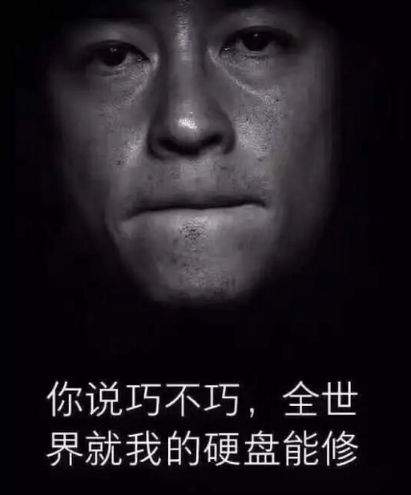
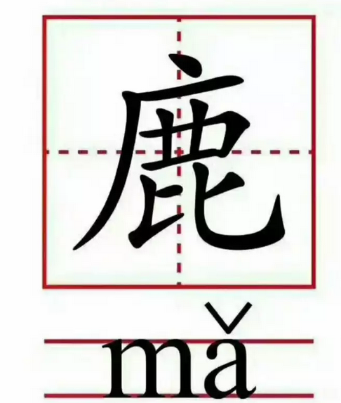
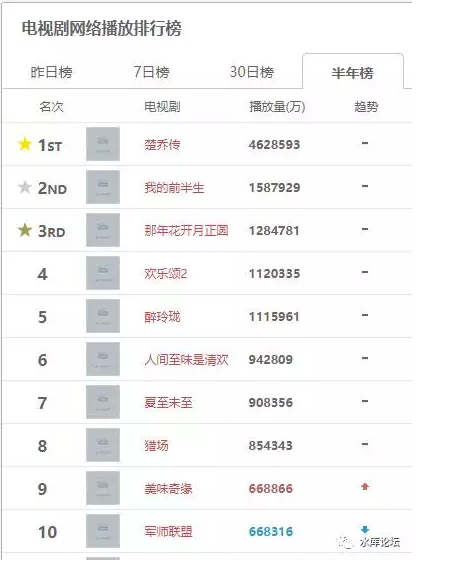

# 即将到来的中产阶级社会 \#F1390

原创： yevon\_ou [水库论坛](/) 2017-11-30

 即将到来的中产阶级社会 ~\#F1390~
============================================================================================================================

 

共振的潮声

 

 

一）前言

 

上一次推送，是七天之前了。

在这一周之内，其实写了二篇：

 

-   《正本清源话通缩》\#F1175

-   《欧美国家可以拒绝非法移民么》\#F1380

 

您想要阅读的话，可以在"菜单---最新五篇"中找到。

 

只不过，由于种种原因，水库文章都没有群发。

算算广告费，二篇文章折合好几万元。未免又有点心痛。

安全第一。哥哥每次经过Starbucks，都是绕着走的

 
近期的热点，是"三原色"事件。

网友们很多留言，要不要凑个热点，您也写写"三原色"。

想死啊！

 

这一类的题材，哥哥是绝对碰也不会碰的。

但是我可以推荐你一个写得极好的帖子，珠玉在前。

"肛锯"先生的《我说一下为什么幼儿园无论贵还是便宜都虐童好了》\[1\]

 

"士大夫"考虑问题的角度，终究和平民是不同的。

能看懂肛锯的文章，人生方有点进步。 

 

今天我们要讲的，是另一个话题：

不可阻挡的中产阶级兴起

 

 

 

二）维密

 

前二天，奚梦瑶在"维多利亚的秘密"走秀，摔了一跤。

维密想要讨好中国，他们放松了对中国模特的要求。

奚梦瑶花了太多时间综艺，腰上长了赘肉。

 
关于奚梦瑶的分析，写得最好的是这一篇《[为什么奚梦瑶不值得同情？](https://mp.weixin.qq.com/s?__biz=MzIzOTM1ODMxNA==&mid=2247483731&idx=1&sn=1c5aa47601e065c3c02df0ca10c152ba&chksm=e92a1956de5d90400b84195b6068bd05fc8122d048f860278c89005f92601e64fe698ba8d2d4&mpshare=1&scene=21&srcid=11219D28BbtOI04b858wWOfT&pass_ticket=mjxzI#wechat_redirect)》

我们对模特的唯一要求，是你必须专业。

你可以耍大牌，可以坏脾气。但你必须专业。

把本职份内做好，才可以交换更多。

 

 

然并卵，奚梦瑶短短15秒的视频，在中文互联网上的播放数量是：3亿次。

3亿次什么概念，英国+法国+德国+意大利

或者说，整个美国的人口数。

 

维密的老板笑不动了。

为什么摔跤的，不是一个拉脱维亚的小模特。这样30万次阅读都不会有。

 

因为摔的中国模特。

整个中文互联网轰动。

维密一举从一个30万元/张门票的小众社圈，扩展到亿万人口关注。

明年内衣销量可观。

 

 

在中国，目前是这样情况。

"影帝"没有小鲜肉重要。

"歌神"没有偶像派重要。

专业的模特，没有娱乐新闻重要。

 

奚梦瑶只要说一句话，就可以让维密的老板继续雇佣她。并且支付好几倍的工资。

"三亿中国人，都想看看，明年我会不会再摔跤"。

 

 

 

三）硬盘

 

这二天刷屏的，是"硬盘"事件。

或者说"404"事件。

 

近期也是中文互联网上的一个奇观。

从来没有过，你从来没见过，有这么多的大V，一篇篇的100000+

 

痛惜者有之，悲愤者有之，抗争者有之，隐喻者有之。

各路大V，各显神通，从各个角度切入，各种取材，互相煽情。掀起了一篇篇100000+

而另一方面，则是"404"。

你从来没见过这么多的404。

 

往往上午看见，下午就404。

朋友圈刷屏，点进去就404.

摁了个打赏，赏完就404.

 

你要问我对这些100000+的看法。

 

哥哥完全都不关心

 

 

 

四）力量

 

那您关心的是什么呢，我关心的是"力量"。

排山倒海，无可抵挡的力量。

 

 

还有多少人记得，TFBoy是哪一年，成为中国销售排名第一歌手的。

SHN48呢，鞠婧祎上次送出2000杯星巴克，进入主流媒体视线了么。

 

不了解相关资讯，可以看这篇。

《[SNH48的吸金手段真是可怕，鞠婧祎的粉丝今年砸了1000万](https://mp.weixin.qq.com/s?__biz=MzI2MjAzMjI3Ng==&mid=2651952487&idx=1&sn=6544fb536229d8e73a39010ac45505fe&chksm=f1b46b9cc6c3e28ac843586fd956a8fa4dbf7eaab93f411ff89d2a8d0818d9a85bd77e6340c6&mpshare=1&scene=21&srcid=07311EXU4LTwzHxY0h69GJtX&pass_ticket=mjxzI#wechat_redirect)》

小女孩们排名次，粉丝们是实打实地砸卡券下去的。

 

水库考虑问题的方式，终究和平常人不一样的。

当"中产阶级"父母，还在纠结于事情的真相，愤怒与讨伐的时候。我们关心的，是另一件事。

 

这么多的迹象，难道您还看不出来么。

一个三亿人规模的"统一市场"，正在逐步形成。

 

 

这个才是惊天动地的大事。其他任何事，于此相比，都小得不足一提。

北冥有鱼，其名为鲲。水击三千里，抟扶摇而上者九万里

 

中产阶级这具大怪兽，从海底爬起。抖落着身上的水珠。

随手撕了二只哥斯拉，当夜宵点心吃。

挥动翅膀。直上云端三千里，大鹏展翅九万里。

 

 

 

五）统一市场

 

中国在1949年之前，一直都是传统的中古"农业社会"。

农田的本质特性，是地理上的分散性。

因此中国大地上，星罗密布地分散了几十万个村庄。"牛家村，李家庄"，种植业土地的分散性，决定了人口的分散性。

 

 

今年天猫的"11.11"促销。卖了1682亿。

相比之下，11月26日（上周五），是美国一年一次Black Friday超级大促销。

美国人骄傲地宣布，营业额涨了+18%，达到79亿美金。

简单计算一下，还不到Tmall 30%嘛。

 

 

有人问，为什么"美，日，欧"诸国，不也搞个11.11，而让马云巴巴独领风骚。

问题不是不想搞，而是没法搞。

 

这问题，简直就象问"1937年中国为什么不造坦克"一样。电商需要无数无数基础设施的。

1）庞大的轻工业，制造业

2）交通和高速公路

3）电信网络

4）普及的智能手机

5）识字的民众

6）廉价的快递人力

7）良好的治安

8）大一统和法制

 

绝大多数的地球国家，连其中的一项都没有。

即使是美欧日等发达国家，也未必有完善的物流和轻工业。

此处，引用马督工的回答《如何看待中国「双十一」线上销售额远超美国「黑色星期五」》\[2\]

 

 

但是，如果你把以上的八点，精简成一句话，一个单词。那么就是：

单一市场

网络有多大，生意就有多大。不超过市场大。

 

中国人，从分散居住，组织度松散的农业社会。

倚靠现代通讯，现代物流，在庞大的国土之上，逐渐凝聚成了"统一市场"。

 

从此以后，你不再是三十万个分散的村庄。

你是3亿人口大市场。

 

 

你看近期的社会热点，它的一个最大特点是"共振"越来越强。

以前，能获得100W个关注，就已经算是大事情。

现在，同一个话题，能有几百篇100000+，数千万人同仇敌忾。

 

共振

 

上海排名第一的报纸《新民晚报》，发行量也不过110万份。真正打开的还没这么多。

 

而我们关注网剧，《三生三世十里桃花》庆功宴300亿次。

《楚乔传》播放超过462亿次（有点刷榜）

这后面的数零，数得哥哥头晕。

"网剧"的播放量，是《新民晚报》的40000倍。

一个上神"白浅"，就能让数十万人同时讨论。

 

 

而这样的"关注度"数字，也不是一朝一夕上去的。

大家都知道网剧"财大气粗"。但视频网站，也不是第一年就有钱的。

就算是天猫11.11，也经历了五年大发展。 

如果我们稍微关心一点历史数据的话，我们就会发现，无论是tmall，网剧播放量，SHN48吸金，网络热点100000+数量，甚至微信用户。

都是逐渐变得越来越强

 

 

当你开了一艘木船，在海里开。

一个巨浪打过来。你不要先心疼，浪花打碎了你几个木桶，几个碗。

这些事重要吗，并不重要。

"三原色"完全不重要。

 

身为一个经验丰富的船长，你需要注意的是："浪花越来越强了"。

从2米海浪，变成4米海浪，再变成10米海浪。

大海在共振，大海在咆哮。

 

当动辄都是几百万人，几百万人的滔天巨浪。

这个才是船长惧怕的。

 

 

 

六）中产阶级社会

 

坦白说，我对近期的"社会热点"完全不关心。

是非对错，正义善恶，哥哥都懒得关心。

 

我重视的是"风浪"。

随着3亿人民，逐渐凝聚成"单一市场"。连通器开始共振，共鸣。

中产阶级不可避免发出自己的呼声。

共振

 

今天不过是一个开始。而且今天的Issue毫不重要。

未来，一定肯定必定，还会发生更"舆论哗然"的事情。

届时中产阶级，会比现在更激动，爆发出更强烈的能量。

 

 

你对于真正的力量一无所知。

真正的力量是什么，是数量！

 

无论是圣人贤相，英雄史歌，他们是很容易击倒的。

沙皇尼古拉二世，号称Czar神的子孙。可是陨落的时候，无声无息。

 

真正不可击倒的是什么，是数量！

当一个群体，有着2000W人口。他们就很难对付。如八岐大蛇般斩杀不尽。

 

而如果有3亿人群呢。

人类一旦形成"乌合之众"，个人就不需要担责任。

批评再严厉，也是法不责众。

"中产阶级"大怪兽，是立于不败之地的，无法惩罚。最多不发声，生闷气。

 

 

"大怪兽"一旦诞生，他就不可能再消失。

今天已经完成"城市化"的3亿人口，你几乎不可能让他们再住回中古时代的农村去。

以2025为分界线，中国的历史，可能会有清晰的裂痕。

 

以2017为元年。影响深远，至少会永久性地改变中国的生态100\~200年。

中产阶级踏上历史舞台。

 

顺便说一下，我个人是反对"中产阶级"的。

相应的观点，写在\#F1380里面。咖啡御免。

 

 

 

（yevon\_ou\@163.com，2017年11月）

 

 

 

二件事情；

 

1）    《分答问答社群》2018年续费，号称今天上线。请大家一定要赏脸，赏脸，赏脸。

衣食父母，剁手败家就靠粉丝养活了。

2）dittojeff问我讨了一个次文位。他说统计阅读量。

次文不代表本人观点。

 

 

 

 

 

 

 

 

\[1\]《我说一下为什么幼儿园无论贵还是便宜都虐童好了》https://zhuanlan.zhihu.com/p/31410941

\[2\]《如何看待中国「双十一」线上销售额远超美国「黑色星期五」这一现象？作何解释？》https://www.zhihu.com/question/37963946/answer/130812690
