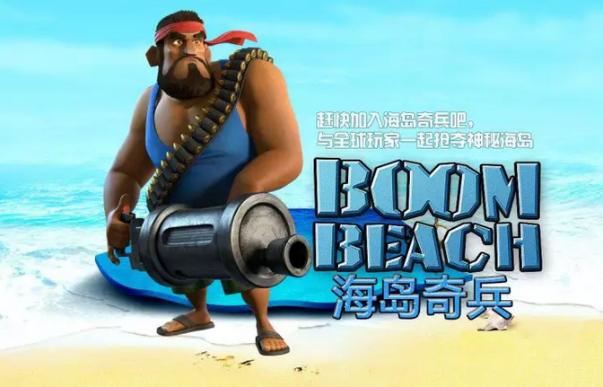
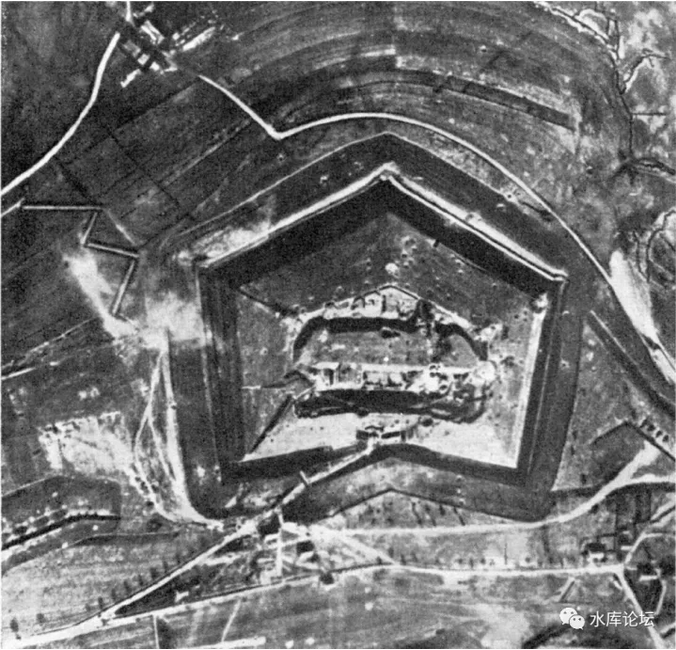
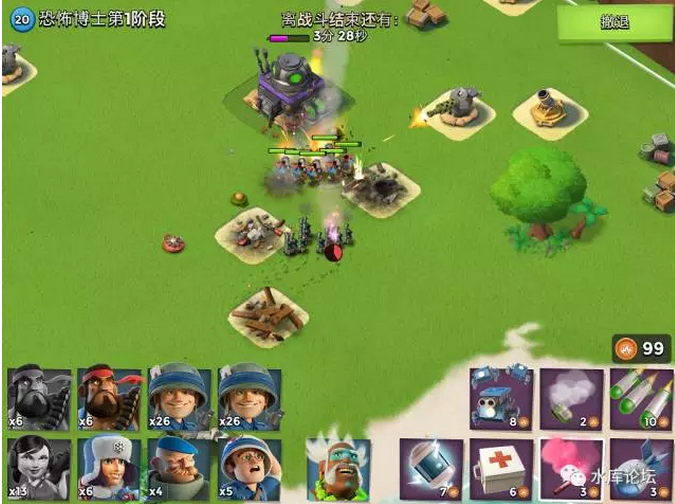
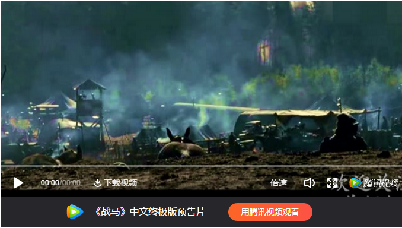

# 海岛奇兵中的军事原理 \#F1400

yevon\_ou [[水库论坛]](/) 2017-12-03

海岛奇兵中的军事原理 ~\#F1400~

 

本篇是军事

 

我花了整整一年的时间，来玩《海岛奇兵》和《部落冲突》。究竟学到了些什么。

  

 

一）战斗力

 

俺少年读书，很多问题不甚得解。也没有明师教我。

 

譬如说，教科书描述"封建时代"的消亡，标准说法是"大炮的出现，彻底轰平了领主们的城堡"，国王剿平了各地的诸侯。

 

可是到了1914年，"德法"之间打一战的时候，著名的凡尔登要塞。德国人准备了24万吨炸药，亲王领队，"大贝尔塔炮"都上了。1000门大炮同时齐射。

要塞弹弹灰尘，纹丝未动。

 

俺当年读到此段时，我就在想，不知道凡尔登要塞，是用什么材料建成的。

既然天下有如此宝物，"封建领主"们为什么不在家里也造二个。国王调集50W兵力也打不下来。

第二段疑惑，是我在读到"解放上海"史料时。

当时，苏州作为东南第二大城，一天就打下来了。

渡江战役"战上海"时，措辞却十分谨慎。

 

纪录片配音解说说，汤恩伯部组织了"立体式"的防御网。

防御力十分强大，不好对付。一开始接触，还吃了小亏。

 

当时俺对这个"立体式"防御，心向神往，不知道是怎样的布阵图。

防御力究竟靠如何计算。

 

 

这二个问题，困扰了我很久，但是俺完全完全解决不了。

为什么，因为你根本找不到"兵书"。

 

我们现在的书店，你进去看，分门别类有所谓的"军事"类。

但你打开来看，无非就是《第三帝国兴亡史》《太平洋战争》《二战中的谍战》

这些，并不是军事。

而是历史书。

 

"军事"一科，是严格管制的。

严格严格地控制科技外传。以至于你任何参考资料都找不到。

 

 

关于"战斗力"上的疑问，伴随了我很多年。

一直到某一天，一家美国公司，又是美国，发布了一款游戏。

这款游戏，是《海岛奇兵》

这家公司，是Supercell

 

 

 

二）海岛奇兵

 

前二月水原问我，有什么游戏好玩。我就向他推荐了《海岛奇兵》。

他玩了二周，升了几个等级。我问他有什么感受。

水原想了半天，回答说："战斗力不是一维的"。

Bingo，哥哥打了一个响指，悟性真是惊人。

 

 

传统意义上，伴随了我十几年的一个误解，我们总认为"战斗力"是一维的。有一个"武力值"。

一个200斤的胖子，肯定比80斤的能打。

200斤带盔甲的，比赤手空拳能打。

 

伴随着这种思想，我们总想培育"最强战士"。津津乐道于关羽和张飞的武力值谁更强，屠龙宝刀加几点攻击力。

 

 

可是在《海岛奇兵》这个游戏里，这是一个Q版模拟战争的游戏，却不经意揭示了战争逻辑的原理。

举个例子，这是最简单的兵种，"火箭炮兵" 

这个，是最原始的炮台，火焰喷射器 

如果你让一个mm，去打火焰炮台的话，那是一滴血都不会伤的。

 

-   因为MM的射程是7.2格。

-   火焰炮台射程3.5格

 

你只要站在射程之外，慢慢地磨死电脑就行了。

 

那么，作为防守方，该如何应对呢。

答案十分简单，在"火焰炮台"的背后，再加一台"狙击塔"。

狙击塔射程12格，扣除炮塔本身占地3格，还剩9格。

足以在MM能靠近火焰炮之前，提供支援。

  

但是，狙击塔也有弱点。弱点就是攻击力太弱。

你譬如造几个大胖子，狙击塔的火力，就象是挠痒痒。

大胖子可以顶着火力，行进很远的距离。

而胖子的缺点是，他的射程只有3.3格。

如果胖子想要攻击的话，他就得贴得很近。然后被火焰炮，机枪，地雷等短程武器打。

 

 

 

三）战争的逻辑

 

武器，大致遵循这样一种原则；

 

-   长射程武器，必然射速慢，火力弱，防御力薄弱，造价高昂。

-   短射程武器，可以射速快，火力强，装甲厚强硬，代价低廉。

 

而打仗，主要分"非对称作战"和"对称作战"二种。

 

 

譬如说，1840年英军和清军的鸦片战争，就是"非对称作战"。当时的英国，已经率先完成了工业革命，技术水准领先清军一代。

 

因为工业革命，可以使用蒸汽机，挥舞几万斤的大锤。水压锻造机，可以把钢铁中的杂质压缩万倍。

因此英军可以造出远远优质的炮管。而炮管的质量，决定了膛压，决定了射程。

 

因为工业革命，欧洲人已经走上了"科学"的道路。

物理学，化学的发展，欧洲人逐渐从"本源"上，开始考虑事物的原理。

这为火药研究打开了大门。经过千万次有针对性的刻意实验，英国人的火药质量远远胜于清军。

更强的火药，等于更强膛压，等于更强爆炸力。

 

 

当1840年清军和英军遭遇时，英国Frigate上大炮的射程是3000米（6华里）。

而清军的射程只有1000米。

 

这就是非对称作战。英军只要船泊在3000米远的外海，闭着眼睛开炮。

打完一排，向前推进500米。

再打一轮。如此往复。

 

往往一场战役打完，清军一枚炮弹都没有还击。

这样才能打出1:1000的伤亡交换比。

 

 

我们看这张名单：

 

陈连升，关天培，江继芸，祥福，葛云飞，王锡朋，郑国鸿，谢朝恩，长喜，陈化成，海龄

以上诸人，均战死于战位，并未因失败而逃生

 

中国教科书，在讲到"鸦片战争"时，绝对是污蔑的。

关天培，葛云飞，琦善，在当时都算"一代名将"。都是打过白莲教，西南夷，镇海王，天理教的"战功赫赫"。

在庙堂上，名将耆宿，肯定拿得出手的。

 

而且你要注意到，这些清军将领，都是"战死"在炮台上的。

誓与阵地共存亡。

鸦片战争，你要推诿于清军"腐败""怯懦"，话是不公平的。

 

真正的原因，还是"非对称性"作战。1:1000交换比。

 

 

我们看80年代的电视剧。里面常常有镜头，中国的民兵，端举着长枪大刀，向日军的阵地突击。

然后被日军"突突突"。

 

在抗日战争时期，日军的散弹冲锋枪，射程大约在100米左右。

而八路手里冲锋枪，射程只有50米。

 

 

意思就是，八路战士，要高唱战歌，冒着身边一批批倒下的同志。冲过前"死亡50米"。

冲到射程之内，才能换一次"开火"的机会。

 

这往往需要巨大的牺牲。几条人命，用血填出来《[[不公平地揍人]](http://mp.weixin.qq.com/s?__biz=MzAxNTMxMTc0MA==&mid=2651016338&idx=1&sn=daad3a965284e2efc40650da0894b304&chksm=80721a81b705939726a9d5cd1cf7195526a97857c527f7032e8c2366a109029a2b5a84b8164a&scene=21#wechat_redirect)》。

而如果"射程"差距太大，机关枪打大刀队。则再多的人命都没用。

 

 

 

四）对称式作战

 

另一种情况，则是"对称式"作战。

殖民时代，欧陆国家打亚非拉，是非对称作战。

欧陆国家之间，是对称作战。

 

你可以看到，英法战争，法德战争，虽然双方指挥官不同，名将互有胜负。

但是总体交换比，还是在1:1之间的。

当数量上升到几百万数量级，大家伤亡都差不多。

 

当你有长程武器，我也有长程武器，这就成了对称作战。

 

 

好比玩海岛奇兵，你有射程远的火箭炮。对方也有射程远的狙击塔。

这时候，你就不指望，躲在远处，一枪一枪剽死炮台了。

你会说一句"大家上啊"。然后一起冲锋。

 

在"对称作战"的情况下，你的部队会呈现一种"长程，中程，短程"的搭配。

对方的炮兵基地太讨厌，射程太远，怎么办。

派一队步兵，一直杀到阵地前。把炮兵阵地给端了。

 

炮兵阵地之前，有机枪阵在防守，怎么办。

平时你是根本不用搭理"机枪"这种短射程武器的。可是你要抄炮兵老巢，你就只能用人命，把机枪堡垒给兑掉。

 

战争的逻辑，大致如此。

"对称作战"之下，才有几百万人打几百万人，才有可歌可泣的英雄炸碉堡。

 

 

 

五）完美阵地

 

中世纪时，其实并不是法国国王的大炮强。

而是"国王有大炮，诸侯没大炮"。

 

18世纪的大炮，依然是一件高科技的，珍稀的，昂贵物种。

只有法王财大气粗，负担得起。

 

因此法王可以端起大炮，对着诸侯猛轰。无脑轰炸几个月。

而诸侯无力还击。

 

 

但是在一战，"凡尔登堡垒"之时，法国和德国的军事实力是对等的。体量虽有不同，科技却是在同一个水平。

因此德国大炮，不存在"非对称性"压制。

 

当德国大炮开火的时候，法国大炮也在开火。并且把德国炮火阵地，赶出视线之外。

德军不得已，花费了大力气。反派步兵渗透，短兵相接，试图端掉炮兵阵地。也就是后世所谓的"壕沟战"。

 

对于要塞而言，最好的防御，是还击。

 

https://v.qq.com/x/page/j05209dg2un.html，前二分钟，重炮的暴力美学

\
 

对于"立体式"防御体系来说，1937年日军进攻上海。由于日军的武器，比中国人领先一代，因此有了射程上的"非对称压制"。

 

你可以看到，抗日战争前期，几乎没什么"打不下的堡垒"。

任何娘子关天堑，如纸糊的一样，哗啦啦就掉下来。

 

因为日军射程更远。他们可以站在射程之外，用重炮稳稳的射击。

在"射程"压制的情况下，任何防御体系都是无效的。

 

 

可是到了1949"解放上海"的关头，汤恩伯也是"立体式防御"。

使用机枪，狙击枪，长程火炮，甚至空中支援等种种方式，构建"长---短"防御。

 

PLA并不占有"射程"上的优势。打这种"立体防御"，就很吃亏了。

一旦退化到"对称作战"，就意味着你要拿人命上去填。顶着炮火倾泻的火力，炸掉他一二个炮火阵地。

 

战无不胜和百折千回，可能也就差一二十年代差。

 

 

《海岛奇兵》有一个重大的功能，可以自己调整炮台的位置。

按照你的喜好，构建"完美"防御阵地。

而不管怎么调，都不是稳妥的。都有攻和破的问题。

 

哥哥每次思索炮台阵的前后搭配。于是就有了这篇文章。

 

 

（yevon\_ou\@163.com，2017年12月3日午）

 

 

 

《海岛奇兵中的军事》和《部落冲突中的军事》，是二篇早已想好，一直存在稿箱中的文章。

今天匆匆发出来，主要是广告主催了。

 

近期研究开发"次文"广告市场，就是主贴下挂的小文章。

"水库论坛"主文，基本可以保证80000+阅读，对外报价，贴片小广告RMB
60000/次。

 

但是很多广告主，喜欢扔给你3000字。恨不得把公司十八代都介绍清楚。

对于这种"长"广告，因为[严重污染]版面。因此只能独立放在次文。

次文的"打开率"很低。连一半都不到。我们给渠道的报价是：RMB
30000元/次，保30000阅读。

 

为了提高"次文"的阅读率，目前采取的策略是，夹杂着"干货"和广告，随机发。

有时候会夹杂几篇dittojeff哥哥的原创文章。

有时候会夹杂几篇恰空的情史。市wei书记的女儿暗恋他。

 

再次强调一次，次文不代表水库立场，纯广告！
