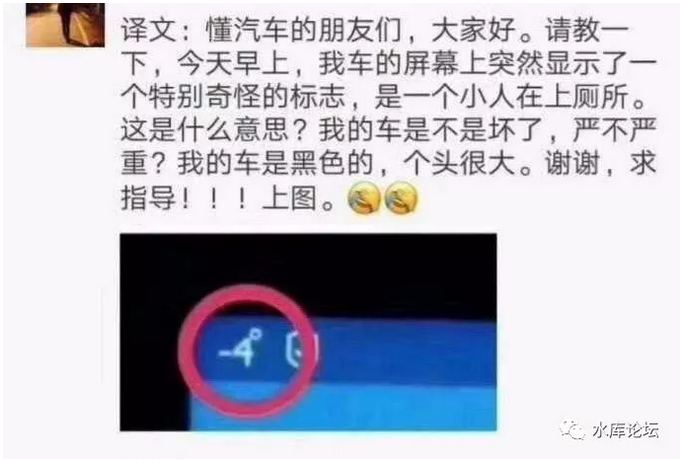
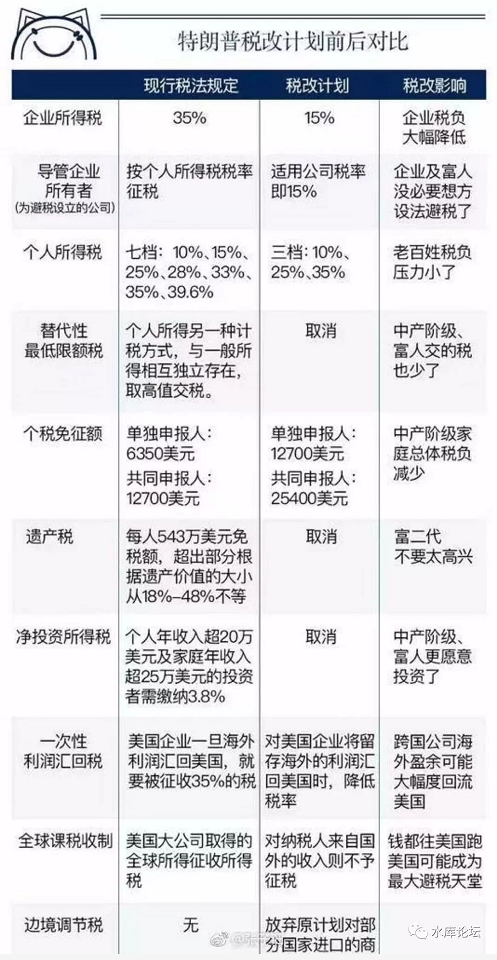

# 特朗普减税案 \#F1410

原创： yevon\_ou [[水库论坛]](/) 2017-12-04

特朗普减税案 ~\#F1410~

 

天亮之前，毫无意义

 

 

一）吐槽

 

特朗普减税案

特朗普减税案

特朗普减税案！

为什么你们每个人都关心特朗普减税案

你们关心点有营养的事情好不好。

 

 

昨天哥哥写了群发《[[海岛奇兵中的军事原理]](http://mp.weixin.qq.com/s?__biz=MzAxNTMxMTc0MA==&mid=2651016553&idx=1&sn=565a5007ccffa7bd5bc3b38f63337b0d&chksm=80721b7ab705926c6d73a4ca9ab4cf57a344e1c7f2aa71cbe04e2a9083c7a8e733b378ad3e35&scene=21#wechat_redirect)》，一经发出，顿时被骂成了狗翔。

群众们纷纷表示，要听更加"高雅"的。而不是小儿科。

譬如，谈谈最近最热门的"特朗普减税案"。

 

特朗普减税案有什么好谈的呢。

哥哥觉得一点不高雅啊。

《海岛奇兵》才是我深思熟悉了十几年，到今年才慢慢摸索出来的，关于"军事"的底层规则。

你以后看战争片，端掉那个火力点，抢夺哪片高地，你都可以在脑海中，默默还原成游戏炮台的设定。可以极大地增强你对于军事的理解。

 

你要问特朗普减税案，那我的回答就是二个字：

"完全忽略"

 

完全忽略，还不如我晚上剥二个梭子蟹来得重要。

别妨碍俺晚上吃蟹去。

 

 

 

二）中恐输

 

我知道，人类询问某一类话题，是在于他们更"渴望"听到那个答案。

 

好比上次写"[[租售同权]](http://mp.weixin.qq.com/s?__biz=MzAxNTMxMTc0MA==&mid=2651016047&idx=1&sn=408f81d688243b299961f255336ffdaa&chksm=80721d7cb705946a7723e948e77cf95d207f3027c07c805642961156c59e44e98bbaa3f5eed2&scene=21#wechat_redirect)"话题时，网友们再三追问。

哥哥最后恍然大悟，"你关心的不是租售同权，你关心的是3000元房租，能否享受800万学区房一样的待遇"。

 

 

同样道理，关于Trump减税这件事，虽然我不关注左派媒体。但想来网上一定是"炸了锅了"。

 

-   中恐输，中国恐成最大输家

-   全球资本流向美国，金融危机一触即发

-   人民币汇率，利率崩溃

-   数百万企业破产潮

-   利率大涨，房价大跌，房东跳楼

 

您反反复复问我，"对特朗普减税案"怎么看，您就是想从我嘴里听见一句："金融危机，企业破产"。

对不对。追问不休，对不对。

 

抱歉了您，真没有这回事。

对Trump减税案的唯一正确解读，就是"忽略"。您别妨碍我吃蟹子去。

 

凡是在网上上蹿下跳，总结归纳"中国崩溃论"的，全部都是SB。

建议您阅读之后，旁边添加注解。-4°

朋友圈同理。转帖给您的，师长，亲友，套餐奉上不送。

 

 

关于这件事，我们首先要讲一个道理。

在中国的历史上，2015年是非常难得"[[减调控]](http://mp.weixin.qq.com/s?__biz=MzAxNTMxMTc0MA==&mid=403410322&idx=1&sn=ac852721468b2403e13722f37d09a47d&scene=21#wechat_redirect)"的一年。

 

在这一年历史上，持续了十年的"宏观调控"政策，极其罕见的出现了"逆转"。

从"政治正确"的层面，放松了大量管制。绳子放松，而不是收紧。

 

具体来说，除了北上广深这四大城市，几乎在全中国的范围，都取消了"限购"。迎来了全国无限购的大好局面。

 

另一方面，政府发文，"凡是不限购城市，一律不再征收非普差额营业税"。

这一块的让利，也是非常非常重的。

在南京，杭州，武汉，成都等上千万人口"强二线"城市，交易税收成本，直接就降到接近零了。

 

 

我们相信，高层领导在出台如此"重磅减税"政策时，心意是好的，肯定也承担负担着巨大的压力。

因为大家的目标，都是"降房价"。

 

奥地利经济学派，孜孜以求，花了近十年的时间。愤懑批评"宏观挑控"管控政策，并且提出了"因为宏观跳控，所以房价飞涨"。

 

只有取消调控，房价才可以降下来。

 

 

好了，现在高高大领导从善如流，给你减免税了。

你倒是见效啊，你倒是见效啊，您倒是见效啊!

你见效了，高高高层领导，才可以免于同僚的异议压力。"市场经济"才可以进一步的搞下去，改革开放才能深入。

 

见效了没有

完全没有

2015年的房地产政策，就是一场大灾难。

 

 

中央期许的几大"减调控"效果，一条都没有显现。包括；

1）降低税率后，交易极大增加。总税收反而上升

2）税率降低，价格降低

3）减少地王和投机

 

-   交易量没增长半分

-   房价继续疯长

-   投机盛行

完全和书上不一样啊。

 

2015年的"减调控"政策，执行了大约一年。最后以"彻底的失败"告终。黯然收藏。从此以后再也不提。

房地产政策，重新奔向"勒死紧逼"，一路狂奔。

改革派黯然收场。减税派黯然收场。

 

 

问题出在哪里，问题出在哪里。

"非限购大城市，可以不征收非普差额营业税"，到底哪里出错了。

 

大哥啊，你接点地气好不好！

 

北京上海的交易税收，是3%契税+2%所得税+5.55%差额增值税。

其中增值税是五年内全额，五年外差额。因为上海楼价涨得非常快，五年往往翻三倍了。全额=差额。

 

算上中介费，限购限贷手续费，垫资成本，"第二套房"贷款损失，房产税等等之后。

 

-   上海买卖一次房屋，交易税收15%

-   在2015税收优惠期间，交易成本11%+

 

看似-4%的巨额减税力度。

大哥，你说15%的交易成本，和11%的交易成本。

**有区别吗，有区别吗，有区别吗！！**

 

你每天上班，老板抽你30个耳光，抽你20个耳光。

有区别吗，有区别吗，有区别吗。

 

答案是没有任何区别

都是捆死

 

 

"产权交易"能承受的成本，上限就是3%。买卖1000W的房子，交30W税收给政府。可怜一年工资才多少。

"契税"的古文本意，就是买卖不动产缴纳的税费。

 

从理论上，"契税"就包含了**一切**税收。

只有到了秀相手上，才画蛇添足增加了那么多**苛捐杂税**。

 

古人的智慧早已告诉我们，"契税"上限就是3\~4%

超过了这个标准，都是失败的。

 

 

然后在2015年的调控政策中，你减税就减税吧，偏偏加了一个小尾巴，"限购城市的非普通住房，不享受此项优惠"。

因此导致的结果，就是北京上海广州深圳，几乎所有能住白领的次新房，全部都是"非享受"。

"第二套房"首付八成，还是七成，有区别么

第二套房，首付降一成，会有效果么。

洒二粒毛豆，能指望交易额翻几倍么

 

你从15%的交易税率，降到11%有区别么。

你抽11%这么高的天税，指望交易额"翻几倍"，指望发生质的改变，有可能么。

 

量变产生质变。

 

"减税派"不要指望一二次的滴水般的减税，能够带来新生。

你要减税，你就一定要减五六次。

一直到突破阈值。

好比房地产市场，把"增值税""个人所得税""房产税""土地增值税""双倍契税"全部都取消。

 

一直降到交易成本\<3%，然后发生质的改变。

 

 

 

三）特朗普减税案

 

话说回特朗普减税案。

美国这个国家，叫做"沉疴难救"。

特朗普减税案有用么，一点没用。

前一阵子曹德旺，脑袋大思路不正常。

他一看，咦，美国税率很低的，能源价格也不贵。拿"账面"的纸上算一算，去到美国建厂，甚至可能比中国还便宜。

 

他兴冲冲地跑过去了，下场如何。

脸都被打肿了，打得象猪头一样。

你以为美国的核心税率是"企业所得税"，这本身就是一场谬误。

"企业所得税"是完全不重要的。其重要性，或许还不如几条会计原则，或者海外资本转移的条款更重要。

 

在美国置业办厂，最最最重要的，其实是二部法律：《工会法》和《环保法》。

 

譬如说，你在美国办厂，干得好好的。

郡政府，突然塞给你300个黑人墨西哥裔，300个叙利亚难民。

根据《平等工作法案》，你还完全不能解雇他们。

每天还要尊重五次做礼拜的休息。

 

 

象这种《人权法案》，是完全不会写在"企业所得税"里面的。

你看华尔街的"招股书"，堂而皇之是不会有这项提醒的。

但是，他对于你利润的侵蚀是巨大的。多200个"待赡养"的员工，你这一年就算白干了。连关厂都逃不掉。

 

这种情况下，你还认为"企业所得税"很重要么。

 

 

美国最麻烦的，一个是他的劳动市场，[对于雇员的额外义务和不平等的劳动合同]，极其的麻烦。

 

另外一方面，则是美国"白左"盛行。动辄说你这个不环保，那儿歧视，此处污染。

工厂门口死了二只麻雀，原材料中有0.0001%的质量瑕疵。

换到民主党手里，分分钟给你开一张几百亿的罚单。

 

而且他们就这么干了，高通，大众，德意志银行，哪一家不是哭着离开美国市场。

 

在这样的环境下，"企业所得税"税率，有个屁重要！

 

 

 

四）结语

 

美国最重要的，是二部法案，《工会法》和《环保法》。

其更深层次的阻力，则是人口结构，白左圣母盛行。

 

"企业所得税"根本不是主战场，不是利益之所在。

而这二部法律，堪称千难万难，能废除的概率，不超过Blue Moon.

 

 

Trump的减税，是件好事。是正确向前的一步。

但是我们注定可以判断，它的效果是"完全忽略"的。

 

没有任何企业，会为了20%的企业所得税率，而考虑去美国设厂。

相比之下，欧洲领导人深明大义。企业所得税率不变，但是海外利润"汇回"只收5%，

反而更务实一点，更加老狐狸。至少能赚到点小钞票。

 

 

美国想要革新，需要全面的革新。

堪比中国房地产市场"沉疴难救"，得把增值税，个人所得税，土地增值税，房产税，统统都取消，把交易"综合契税"税率降到3%以下。

 

美国想要复兴，不仅仅得降"企业所得税"。还必须废除不合理的劳动法，把"公平就业计划"彻底扔进垃圾桶。

废除"环保计划"。虐死了小猫小狗不用赔偿。

 

量变产生质变。

大统领获取一个胜利毫无意义。

得堆积产生四五个胜利之后，USA才会浴火重生

 

 

 

最后还是吐槽一下，这篇文章我只用了1.5小时。一挥而就。

这篇才是水文，毫无营养的文章。但注定会叫好，又叫座。

而《海岛奇兵》俺构思酝酿数年，反复删写8个小时。被喷成翔

都什么眼神啊。

 

 

（yevon\_ou\@163.com，2017年12月3日晚）
