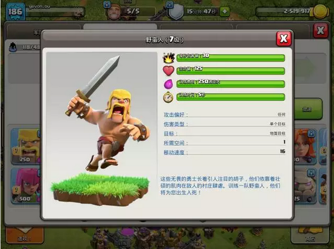

# 部落冲突中的军事原理 \#F1420

yevon\_ou [[水库论坛]](/) 2017-12-03

部落冲突中的军事原理 ~\#F1420~

 

 

上一篇\#F1400中的原理好像写得太浅了，后台骂声一片。

好吧，我们继续。

 

 

 

一）惨败

 

上一节我们讲了"非对称作战"可以无脑胜利，走到哪里，全都是熠熠战神。

但是在真正的对手之间，往往是"对称作战"更多一点。

普法战争能打赢，才算是真本事。

 

如果说《海岛奇兵》是一个小儿科般的游戏，

则《部落冲突》就是成年人的玩具了。

 

 

《海岛奇兵》其实是一个很不均衡的游戏。它太简单。

因为简单，所以有很多必胜的战法。例如一个非常流行的流派，"医坦流"就是利用坦克的超远射程。躲在角落里削。

削完了一圈，再往里一圈。

这样一点点推进，几乎可以无脑清图。

 

 

但是《部落冲突》与此不同。部落冲突中，没有这种长程兵种，也没有特殊逆天的偏科指数。射程都调得很均匀。

难怪他"全球第一"手游的荣誉。

 

 

在玩部落战争时，我一开始用的是"屌丝兵"。

屌丝兵是什么，是野蛮人和弓箭手。

 

野蛮人其实很强。各项指数都很高。和巨人胖子也并不差多少。

关键造价低廉，造兵速度又快。

在最开始六本，七本的时候，全靠野蛮人打天下。 

可是等我升到八本之后，部落里开始"部落战"了。

具体的意思，就是和人类对战。打编组。

一场大战打下来，才知道自己有多弱。

 

 

大家差不多的兵力，我去打对方，完成度10%

对方打我，同样的炮台，完成度100%，全灭。

 

这样连续打了很多场，俺逐渐在思索。

为什么在"对称战争"环境下，双方的兵力相差无几。而结果可以差这么多。

 

 

 

二）批次

 

首先，我总结了一下，俺为什么输。

通过再三的回放，我发现我绝大多数的兵，都是死在"在路上"的。

 

好比说你有200个兵。你在后方拼命地点啊点。满头大汗终于把200兵派下去了。

这200个兵，拉成了5厘米屏幕。

分成了很多排，20人\*10排，一排排倒在了敌人机枪下。

 

 

我以前读书，我是不知道有"行走时间"这个概念的。

20000人的大兵团，印象中是"点状"的。好像没有时空的距离。

而事实情况呢，历史会战中的20000人，前后可以延绵十几里。

"锋线"最前面一排，也就几十人而已。

 

当你真正打仗时，屌丝兵不停地向前，对方的机枪不停扫射。

打完一个，再来一个。

你是一批批送死。

哪怕兵力再多十倍。你也填不满。

 

 

中国1840年鸦片战争时，很多文人震惊。为什么一个拥有4亿人口的帝国，会被一支区区3000人的远征军打败。

事实情况是，你人数哪怕再多。你也是分批上的。就象屌丝兵一样，一轮轮倒在枪口下。

 

赤手空拳的百姓再多，战场也无法达到饱和。

而英军一旦上岸，就是一只"火刺猬"。

火药武器组成的密织火力网，是不可能靠人力来突破的。、

 

 

 

三）胖子

 

下一次的进步，经高人指点，我会学了使用"胖子"。

就是那种血很厚，打不死，扛在前面的肉板胖子。

 

以前，你用200个野蛮人都填不满的机枪炮台，用胖子轻易搞定了

 

胖子有什么用呢，胖子其实也不是很强。

论血槽，也就相当于野蛮人的五倍。

平原上格斗，胖子是肯定打不过五个野蛮人的。

 

 

可是"攻城战"的时候，胖子比五十个野蛮人还有用。

因为胖子可以扛住，一直扛到贴近炮台。后面的嫩血部队，无论是法师，还是弓箭手，可以火力输出。

 

以前二百个野蛮人都打不下来的堡垒。靠"胖法"轻松就可以啃下来了。

只要我方也可以火力输出，而不是傻傻地死在路上。

这就不是"非对称性压制"，而是"对称战争"。

 

鸦片战争中，只要清军可以贴近英军火力输出。

那么哪怕再多十艘船，也不够打的。

 

  

"胖子"事件，互相印证，让我明白了为什么在军事中，"高阶部队"如此重要。

一支军团，混进去几只高阶部队。其战斗力不是相加，而是奇迹般相乘。

 

譬如说，令各国头疼的"游击队"问题。

游击队的战斗力并不弱。使用AK47，在丛林地带，战斗力翻倍。

 

哪怕在平原上遭遇战，游击队面对"正规步兵"，也是毫不逊色。

至少是可以格斗的。

 

 

可是，你纵观二战之后史书，从来没有游击队"进攻"城市的。

在古史上，民兵叛乱，烽火连天。往往已经几十万流民叛军了，可就是有几座"大城"啃不下，在战略上处于极其被动的局面。为什么。

 

 

因为游击队缺乏"重型攻坚武器"。战斗力，绝对不是一维的。也绝对不是加法的。而是要讲搭配的。

游击队如果进攻"大城"。就象屌丝兵打炮台一样。被一层一层地收割。

 

游击队只有AK47等轻武器，这些武器，射程又近。伤害又低。

在正面堡垒战中，防护薄弱的游击队，还没来得及开枪。就被城墙上的建制武器成片杀伤了。

 

 

你一定需要"重炮"。或者"重坦"。

数量不需要多。哪怕象李云龙，有一门意大利炮，打县城就不是同一个难度数量级。

 

 

 

四）攻坚

 

知道了自己弱项在哪里，再要看别人强项在哪里。

在对战中，能打出良好成绩，二星（灭大本营）以上的，我觉得他们套路可以概括为"突破\-\--扩散"。

 

 

譬如说，"部落冲突"新手上路时，常常有千辛万苦，打掉敌人二个炮塔堡垒。但是收获却不多。没抢到什么金币，也没揣掉老巢。

而在高手手里，有时候兵力不多，造了一半出门，收获却极其丰富。

 

 

我想了很久，最终想明白，"军事"这玩意，其实象一个蛋壳。

我们都知道现代军事，他有"硬壳"，有机枪碉堡，有混凝土炮台，有永固型工事。

 

但是另一方面，任何军事机构，也有"软壳"。

包括但不限于：弹药库，油库，飞机库，物资仓库，人员营房，师指指挥部。

 

这些"软壳"往往没什么防护力。只要一支小分队突入，就可以造成非常大的破坏。

但是"软壳"却非常地有价值。无论弹药库，油库，炸了都足以改变战局。

 

通常情况下，软壳是被硬壳包起来的。

 

任何一个军事机构，他总是把钢筋混凝土，冷冰冰的"碉堡"放在外围。

这些碉堡，往往很硬。啃掉碉堡需要大量物力，还需要人命去填。

但是"硬壳"，却没有什么缴获。辛辛苦苦打掉一个碉堡，或许就缴获几罐头沙丁鱼。

 

 

一个优秀的军事家，要取得辉煌的胜利，关键在于"打破硬壳，直取软囊"。

我以前看"二战史"，一直不明白法国军队是怎样被消灭的。 

 

二战法国为什么会走投降这条路？

**御风 **https://www.zhihu.com/question/67453863/answer/254269911

正面逻辑是，法国军事上已经撑不下去了；反面逻辑是，投降也没那么不可接受。

到敦刻尔克结束的1940.6.4，荷兰和比利时都已经投降，英军两个师（12、23）被歼灭。

而法军到此时阵亡了大约5万人（确数好像是49784），总损失了30万，看起来不多。但北线的18个师一半损失掉了，一半打乱了编制、丧失了装备撤往英国，短时间内同样没有战斗力；中线的18个师，连通德军一路扫荡的各军区的后勤、机关人员，一部被歼灭、剩下的大部分则陷入了溃散状态，丢失了装备，丧失了抵抗意志，惊慌失措地四处奔逃，短时间内同样无法恢复战斗力。这些溃散和丧失装备的部队包括法国最精锐装甲部队：三个轻机械化师（DLM）和四个预备装甲师（DCR）。所以，到"红色方案"发动时，法军只能以不足70个师来应对德军压上来的135个师，当然没有胜算。

 

时至"巴黎战役"结束，短短的一个月，法国已经损失了36个师。而且基本都是"全歼"的，连番号都被消灭了。渣都没有剩下来。

 

我们知道，讲二战的故事，就一定不能避免希特勒德国的"闪电战"。

在最早的时候，德军闪电突击，钳式夹击，法国波兰一败涂地。

 

但是，为什么"闪电战"就能全歼敌军。

为什么一旦"突破"，立刻就是整军全歼。

这些问题我想破了头，也想不明白。

 

法军手里也有坦克机枪。而且他们固守本土。躲在非常完善的壕沟堡垒之中。

你哪怕硬攻，也需要很多个月时间。

怎样在短短的一个半月之内，"全歼"一百万的军队。

 

 

这个疑问，一直到我打了很久的COC，才隐约地想到。

因为德国使用了三倍的兵力，他们把所有的坦克集中起来，"狠啄"。

 

好比一个硬蛋壳，狠啄把你凿开了。

尽情地吃里面的膏肓。

 

 

在二战初期，只要德军可以狠狠地撕开第一道防线。

后面就是弹药库，油库，粮草，营房，甚至师指。

 

把这些东西都灭了，前线的部队，一般都只有三天的补给。

我只要绕过你。三天一过，弹尽粮绝，你还不是要乖乖地投降。

 

打COC，你找一堆精锐部队在前面猛冲。

撕开缺口后，跳进去一个邪恶矮个子法师，慢悠悠杀人放火。岂不快哉。

 

 

到了二战后期，所有国家都学乖了。

普遍采取了"复合阵地"购置第二第三道防线。

粮草弹药，也不扔在触手可及的地方。又或者是牺牲效率，分散放置。

 

这样，德国"闪击战"的效果就大大减低了。

甚至在库尔斯克战役，纯粹和苏联人玩起了力的比拼、

 

 

（未完待续）

 

 

 

（yevon\_ou\@163.com，2017年12月3日晚）
