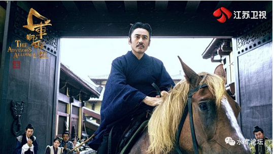
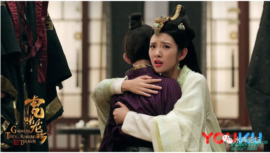
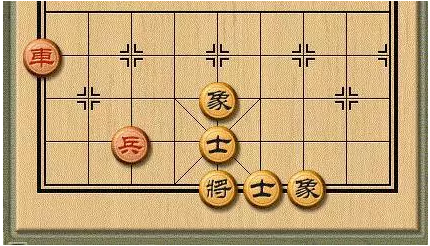
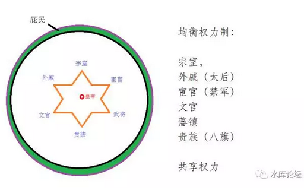
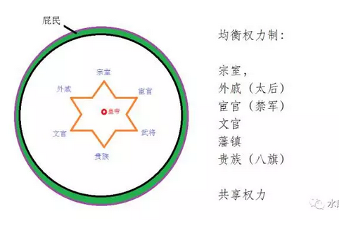
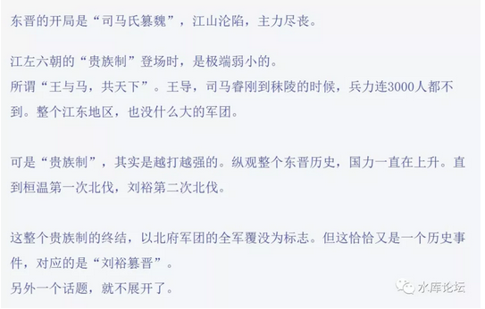

# 司马懿的魏晋孽债 \#F1440

原创： yevon\_ou [水库论坛](/) 2017-12-19

司马懿的魏晋孽债 ~\#F1440~
==========================

本篇为纯历史

前二天，有人问了我一个问题，一下子把我问住了。\[1\]

下笔千言，却不知道如何说起。

各位如果不嫌我啰嗦，不妨听我讲一段司马氏的历史。大江浊酒，尽在笑谈中。

 

 

 

一）忠臣司马懿

 

"司马氏代魏"，在中国历史上，绝对算一场异数。

如同"骡"一样，司马懿以一己之力，改变了历史几千年的走向。

 

因为"魏主"并没有过错。

司马家篡魏，无论从任何一个角度来看，都是一点正义性都没有。

 

 

司马懿入仕很晚。他一直到建安十三年（208年），才遵从曹操的征召。

司马家是河内大族。他的父亲司马防，大哥司马朗，都是朝廷的大官。

 

可是司马懿生性谨慎，谨守中立。一直到曹操打完官渡之战，远征乌桓（207年），天下大势逐渐明朗，他才愿意投身曹魏阵营。

可以说，司马懿从一开始，就不是曹魏的贴心人。

司马懿很聪明，是绝对的"精致的利己主义者"。

你入仕晚，人家创业元老A轮B轮，C轮D轮都结束了，患难生死的老兄弟，梁山座次椅子占满，核心集团都排定了。

 

你想要弯道超车，你想要做大官。

司马懿极聪明，他投靠的不是曹操。而是太子曹丕。

成了曹丕"四友"之一：陈群，司马懿，吴质，朱铄。\[2\]

 

太子舍人不是正式的官职。想要入仕，门槛自然低很多。

而司马懿的目光长远，曹丕一旦即位，他就是"小时候的老兄弟"。

 

真正读懂史书的人，才知道"太子"是最值得投资的。

历朝历代，太子一旦即位，"舍人"都贵不可言。

年羹尧，田文镜，李卫，当初都是雍正的府客。雍正如果不夺嫡，他们连史书上留下名字的机会都没有。

 

事实证明，司马懿果然是"聪明绝顶"。

在曹丕和曹植的斗争中，司马懿屡出奇计，勾心斗角。

曹丕登基之后，他也顺理成章拿到了御史中丞，开始进入中央。

 

 

曹叡的母亲，甄夫人，原本是袁熙的正妻。

美艳不可方物，被俘后一跃从俘女，变成曹丕的正妻。后来的文昭皇后。

 

曹植写《洛神赋》，写道：

凌波微步，罗袜生尘，光润玉颜。

含辞未吐，气若幽兰，华容婀娜。

这段话，赞美洛神，写的女神却是甄夫人。是甄夫人在洛水上跳舞的婀姿。

叔嫂间写出"令我忘餐"这样的字语，其实十分不妥。曹丕看在眼里，怒在心里。 

但是曹植和甄宓之间，真心是什么事也没有的。

史学界一般共认，曹叡的血统是可疑的。但是这个锅，并不是袁熙背。

 

甄宓在曹府养了半年，最后是曹操赐给曹丕的。\[3\]

曹叡其实是曹操的儿子。

陈寿写《三国志》，有意把曹叡的生辰写错了半年，暗示血统可疑。后来经过史学界重重认证，决定老贼嫌疑最大。

也造成了曹操/曹丕父子之间的严重不和。

此是后话，略过不提。

 

 

曹丕费尽心机地争太子，然后曹丕篡汉，当上了魏文帝。

这个辛苦皇帝，寿只有七年。

七年之中，司马懿进入中枢，开始带兵，最终成了"许昌留守"。类似"荀彧---曹操"最信任的关系。

 

曹丕死时，留下遗诏，让他最信任的曹真，曹休，陈群，司马懿，作为曹叡的"辅命大臣"，地位十分尊崇。

可以说，曹丕一辈子，都把司马懿当成了最好的朋友。

 

曹叡的寿也不长，魏明帝13年，死于239年。这一年司马懿60岁。

曹叡遗诏，让曹爽，司马懿一起当"辅政大臣"。司马懿又一次成了托孤。

辅佐养子曹芳。

 

 

故事如果进行到这里，司马懿就是一个"四朝老臣"。

地位高度尊崇，但在历史上也车载斗量。

并没有特殊之处。

 

 

 

二）反贼司马懿

 

然后，司马懿就谋反了。

司马懿居然谋反了。

司马懿居然谋反了！

 

司马懿谋反，是历史上最奇特，最不合逻辑，最不可思议的事情。

一个70岁的老人，在离开了政坛10年之后，居然倒戈一击。

 

 

司马懿是"四朝老臣"，二度托孤。

曹芳登机后，曹爽不爽司马懿，把爷爷辈的心腹踢出朝堂，独霸朝政。

司马懿也乖顺地象绵羊，丝毫没有和曹家人争。

 

就这样足足过了十年。

等曹芳从8岁成长为18岁。所有人都遗忘司马懿的时候，他突然反了！

 

 

你想象一下，在古代，一个70岁的老人，是什么概念。

君王从来不提防老翁。因为你哪怕夺取了天下，古人寿命都很短，你又能享受几年。

进则二三年富贵，退则全家屠灭。谁会下这样的赌注。

 

而且曹丕待司马懿"恩重如山"。司马懿几乎就是他一手提拔起来的。

太子舍人，说是家臣。放在清代和"家奴"也差不多。

这是多一层人身依附关系的。和普通的"食君之禄"外庭官员又有所不同。

 

 

而且司马懿并非没有掌握过权力的。曹叡登基的时候，他也是"辅命大臣"。

此后魏庭无人，南征北战，全都靠是司马懿四处灭火。

孟达，申仪，诸葛亮，公孙渊，三次吴国入侵，司马懿长期军权在手。一度整个关西兵力都是他控制。

司马懿也没有反啊。

 

等到公元249年"高平陵之变"时，魏哀帝想破了头，任何人都可能反。

唯独你司马懿不可能反。

你没理由反啊！

 

 

可是司马懿真的反了。

宛如一个隐藏了41年的刺客，熬死了四个皇帝，不慌不忙，突然一把亮出了獠牙。\[4\]

 

而且他真的反成功了。\[5\]

"高平陵之变"是中国政治史上的奇迹。自古以来，"反叛背叛"层出不穷，满大街都是。

可是"政bian"搞出一个大一统王朝来，化家为国，形成正统王朝。正数三千年，倒数三千年，只有"晋"祚百年。\[6\]

 

 

 

三）晋王朝

 

司马懿篡晋，是中国历史上的奇事。司马懿以一己之力，把整个历史进程都打乱了。

司马家最大的问题，是他们得了天下之后，没有办法坐天下。

 

魏帝并没有过错，曹家待司马家恩重如山。

在这样的情况下，你还要反叛。

做了婊子还要立牌坊。

 

因此有"晋"一朝，是决口不提"忠君"的。

从汉武帝"罢黜百家，独尊儒术"。前面的汉魏，后面的唐宋明清，中国的主体思想，一直都是"孔孟之道"，都是儒家忠君。

 

唯独当中缺了一段。缺了司马家篡位，魏晋南北朝风流，大分裂和五胡乱华十九国。

大约四百年的时间。

这四百年内，统治中国的是"道教"。尤其是黄老，和庄周的"玄学"。

 

 

为什么，因为司马家没法提倡"忠君"。

曹家都待你这么好了，你居然还高举叛旗，你有什么脸面，号召属下"尽忠"。

 

你又不是被逼到了绝路。

象后世的起兵，萧衍起兵反对萧宝卷，朱棣永乐朱允炆，那是被逼到绝路了。朱棣都跑到大街上吃大粪了，朱允炆还不肯放他一条生路。

那只能举旗了，鱼死网破。

 

可是曹家并没有想害你司马家，还高官厚禄给了你一个"太傅"的虚职，把你养着，子孙荫萌。

如果一个70岁的老翁，脱离了政坛10年之后，居然还能发动"高平陵之变"。

请问，满朝文武，还有谁能信任。

 

 

有晋一朝，大家满口昭昭。讲的都是"渺渺天命"。

你司马家可以得天下，因为天命在你。是运气好。

什么"忠君"，以死报国，舍生取义之类的，就不要提了。

 

 

               

四）皇权

 

生于不义，气血不足，始终没有凝聚力。

 

晋王朝接下来一个"并发症"，则是在司马炎手里做的分封制。

这段对"政治学"的要求比较深。各位不嫌我啰嗦的话，让我插一千字左右的说明。

 

 

中国第一个"大一统"王朝，是秦王朝。

当时"秦始皇"前无古人，没有经验可以借鉴。因此在"进步主义"上吃了大亏。

 

秦国虽然建立了中国第一个封建王朝。

可是对"有机体"应该如何构建，bug何在，毫无经验。

 

秦始皇设计的政体，是这样的。

}

看过80年代电视连续剧《秦始皇》的人，肯定印象深刻。

里面有一句台词："哪个还敢多说话"。

 

秦始皇的权威，是100%的。

一言九鼎，任何人都不能违抗他的权威。也没有校验和否定的机制。

 

 

而事实上，这样一种"体制"运行的结果怎样呢。

结果非常糟糕。秦国只维持了不到30年，就崩溃了。

 

史学中，有一种说法，认为始皇帝真实死于赵高之手。

是赵高毒杀了他。

 

然后赵高就"彻底"控制了朝廷。只要不停以始皇帝的名义发布指令，就可以逼到蒙恬自杀，逼到扶苏自杀，逼到李斯腰斩。

把秦王室的王子公主，杀得干干净净。

逼到重臣指鹿为马。

 

 

象这样"绝对君主制"的体制，君王其实是很危险的。

因为君王也是人，不是神。

是人，就有可能被官宦，女官们控制。

你皇帝再强势又如何，还不是被十六个宫女勒死。[\[7\]] 

 

法国大革命的罗伯斯庇尔，强势无比。

他既镇压左翼，也镇压右翼。把自己四五个盟友，全部都弄死。

最后，一场宫廷政辩，死得无声无息。只要五六个卫兵，就把他送上了脚手架。

 

后代的政治家，痛定思痛。认为"宫闱"是很容易被控制的事。

为了防止"绝对皇权"被太监宫嫔卫兵，轻易控制。

因此在皇帝身边，还要加二个"士"。

如图，"士"是内廷的，宰相反而是外庭的。

 

 

"士"有这样一种功能，即"皇帝被控制时，他可以解锁"。

换句话说，它不仅可以拒绝皇帝的命令，还可以废立君王。

 

"控制论"是很复杂的。

"士"如果拥有如此巨大的权力，可以抗拒君王，并且策立君王。

那么有心人立刻问出，"士"才是真皇帝，皇帝是傀儡皇帝。

 

好比罗马帝国的末期，"禁卫军"完全控制皇帝的废立。

禁卫军才是真曹操。

皇帝不过是木偶傀儡。

 

 

那皇帝怎么办呢，"皇权"最终设立的，是这样一个复杂机构。

如图，在"最高皇权"的周围，衍生出六颗小星。分别代表六股势力。

他们介于"屁民"和"皇权"的中间。

拥有废立皇权的力量，但又互相牵制。

 

宗室：宗室是对皇帝威胁最大的力量。南北朝许多皇帝，干脆把自己的兄弟彻底杀光。

外戚：东汉四代都是外戚专政。外戚真正的力量来自于"太后"。太后有赦旨权。

宦官：许多人不知道的规矩是，京城唯一的军事力量，羽林军由宦官掌管。

文官：士大夫集体

武将：藩镇，安禄山，尔朱荣清君侧

贵族：满清八旗，异族统治，荆襄集团

 

对于"拱卫皇权"的机制，皇帝不是设立一个，而是设立六个。

这六个，理论上都有力量"废立君王"。

纠正皇帝被太监控制的可悲局面。

 

而在实际操作中，"控制论"是一把双刃剑。

既然有东西可以伤害到"皇权"，皇帝对它是一百个不放心。

但是你又不能放弃"六柱"。你只能在他们之间搞平衡。

 

这六个集团，任何一个的影响力份额，如果超过了51%，都是极其可怕的事情。意味着皇帝当不下去了。

低一点，40%也足够威胁了。

如果低于33%，则数学上至少需要三到四个利益集团，同时存在。

 

 

譬如说"人民的慈父"斯big林，Stalin对于铁血人民，可绝不是什么好消息。

可是他的领袖位置，却从来坐得非常牢。

因为他手下五六股人，无论是苏共，军部，行政院，KGB，互相之间斗得一塌糊涂。

五六股势力咬来咬去，都恨不得咬死对方。

最后，只能求助于高高在上的"仲裁者"慈父。

 

 

 

五）司马炎

 

说回到晋王朝，司马炎在他登基的第一年，也是晋王朝的第一年（265），做了一件他自以为无比聪明的大事：

-   分封诸王

 

 

前文说到，司马氏得国不正。高平陵之变后，任何人都不再值得信任。

因而司马昭/司马炎，是长期生活在恐惧之中的。

 

他们时常在想，司马家既然可以"高平陵之变"。

那有什么理由，阻止你的手下，也照模照样再搞一场呢。

只要出一个幼帝，司马家就危险如风中之烛。

 

禁卫军将领可靠么，宰相可靠么，太傅可靠么，将军可靠么。问号问号问号。

司马昭放眼望去，台下全部都是潜在的反贼。

 

 

政治学上讲，术语"得国最正"。

你一定要一路杀过去，杀得血流成河。武力剿平所有的竞争对手，翦平群雄。

这样做，在政治上才能有最高赞誉，俗称"得国最正"。

 

为什么，因为你在"皇帝"和"臣子"之间，划清了一条界限："千秋功业"。

毕竟"武力统一"这事很难的，刘邦和曹操的功业很难的。不可复制。

曹家做皇帝才有道理。

 

可是你司马氏有什么功德。你司马氏做得，为何南宫氏，慕容氏做不得。[\[8\]]

大家都是臣子，Feet to Feet，司马氏可以篡位，夏侯氏也可以篡位。

 

司马炎天天想这事，天天烦心这事。想得头都大了。

他也不想哪天出去打猎，司马家被人一锅端。

于是他决定，"分封诸王"。

 

-   赵王司马颙，元康初迁征西将军，开府仪同三司，都督关中

-   成都王司马颖，惠帝时为镇北大将军，都督邺；

-   齐王司马冏，为镇东大将军，开府仪同三司，都督许昌

 

晋帝的分封，是"实封"。

在所有官职中，最有价值的是"都督"二个字。相当于"军区司令"。

 

 

司马炎的分封，指司马氏各王，各镇一地。

每一个王爷，不仅有当地的封国，官禄，而且最关键的，野战军不是由中央控制，而是由"都督控制"。

 

可以说，司马氏每一个王爷，都是一个"独立王国"。

和千年成吉思汗死后，蒙古帝国迅速分裂，没什么二样了。

 

 

司马炎的如意算盘是，司马氏分裂成几十，上百块。

那就不会象曹魏"高平陵"之丧了。

作为一个分布式系统，哪怕洛阳被人端了。司马氏还可以活下来，至少可以活一百几十年。

 

很好，报应来得很快。

八王之乱

 

 

 

六）八王之乱

 

司马炎的世子，是一个白痴。

司马衷留下一条千古名言，"何不食肉糜"。

 

司马衷一辈子只有一个儿子。这孩子聪明伶俐，天赋过人，简直就是神通。

司马遹的妈叫谢玖。

谢玖是司马炎内府的，赐给太子之后，很快就怀孕了。

人民群众纷纷表示，老贼啊老贼。

 

当时大臣们议论纷纷，都说司马衷是个白痴，怎么可以继承帝位。

只有司马炎含笑不语，"儿子不行，我看孙子就很聪明嘛"。

于是这事就定下来了。

 

 

可是司马炎没想到，他死了以后，有个超级嫉妒的儿媳妇：贾南风。

史上第一悍妇，杀掉了司马遹，杀掉了谢玖。引发了八王之乱。

距离他的去世，还不到三年。 

我们之前画了一张图，权力需要稳定，需要六个角互相牵制。

  

司马炎极大拓展了"宗室"的力量，每一个司马家的"八王"都象是独立诸侯一般。

可是他没想到，这个原本防止司马家被"一锅端"的设计。在他这个"大家长"死掉之后，

惠帝缺位，迅速演化成了"八王之乱"。

 

一开始三个王，属于"宫廷"亲王，伤害还有限。

可是变乱持续，渐渐地把司马颙，司马颖，司马冏三位扯进来了。

 

这三位的抬头是：

-   关中都督

-   邺都督

-   许昌都督

 

其实就是晋帝国的西路野战军，华北野战军，中原野战军。晋军三大主力之间的决战。

 

 

晋帝国互相消耗，当把这些"野战军"的底子消耗光。北方的游牧民族"五胡"南下，便再没有力量抵挡了。

 

最终"五胡乱华"，整个华北沦陷。

晋国朝廷，又没有凝聚力。二位皇帝被俘虏。

 

衣冠南渡，大分裂时代持续四百年。

"南北朝"诸多历史支线，起源都来源于司马家"得国不正"，来自于司马炎的八王分封。

来源于那个70岁老人，那年冬天，老骥伏枥的不甘心。

 

 

https://t.xiaomiquan.com/jYjay3Z，原帖讨论

（yevon\_ou\@163.com，2017年12月18日暮）

 

 

 

 

\[1\] 知识星球的原帖链接：

https://wx.xiaomiquan.com/mweb/views/topicdetail/topicdetail.html?topic\_id=15512228828842&user\_id=225442182841

\[2\] 陈群是历史上的大人物。陈群搞出了"九品中正制"，引发了长达300年的门阀时代。

\[3\] 《程昱之死到底是因为什么？》https://www.zhihu.com/question/68380359/answer/262720272

\[4\] 献帝，曹操，曹丕，曹叡

\[5\] 参见一篇文献《如何评价邓艾和钟会？》

https://www.zhihu.com/question/23274323/answer/24820882

\[6\] 赵匡胤严格算，应该是兵变。他是掌握军队的。

\[7\] 指嘉靖帝的"壬寅宫变"。

\[8\]司马炎辛辛苦苦灭了一个吴

次文是广告，不代表水库观点。

最近次文点击太少，害得我被广告主扣了二次钱了。各位多多捧场。
