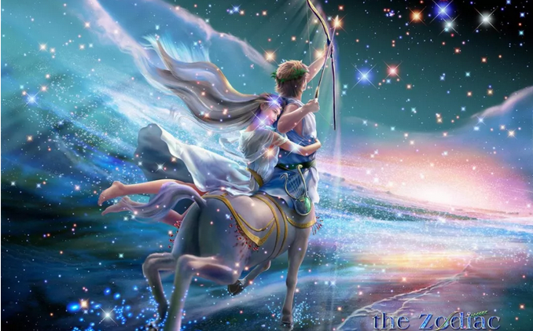
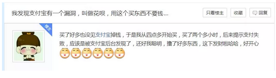

# 男人是张信用卡 \#F1470

原创： yevon\_ou [水库论坛](/) 2018-01-18

男人是张信用卡 ~\#F1470~
========================

 

 
=============================================================================================

我们相信，人与人都是平等的。

一个自由人，如果哪一天他结婚了，一定是为了追求更大的幸福。

 

因此当某个傻瓜结婚后，他彻底地懵圈了。

雪片般飞来的，是无穷无尽的账单。消费者的权益，却细微到几乎没有。

 

 

我想"女权"份子们，或许搞错了一个问题。

男人不是取款机，不是ATM，也不是吸血宿主。

男人是一张信用卡。

信用卡的意思，你刷了要还的。

 

 

男人不是提款机，信用卡是记账的。

你可以肆无忌惮地消费，肆无忌惮地挥霍男人心力，肆无忌惮地排泄负能量。

但"信用卡"是记账的。一笔一笔记在账上。

到了一定时间，他就给你寄封账单。

 

信用卡是有"免息期"和"透支额度"的。

在免息期内，你觉得信用卡可能是全世界最好的东西。可以买下任何你要的奢侈品，肆意挥霍，没有反噬，不用考虑辛勤劳动。

但任何"免息期"，终究不是无限的。

 

 

免息期到了，信用卡公司就给你寄封账单。列明了您近期的消费，每一笔都有，请记得及时还款。

如果您"全额"还了。很好，没有任何后患，还能攒点积分。

如果您还不清，也行。你可以还"最小还款额"。

 

 

当你欠了钱，而没有还清。"信用卡"就开始计利息。

而且是很高的利息。\
下一次你想"全额还清"，就得付更多的本息。

 

你以为这是个悲剧，其实还早。

信用卡从开始"背负"利息，一直到最终封卡，期间还有无数光年距离。

 

车太贤电影《悲伤故事》中，讲述了一个青年。

在超市购物的时候，连续换了八张卡，最终都刷不出来。

因为每一张卡都已经利滚利，负债把授信额度全占光。

只有卡"爆"了，才会真正停卡。

 

 

当你不能"全额还款"，你的情感账户就开始产生利息。

但你的男朋友，往往是一张"巨额白金卡"。

在某些情况下，甚至是一张"天价黑金卡"。

 

"免息期"和"高额度"，给了你一种错觉。

[让你幻以为，"刷卡"是不用还的。]

[让你幻以为，卡是永远不会"爆"的。]

无论你怎样的肆意荒唐，银行总纵容着你。有求必应，只有快乐，没有悲伤。

 

可是您，千万不能连"最小还款额"都不还呀

 

请保持良好优秀的用卡习惯。

虽不能避免竭泽而渔，可您这样做，就是把一世的福报，十年全烧花完了。

 

 

再大的额度，也不是无限。

再大的透支，终究也有尽头。

终有一天，信用卡公司会通知你，已经触及了最高授信。再也不能"利滚利"了，封卡，请您还清卡债并支付高额利息。

 

你茫然四顾，才发现已经"透支"了这么高的天文数字。

 

 

 

我们相信，人与人是平等的。

任何人，都不是老爷，巴依，奴隶主......前来奴役剥削你的人。

自由人结婚，图的是更幸福的生活。

平等的三观，才是正确的三观。

 

男人是一张信用卡，信用卡"余额"天生为零。

不是奴隶，不是贱民。刷了请记得按时还款。

 

 

女人通常缺乏智慧，"女权"主义毒害尤其恶劣。

当花子纵情享乐，岁月静好，她们没有注意到，她们丈夫的怨气。

男人有免息期，可男人不蠢。

 

在北京这座国际性大都市，有多少人意识到。

"情感账户"早已是巨大的赤字。

 

 

放弃共有：京沪35套，6300㎡

代偿：4550W房贷

1000W现金

 

获得：二个孩子

福建人重感情，算和平封卡吧。告诉大家这些什么意思呢，意思是：

这次捅了一个巨大无比的财政窟窿

接下来，恐怕要更加肆无忌惮，毫无底线地接广告了。

大家原谅我吧。

 

 

次文是广告。重申水库广告原则：

a)  一字不改，给钱就刊

b)  批评留言统统不放，赞美留言统统放出。水军留言一律置顶。

童叟无欺，信誉可靠。欢迎广大商家投放。

 

 

（yevon\_ou\@163.com，2018年1月17日晚）
