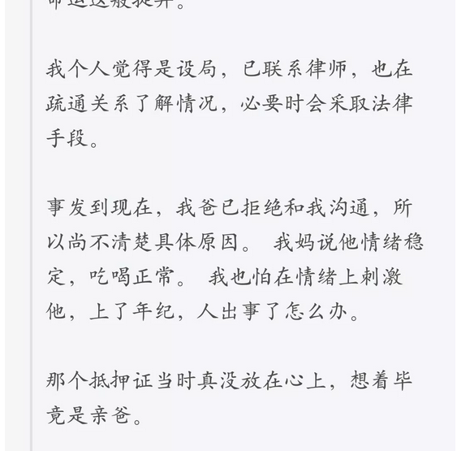
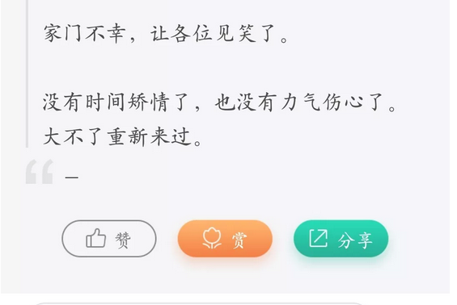

# 亲爹啊，我尽孝了 \#F1490
------------------------

原创： yevon\_ou [[水库论坛]](/) 2018-01-29

亲爹啊，我尽孝了 ~\#F1490~

 

一）惊变

 

代持的事很多。代持的事，爆出三千万窟窿，这是第一单。

而且爆破的方位，唉，怎么说呢。

 

通常，代持有着"全套规范手法"。

从抵押证，租约，欠款借条，原始合同，转账凭证，录音录像，防备不算不密，考虑不算不周。

 

通常说，会犯错误的地方，都是没有严格执行规章制度。

 

在这个世界上，只有三种人，是没有严格执行《[[代持操作手册]](http://mp.weixin.qq.com/s?__biz=MzAxNTMxMTc0MA==&mid=2651016603&idx=1&sn=3bfcc1a0051b41242d545861b089f93b&chksm=80721b88b705929e1092b16595bddc1fdcfb01403ea4e883da1cc3e0bb93646bb257789ba00f&scene=21#wechat_redirect)》的。

-   父母

-   子女

-   配偶

 

天下没有不是的父母。遇见这种事，应该如何安慰。

 

 

 

二）大病

 

今天网友贴出这样一个贴，刷爆水库。并向我咨询，该怎么办。

 

遇见这种事，你首先要想的。

-   钱重要，还是感情重要

-   钱重要，还是感情重要

 

哥哥觉得，其实还是感情重要。

钱损失了，还可以再赚的。

父母就只有一套。

 

 

今天下午，我把这帖子发在微博上了，想看看群众反应。引发了骂声一片：

https://weibo.com/1853047530/G0mTFuKIU

 

微博上的质疑，主要集中在这个帖子是"假的"。这个故事是编的。

我想，微博上那帮屌丝，这辈子都没有见过500平米。

更是对有钱人的世界，缺乏想象力。

 

一般而言，微信粉的质量，远远高于微博。

因为微信更封闭。在微信世界中，能找到"水库"，本身就是一场很不容易的能力。

 

 

就LZ个人而言，我们要注意一个关键词。

楼主不是被卖了500平米，LZ是"有500平米被卖了，而不知情"。

 

那你想一想，什么样的情况下，损失了500平米，还毫不知情呢。

假设你只有一套房子，每个月要靠该房租吃饭。

那房租就是天大的事，提前十几天，就开始盘算收租日了。

每一笔入账记得清清楚楚，甚至能回溯三年。

 

 

能够"遗忘"500平米，甚至500平米的房子被人卖了，过几个月才知道。

平时和租客也不联系，断租几个月了，也才刚知道。

这种情况，哥哥再熟悉不过了。

............楼主，至少有1500平米。

 

你一定是本人名下的500平米，妻子名下的500平米，全部都塞满了。

然后才会考虑，老父名下再塞500平米。

 

 

这次的500平米，按六折卖了，实际损失是200平米。

如果你有1500平米，损失了200，占比13%

算一件坏事么，算的。

算大灾难么，不算。

 

事实情况是，有1500平米的人，再赚200平米，速度是很快很快的。

一般的水库多军，也都是以这种速度在扩张着。

你只不过损失了一年的涨幅。

咬咬牙，接受损失吧。

 

 

从另一方面看，父母却是严重"稀缺"的。

任何人，一辈子只有一对父母。

而且老人过了60岁以后，身体一天不如一天，"子欲养而亲不待"。

 

往更深入的层面想，你可以假设父母生了一场疾病。

无论是心血管，还是神经类的大病。

一旦父母"有恙"，你肯定心急如焚。四处求神拜佛，哪怕损失掉200平米，只要老人身体健康就行了。

 

好了，现在你父母的身体完全健康。彻底康复。身上连开刀的口子都没有。

而且精神状态异常红润亢奋，简直重振了人生的第二春。

如此神医效果，即使烧掉200平米又如何。

 

更过分，你再想想，这么大的事，你母亲不可能不知情的。

她肯定参与到最后一步的。

这样算来，就是二个老人。人均开刀才100平米。超值啊！

忍忍算了。 

 

从好的方面想，在以前，你的父母肯定很强势，不把你放在眼里。

你想做什么事情，诸多掣肘，丝毫没有人权和边际感。

 

经过了今天这个事件，你父亲的名誉算是彻底毁了。

从此以后，家庭会议上，他再也不能发号施令。凡事都要绕着你走。

 

这也是巨大的收获。家人同心，其利断金。

既然有1500平米打底，往后更勤力一点，200平米很快补回来的。

 

 

 

三）补救

 

第三个层面，是"补救"。

出了这样的事情，悔恨扯皮无济于事。我们要想办法，怎样挽回损失，把亏损控制在最小。

 

 

首先第一件事，也是可以全盘"翻盘"的做法。

立刻找一家医院，给你父亲开"间隙性精神失常"证明。

只要你能证明，立约人在签订文书时，神志并不清晰。不具备独立民事能力。

则你可以向法庭申请，宣告买卖无效。撤回合约。

 

这一条路子，需要你父亲配合。还要医院证明。

虽然成功率低，但还是有希望的。

成交价仅仅六折，这是"显失公平"。法院有一定机会支持你胜诉的。

 

 

第二个方法，是立即"补签"二十年的租约。并且去税务局备案。

在所有房子拖成老赖，恶心死对手。

 

第三个方法，对方显然是有组织，有预谋的"拆白党"。

既然是老犯，手脚肯定不会干净的。去检查对方的过往记录，看看有什么把柄，能否以诈骗罪起诉。

 

第四个方法，是找一群小兄弟，打断那孙子的腿。

 

 

 

四）制度

 

第四个层面，要改善制度。亡羊补牢，尤未晚矣。

 

对于这一类事情的控制，最关键是"一元抵押证"。

叠一个抵押证上去，金额只要1元，不用多。

 

抵押证的意思，中国法律规定：

在全部抵押证清掉之前，房产不得买卖。

 

你叠一个抵押证上去，哪怕只有一元，抵押人是你。

你父母在没有"通知"你的情况下，就不可能再偷偷卖掉此处房产。

 

而金额设在1元，是为了亲人之间免伤和气。

哪怕给ZMN设抵押，也是1元，善意好说话。 

补锅的第二个层面，是加强和父母的沟通。

 

身为"国企干部"，本身肯定受谢国忠，易宪容傻空言论蛊惑。

全公司上上下下，充满了"调控要坚持五年""房产税腰斩""美国金融大作战"等言论。

 

在平时，我们太忙于赚钱，而忽略了对父母的教导和民智。

父母，配偶，终究不是100%安全。

尤其当他们不尊重你的时候。

 

 

父亲把房子6折卖了，还洋洋得意"拯救你，房子要大崩溃"。

那就是侮辱儿子的智商了。

即使崩溃也跌不到六折啊。

再说也轮不到你操心啊。

 

太祖曾教导我们，"思想工作要时时抓"。一刻松懈不得。

回到家，也不是港湾。还得继续承担宣传工作。

真是累死人啊！

 

 

好消息是，经过本次事件，我们更清晰了社会某一类人的性格。

以及下一步收割韭菜的方向。

 

 

 

五）脑洞

 

脑洞也有。

或许这一切，都不存在，都是你母亲编出来骗你的呢。

 

你常年工作在外不回家，工作又太辛苦。耽搁了人生大事。

你母亲这次把你骗回家，帮你找好了相亲对象。

就等着"捆绑成亲"呢。 

（水库知识星球，链接在菜单里）

  

六）全错

 

好吧，我承认我编不下去了。

以上各种言论，都是"诡辩"。都是胡说八道

唠唠叨叨这么久，四个大字："以上全错"

  

本文写了这么久，归根到底一件事。

当你遇到困难时，周边的人，会怎样尽说一些没用的话。

 

-   你以为他们在安慰你，其实不是的。

-   你以为他们在安慰你，其实全是废话。除了多扰你烦心，一点用处都没有。

 

以上说的所有分析，所有建议，都是废话。

一点建设性屁用没有。

陈腔滥调，令人恶心。

让人恨不得把电话机，砸在他脸上。

 

 

水库不需要这些"婆婆妈妈"的安慰词。

作者的全部精神，在第三行字就已经写得很清楚了：

不要依靠他人，人生本就孤独。

行走于这颗星球之上，我们生而孤独。

没有任何人可以依靠。

辛勤劳作，哺育他人。

 

无论父母怎样不是，我养你。

 

 

 

（yevon\_ou\@163.com，2018年1月28日子）
