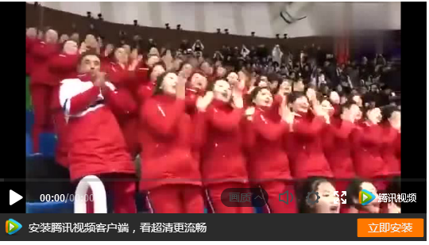
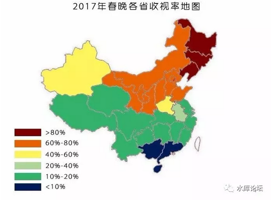

# 春晚可以不挨骂吗 \#F1530

原创： yevon\_ou [水库论坛](/) 2018-02-19

}春晚可以不挨骂吗 ~\#F1530~
=======================================================================================================================================================================================================

 

本篇是marketing

 

 

一）       春晚

 

"论偷情节写文章是一件很苦瘪的事"

"论情人节写文章是一件很苦瘪的事"

"论除夕夜写文章是一件很苦瘪的事"

"论年初一写文章是一件很苦瘪的事"

"论年初二写文章是一件很苦瘪的事"

"论年初三写文章是一件很苦瘪的事""苦你妹啊，再不写没有饭菜钱了"。

 

话说2.15过得浑浑噩噩。日夜颠倒迷糊。睡到13:00醒，再补一个三小时的午睡。眼睛睁开，就天黑了。

看春晚么，大概率是不看的。还不如刷微博。

昏睡到年初二再翻，果然又是春晚骂声一片。

 

翻翻知识星球，有人问了我这样一个问题。

从Marketing角度而言，这问题实在再有趣不过了。值得我们专题写一篇。

 

 

二）       挨骂

 

第一个问题，春晚可以"不挨骂"么。

答案是:"不可能"。因为这违反了最基本的Marketing原理。

 

从1983年开始，困扰了文科生小编无数年的"春晚挨骂悬案"。无论国家如何不惜工本地大制作，如何费尽心机地搞声光电场面。如何耗费人力花半年准备一年的戏。

早在2000年，演出服已高达50万元/件。而往往只穿一次。

小品，曲艺，歌曲，相声，上一个骂一个，再高的成本，都出不了精品。

 

 

"春晚挨骂之谜"，放到marketing科学中，其实非常容易解释。

因为消费者分层了。

 

1983年的时候，中国人一个特色，是十亿人民一种颜色。

尼克松访华之际，曾经惊叹，全体中国人，无论男女老少，全部都穿卡其布劳动衫。千人一面都是靛青的。

这种效果，今天你可以看看北朝鲜拉拉队，体验极致。

 

https://v.qq.com/x/page/g0553e3kv5p.html

 

但是1983年之后，国民急剧分层。

尤其是"改革开放风气之先"，这个"先"字绝不是轻飘飘一句空话。

当深圳，苏州，外资企业密密麻麻，早已融入WTO全球分工之际；你到开封，太原，襄樊这些"历史名城"。连出国护照都没有几个。绝大多数的人口，依然靠公务员体制内过活，拿2000元死工资。

 

当消费者分层之后，你就不可能靠单一产品，覆盖所有顾客。

这是marketing基本原理。不存在One for
all的产品，即使存在，生产成本也不会是最优的。

 

 

"春晚"的基本概念，即试图使用"单一产品"，来覆盖十万万消费者群体。

大伙都知道"众口难调"。你偏偏知难而上。

 

如果你是"商业演出"，则任何一家聪明的大公司，都肯定会搞N个版本："南方春晚""华东春晚""北方春晚""西北春晚"。

使用不同的产品，覆盖不同的消费者群体。

 

不幸的是，由于春晚的"大一统"特性，使得春晚注定"全国人民一台戏"，导致3/4人口骂你，也就不足为奇了。

 

 

三）       春晚的根基

 

第二个问题，春晚可以"挨骂"少一点么。

春晚挨骂，本不足为奇。甚至都不足以成为一条新闻。

真正有趣的，是"省际分布图"。

其中颜色越浓，代表收视率越高。

很显然，春晚在东北，具有"浓厚"的观众基础。到了华北，还有不少人看。

一过长江，马上就不行了。

到了华南，简直惨不忍睹。

 

和很多人印象中的一样 ，春晚本质上，是一场东北农民的晚宴。

现在我们要问的是，为什么，为什么是他。

 

从Marketing正统的角度而言，假设市场分层，分成了很多"细分组团"。

而且你作为发布者，只能发布一款产品。

请问你会发布什么。

 

几乎所有市场部的品牌经理，都会毫不犹豫地回答你。

抓住市场最大的板块。

 

 

而市场最大的板块，是哪个。

从"网剧"的分布流行中，我们可以清楚地拿到统计规律。

什么样的电视，观看人数最多。

什么样的电视，无人问津。

 

自从刘老根系列结束以后，"乡村爱情故事"事实已经脱离了我们的视线。

虽然你每天打开CCAV1，19:30\~21:30的黄金档，还很喜欢播放"篱笆，女人与狗"的农村主题电视剧。

但我们都很清楚，"农民剧"的时代，已经结束了。

 

随着中国城市化进程的加速，现代化进程的不断深入。

"工农联盟"就其人口和实力，都在不断减少。

"城市市民阶层"才是最大的Segment。

 

 

网剧里面，"楚乔传"满足了屌丝逆袭的翻身，"花千骨"则是九天十地玛丽苏女主的意淫。

《欢乐颂》《何以笙箫默》都市剧的统治者。

 

这二天休息，我看了《二代妖精》讲的是社会底层屌丝，撞大运遇见狐仙，免费狐狸精。

《乘风破浪》讲小镇青年和流氓斗殴。

《神秘巨星》直接把我看吐了，YY还是阿三强，不服不行。

 

"商业"是清醒的。几乎每一个老板，都清楚地知道"消费者是谁""消费者在哪里"。谁是真正的力量。

谁是真正的力量，都市平民啊。

那些占人口的大多数，月薪3000\~10000，吃着泡面，念着马云成功学。然后刷微博和给YSL上供的男女们。

 

 

但是"春晚"是个异数。

为什么春晚的收视率越来越低，为什么骂春晚的人越来越少（少到甚至不关注），为什么春晚难以出名作佳品。

虽然春晚的收视率已经够低了，但它本来还是可以更帅一点的。

 

因为春晚的定位，取了一个非常奇怪的例子。

-   他既不是定位在人数最多的群体。

-   春晚也不是定位在最有先进生产力的群体。

春晚的定位，就是东北的农民。

而不是城市的平民。

这里面虽然有历史传承，路径依赖等各种原因。但作为国家主流媒体，却偏抓一个"非主流"市场，无论如何都是很奇怪的事情。

 

 

四）       负重前行

 

今年春晚最触动我的，是歌舞"丝路绽放"。场面宏大，动作划一，达到了极高的训练水准。

尤其是舞台的灯光炫丽效果，看得俺目瞪口呆。如此强大的计算能力，显示出了大国风范。CCAV硬件力量突飞猛进的中国发展速度。

蔚蔚盛世，名不虚传。

 

https://v.qq.com/x/page/k0025b6vo7v.html

 

可是等表演结束，俺就笑不出来了。

别人在看春晚，我在看观众。

 

在观众席上，白发苍苍，满脸油光。一路数过去，全部都是秃头，一个小鲜肉都没有。

你别以为请TFBoys唱二首歌，就给春晚注入了"青春元素"。春晚就其本质而言，依然是一个老人社会。

不仅仅演员是老人，观众是老人，舞台手法是老人。

整个社会主持秩序的，都是老人。

而我们整个民族，也已经太老。生育率严重不足，蔡明冯巩都快入土了，还在霸占屏幕。

 

 

春晚的第二个隐患，是战略目标太多。

历年来，被骂得最凶的，是2017年鸡年春晚。豆瓣甚至因此关闭了评分。

因为整个2017春晚，几乎就成了"表忠心"的春晚。塞进去太多zz元素，观众们不爱看。

 

时至2018年，吸取了教训。干脆少说话，多跳舞。把渲染效果调到最高。观赏看大片。

即使这样，依然免不了有人骂。例如《丝路绽放》之前一个节目。

在春晚已经举步维艰的情况下，你依然从中汲取力量。

 

第三个隐患，如前所述"消费者"偏离。

时代已经变了，而你并不能与时俱进。目前你已经抓不住社会中最主流的人群。

 

 

这三个隐患叠加，是什么意思呢。恰如我们的guo运。

"人口正在变老，你抓不住剑柄，却试图做伟大的事业"。

岂不令人叹息。

 

 

 

（yevon\_ou\@163.com，2018年2月19日丑时）

 

有些东西写得很隐晦，完全没展开。

参考阅读：《[[春晚\-\--现代宣传工作的困境]](https://mp.weixin.qq.com/s?__biz=MzA4NDI2MTkxMQ==&mid=2649620029&idx=1&sn=7ad3c8b84cce20ebe66ea225b72116df&chksm=87f0b345b0873a538cd9b9ca81108b44114e9ebfe159722becdacdb3dbdc1feac413cb97ae6f&mpshare=1&scene=21&srcid=0218E9nsK9jQLIenD7YAPVb1&pass_ticket=1Mbwechat_redirect#wechat_redirect)》

 

不知大家对沈阳怎么看，乐墨正在组织沈阳战役。我准备节后飞去看看。

乐墨微信：canonsolo
