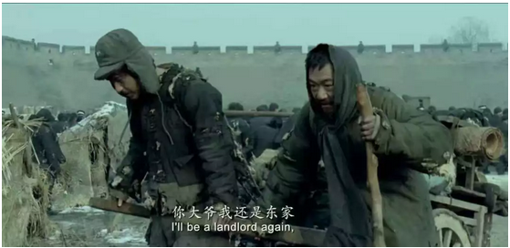

# 眼界那些小事 \#F1580

yevon\_ou [水库论坛](/) 2018-03-08

眼界那些小事 ~\#F1580~
==================================================================================================================

 

天地之间，其犹橐(tuó)籥(yuè)乎？

 

 

一）       乡陋

 

后台有些朋友问我，为什么最近都是\#F系列。

你傻呀，"会会"二个字怎么念。俺还准备多写几篇\#F呢。

 

所以，今天我们从一个光头开始。

 一千个人，有一千个哈姆雷特。

《张杨导演，我爱你》别人看，关注的是108颗佛珠，进藏女文青。

哥哥关注的，是"这造型怎么这么丑"。

 

唉，真是没品位啊。丑得污染视觉。

另一个极丑的女文青，则是著名的龅牙：三毛

尤其当崔睿说出，"你是荷西转世，我是三毛转世"。

内嫩外焦，哥哥被惊吓出一身鸡皮疙瘩。

 

 

顺延出去，大概二个月之前，公众们或许已经忘记，另一个惊悚女主角：盈科张晴。

https://weibo.com/1853047530/FDGnHrZXm

小姑娘惹人耻笑的原因，是她们很Low。

这辈子没见过世面，什么iPhone SE手机，卡地亚手表，都成了炫耀的工具。

女文青脑子里没什么文化。进藏，佛珠，转世，冈仁波齐，就成了她全部的知识体系。

 

若是有人指点带领，品味断不至于如此

 

"眼界低=惹人耻笑"，这是第一层的道理。

但是你若往深处想，去哪里找贵人，会指点带领你呢？

 

 

二）       贵人

 

张晴几乎成了整个一月份，朋友圈的笑点。

但是你仔细想下去，小姑娘却是非常无辜的。

 

因为你生下来，的确是没人教育你，带领你这些知识的。

你若出生在江西，湘西这种地方。一无所有。

奋斗到北大的函授生，律所底层女员工。月薪二三万，穿得起18888的Burberry.

在乡亲们面前，绝对算"力求上进"了。

 

"一花一世界"，在她的世界里，她真是已经努力做到了最好。

真正的社会底层的人，你不是嘲笑她。

而是根本看不见她。

 

不是张晴，崔睿不努力。而是她们输在了起跑线上。

 

"眼界"这玩意，就和金钱一样。

对于贵族和寒门，起点从来就不是相同的。 

98年电影《泰坦尼克》中，露丝的妈妈，无论如何也不肯露丝嫁给杰克。而非得让她嫁贵族未婚夫。

因为露丝妈妈心里非常清楚，"你那死鬼老爸除了一个贵族头衔，没有多少财产留给我们"。

 

在这一刻，"露丝的妈妈"其实处于一个非常危险的位置。

她们依然保持着贵族的身份，和生活印记。也可以轻易地出入上流社会。

但她们母女依然可能因为缺乏养分，缺乏收入，而迅速枯萎。

 

露丝妈妈拼命反对杰克，因为她们此刻已经一无所有。而唯一保留着"眼界"。

复兴还是有希望的。

 

而露丝一旦嫁给杰克，跟着杰克搬到贫民窟住上几十年。

则她所有的"眼界"和习气，都会烟消云散。大概率也没有能力再传给下一代。

她的外孙，真的要社会阶层下滑了。

 

 

中国的近代史上，曾发生长达卅年的"太祖动荡"。

但到1979年改革开放，以及随后的数十年竞争。

我们渐渐地发现，在"改革开放"中冒出头的，很大比率，依然是当年的"书香门第"簪缨世家。

 

因为卅年，是"一代人"的时光。在这么短的时光内，老人还没有死光。

哪怕儿子全被打乱去当工人，体力活，卡车司机。

可是老人依然有机会教育孙辈。把"眼界"灌输给他们，关于整个世界运转，更底层的规律。

-   刘慈欣《白垩纪往事》末尾，也有类似描写。

 

 

"家学"从来就是不平等的。哪怕强行抹断，几十年后也会不平等。

再过十年，我还是你的东家。老爷还是老爷。

  

 

三）       开拓和耕耘

 

人老了容易胡思乱想，从女网红的丑八卦，想到乡俗鄙陋。

从眼界的不平等，想到家传渊源。

 

再进一步的想下去，有些人很成功，但其实他并不成功。

有些人很强大。但其实没什么能力。

有些人最开始顺风顺水，但一旦遭遇挫折，则一败涂地。

最典型的例子，是父母"传功"给你的眼界。

 

有些人，譬如你爸是林业局的干部。你一毕业，他就让你去环保局上班。

你爸爸已经经营三四十年的企业，你毕业了就去接班。

对于这种"富二代""官二代"人们一般是抱以羡慕和仰视的目光。 

人，或者整个家族，或者整个社群。

生活在这莽莽荒原，危机四伏的杀场，其实有一点类似于游戏中的"开地图"。

 

已经的区域是亮的，未知的区域是黑的。

每个人都有自己的一亩三分地。

都有生活熟悉的范围，主场是掌控的。

 

好比你父亲传给你一个杂货铺。去哪里进货，去哪里批发，给哪个城管大哥敬烟，交警大队长手机多少，这些都是不传之秘。

他把这些"眼界"传授给你了，你的地图就是明的。

爹越大，只不过"明地图"越大罢了。

 

在明地图之内做事，毫无压力。

跨出了地图一步，就是黑暗边界。需要自己开拓。

 

 

我这二周领悟了一个道理，即人的能力，其实分二种。

一种是"耕耘"，一种是"开拓"。

 

每一个人，都有一盘现成的业务。你如果在"舒适区"反反复复做，看起来收益也很高，赚钱也很多。但其实你的业务模式，属于"耕耘"。

 

而某些人，若出于某些原因，不得不踏入"开拓"荒原。这就是披襟斩棘了。

哪怕开辟一个外地分公司，新开一条产品线。这些都需要十倍的努力。

Setup十倍辛苦，才能换取Maintaince坐着的收入。

 

归根到底，我爹又没传大公司给我。

 

 

 

四）       开拓的鸡汤

 

开拓很难。只要踏入荒原一步，就是十倍的辛苦。

有些人，在老巢大本营，如鱼得水，过得象地头蛇一样。可是只要一旦脱离主场，马上陷入人生地不熟，水土不服的境界。

 

我们做生意的，一定要分清楚"耕耘"和"开拓"的区别。二者的含金量是完全不同的。

只有不断地开拓，地盘才可以一块一块打下来。业务线才能越来越长。

 

好比张晴，崔睿这样的女孩子，正是在众人一次又一次的耻笑之中，她们见识了更广阔的世界。从而换取了自身的生长。

 

你年轻的时候不拼，难道让你儿子再拼么。

你年轻的时候，不迁徙到大城市。难道让你儿子再迁么。

 

你年轻的时候，整天混日子。五点半下班，二斤黄酒吃饱，醉得浑浑噩噩。

你是待在"舒适区"没错。

你家的隔壁老王，还在一心一意啃MBA，混了一个硕士文凭落户上海。省吃俭用参与各种投资""开拓区"。

 

你嘲笑他"走出去"也没赚多少钱么。

可等大祸临头，才知道危机么。

 

 

 

五）       马尔萨斯陷阱

 

在电影《暴雪将至》中，段奕宏扮演一个东北小城市的钢铁厂职工。

可是不知不觉地，钢厂就混倒闭了，他就被下岗了。

 

我们知道"耕耘"和"开拓"是二条道路。

开拓的艰辛，远远超过"舒适区"耕耘十倍。而初期回报却差不多。

为什么我们还要进入新市场，拓展新产品线。

 

 

因为"耕耘"具备马尔萨斯陷阱。

几乎任何一个传统产业，最终都会做死掉。

如果农田不增加，而农夫无限增加。最终就是马尔萨斯陷阱。

你迟早得下岗。

 

传统产业，基本都是马尔萨斯陷阱。

在这个世界上，行尸走肉，"人生宛如梦游"，一辈子不动脑的人口，是占绝对多数的。

99.9%的人，是寻求在现有的疆域，深耕更肥沃的土地。

肯走出蛮荒，九死一生创新的人，不到0.01%

 

 

钢铁，煤炭，电力，交通，任何一个产业，一旦成熟，无一不是供大于求。

他们的毛利率，全都是往下走的。最终也都是不发财的。

一吨钢铁，比一吨白菜还要更便宜。 

 

六）       结语

 

大哥，你这篇，每一句话我都认识。可是通篇就没看懂。总觉得话里有话，你想表达什么意思啊。

 

哦，其实我想说的是，有一个24岁的小妹妹，刚刚花了3亿现金，全款买了一套房子。

我有点酸，仅此而已。

 

 

 

（yevon\_ou\@163.com，2018年3月7日晚）
