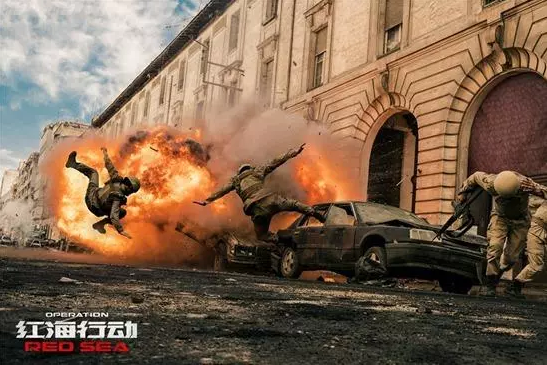

# 社会平均工资 \#F1600
--------------------

原创： yevon\_ou [[水库论坛]](/) 2018-03-15

}社会平均工资 ~\#F1600~
===================================================================================================================

 

生于忧患，死于安乐

 

 

一）       红海行动

 

最近几篇，写得不好。

虽然观众依然捧场，没有打脸。但我自己知道，写得不好。按照过去的标准，是没有资格群发的。

 

一个原因，是我实在太累了。过去几周，连续保持着每周70小时以上工作时间。

有好几篇文章，都是在0:00\~3:00am期间写的。

 

象[[\#F1570]](http://mp.weixin.qq.com/s?__biz=MzAxNTMxMTc0MA==&mid=2651016995&idx=1&sn=bd1b12fd6d5ed03b5b2e88cb36f4847d&chksm=80721930b7059026e600d7b85597aebbd19a46dfa7b84861f902c99006073a9d4a0af32156cc&scene=21#wechat_redirect)和[[\#F1590]](http://mp.weixin.qq.com/s?__biz=MzAxNTMxMTc0MA==&mid=2651017036&idx=1&sn=003c45ede93a2132b909aad85e4c3c22&chksm=8072195fb70590496888475cd9acb4f19b7afb57a006cadf4aea972affafab769875c6fdbfc0&scene=21#wechat_redirect)，都是开头还不错，前2000字挺有可读性。

可收尾却不行了，没有狠狠地刹住，提出独特的见解。

因为我实在太累了，2:30am瞳孔已经涣散。而第二天早上9:00，又将开始一天的工作。

 

3月13日，刚回到北京的第二天。

今天，哥哥决定好好看场电影去。

电影，就是最近大热的《红海行动》

 

 

 

二）       杨锐

 

电影呯呯砰砰，哥哥的三观从来不正。

别人看得入迷。我看电影，从来不是看电影，而总是会思考一些稀奇古怪的问题。

 

在电影里，张译演队长杨锐。前后经过三场生死。

第一场戏，是山坡上遇袭，迫击炮阵地。

第二场戏，是8个打150个，蛟龙队员死了3个。

第三场戏，是完好4队员，四十分钟端掉了老巢。干掉了阿訇。

枪林弹雨，堪称九死一生。

 

哥哥这么庸俗的人，想的却是：杨队长该领多少工资呢？

 

 

在电影里面，杨锐是少校军衔。正营级干部。

中国前几年的军队改革，推行的是"8/5/3"，也就是一个营级干部，月薪在8000元左右。

最近据说又加薪了，不太清楚。但数量级就是万八千了。

 

 

而一个"真正"的军人，他的工资应该是多少呢。

以美国"黑水"公司为例。黑水是全世界最大的雇佣兵公司。有数万人，受雇在伊拉克工作。大量替换掉美军正规兵。

 

"黑水"公司的工资，发到个人手里的，大约是每一天RMB 20000元。

每一天2万元。

也就是只要你在战场，不需要承担第一线的工作，不需要BattleField。只要你承担生命危险了，有被袭击的可能。就每一天2万元。

 

待一个月60W，待6个月的话，拿360W万元。

有大量的北美华人，为了"捞钱"，就去参加黑水公司。只要半年不死，大幸几百万元。也算是笔小钱。

 

 

而这个"每天2W"，并不是指象杨锐这样，出生入死，九死一生的。

很多人对于军人这个职业有误解。军人就总体而言，劳动强度并不算非常大的。

俗语"养兵千日，用兵一时"。

 

当年帝国主义列强WWI打了四年，算是非常强烈度的世界大战了。

有约50%的士兵，从头到尾，一枪也没有开过。

尤其是北线对峙，和南线防守的部队。他们主要的功能是"控制"和"威慑"。地方卫戎部队，根本没有开枪的机会。

 

包括占去威廉二世50%军费的"德意志海军"。

历时四年，上百万海军，一共只打了一仗，就是著名的"日德兰大海战"。

德军出动一线官兵45000人，伤亡比例6.79%，折合3000人。

 

 

"每天2W"的巨额经费，并不是让你卖命了。

而仅仅是在"100W人，阵亡3000"的低概率死亡率下，就要每天2W。

杨锐的工资，远远不止。

 

象陆琛这样，被炸掉一只手，你说要多少钱。

你京沪一个良家子弟的大学生，985/211前途无量。哪怕仅仅有炸掉一只手的风险，你说要多少钱。

你的父母家长，多少钱才肯放你去。

 

真正的拼命军人，是很贵很贵的。

 

在真正的现实生活中，付给杨队的名誉金钱职务提升赡养善后总报酬，可能比拍这部电影还要高。

 

 

 

三）       民兵

 

和杨锐相对应的，另一个反面，则是伊维亚的民兵。

有一个镜头印象深刻:"汽车炸弹"

 

在剧中，恐怖分子随手拉过一个无辜市民。平民有一个儿子，大约10岁。

恐怖份子用枪指着孩子的头，说"你现在开车冲过去，否则我就杀你的儿子"。

大胡子流着眼泪，一边猛踩油门。

 

"汽车炸弹"威力巨大，一下子炸开了政府军的防线。炸死十几个军人，拉开了很大一条缺口。

 

 

影片看到这里时，我又由不住在想，"汽车炸弹"威力巨大，要多少钱。

我们有三个标准：

1）伊维亚：免费

2）中国：1000W\~1亿

3）美国：10亿美金

 

组织"敢死队"这种事，在中国目前这个社会，勉勉强强还是可以干的。

当然，出发之前要搞动员大会。专门挑几个楞儿，或者欠了一屁股高利贷的。

然后人冲上去了，重重的抚恤金肯定不能少的。子女入学，换城镇户口，英雄奖章，恩荫三代这种事，都少不了。围绕"烈士"，国家前前后后，千万上亿肯定是要投下去的。

 

 

而在美军............哎，美军这事就别提了。"腐朽入骨"的典型。

美国所有的部队，都跟随了随军牧师，不仅仅牧师，还有厨师，理发师，药娘师，阿訇，心理辅导师，变性男女专用厮所建筑师。

在美军，一个人只要说他心灵受到了"困扰"，战场的血肉横飞令他不适，他就可以接受\$450/小时的专业心理辅导，为期六个月。聊得开心的话，还能再延二个月。

 

在美国军队里，仅仅性别，肤色，年龄，不吃猪肉等信仰，他就可以告你歧视。

1991年，沙特二架IDS执行任务，美国派了空中加油机赶去加油。

临到接触，沙特飞行员发现，美国飞行员居然是个女人！

虔诚的穆斯林拒绝让女人给他们加油管，驾驶着空邮箱返航，二架价值1.5亿美元最先进的战机，就此坠毁在沙漠中。

事后，飞行员受到了英雄般的奖赏。

 

对于美军，"敢死队"这种事是想也不用想了。哪怕总统都没有这个权限。

想想国会山的扯皮，想想民主党的眼泪，光媒体就够你喝一壶了。

 

 

王陶陶在给反恐部门的报告中写出：

-   一个阿富汗民兵，每年的工资是三袋炒米。

-   一个美军，平均年开销是\$3,900,000

-   再大的帝国，也经不住泥沼战的开销。

 

 

 

四）       成本

 

帝国的角力，不仅仅是"国力"的比拼。

"兵种"的价格，也是很重要的。

你出一个机枪兵，200金币。人家出一个大头兵，5金币。

那这仗还是没法打的。

 

要研究一个"战兵"为什么这么贵，我们还得从事情的本质说起。

为什么"黑水"公司每人每天要2W元，为什么"美军"中2/3都是黑人，常青藤毕业生根本不屑于参军。

 

 

因为"养兵"的成本，其背面，其实是"社会平均工资"。

你开给士兵的工资，真正的竞争对手，是文员，售货员，送外卖的，吃福利的。

 

你设想一下，一个血气方刚20岁左右，肌肉强壮，但学习成绩未必一流的年轻人。

如果他不当兵，可能就在三四线城市找份"美团骑士"的活，每个月赚五六千元。

 

同理，如果你要劝说别人"放弃"写字楼职业，来给你摸爬滚打。

你需要支付的报酬，就是全社会的平均工资+风险溢价。

 

帝国的腐朽，从人力资源腐朽开始。

当全民族越来越懒，越来越不愿意劳动，则"社会平均工资"不断上涨。

 

在这里，我们可以清楚地看见，"民珠"政体，是非常非常吃亏的。

"低人权优势"才有更强的力量。

 

因为在民珠社会，社会的"底线"实在被拉得太高了。

一个混混，骗吃等死，每天拿社会的福利，他也能活得很好。

你让他怎样先锻炼八块腹肌，然后在沙漠里匍匐前进，每天就只吃压缩饼干+没防晒霜。

 

美国的部队里，已经没什么白人了。这个和"古罗马"帝国灭亡前很象。

骄逸奢侈，锦衣玉食。美军唯一的假想敌对手是外星人，这导致美国人无限拉高"人权"待遇。

 

生产力并没有提高，而"驱人劳动"的代价不断升高。

成本推动型，摧毁了一个帝国。

 

而"民珠"社会，本身又是死锁的。

任何一个政客，只会继续"提高"人民的生活水准待遇。谁也不敢提出艰苦朴素，爱国奉献之类的话语。

民珠国家之堕落，不可避免。

 

 

 

五）       降低成本之路

 

怎样降低"造兵"的成本。使得大头兵的成本，由200金币，降到100金币。

而不是transgender的2000金币。

我们已经把逻辑理得很清楚了。

 

主要是；

1）降低社会平均工资。降低福利，降低生活水准待遇，利出一孔。人民越是贫穷，则机会成本越低。

 

这点在"反侵略战争"中尤其明显。历史上不乏越打越强的例子。

因为房子被推倒了，麦田被烧毁了，一贫如洗了。愤怒的人民，只好拿起武器，向侵略者复仇。世道越乱，募兵越便宜。

 

相反的，国家越是稳定富裕繁荣昌盛，则"海外行动"的成本越高。

压低人命，减少幸福

  

2）军人荣誉感。增加"当兵"和其他工种相比的心理满足。军人将成为一种高尚职业。

 

在《红海行动》中，一个特殊之处，不知道各位留意了没有。

他有迄今唯一的，整辆车被炸毁之后，正面血肉模糊宛如地狱的场面。

也有烧焦的，单独割下"头颅"的特写。

还有大量的，反复出现的，断指和断臂的近距离镜头。

 

当然，其中也有张译等人，穿上飞行翼，纵身一跳，宛如神兵天降的英雄场面。

这些镜头，以后只会越来越多，越来越反复出现。

直到各位熟悉，[不再恐惧]，崇拜，仿效为止。

 

1944年的日本人，刷出了全人类文明史上的唯一记录。

当年，大约GDP的90%，全部都是军费。

日本以一个弹丸小国，对抗美国的大军。如果不是国力悬殊太大，还真不好对付。Bushido，有道理的。

 

3）增加军人的抚恤和奖励，tuiyijunrenguanlibu

 

 

 

（yevon\_ou\@163.com，2018年3月13日晚）
