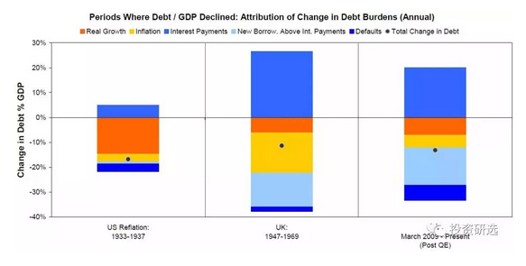

# 桥水报告 \#F1620
----------------

原创： yevon\_ou [[水库论坛]](/) 2018-03-21

桥水报告 \#F1620
============================================================================================================

 

揣摩上意，乃做官的不二法门 

\-\-\-\-- 《鹿鼎记》

 

 

一）       Ray Dalio

 

小老头子，一下子热了。

这二天，不断有人问我，对于Ray
Dalio《去杠杆四部曲》如何看法。还说很有震动，很有道理。

 

知识星球问得烦不胜烦。前几天终于潜下心，看了一下戴老板翻译的中文版：

《[[关于去杠杆的深入研究-Ray
Dalio]](https://mp.weixin.qq.com/s?__biz=MzUxODUwMTkwMA==&mid=2247483673&idx=1&sn=6060a796e2ade1e4135c0e01b35fc49a&scene=21#wechat_redirect)》

 

中译文11000字。

可能和原版小有出入。若有差异，抱歉我喷的是中译本。

 

 

我认为这篇文章，如果是"桥水"公司真心的想法话。那么这家公司快完蛋了。

任何一家公司/个人/机构，如果在2012.02，号召中国人拼命地"去杠杆"，那他脑子一定有毛病。

事实也就是有毛病。Ray Dalio不值一哂。

 

 

相反，真正令人惊讶的，是这篇报告，为什么在2018年又被翻出来。

你会在废纸篓里，寻觅六年前的"财经类"分析报告么。

 

Ray Dalio这次来北京，受到了如此高规格的欢迎，如此醒目的造神运动。

这些才是真正的"桥水报告"。

 

 

二）       去杠杆

 

Ray Dalio这篇，分为二个层次：

1）           我们要去杠杆

2）           怎样去杠杆

a.  债务减记

b.  紧缩政策

c.  财富转移

d.  债务货币化

遗憾的是，这二点逻辑，都是错误的。

 

 

首先第一点。"去杠杆"并不具备"大义"的名分。

虽然Ray Dalio大声疾呼，就差直接拿来当"公理"引用了。

上串下跳"去杠杆是政治正确，就是好，就是好"。

 

 

但是在几乎每一个"经济学"学者的心目中，我们清楚地知道，"去杠杆"天生并不具备"大义"的名分。

 

人类的文明历史上，"杠杆率"最低，负债率最低，最没有系统风险，几乎不可能发生金融危机的是：石器时代。

石器时代是好日子么，谁都知道极度贫穷。

 

 

而人类真正的金融，是随着"工业革命"一起而来的。

因为可以源源不断发行高信誉的债券，英国人最终遏制住了拿破仑的百战百胜大军。

因为有了众筹，哥伦布才能组建起葡萄牙舰队。

中古时期，一艘海船的沉没，足以击毁一个传承几代的世家。在这个基础上，发展起了远洋保险业。

现代的华尔街，只要你有一个"创意"。自然会有天使轮，A轮，B轮，前仆后继给你提供资金。孵化出众多独角兽企业。

 

这里面的每一个步骤，都有"杠杆"。甚至可以说，整个人类文明史，就是杠杆越来越深，越来越重的故事。

 

从经济学上讲:

-   金融自由化=生产力

-   去杠杆=降低生产力

 

奥派认为，dT\>0

只要借款人，放款人，都是自由自愿的。这笔交易就是好的，就一定有利于生产力。

没有例外。

 

 

现代的"去杠杆"，其法理源泉来自于"央行"。

从中国历史上1985年央行分立，一直到今天，央行始终对金融机构负有"刚性兜底"的责任。

-   既然你要我兜底，你就得符合我的一些行为规范。

 

而"央行"的地位，来自于《中国人民银行法》第十五条。这句话杜绝了"复本位制"在中国的竞争。

-   第十五条：中华人民共和国的法定货币是人民币

 

《中国人民银行法》的背后，是武力。这就涉及了"经济学第二定律"。

-   暴力所在之处，经济原则不复存在

 

 

第二定律的背后，是浓浓的咖啡危险，哥哥此段就不再展开下去了。

但总而言之："没有任何一个正经的经济学家，会把'去杠杆'作为先验真理来使用"。

 

Ray Dalio身为一个洋大人；

如此舔屁沟。

不是蠢，就是坏了。

 

 

 

三）       替罪羊

 

Ray Dalio的第二部分，讲的是"如何去杠杆"。作者提出了四个步骤：

a.  债务减记

b.  紧缩政策

c.  财富转移

d.  债务货币化

 

如果你继续看下去，作者其实并不是1234并列的。作者的核心思想，原文是：

（再次吐槽文风拖沓）

 

这种债务减记（债务违约和重组）的方法必须受到严格控制

......

这将带他们进入下一个阶段，在这个阶段，"印钞"将成为主角。我们并没有说债务减记和紧缩政策在去杠杆过程中一点儿作用都没有，因为它们其实有点儿用处，但作用不大，却带来痛苦的结果。如果债务减记和紧缩政策要起到应有的作用，必须跟"印钞/债务货币化"来混合使用。

 

这段话，翻译成最最最通俗的，"财上海"的语言，那么就是：

印钞票，印钞票，印钞票！

一印解千愁

 

 

假设你有家"太阳能"企业。你欠银行100亿，每个月的营业额只有1亿，管理成本反而要2亿。

企业早已人心涣散。高级经理纷纷贪污，中层经理纷纷内斗，底层员工尽情偷懒。机器设备飞速磨损折旧。

 

董事长已经逃到了美国。债主们天天堵门。

上游厂商再也不愿意赊账，应收债款完全收不回来。会计现金接近枯竭。

 

面对危机，世上从来都有二种"经济学家"：凯恩斯主义和奥派。

 

 

凯恩斯认为，"流血"是不可以接受的，失业是不可接受的，苦难和哭泣，甚至轻微的加班，统统都是不可接受的。

哪怕"阵痛"了，在民珠社会也是要垮台的。

 

凯恩斯认为，有痛就得打麻醉针。政府再借给他20亿，让它"续命"。

不要痛苦，不要眼泪。

至于钱，发钞最为理想，所谓"通胀型"解决方案。

 

我们可以看到，凯恩斯主义，骨子里是和西方圣母"白左"思想一脉相承的。

丫的就是一个娘炮。

不能承受任何苦难和变革。最好人间大爱，大家都充满爱心地照顾小动物。

 

 

而奥派认为，"冤有头债有主"。正义比黄金更宝贵。

你公司经营不下去，是因为你"混蛋"。

高层纷纷贪污，中层纷纷内斗，底层纷纷偷懒。那是因为你养了一群蛀虫。

 

混蛋不遭天谴，世界怎能进步？

不涉及微观除虫的改革，必然是假改革。

蛀虫，就应该拔掉。

就应该大规模的下岗，把公司倒闭，让白领金领接受再教育去。

严查银行系统，当年是谁贷给你那么多钱的。溯本追源，清洗体系中的贪官。

 

明明是你做的恶，为什么要让政府救市，让全社会的储蓄者为你分摊呢。

大家在同情"下岗工人"的眼泪时，有多少人谴责过他们吃大锅饭时的懒惰呢。

正义，本身就是疼痛的。这才是"紧缩型"方案的真谛。

 

Ray Dalio推销"大锅饭"》 阵痛

 

我真心怀疑，Ray Dalio到中国来，是来干嘛的。

各位知道"欧美日"经济为什么不行么，因为他们的经济学家太渣了。

 

欧美的社会，基本被"凯恩斯"主义所笼罩了，凯恩斯就是白左圣母。

在过去几十年中，混蛋没有被惩罚，勤劳储蓄者被迫养寄生虫。

 

因为"凯恩斯"主义的胡作非为，养得欧美日遍地"僵尸企业"。

几百号人一个"读报"公司，生产力是负产出。却永远不可以倒闭。续命吊着吸民族的血。

接触过日本企业的人，应该知道，这个国家为什么没希望。

 

 

 

四）       凯恩斯的恶魔

 

《Principles》这本书，起源于徐新的第一次推荐。

随后在投资界被疯传，迅速成为网红书。顶礼膜拜，新一轮"造神"运动开始。

谁要是朋友圈没有转二篇Ray Dalio的精选，那就是太Low了。

 

但是你翻开仔细阅读之后，你会发现Ray
Dalio的思想，乏善可陈。甚至可以说毫无建树，错误百出。

犯的都是经济学界最基本的错误，毫无营养，不值得一读。

证券界造的神，在经济学眼里，可能是毫无意义，拙劣可笑的。

否则徐小平也不用推销区块链了。

 

哥哥看电影，从来看的不是电影的情节，悲欢离合情仇。而是想的是，"他为什么这么拍，他想表达的什么"。

对于Ray Dalio的《Principles》这本书，原理也是一样的，Ray
Dalio本身小人物，各位别忘了前几年的罗杰斯，毫不足道。

 

我们要思考的是：

-   为什么他会走红

-   什么人需要这种思想

-   假设"通胀型"解决方案成为显学，接下来的经济会怎么走。

 

徐大姐是聪明人。她推荐这本书，并不是书写得好。

而是因为书选得好。

就如同上电视台的嘉宾，都不是因为水平高。而是因为其立场，被精心"选"出来的。

 

**\[zt\]
更为重要的是，当前主导中国"去杠杆"过程的宏观决策者，对桥水的研究成果的重视程度，恐怕要比你想象地大得多得多。因此，本文值得所有专业交易者精读10遍以上。**

相对来说，《An in-depth Look at
Deleveragings》最有价值的，应该是其六大案例。

尤其是作者不啬笔墨，大肆赞赏，称为"成功案例"的三次。

尤其是作者用红笔标红，称之为"***到目前为止，这次去杠杆是历史上最成功的一次。***"

 

 

(yevon\_ou\@163.com，2018年3月21日丑)
