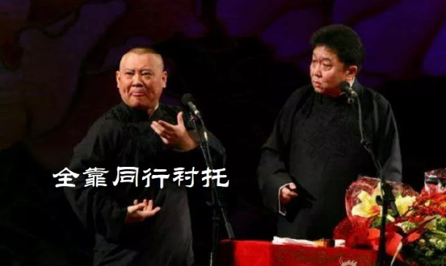
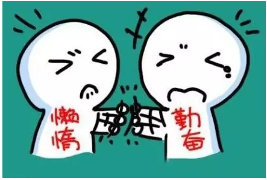
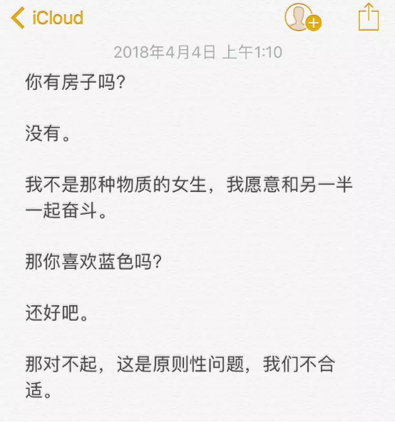

# 天才语文 \#F1630

yevon\_ou [水库论坛](/) 2018-04-04

天才语文 ~\#F1630~
==============================================================================================================

 

关于"水库招人"那些小事。

 

 

一）       初级班

"水库论坛"有400000订阅粉丝。平均每一篇文章，有80000铁粉保底阅读。

《[自媒体那些小事](http://mp.weixin.qq.com/s?__biz=MzAxNTMxMTc0MA==&mid=2651017066&idx=1&sn=27708bdbe96e64ee2b4797ee60a68a29&chksm=80721979b705906fddfb7f4e163280d4161f79c88fbc6d5449dae72d3f92a1ea1e776a4a6562&scene=21#wechat_redirect)》发出后，收到了400封应稿来信。

而我只想招一个人。

 

哥哥的脑海里，常年有二个小人打架。一个勤奋小人，一个懒惰小鬼。

勤奋小人整天揪着俺的领子摇晃："房贷，房贷，下周一三四五日要付房贷"。

懒惰小鬼则撒谎安慰我，"别怕别怕，就快找到助理了，就可以偷懒了"。

你问我，400封"应稿信"看完之后，心情怎样。

==\> 懒惰小人被打死了。 

前天吃饭时，我难得给饱饱公主加了一个皮蛋。

她眨着大眼睛看着我，"没事献殷勤，非奸即盗"。

"爸比觉得，你可以上清华"。

"那爸比呢"。

"我要是哪天失业了，我觉得可以改行当畅销书作家。写爱情小说"。

 

为什么，见识了社会平均语文水平。全靠同行衬托啊

}

当哥哥贴出"招贤榜"时，我预计的是，接到一篇篇的小故事。其中，不乏原创的段子，也有可能会心一笑。

譬如说，近期流行的"我去买几个橘子，你就站在此地，不要走动"。

又譬如说，水库中人会心一笑的，"我孩子都打完了"。

}

在英国，曾举行过类似的比赛。要求在一个短句中，同时出现"王室，宗教，性和神秘"。

得奖者是一名初二女生："女王怀孕了，Oh！my God，谁干的？"

 

哥哥满怀喜悦，打开了邮箱。

我会收获什么惊喜呢。

真是老大的惊喜啊，俺的懒惰小人被打死了

 

 

二）       中级班

 

哥哥接到的文稿，是这样子的。

   热力学里有一个"熵增理论"，说的是在一个封闭的系统里，熵总是增大的，体系总是向着更加"混乱"的方向发展。人类社会暂时的平静是否是假象？我们的世界是不是也在向更加"无序"的状态演变呢？当然，社会发展是一个复杂体系，复杂体系影响因素无穷多，我们在分析单因素作用力的结果时，很可能得到错误的结果，因素与因素之间相互影响，相互作用，共同作用，无法结论。就像薛定谔的猫，就像女人的心情......当然，我们可以总结复杂体系中多因素合力作用下的表征现象------"周期"。不过貌似研究周期有泄露天机之嫌。

 

孔为余起数：县考童生，当十四名；府考七十一名，提学考第九名。明年赴考，三处名数皆合。复为卜终身休咎，言：某年考第几名，某年当补廪，某年当贡，贡后某年，当选四川一大尹，在任三年半，即宜告归。五十三岁八月十四日丑时，当终于正寝，惜无子。余备录而谨记之。

 

做题不审题 有趣X3 写什么科技才是第一生产力 放过你的键盘吧
王大锤都能明白的道理不必写了因为你就是王大锤

 

放过我的键盘吧，我觉得我生活在一颗假的蓝色星球上。

亲，是不是我描述得不够清楚。

亲，是不是哥哥的语文成绩有问题 。

 

我不需要知道你的年龄性别学历残疾人；

来稿500字，[最有趣者最佳]

 

我以为会引来一轮强者对决。至少原创火花。

结果绝大多数人努力之低，根本轮不到拼天赋。

 

（优秀范文）

"等我学会了拼音，我就上网骂你"------ 郭德纲，13字

"童鞋，待售，未穿过"\-\-\-- 海明威，6个词

前二天，和一个业内人士聊天。

他和我说，在高考试卷的"大数据分析"中，数学最后一道大题，和语文压轴作文的分数，是高度成正比的。

 

虽然说语文大题的评分，有很大的随机性。甚至完全依赖阅卷老师的心情。

但我们这个世界的真相是，绝大多数的人，连"完整地说话"都做不到，及格都拿不到。

 

 

语文是主课之首，绝大多数人，并没有意识到"语文"有多难。

985/211这么容易考的么。

你出去问100个中国人，至少有99个人，认为自己的"语文"是母语，棒棒哒。

 

可实际情况是，在249/三个月的在行一点屌丝社群中。我们可以看到有些人，有些样本，就"说话都讲不利索"。

-   不知道自己想要表达什么东西

-   不知道如何组织语言

-   不知道有针对性的，适应对方身份，情绪，场合调整（高阶）

 

我让你写段子，你就老老实实写一个Joke段子。

 

我让你写个笑话，你灌那么多乱七八糟的东西来。

干什么，干什么，干什么啊！

连审题都不审好。你这样高考能高分么。

能放心拿业务，和你对接么。

 

400封邮件，筛选剩下不到40封。

哥哥手心出汗，在这么低的转化率中，还有最难一道关，难以难以突破。

 

感谢：（因隐私保护，已略去姓） 

  fires   Yesong   zyy    jing\_hi   建桢   粟     dongjia
  ------- -------- ------ ---------- ------ ------ ---------
  剑雄    小多     hany   Wei        剑     冷云   zzx
  不二    Jason    思达   Daniel     hyq    yoga   

  

 

三）       高阶

 

金庸的文学水平高，还是古龙的文学水平高，还是罗森的文学水平高。

答案是：金庸的水平最高。

 

因为金庸写的是"长篇小说"。

《天龙八部》约120万字，《笑傲江湖》约120万字，《鹿鼎记》约150万字。

 

外行看热闹，只觉得场面气势宏大。

内行看门道，捧在手里，手都是发抖的。

 

因为"长篇小说"和"中篇小说"，根本就不是一回事情。天差地远。二个世界的难度。

再要和"短篇杂文"相比，又是二个世界的难度。

 

字数长2倍，难度大4倍

 

 

500\~800字的，被称为短篇。

短篇写得好，只代表你的文字和笔力好。在一个战术小环节上，表现不错。

 

而中篇小说，25000字左右篇幅，讲的是一个"故事"。

最典型莫如我写的《[拜金女郎](http://mp.weixin.qq.com/s?__biz=MzAxNTMxMTc0MA==&mid=2651014809&idx=1&sn=5f6aadb6fb4c54249fbe9f4d087728aa&scene=21#wechat_redirect)》，环环紧扣，各有算计。浑然天成，拆除一个小节都不行。

 

 

而长篇小说，讲的是一个"世界"。

金庸一部120万字的作品，讲的是一个"江湖"。虚构了一个宏伟的世界。

草蛇灰线，人物命运各有交织。

有许多伏笔和心路，甚至要埋到十几章之前，便有端倪。

 

而命运的层层累积汇聚，人物和情节的发展。每一步迈进，都要符合逻辑。《战争与和平》。

甚至有人说，到最后，是"主角推动着作者"。故事的情节，是自动发展的，人物都是活的。

斯巴达克斯就一定是悲剧，安娜·卡列尼娜就一定要跳火车。

恢宏控盘能力，才是"大师"的分野。

 

出门一天，隐形眼镜都不用换。

出门一个月，全副生活的家当都得备上。

而出门一年呢？

 

 

《红楼梦》80章节，《红学》强大之处，他是浑然一体的，大观园讲的是同一个故事。

现在一些"网络小说"作家，动辄也灌200W字。但是你仔细看，他们的故事情节，是断裂分离成N段的。

 

不外乎主角在某一个时空，打怪升级，挖掘草药，一直到等级升满，破开虚空，进入下一个世界。如此往复。

他们其实写的是"中篇小说"\*20，而不是长篇小说。

 

 

我自信"水平"也就在中篇小说级。或许到廿年以后，且不这么忙了，可以静下心写一篇长篇。

这次"水库500字"招聘，俺留了一个心眼。500字只是引语，我指望在这500字中，看见"中阶"水平的端倪。

 

一个人不仅仅要能写段子，他还要能"讲故事"。

起承转合，把优点缺点都讲清楚，把来龙去脉都讲清楚。

 

他必须要显示出"组织能力"，不仅有幽默感，还要有全局观。

有了全局观，他才能做枪手。才能代我写"水库主文"，哥哥才能高高兴兴匿了，偷偷躲出去度芈月。

 

在这剩下的40封邮件中，有没有这样的"天才写手"呢。她的水平怎么样呢。

 

非常幸运，我找到了，在如此稀缺的概率下，有一位我完全无法抗拒的优质人才，一定要好好加她的工资。

 

至于她是谁，能写些什么东西。

亲，难道你看到现在，还没有分辨出来。今天这整篇\#F1630，都是芸姨写的。本篇从头到尾，都是她的枪文啊！学得像不像？

 

 

 

（yevon\_ou\@163.com，水库芸姨，2018年4月2日午）
