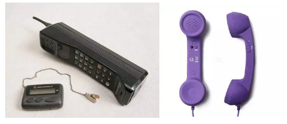
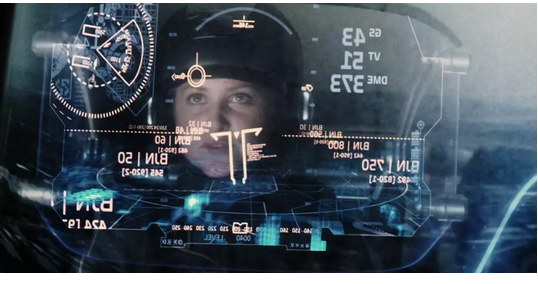

# 机屏分离 \#F1710

原创： yevon1ou [水库2019](/) 2018-06-08

 机屏分离 ~\#F1710~
==============================================================================================================

 

晚上洗澡的时候，突然想到一个问题。我们的手机，不应该是这样子的。

 

手机，最早的功能是电话。最原始的第一代大哥大，他的样子，其实和座机非常象的。

对的，就是一个马鞍形。二头都是话筒。 

久而久之，我们现在的智能电话，是这个形状的。

目前市面上的手机，99%是一块白板，大屏幕的结构。

翻盖手机，退出市场已久。折叠式的手机，更是销声匿迹。

 

市面上千千万万款手机，无论它们宣称自己"颜值"有多高。但在直男癌的眼里，感觉都是差不多的。

手机行业缺乏创新，我真心很厌倦

 

 

为什么会走到这一步，主要是因为显示屏。

显示屏越做越大，从最初的4.5寸，5寸，5.5寸，目前6寸Max屏也不少。

 

"屏占比"已经压缩到极限。手机的尺寸，没有缩小化的空间。

显示屏定死了手机的基本尺寸，智能手机=白板一块。

 

 

但是这是不对的。

既然"二头听筒"的造型结构，并没有统治通讯系统一辈子。

我们凭什么认为，"一块白板"的造型结构，就会统治一辈子呢。

 

手机这个行业，真正业内的人，都十分悲观。

类似于某著名手机厂商即将上市，该行业是肯定值不得这么高的PE的。

手机行业，一般认为15年之内，人类就将不再使用手机。

悲观的人，甚至说10年5年，手机就会被颠覆。

 

 

"未来"的手机，会是怎么样，我不知道。

但是我可以猜，我想要怎样的消费品。

 

对我来说，"手机"这个设备，体积还是太大了。

人类一直在追求更尽情的，无束缚的自由。身上的卡包，卡片少了一张又一张。

 

上网是生活必需品。笔记本电脑终被淘汰，被手机淘汰。就因为手机更轻小，更灵便。

但是我们仔细想一想，手机还是表相。手机的背后，我们真正的需求是什么。

 

1）通讯

2）展示

3）计算

 

其中通讯和计算，都不需要屏幕。例如接电话，只要二头听筒就行。如果有蓝牙耳机，则更方便。

 

而计算，他可以提醒你下个路口左转，支付宝付面包钱，播放音乐MP3，设置日程闹钟，拍照和领优惠券。

 

若我不需要"展示"功能的话，以上所有的功能，可以微缩化到一块非常小的芯片上面。例如，一粒纽扣。

 

 

如果我们拆开手机盖子的话，手机中超过2/3的体积，是被显示屏+电池占据的。

这二个东西，又是相辅相成的。"屏幕"永远是耗电大户。一般占1/4以上。

 

如果我们撤掉屏幕，并且把屏幕"电源"那部分也撤掉。整部电脑只剩下CPU+内存+硬盘+通讯模块。

那么这个系统，可以做得非常非常小，小到远远小于Apple
Watch，就一粒纽扣那么大小。高度集成。

 

 

那么，屏幕去哪里呢。外包！

既然通讯技术已经如此发达，假设5G/6G技术可以充分发达的话，我们为什么非要用一根排线，将屏幕和主机"物理连接"呢。

 

屏幕完全可以拆出来，通过蓝牙/5G/AirDrop之类技术，纯粹就是一个流媒体的投影端口。

我出门的时候，身上戴一粒纽扣。然后再单独拿一个屏幕。机屏是分离的。

 

 

然后再进一步想，既然机屏是"分离"的。那我还有什么必要，非得带一个屏幕出门呢。

"共享经济"既然已经如此发达，为什么不可以处处都有屏幕呢。

 

 

譬如说，今天晚上我写文章的时候，我就觉得，IT业界，还要画地为牢，硬性划分出大屏/中屏/小屏，是非常愚蠢的。（电视/电脑/手机）

 

为什么我的墙上，不可以装一个150寸的大液晶。或者穷人投影仪也可以。

我码了二个小时字，然后看一段抖音，然后刷刷微信。

为什么我不可以躺在沙发上，就看一堵6米高的墙呢。

 

我只要简单地对纽扣说一声"客厅狗""卧室羊""手机猪"，纽扣就自动地切换显示屏。岂不是很方便。

 

 

进一步延伸出去，刘慈欣在"三体"里，构想了一个信息化社会。

程心出去吃饭，饭店餐厅台面，都是镜面电视。随便用手一点，就是股市行情。

 

"信息化"社会，也可以这样。

你可以选择自己带"屏幕"出门。也可以选择租公用的屏幕。

甚至你不介意的话，可以直接在大庭广众之下看抖音。

 

自行车进化成了共享单车。

终有一天，你会发现，你也不需要带显示屏出门的。 

 

目前"柔性屏"发展，已接近突破瓶颈。十年之内，显示屏可以印在报纸上，价格也可以做到足够便宜。

你在地铁公众场合，随手扯过一张报纸。念一下上面一串数字，纽扣就自动和报纸配对。

然后你就拎着报纸，从头看到尾好了。等你下车的时候，顺手再把报纸塞回月台。

公用场所的"屏幕"，甚至可以做得很强大。

背后连着云计算，是Client/Server的结构。

手机，会象NC一样简洁。你再也不需要每过一年换新手机了。

（注：当年著名的Net Computer设想）

 

 

目前的技术发展，有几个方向，一个是Google
glass，一个是视网膜投影。一个是VR头盔。还有Magic Leap之类混合现实技术。

 

但是不论哪一种未来技术，你追溯消费者本源，你会发现，消费者需求的，都是"展示"功能。 

而那种认为，"主机"就应该和显示器做在一起，就应该焊接成同一部机器的想法，是古董化石毫无道理的。

只要技术可以发展，AirDrop之类日渐成熟，则"机屏"分离，才是大趋势。

 

人类肉体凡胎，是不行的。

但是人类对于电子仪器的全部需求，可以压缩成一粒纽扣。贴在你身上，毫不占地方。

 

 

今日干扰手机"微小化"的主要瓶颈：显示屏，显示屏完全可以外包嘛。

无论是Google
glass，视网膜投影，VR头盔，终有一天，"显示屏"会变得不那么象显示屏，手机也会变得不那么象"智能手机"。

 

v.qq.com/x/page/f0328mj0y73.html（著名的"大鲸鱼"）

 

好了，最后我要写总结陈词：

 

"芸姨周日要发《看空小米》\#Y08，这篇文章，其实是给芸姨刷点击的"。

 

 

 

（yevon\_ou\@163.com，2018年5月5日子）
