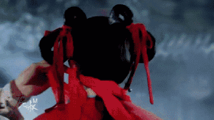

# 玄门内功心法 \#F1850

原创： yevon1ou [水库线下](/) 2018-06-25

玄门内功心法 ~\#F1850~

 

水库被封号一个月，强制放暑假。

积劳释放，最近有一点生病。

读了一些SixG的大作，颇为景仰，学学他的文风。

 

 

永远不要站在屌丝一侧

哪怕屌丝是正义的。

 

 

一）       玄门正宗

 

少林寺的玄慈大师，突然兴起了"传道"的念头。

 

话说众生皆苦。你看过《天龙八部》，里面就讲辽国武士，想抢嵩山少林，盗走武功秘籍。

一旦学会，辽国人人武功大进。再也无法抵挡。

 

大宋和契丹交战，输多胜少。少林武功，强生健体，既然契丹人可以来抢，为什么少林寺不主动公之于众，让宋人体格健壮呢。

 

 

玄慈大师说，"目前市面上流行的武学，主要是体术不正"。

习武这种事，本来应该是进程迅速的。20岁弱冠之年，就可以成为一流高手。

 

张无忌学"九阳神功"，在山谷里一共练了八年。

等他一出关，真气浑厚如大海。江湖上"内力排名"立刻就是第一梯队。

 

换算成"水库语"体系，就是说你三五年之内，便可以成为A8.

千万富人跑到社会上，"拼内力"能胜过你的人也不多。

 

 

可这句话倒过来说，却是一个大大的疑问。

为什么江湖上有大量的人，海砂帮青木帮长青门五虎门，其中的长老，练武练了几十年，眼看都成了耆宿了，长老了。

却打不过张无忌一个20岁的小伙子？

 

为什么有这么多"杂牌"武林门派，朝九晚九每周六，最后却练成了铁叉会鹰爪功八卦掌快刀门，酱油人生。

这是因为他们的"框架不对"。

 

 

 

二）       玄功要诀

 

在《萍踪侠影录》中，最重要的一本秘籍，叫做"玄功要诀"

 

「**子曰：范围天地之化而不过，岂能出于理、气、象乎？**」

「**象者拳之形也；气者拳之势也；理者拳之功也。理气兼备，举手投足，无不逾矩。**」

 

人类对于"真理"的追求，是永无止境的。牛顿归纳出三大定律，万有引力就突飞猛进了。

 

所谓"玄功要诀"，其实就是对武学更基础的规律，是"体"的描述。

对一件事物的描述，越接近本质，则练功的效率越高。同时也能达到更高的境界。

 

 

举个例子；

-   中世纪的古人，只知道"分子"，只能进行冷热物理反应。木头还是那个木头，铁器还是那个铁器，最多磨磨尖。

-   工业革命时代，知道了"原子"。于是就可以解锁"化学"。有了化学反应，你才可以制造火药，才能进行氮肥反应。

-   现代物理学家，知道了"原子核"。有了核物理，才能使用核能。

 

 

在"五虎断门刃"里面，掌门人或许只懂得"打磨力气"。

每天只会让徒弟们铁砂磨掌，木桩盘腿。

练是练得很辛苦，却不能到上层境界。

 

而内家弟子，练的主要是"内力"。又简称"贷款"。

练上十年《九阳真经》，出去打外家拳师，那是一打一个准。

降维攻击的碾压。

 

当然可能还有Section3的科技。另一个话题。

 

 

 

玄慈大师认为，研习上乘武学，关键是"三观"的探索。

这个世界，究竟是怎样的。究竟是怎样的运转规律。

哪些教育，是毒教育。

哪些历史，是编出来的。

 

你对世界理解的越正确，就越容易找到"接近正确"的迅速捷径。

 

 

 

三）       卖白蜡杆子的

 

玄慈大师一通话讲完，高念一句"阿弥陀佛"。

垂下眉毛，偷偷观看二侧反应。

 

只见众人交头接耳，脸上阴晴不定。咬着耳朵，却是越伏越低了。

始终都没有得人接话。

 

 

过了一阵子，山东白蜡的胡大杆子站出来了。

"掌门，此事，恐怕不妥"。

 

"我们是山东地界开武馆的。教教徒弟打拳，顺便收点茶水费"。

"上次有一个叫'杨露禅'的小伙子路过，拜师学艺。我前前后后讹诈了他三十两银子。还让他免费做了六个月的长工"。

"拳法呢，光吹不练"。

"哪怕他在我家再长工十个月，我也不可能教的。这辈子都不可能教的"。

"功法，当然是要藏着掖着。哪有拿出来教人的"。

 

杨露禅是谁，是太极宗师。AngelaBaby拍了电影《太极》。

这个故事，记载在《太极杨舍命偷拳》 

胡大掌柜既然开了一个头，接下来的讨论，就热闹多了。

紧接着"八卦螳螂拳"代表，也要求发言。

 

"玄慈掌门，想要普及武林科学的心意，是好的。我们也很感激"。

"但是方法和技巧，还需要多斟酌"。

 

"象我们八卦螳螂拳在豫西，专门教人理财"。

"我们的口号是，年化回报6%，高手高手高高手，争取回报8%"。

"练上二十年，才让你理财收益，本金200%。这还是没有股灾的基础上"。

 

"但是，我们要收你初级班，中级班，高级班培训费"。

"从19.90元的小讲，到知乎Live，到99元的专业课，到199元的大课"。

"同一套三流心法可以反复卖"。

"我们的口号是，不求心法好，但求卖课高"。

 

"玄慈掌门你要三思啊"。

"你那么醉心普及科学，搞得我们江湖小门派，都无法生存了怎么办"。

"这么多老师，这么多讲课的。这么多上下游的"。

"就业，纳税，想砸场啊"。

 

"对，对，中小门派齐声反对科普。给'低等功法'一条活路"。

台下呱噪了起来。

 

 

 

四）       同门

 

眼见台下反对一片，玄慈大师回过头来，依次扫过玄苦，玄难，玄寂等各位师弟。

只见大大小小的管家公司，默念佛珠。

水库里的大V，小V，欲言又止。

 

"师兄，此事恐怕不妥"。

"我就问一个问题。如果少林心法，普及于世。个个都学会了，都成为了玄字辈高手"。

"是不是就意味着玄字辈不值钱了，圣阶多如狗"。

"那我们玄苦，玄难，玄寂，岂不是贬值了"。

 

玄字辈高手，身份尊崇，月入双十万。

知识既然可以卖课，自然不能贱卖的。大伙都指望一身"武林秘籍"能吃几辈子呢。

 

 

眼看玄慈大师的提议，在"少林寺"内部也得不到支持。突然听见小沙弥急报，匆匆忙忙跑进入来。

"启禀方丈，刚刚听到书院改革。从此以后，书院要改'信息流'了"。

 

"这是什么意思啊"。

"意思就是，你要花钱买'展示位'"。

"兜售少林武学，要自己出钱，买置顶头条，逢刷必中，推荐关注了"。

"新浪微博改版后，收入翻了三倍"。

"普及越多，亏钱越多"。

 

 

"从今以后，哪怕你把少林武学白送，公示给大众。读者们也刷不到，看不到，见不到""他们只会刷出30两银子坑长工的胡大杆子"。

 

玄慈方丈，卒。

 

 

 

五）       喂养屌丝

有时候我在想，屌丝真是无法救药的。

这个世界的游戏规则是，哪怕你真的存了大善心，想要拯救屌丝。你也是救不起的。

 

因为在整场游戏规则中，所有人都付了钱，只有屌丝没付钱。

玄慈，其实是没有能力拯救屌丝的。

唯有屌丝自己，才可以拯救屌丝自己。

 

 

一件利国利民的好事，却导致了"全武林"人士的反对。

那么，一定有哪个环节，出了问题。

 

俺想来想去，发现整个社会的游戏规则，其实是这样的；

1）各大利益团体，角力者胜

2）代表先进生产力的"团体"，能拿出最多的钱。

 

但这里面是有一个bug的，主要是第二条。

代表"解放生产力"的那一方，他蠢到：不愿意掏钱怎么办。

 

屌丝注定扶不起，因为屌丝不愿意付钱。

整个社会，注定向"豪强"+分化方向发展。因为屌丝作为一个阶层，不愿意付钱。

 

 

 

玄慈大师，想要向全大宋普及少林武学。江湖中的小门派反对他。

少林同僚反对他。

收费太低反对他。

里里外外"既得利益团体"都得罪光了。

 

只有一穷二白的"孤苦少年"是受益者。某屌丝有机遇练成武林高手。

可是某屌丝会感谢玄慈方丈么。我看未必？

 

董伯伯试图降低香港房价，伍拾萬人反对。

可是他的关键"受益"者：屌丝群体，却没一个站出来为他说话。

那一刻，他面如土色。

 

 

 

六）       结语

 

前二天，在后台见到一条留言，真心被恶心到了。 

作者又不欠你什么。屌丝别以为自己是宇宙中心，别人天生都围绕着你转的《[中二病](http://mp.weixin.qq.com/s?__biz=MzAxNTMxMTc0MA==&mid=401668087&idx=1&sn=94dc27a4eb39acf7cc7adb10e6df7d73&scene=21#wechat_redirect)》。

你进了社会，真相是刀山火海，所有人都想坑害你。

 

 

水库是为数不多几个，真心为你好，和屌丝说真话，"普及科学"人类大同的账号了。

为此，水库承受了巨大的压力。冒了很大的"咖啡"风险。

 

"待粉丝好"，这条路很辛苦。

犯傻不如当咪蒙，螳螂门，一堂课程卖三次，把你当韭菜割榨更来钱更爽利。

 

 

水库的要求很简单，这次微信订阅号"改版"之后，所有的自媒体作者，都面临[灭顶之灾]。腾讯"保护费"在所难免。

水库做了一个永久免费的知识星球。这里会有公开，未公开的水库文章。目录最全。

 

你以后常来，从这个"**入口**"多打开就行。 

 

（yevon\_ou\@163.com，2018年6月24日晚）
