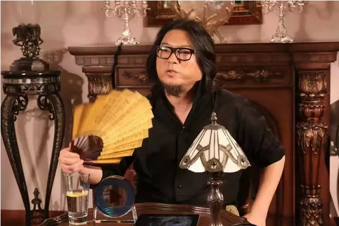

# 炼金之术 \#F1930

原创： yevon1ou [水库论坛](/) 2018-08-27

**炼金之术 ~\#F1930~**

 

高晓松举着扇子，"哈哈哈，北大清华的学子，如果一辈子就为了一套房子。那无疑是可悲的"。

 

水库："疯狂鼓掌，支持"！

 

高晓松把扇子一收："你说"。

 

水库："北大清华学子，如果一辈子为买一套房子，无疑是可悲的"。

"可如果他们买100套房子，那就成了艺术。刀锋上的艺术！"

 

 

 

一）画生

 

今天这篇文章，是写给一个小朋友"画生"的。

画生是水库90后中的佼佼者。著有公众号：《画生的吐槽空间》

 

但是最近的几篇，画生渐渐陷入了迷惘。在独立破阶的道路上越走越远。甚至哀叹起了"人生出头困难"。例如最新的这篇：《[[148：庸俗]](https://mp.weixin.qq.com/s?__biz=MzIzMzE5OTYyOA==&mid=2654654200&idx=1&sn=1da0d80cfea6e8da0105223a8b2f6e57&scene=21#wechat_redirect)》

在文章中，画生哀叹乔布斯在车库中改变世界。只要你有"火焰和梦想"，最终可以进化全人类。

而我们呢，我们只发明了[拼多多](http://mp.weixin.qq.com/s?__biz=MzAxNTMxMTc0MA==&mid=2651018299&idx=1&sn=77b9dc16ea0d1d8ce70df1b513f4b30d&chksm=80720228b7058b3e6cdd3d31102873997d5ba13599bc388836cf89847ef4fcb684dae1b8813a&scene=21#wechat_redirect)和抢红包。这是何等令人沮丧的局面啊。

 

技术，技术，技术你懂么。

奇妙的，弹跳的代码，构建了iPhone。科技使得人类可以远隔万里通讯，可以用云存储照片和音频。

 

相比中国人在二件八折，59元包邮之中打转。境界相差何其巨大。

人家是艺术，我们就是庸俗啊。

 

 

 

二）手机

 

我想告诉画生，他所知道的一切，全部都不是事实。

 

 

俺从2003年开始用Dopod S1，一直到2007年第一次接触iPhone 3.

当我看到iPhone时，我整个人都惊呆了。

我不能想象，怎么会有人使用这么落后，这么愚蠢，这么丑陋难看的手机。

 

iPhone上所使用的一切，全都不是新有的技术。

当99.9%的人口，还在使用Nokia双屏，带着笨拙的键盘。命令行式的输入。

Dopod系列，早就是触摸屏了。

 

触摸屏，可视化按钮，手写输入，无数App，自由下载和安装，而且还是六寸屏。

除了唯一没有"缩放"功能。iPhone没有给我任何新的体验。

 

相反，对于当时哥哥的二大主流需求：逛房产BBS和看碟。iPhone显得都十分笨拙。

它不仅仅只有狭小的4.5寸屏幕，拍照音频也毫不占优。

 

当哥哥的一些朋友，从海外带回iPhone手机时，哥哥的第一个反应："这是个骗子"。

因为Jos使用的所有技术，全部都是已有的，哥哥接触熟悉四五年，老掉牙的东西。

 

我不能想象，有什么样的穷人，会使用这样一台技术落后，形状丑陋的手机。即使是厚度和纤巧，iPhone3也不占优。

 

 

一直到有一天，哥哥不小心把手机屏幕敲坏了。于是我就去换屏。在当时，液晶屏还是一个稀罕玩意。换屏修理费，大概花了一台iPhone。

于是哥哥明白了，"低端细分市场"还是有客户的嘛。

 

 

iPhone从来不是"技术先进"的手机，甚至说，乔帮主搞出iPhone的时候，使用的全部都是"市场上"现有的框架。

他真正创新之处，是把成本控制在了600美金！

 

市场上有贵东西，好东西，但是穷人用不起。

当"智能机"降价到600美金以后，这个市场才能爆发式的增长。才能引发全球几亿台出货量。

 

你以为Jobs是一个技术天才，其实他不是。

他是一个经营管理，Marketing的天才。

 

 

十年以后，中国出了一个雷布斯。

雷布斯跑到香港去上市，提出的口号是"估值对齐苹果"，引发小粉红的一阵讪笑。

 

但真正内行人士都知道，苹果的杀手锏是供应链。小米的杀手锏也是供应链。

雷布斯是第一个做出"千元机"智能手机的。使用的，也全部都是市场上已有的技术。

 

你要说什么IOS，生态圈。

抱歉，我只用微信，抖音。

ios多久没出爆款应用杀手了？

 

 

 

三）折枝

 

古龙写"浣花洗剑录"。日本剑客踏浪而来，五战五捷。最终挑战武林盟主白三空。

 

在白家山庄门口，白衣人挥剑，切下一段树枝。交给门客。

白三空盯着树枝苦思冥想五个时辰，静静写下遗书，叮嘱五色帆船主人前来营救。

 

 

那么你想，一段树枝，有什么好看的。值得盯看五个时辰。

你自己拿一把小刀，切段树枝，你就知道了。

 

因为树枝本身是有韧性的。刀刃在空中，如果时间过长，你就切不断树枝。

而树木本身又是有纹理的。便如同战斧牛排一般。横切毫不费力，竖切损伤刀具。横竖纹路不一样。

 

如果你递进去一截树枝，一挥刀之间，瞬间能让纹路形成一个"白"字。你想想，这是什么功力。

这叫什么，叫内行看门道，外行看热闹。

 

 

同样的道理，在地产这个领域。如果一个人说，他有100套房子。

我们拿过来一看，发现全部都是全款的。其中不乏CEO盘。甚至还有旅游地产，包租商铺，五六线县城的房子。

不由得心生鄙视。土豪钱多。

 

水库"知识星球"，经常有人拿陕西河南150套房子的"房叔"来问。

在水库回复，不是迎来"前辈"高人评语。而是奉送二字套餐。

 

 

相反的，如果某人说，"小弟不才，小有建仓，大神们请勿见笑"。

我们拿过来一看，限购限贷城市并发低首付规划好民宿出租无敌景观奉送露台花园地下室不溢价双地铁超低价笋盘。

不由得倒吸一口凉气。这是什么，这是艺术啊！

 

 

这其中的区别，关键在于你懂不懂行，能不能"内行看门道"。

你手持一节树枝，去见武林盟主。如果换一个庸仆保安，或许就直接扔了。拿去炕下生火。

 

 

高晓松扇着扇子，大喊"买房就是庸俗"。

这里面，关键看他懂不懂买房的诀窍。知不知道在"限购限贷"城市，并发低首付三套，这种事有多难。

 

便如同绝世棋手，绝代画家。

一步手筋，看得人目眩神迷，如痴如醉。绕梁三日，回音不绝。

 

 

 

四）真正的技术

 

人世间的一切美好，都是技术。而你却只懂得其中1%

\-\-\-\-- yevon\_ou

 

画生看乔布斯，觉得iMac非常地高科技。"拼多多"非常地Low。

这是不对的。

在Marketing从业人员的眼里。"拼多多"简直就是一场圣殿，而iMac才是不值一提的。

 

 

即使经过很多年，中国人渐渐知道了"酒香也怕巷子深"。

不再是1980年，"只要产品好，绝不打广告"。

 

但是，"遗毒"并没有扫清。思想并没有净化。

依然还有人认为，"生产"中的技术，是真正的技术。而"销售"中的技术，根本就不是技术。

 

你把显示屏，从1024\*768提高到1920\*1280，一群的人顶礼膜拜。说你是"大师"。高级工程师。

可是你想出"在线销售"，想出"按需生产"。先有拼单后有下单。如此天才绝伦的惊艳，居然没有人说你是"技术"。

 

 

市场经济，任何东西都不是免费的。企业的竞争，是全方面的竞争。一切毛利提升计划，都是技术。

 

-   "信息"不是免费的。《[["信息不对称"是伪科学]](http://mp.weixin.qq.com/s?__biz=MzAxNTMxMTc0MA==&mid=2651015322&idx=3&sn=458b83fb16bc48016e763526e1d60205&chksm=80721e89b705979ff1c3a3189cec1c172c59b251a1416c08bb9940bb5fbcaf16cf10e8bd2bd7&scene=21#wechat_redirect)》\#F750

-   "收费模式"不是天生的。同样需攀爬科技树。见《[[经济学中的'搭便车'行为]](http://mp.weixin.qq.com/s?__biz=MzAxNTMxMTc0MA==&mid=2651018534&idx=1&sn=173dd9a100282e4787299ea7e36ba1a4&chksm=80720335b7058a23cf4db8a02c3c497368178e97932cc5c9170f08eff1c750f9659829ebff37&scene=21#wechat_redirect)》。

 

 

 

五）原创保护

 

["销售"中也有技术]，道理似乎很简单。许多人在点头，是不是。

经济学是"很难"的。我只要举一个例子，就可以考倒很多人。

 

 

前二天，桃军师写了一篇《[[甄嬛的永生]](http://mp.weixin.qq.com/s?__biz=MzAxNTMxMTc0MA==&mid=2651018612&idx=1&sn=720ff14fc5598b0c8e31e50c710291dc&chksm=80720367b7058a71b8644dc761ed7b11ead5490728b3c15e766019d15144ed2f9e0b66b0a2bf&scene=21#wechat_redirect)》\#X61，引发了铺天盖地的骂声。

在留言中，论文笔或许还有对女孩子的宽容。

但是"洗稿"这件事，几乎是一面倒地指责，一面倒地批评。纷纷认为桃军师错了。

 

 

"洗稿"可以洗么。[洗稿其实是没法洗的。根本不存在洗稿业。]

桃军师全文的文眼是："为什么原创只有几千阅读，洗稿却能有100000+"。

这句话才是全文题眼。

题眼不抓住，你是没法回答的。

 

那么，为什么"洗稿者"能洗出100000+呢。

因为洗稿者才提供了消费者"真正需要"的东西。而你原创并没有。 

许多人认为，文章中的抄袭部分是"华衫彩服""灿灿星河""眉目如画，顾盼生情"。

其实这是不对的。

 

这些根本不是读者关心的事

 

写小说这种事，同样分为"体、用、书"。

-   体：金庸构建了一整个武侠世界。侠义的伦理规则。

-   用：郭靖东奔西跑，逐渐成长的故事。

-   术：霓裳羽衣曲，山河地理裙

 

"术"是没有价值的。你把鎏金银铜马，换成玉双龙首璜。洗稿者瞬间可以把男女主角的衣服、名字、武功都换了。绝不会影响故事情节半分。

 

这种程度的洗稿，占了目前市场上的99%

而这样的洗稿，对"原创作者"一点威胁都没有。

 

 

真正麻烦的，是"用"。

故事怎样逐次推展，郭靖出蒙古后，怎么寻找仇人报仇。

 

故事情节的展开，便如同高山流水。顺着水流，完全没有空隙。

也就是说，一旦你的文章，形成了一个系列。首尾呼应，环环相扣，则是根本无法洗稿的。

 

短篇可以洗，中篇没法洗。

因为你已经成了一个系列。有头尾呼应。而一个链条中，更改一环，就是错误。

 

金庸写鲁有脚死了，耶律齐继任帮主。

而你傻乎乎地写鲁有脚继续活着。那二章以后，情节就对不上了。洗稿者就没法看了。

 

《射雕英雄传》只能等金庸完全写完了。别人才可以开始洗他的稿。

而整个故事框架，已经完全定死了。你最多写写同人。

同人写得再多，都是为他人添IP。

 

 

"手撕洗稿者"时，所有原创者的重点都错了。

揪着鸡毛蒜皮抄袭字句，标榜归属是你，证明那点微薄可怜才华，有什么意义。

 

如果你的稿子，轻轻易易被人洗了。那就说明你只有"术"，没有"用"。

然后别人再用更通俗的语气，更精美的排版，更完善的细节击败你。阅读量是你10倍。

 

而你只要稍微"深入"思想，写成前后篇呼应，立体架构。则"洗稿者"是根本没法洗你稿的。

别以为文笔锦簇是一门"技术"。写文章的挖坑，更是一门"技术"。你对此一无所知。

 

 

 

六）结语

 

我们的大学里，从来不教育"真正的技术"。

 

许许多多的大学生毕业，他们以为可以写很复杂的代码，可以算DES128的加密哈希，他们把这些误以为是"技术"。

顺便还误以为自己是"牛人"。

 

 

而真正的技术呢，是在批发市场控制各经销商如何不"窜货"。

是发货到内地，如何确保"应收账款"和追债讨账。

是在香精提高1个等级，和成本上升0.02美元之间，痛苦的抉择。

是信用卡和信用贷科技树。

 

而这些东西，学校里是"从来不教"的。

世界上最可怕的事情，是你"不知道自己不知道"。

 

 

水库希望告诉年轻人，你不知道的不知道，才是大雅！

能在菜市场看出经济学，网游中看出心理学，二百套看出笋盘学，才是真正的艺术之旅。

 

 

 

 

（yevon\_ou\@163.com，2018年8月27日丑）

 

marketing有大量大量的诀窍，一言难尽。
