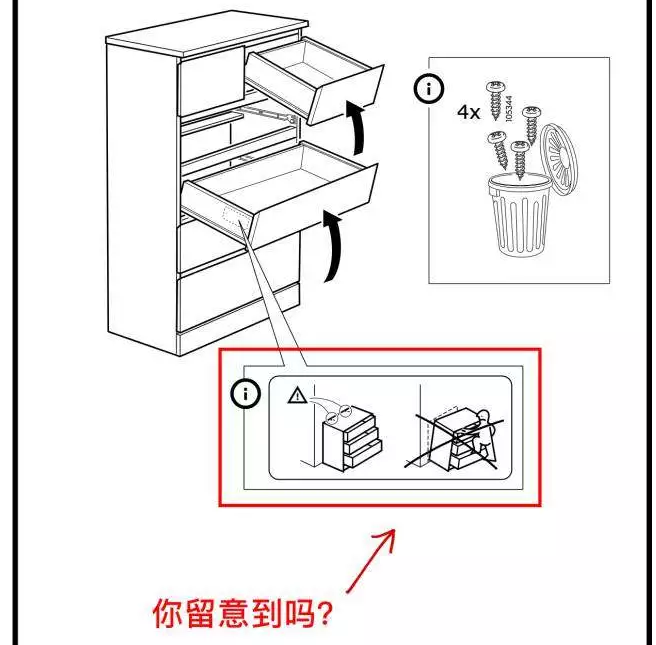

# 社保涨完了，涨什么 \#F1950

原创： yevon1ou [水库论坛](/) 2018-09-10

**社保涨完了，涨什么 ~\#F1950~**

 

涨价啊！

 

 

一）前言

 

 

长期的愚民教育，使得我们培养了一批"[中二病](http://mp.weixin.qq.com/s?__biz=MzAxNTMxMTc0MA==&mid=401668087&idx=1&sn=94dc27a4eb39acf7cc7adb10e6df7d73&scene=21#wechat_redirect)"的学生。

中二病发作到极致，就会发出以下话语。

 

-   "就算企业负担增加，企业应该内部消化。用利润来填补费用"。

-   "涨价是不可能的。要能涨价，他昨天早涨了"。

-   "成本的上升，不代表价格的上升。成本和价格是无关的，初中马列教的"。

 

中二的幼稚，笑得我亲赴后仰。

亲，你说为什么他"昨天不涨，今天却可以涨"。

因为今天"新社保条例"生效啊，政策环境变了啊。变量输出自然不同。

你哪个大学毕业的？

 

 

不过，今天我们并不准备谈论"社保""死亡税率"等等问题。

时政评论太过于危险，咖啡香浓。

今天我们谈论一个纯学术的问题：

 

"所有的企业成本+20%，3.7万亿社保费，谁来买单"？

 

-   企业主

-   打工仔

-   还是消费者？

 

 

 

二）短中长期

 

经济学的分析中，常常有"短期""中期""长期"等术语。

对于初学者，他们无法搞懂"长短"的差别。甚至误以为指的是时间岁月。

 

其实在经济学中，"短中长"主要是指，你能否[修改]一个变量。

 

水平低劣的调侃者，还会用凯恩斯"从长期看，我们都死了"来贫嘴。

这更显露思想的空虚。

 

 

举个例子，1973年"石油危机"时，OPEC把能源的价格提高了4倍。

一时之间，酋长们财源滚滚。而且造成了西方经济霸权的崩溃。

 

正在欧佩克商人得意洋洋，自觉得天下无敌的时候，他们身边的经济学家却劝诫道，"油价太高不好，长久来看，反而会削弱石油收入"。

 

油价过高 \<\--\> 减少石油收入

 

这个逻辑是怎么绕的。一般普通市民的脑袋，真无论如何也理解不过来的。

 

 

 

而经济学家的解释呢，你一夜之间油价翻4倍，导致销售额也翻4倍。

这个是"短期"的。

短期之短，可能也就一天，一周，一个月。

 

一个职场白领，买了辆车，早上急着去上班。

那么无论油价是7元，70元，170元/升。他总是要加一箱油的。不能因为赌气就不上班。

 

 

但是在"中期"，这个中期，可能是三个月，六个月，或者一年。

"中期"最主要的经济学意义，中期可以"修改"一个变量。

 

这个变量，有可能是白领不开车了，改坐地铁。

也有可能拼车，坐顺风车。

甚至换一辆小排量的汽车。

 

 

在真正的"正史"中，世界也是如此演变的。

1973年之后，"日系"汽车急剧扩张。

因为日系车较小，省油，热机效率高。

 

以前美国最流行的，是悍妞开着悍马，离地2米高的那种大吉普。

"能源危机"之后，各种"节能"科技如雨后春笋般发展。SUV飞快被小轿车替换。

 

[v.qq.com/x/page/d03961zxwby.html]

 

OPEC的涨价行为，反而限制了石油使用量。同时，挪威苏联等开采量也大增。

自掘坟墓。

 

 

 

而到了"长期"呢。长期可以打的牌就更多了。"修改"的变量也更多了。

1973"石油危机"之后，美国在中东的影响力剧增。多次影响政局。

"石油"成了帝国外交的生命线，海洋和航路大肆争夺。

萨达姆挨了几千战斧。

R\>T，不想花钱的，可以来抢。

 

 

另一方面，时间一旦拖成了"长期"。就为"科技革命"留出了空地。

美国人主导了页岩气的革命，有望在2030年，达成石油自给。再往后，甚至可以成为能源净出口国。

 

"石油涨价"，从远期看，提早结束了石油的时代。

 

 

 

三）物价中的短中长期

 

好了，现在我们来看"企业经营"中的短中长期。

 

"社保加税"，从短期内，无疑是对企业主不利的。

社保就是真金白银地掏出去，就是企业要增加上千万的负担。

第一天，肯定是哀鸿遍野的。

但是，"中期"呢。就中期而言，我们可以"修改"一个变量。

这个变量，毫无疑问就是"零售价"。

 

社保涨价之后，必然导致物价大涨！

 

大部分的"中二"学生，马政都没有学好。教科书是说："成本不等于售价"。

可那是为了适应你小容量脑子，阐述的简化版。

 

正确的经济学应该说：

"单一某厂家成本+20%，不代表什么"。

"可如果所有厂家，成本都+20%，售价就会+20%"

 

 

我们也可以从理论上，简单地证明：

-   整个社会的投资回报率，大致是一个常数，约6%

-   整个回报率，受"储蓄偏好/消费偏好"决定。和国民性、人性有关。

-   虽然60后，70后，80后，90后各自不同。但是在短时间内，可大致认为是常数。

 

既然"投资回报率"是常数。则最终售价，就是106%.

如果亏损了，就会有一批企业退出市场。

如果盈利很高，就会有企业加入市场。

最终平衡在"社会回报率"。

 

 

因此社保的增加，中期会反映在[零售价]，最终是由消费者支付的！

 

 

当一群傻瓜，哈哈大笑，希望政府抢老板的钱，来给他们发福利。

他们最终会发现，虽然每个月多拿1000\~2000元。

 

但身边生活的物价，普遍都涨了。完全抵销3.7万亿。

羊毛出在羊身上。

 

消费者支付了税收。

 

 

 

 

四）互相伤害的社会

 

为什么我们要反对"高社保，高售价"。

你说"消费者支付了税收"，企业家毫发无伤。可你为什么还要反对它呢。斥它为邪恶呢。

 

关键是不稳定

 

我们可以以"北欧"为例子。北欧是一个现成的"玩残到极致"的例子。

北欧的一切都很贵。喝一杯矿泉水，可以收费5克朗。

 

北欧的制造业，毛利高得吓人。随便造双鞋子，至少售价200美金。而企业使用的原材料成本，几乎和中国差不多的。也就是几美金。

 

为什么要这么"高毛利"呢。而且企业财务报表，也不怎么靓丽。

因为"高毛利"都没有赚到钱。

 

 

 

北欧的"政府管制"，已经到了匪夷所思的地步。

一个雇员，每周只上班36个小时，每年还要休二个月的假期。即使这样，企业还要负担他一生的养老金，医疗金，子女教育金。

 

北欧的环保组织，严厉苛刻。

企业想要组织开工，拿取批文，千难万难。

 

前一阵子，IKEA跌倒一个柜子，砸死一个女孩。

 

IKEA给出的赔偿金是，5000W美金。

问题是，这样的赔偿，有NN起。

 

 

这些"圣母婊的眼泪"累计在一起，就是IKEA的"毛利"非常非常高。

不管是造家具，还是造水杯，毛利都要300%，否则企业就活不下去。

没钱5000W美金赔给圣母婊。

 

这样一种"互相伤害"的社会，勉强也活得下去。

看似福利很好，GDP也很高，销售额很高。但却是并不幸福。

 

 

 

真正问题出在哪。出在Made In China也开始卖"五斗橱"。

中国商人的心气很平，毛利50%，中国人就觉得是暴利了。

也就是你一半价钱。

 

但是IKEA发现无法竞争。

因为"高毛利，高赔偿"是建立在抢劫的基础上的。"进口货"圣母抢劫不到。

 

中国人虽然只卖150%的价格，可是"圣母婊"找不到外国商人的位置。

他可能是躲在温州，金华山区里，一个乡镇企业小厂。

 

即使你找到了人，你也不可能向他索赔5000W欧元。

人家全付家当都卖了，都没有几铁钉。

 

 

欧洲人的DIY风俗，奠定于1970年代。随白左而壮大。

 

但之后随着"中国货"的涌入，欧洲人被打得溃不成军。

欧洲制造商找了很多借口，包括中国货不环保，不人道，缺乏劳工保护等等。

你以为他们傻啊。

不，他们只想把你拉低到一样的"被圣母虐"的低生存权利。

 

 

"白左"是一种世界性的病毒。

如果中国一味崇洋媚外，学习欧美的做派，则"中国货"就会丧失竞争力。中国的经济增长速度，会慢下来。

再没有中国的制度优势，再没有"中国奇迹"。

 

"高福利，高毛利"模式后患无穷。

说不定会被非洲制造，断了后路。

 

 

 

五）结语

 

严肃的经济学，从中期看，是"成本决定售价"。

从长期看，是"售价决定成本"。

只不过今天篇幅满了，就不展开了。

 

 

（yevon\_ou\@163.com，2018年9月9日暮）
