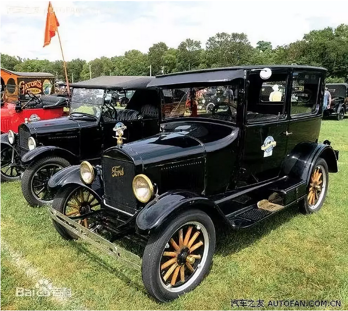

# 销售和营销和剩女 \#F2010

原创： yevon1ou [水库论坛](/) 2018-09-26

**销售和营销和剩女** **~\#F2010~**
==================================

 

销售和营销

 

 

一）捞妹飞行

 

这一周我一直都在西港出差，日程排满。没有时间写文章。

可是广告商不等人，该更还是得更。

 

没办法，只能从稿箱里翻出二篇旧稿。就是周一《[崇祯是怎么死的](http://mp.weixin.qq.com/s?__biz=MzAxNTMxMTc0MA==&mid=2651018931&idx=1&sn=f9b78795143aaa14d046645a31567296&chksm=807200a0b70589b628c9b39debd4a018e1d5c4d4bf3ef35b52cae3cc44ffa924d8a5dc48ed97&scene=21#wechat_redirect)》。

周二吴剑雄《[舆论战指南](http://mp.weixin.qq.com/s?__biz=MzAxNTMxMTc0MA==&mid=2651018933&idx=1&sn=7f90bfc35cc239f2a3cfd44f4feed6ed&chksm=807200a6b70589b0e79289f2294a805de35daa8595130b6971916cccff8f1609114a7a7fdb9e&scene=21#wechat_redirect)》。

 

ZM汇报之后，哥哥越想越觉得咖啡浓。

水原十口遥遥翻了一个白眼，扔过来一篇《[[如何成为豪门的猎物？]](https://mp.weixin.qq.com/s?__biz=MzA3NDMxNDA5NA==&mid=2649511401&idx=1&sn=a5cf915327a8ff5406e98439597d9817&scene=21#wechat_redirect)》

 

 

水原聊房，那个号才45000粉丝，都战战兢兢地转情感类八卦号。

哥哥越发感觉，不写上十八篇依萍和书桓，简直都不能解毒。

 

我们研究一下，要不要写捞妹三部曲。

 

 

 

二）内需不振

 

不知道从什么时候起，我们国家菜民，喜欢喊"内需不振"。

塑料铅桶厂长，闭着眼睛生产铅桶，一个营销人员也没有。终于有一天卖不动了，不反思技巧升级，却喊着政府救市。

 

"滞销剩女生产工厂"xx名校，一口气向市场抛掷几千个大圣。不去好好反省自己的产品出了什么问题，却抱怨中国男人不识货。

 

大约1950年代，美国诞生了"营销"科技树。

 

 

 

什么是营销。

这个概念一点都不难，一点即透。但是就缺这一层纸，在外企没有传授科技树之前，中国人不知道吃了多少亏。

 

绝大多数的公司里，都存在有"销售部"。

你哪怕可以没有财务部，没有人事部。但你一定不能没有销售部。

 

因为"销售"是你的饭碗。是你所有订单的来源。

公司管理混乱可以活下去，但是没有销售，一定活不下去。

销售部，通常是第一大部。地位崇高。

 

但是绝大多数中国公司里，都没有"市场部"，或者称为"营销部"MKT。

 

 

美国人打完二战的时候，人均GDP是3000美金。二战，也是美国最终走出"大萧条"，经济恢复正常化的标志。

 

此后十年，美国经济发展非常快，被誉为黄金十年。

1955年，人均GDP已超过了USD4500美金。

 

 

如果你懂得横向比较的话，则美国的USD
4500美金，质量和今天的"中国经济"档次差不大。

中国人正在踩的坑，美国人当年全都踩过。

 

50年代的美国人，也是一样。一开始闷头大生产，造多少卖多少。

然后猛地抬头，突然发现市场"饱和"了。

 

\*
还有愚蠢的白痴写了篇，发达资本主义国家争夺殖民地倾销市场，否则就会内需不足。丫完全不懂西方经济。

 

 

你翻中国教科书，几乎每一本教科书，都会提到福特的T型车。亨利·福特发明的流水线，使得生产力提高了几百几千倍，大规模低成本生产变成可能。

但是美国最大的汽车公司，却不是福特。而是通用。

 

教科书没有提到的是，二战之后，福特公司遭遇了困难。当消费者都买得起汽车以后，消费者就不再喜欢"单调，丑陋"的单一款式汽车。

全国男女都穿同一款式的衬衫，多么可怕的事情。

 

当"有和没有"被满足以后，消费者迅速地升级口味。他们需要的是千奇百怪的车，个性张扬的车。

 

通用汽车公司，有超过100种车型。虽然每一款批量都更小一点，牺牲了大生产的效率。但是消费者愿意为款式付溢价，综合下来利润反而更高。

 

 

 

大概以1955年为分水岭，美国的市场开始饱和。纯粹地闭着眼睛生产"塑料铅桶"，那是脑残，活该他"内需不振"。这不是困难，而是懒。

正确的做法，应该在铅桶上面"雕花"。例如刻个米老鼠印上去。

又或者是，完全放弃铅桶产业，开始研究娱乐歌舞。例如1954年发明电视机，其震撼意义，绝不亚于今天发明互联网。

 

 

随着美国市场，由"单一大批量"拼价格和成本。转变为"多款，小批量"。

女装拼创意和款式。

女人永远缺一件衣服，只要你能设计出梦幻装。

整个市场逻辑也升级了，由"销售"变为了"营销"。

 

 

 

三）销售和营销

 

什么叫Sales和marketing。

 

-   Sales：销售。业内也称为PUSH。

-   Marketing：营销。业内也称为Pull。

 

 

销售的意思，是先有产品，再找客户。

譬如说福特T型车。你千万别以为T型车是个褒义词。

其实在美国，以至于整个汽车史，"T型车"是非常令人作呕的一个词。

 

福特从1908年开始生产T型车，此后这个型号就没有改变过。一口气卖了1500万辆。全美国也不过3000W家庭。

 

无论你卖多少辆。T型车的款式，是"永远不变"的。

因为你只有固定的车模，固定的底盘，固定的流水线，你才可以最大程度降低成本。尽享大工业的好处。

 

但是这同一款车，一口气卖了20年左右。消费者真的要吐了。

大家不喜欢这个老式过气的长鼻子，同时也觉得后座不够宽敞。

尤其发动机技术的突飞猛进，整个车架都要升级去新的平台，否则难以适应新的高速。

 

 

但是福特"销售"不为所动，他们继续吆喝T型车。

先有产品，后找客户，这是"销售学"的特点。

 

销售学的核心原理，简单粗暴。通俗点讲就是"流量"。流量为王。

-   所谓销售，就是派人在马路上发小广告。

-   派销售人员，挨家挨户敲门。

-   打几百万个Cold Call，按黄页一户户打电话。

-   包下所有电视频道，狂轰滥炸脑白金。

 

 

大概从1955年开始，全体美国人开始培养起"电话鄙视"的文化。

-   听见陌生人打过来，卖保险，卖理财，卖基金，一律挂掉。

-   再热情的美国人，遇销售员上门敲门，多半也是闭门羹。

-   马路上的传单，随手塞进垃圾桶。

-   看见水库金主，登二个广告。垃圾粉就说你掉格。

 

因为人们实在已经受够了"商业推销"。我为什么要买你桐乡皮革城小商铺呢。你这不是害我么。你没安好心。

为了赚自己的一点佣金，把陌生人当韭菜一样割。

 

消费者不介意广告。消费者需要对他们好的广告，需要甄别出有益的信息。

 

 

顺着这个思路发散下去，就是marketing"营销"的思维。

marketing整个逻辑，都是倒过来的。

 

-   不是先生产产品，再试图推销给消费者。

-   而是先问消费者需要什么，再生产相应的商品。

 

 

在marketing的逻辑下，"市场调研"成了第一步。

-   他会先问你，你家有几口人。

-   买汽车，是为了上班，家庭出游，还是野外旅行。

-   是需要房车，跑车，还是SUV。

-   年轻人掏钱注重引擎，还是老年人掏钱注重内饰。

 

根据你这些需求，大致确认出一个"细分市场"有多少容量。

这个容量，再扣除竞争对手，来确认竞争强度。

最后，根据目标客户群，精准地寻找广告媒介投放接触。这段见诸《[广告学入门](http://mp.weixin.qq.com/s?__biz=MzAxNTMxMTc0MA==&mid=2651018767&idx=1&sn=9513296754b30f9709a59f0d83882234&chksm=8072001cb705890a07a7c0ce84d5a206280b84f219b5624749455fc26943ef86b8fdebc1e50b&scene=21#wechat_redirect)》~（中）~

 

 

通常而言，我们把HARD SALE"强制销售"，称之为PUSH。

而把"市场营销"，软销售称之为Pull。

 

最好是客户看了电视广告，按图索骥，主动找上门来。"我看了你们有这种产品，很感兴趣。想了解一下"。

 

当然，在真实经营中，还是Push+Pull结合。"电视广告教育+地推轰炸货架"才是效果最好的方法。

 

 

 

四）捞女的飞行降落

 

我们花了近一千字的篇幅来讲学术，当然不是为了普及marketing的。

理论联系实际。正好水原哥哥写了《[[如何成为豪门的猎物？]](https://mp.weixin.qq.com/s?__biz=MzA3NDMxNDA5NA==&mid=2649511401&idx=1&sn=a5cf915327a8ff5406e98439597d9817&scene=21#wechat_redirect)》，我觉得十分应景。完美地阐述了Sales和marketing的区别。

 

 

水原文中，把"想嫁入豪门"的女性，分为了二种。

 

-   捞女动机单纯，只奔财富权力而来，把自己打扮得花枝招展，或者时尚酷炫，热衷参加各种party，不遗余力地寻找豪门或者富二代。

 

-   另一种女人，容貌并不是绝顶，家世未必显贵，智力不差但未必展露锋芒。楚楚可怜象小白兔。然后不知怎地，一口把大灰狼给吞了。

 

 

怎样嫁给霸道总裁小奶狗，很多女性自以为是地认为，"我要成为高级优秀女性"。

无论是成为哈耶普博士，外企高管，年薪50W，精通各种Celine化妆品，钢琴芭蕾普拉提。

 

这些事有帮助么，其实是没有任何帮助的。

当你学芭蕾时，你心中是没有挂记你男朋友的。

没有任何一个男人，喜欢女友跳芭蕾的。

 

 

这就是典型的"先有产品"，然后找消费者。

先是闭门造车，把自己堆积成一个高成本商品。

 

卖不出去怎么办，卖不出去就"疯狂地推"。

  在马路边散发小传单   相亲网站
  -------------------- --------------
  挨家挨户敲门         参加豪门宴会
  打电话Cold Call      朋友媒婆介绍
  包下所有的展示位     深V战装

 

这种就叫做HARD Sale，你是注定失败的。

你营造的，并不是符合"豪门需求"的产品。而你的出场方式，又让豪门充满了警惕。

 

 

 

嫁豪门的关键，不是Push，而是Pull。

现在的女生蠢到，花点心思做个局都不肯。

 

推销自己最好的方式，不是凑上去说，"Hi，我叫尔晴"。

而是让全场的女生都在说，"咦，今天尔晴怎么没来"。

"如果尔晴来了，就会不一样"。

"这样的场合，尔晴总有办法"。

 

 

在你想要推销自己之前，先要设法把你的名字，在"目标猎物"心中，至少刷三遍。

让他对你"闻名久仰"，形成广告效应，才可以出场啊。

 

也就是说，你先要把目标客户研究透了，"精准营销"。而不是大街散传单这样广撒网。

 

根据"目标猎物"的口味，增补自己的人设。然后再包装自己，再把信息传递给霸道总裁。

 

等最后你小白兔楚楚可怜出场的时候，其实陷阱早已挖好。

就等大灰熊纵身一跃，轰隆隆跳进八米深的坑里。

 

 

（未完待续）

 

 

（yevon\_ou\@163.com，2018年9月25日丑）
