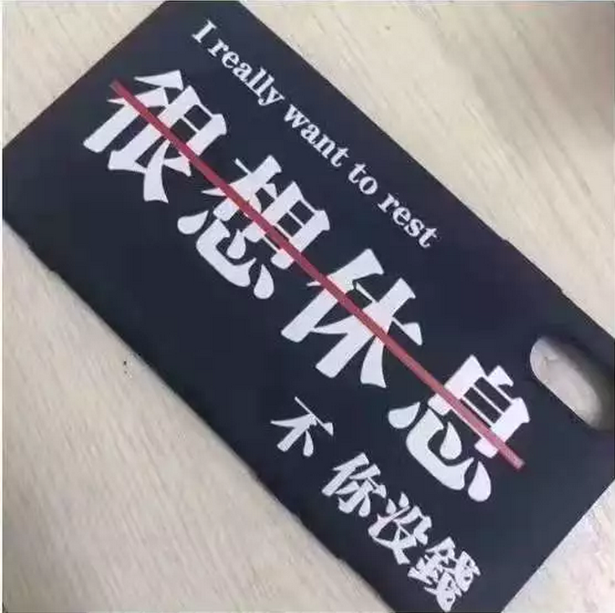
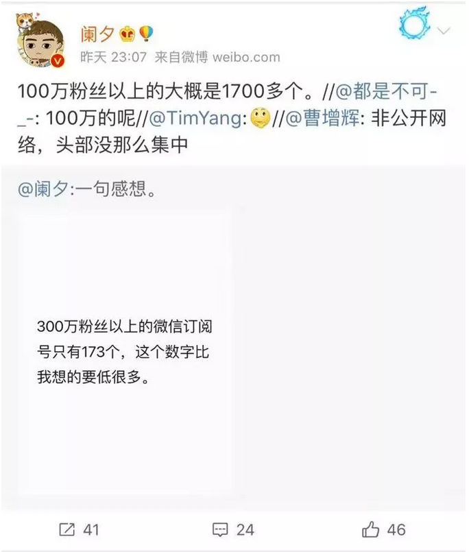

# 水库五十万 \#F2030

原创： yevon1ou [水库论坛](/) 2018-10-05

**水库五十万 ~\#F2030~**

 

公众号的那些小事。

随便聊聊，可能对你有帮助。

 

 

一）粉丝和阅读

 

2018.09.28，水库粉丝突破500000人。

 

作为对比，2017.11.20我们发布了一篇类似的《[[水库微信号分析2017版]](http://mp.weixin.qq.com/s?__biz=MzAxNTMxMTc0MA==&mid=2651016480&idx=1&sn=c600a5c83d4fe8e1e8436c821718abd2&chksm=80721b33b7059225f842dcddb9a634cfcab43055ed9e274e2eea7593769ce7de61e5733e1291&scene=21#wechat_redirect)》\#1590。当时庆祝的粉丝数，是突破300000人。

 

也就是312天的时间，接近十个月，水库涨到了500000粉。

在凄风细雨，一片惨淡的今天，实在是件很不容易的事情。 

 

500000粉丝算不算大号呢。

如果单纯按粉丝量排名，在中国大约要5000名之后。

 

"清博指数"有一个是按访问量排名的。[https://m.gsdata.cn]

按照这个指标，大概是：

-   全国第515名

-   房产类第1名

 

 

产生这类差异的原因，绝大多数的公众号，非常"渣"。

天下悠悠，但是好的公众号，数量是有限的。

读者的打开欲望，是一直在下降的。目前全行业标准，连5%都不提了，业内默认是2%。

 

这句话的意思，哪怕你一个300W的公众号，"保底"的铁杆死忠粉，也就只有6W阅读。

今日"微信公众号"全行业，能做到篇篇100000+的，一共只有28个号（去年17个）

 

其中绝大多数，都是各位耳熟能详。例如咪蒙，六神磊磊，紫竹张先生，饭统戴老板......

 

 

 

水库的打开率......呃，其实一直在暴跌。

去年11.20，当我写《[不公平地揍人](http://mp.weixin.qq.com/s?__biz=MzAxNTMxMTc0MA==&mid=2651016338&idx=1&sn=daad3a965284e2efc40650da0894b304&chksm=80721a81b705939726a9d5cd1cf7195526a97857c527f7032e8c2366a109029a2b5a84b8164a&scene=21#wechat_redirect)》《[为什么牛奶要倒河里](http://mp.weixin.qq.com/s?__biz=MzAxNTMxMTc0MA==&mid=2651016357&idx=1&sn=adf8285cceb25453aeb65e9f684b9969&chksm=80721ab6b70593a05c4e9b0f90307f8f1554714fd460c274c21e9e1c132127dc613b8778d7ca&scene=21#wechat_redirect)》，当时水库粉丝300000，保证篇篇阅读65000+

 

当年哥哥心里热乎乎地。

我在想，"要是俺的粉丝，再增长+50%，那我就是篇篇100000+啊"。

 

老板老板，人家篇篇100000+是包括次文的。你广告达不到。

切，别打脸好么。

大不了，俺不接广告了。

 

于是哥哥写啊，写啊，满心欢喜地看着粉丝数继续增涨。

 

等我400000粉丝的时候，"阅读量"并没有如预期，达到每篇80000+。

相反的，被拦腰一刀，横切又是60000+。

 

 

这下俺傻眼了，是不是哥哥不够努力，文章质量下降？

于是我再写啊写，呕心沥血。

等水库粉500000+的时候，阅读量又拦腰一刀，又是八折，变回65000+

 

 

这下子我死心了，天威难测！

那就不要挑战天威了，你老老实实每篇65000+好了。读者看不见，就看不见吧。

反正我问广告金主，也只收65000阅读的钱。

当交税好了。

 

因此呢，目前"水库"的打开率，从20%，到15%，到12%

基本上就只有12%左右。

 

 

唯一的好消息是，"读者留言"还是很多的。

我们近期的文章群发，一般可以收到500\~600个留言，900个赞。

按"阅读比例"，这相当于1%的留言率，1.5%的点赞率。

 

留言和点赞，明显超过了十个月前300000粉的阶段。炫目高！

为此哥哥也很欣慰，大家热情就好。

 

\*
这段时间内，微信有二次"修改统计"，剔除可疑ip地址。我不是黑微信，有可能是误伤。

 

 

 

二）增长

 

我们再来看这张图。

水库用了10个月的时间，增加了200000粉丝。

但是这些粉丝，并不是"自然平均"分布的。

 

一共有三次事件，构成了"小灶"

-   一月新闻事件，+10000

-   一月七月，有道云推荐，各+10000

-   七月"搜一搜"

 

 

每年的1月，7月，"有道云笔记"都会发布"最有价值微信半年榜"。

这个榜单，是按"收藏量"排名的。

 

由此也可以看见，为什么那么多艺人，削尖了脑袋，去参加这个榜，那个榜的排名。

因为上榜的确会涨流量。

 

水库篇篇精华，篇篇危险，心疼网友们很给面子。年初排第9，年中排全国第7.

上榜了之后，你就开始加粉。

第1天三千多，第2天二千多，前前后后总涨10000粉。

 

在今年一月，水库还发生了一次"公共事件"。

全网疯传，上百家机构洗稿，热闹了足足半个月。第一周又涨了10000粉。

 

  2018/1/11   5427
  ----------- ------
  2018/1/12   2273
  2018/1/13   1267
  2018/1/14   1516
  2018/1/15   1575
  2018/1/16   990
  2018/1/17   690

 

另外，7.18\~8.18，水库被封号一个月。

这段时间内，有位腾讯的姐姐是水库粉。她挺可怜我，于是把水库放到了"搜一搜"入口。

腾讯热搜，威力巨大。水库完全停更的一个月，结果是增长最迅猛的一个月。加了+27000多粉。

 

 

综上，我们在十个月的时间内，吃了三次小灶。

连蒙带骗，总算攒到了200000新粉。

如果扣除这些小灶，大概每个月增长15000粉。每天+500左右。

 

 

 

三）增长

 

繁荣之下，真实隐忧。

 

九月的数据，非常非常差。

这碗饭从来没有这么困难过。

 

十个月300000\--\>涨到500000粉。

可是最后的49W\~50W，最后一万粉，足足用了38天。

 

  8月22日   320   9月4日    423   9月17日   182
  --------- ----- --------- ----- --------- -----
  8月23日   84    9月5日    326   9月18日   505
  8月24日   294   9月6日    397   9月19日   274
  8月25日   9     9月7日    309   9月20日   226
  8月26日   307   9月8日    106   9月21日   18
  8月27日   227   9月9日    196   9月22日   120
  8月28日   215   9月10日   513   9月23日   162
  8月29日   347   9月11日   394   9月24日   347
  8月30日   353   9月12日   349   9月25日   340
  8月31日   222   9月13日   230   9月26日   252
  9月1日    275   9月14日   158   9月27日   266
  9月2日    219   9月15日   215   9月28日   268
  9月3日    358   9月16日   202             

 

如图，最近的一个月，一直到今天，粉丝的增长量，持续以200\~300打头。

甚至有桃军师的一天，接近刷出负数。

 

若按这个速度发展下去，水库迟早会"泯然众人"，沦落成一个普通的号。

再也没有蓬勃发展，互联网的一朵奇葩。 

 

 

朋友们先别急着安慰我。

面对如此不利局面，我还想送各位四个字呢。

答：万一我不在乎呐！

 

水库曾经雄心勃勃。

-   2017年时，我们曾经梦想粉丝100W。

-   2018年时，卑微的梦想，只要求粉丝60W。

-   如今看来，到年底，连60W都完不成。

 

最关键的是，水库已经完全放弃了任何"粉丝增长计划"！

 

 

我们曾经雄心勃勃，要在民间普及"奥派"经济学。

我们也试图找贪心记，戴老板，兽楼处，互推交换粉丝。

我们还考虑过，在平面媒体投广告。

但目前这些计划，都已经完全放弃。

 

我们不需要粉丝。目前500000粉的规模，够了。

我们不愿意再"扩大产能"。更加不愿意举债，有成本地，从事推广活动。

 

号做大了容易封啊！

 

前二天"黄生看金融"喝醉了酒说，他考虑投资400W元，增加800W粉丝基数。

哥哥在旁边冷言嘲了一句，"刚吸完粉就封号"。

黄生颓然败却。

 

 

 

这个世界上，有很多"增加名气"的方式。

譬如你站台走穴，媒体报导。目前的电视媒体，几乎没有"免费出场"的机会了。任何一个"嘉宾"，都要给钱，才能买露脸。

 

可是只要你钱砸下去，你还是可以增加曝光度。还是可以上热搜。还是可以涨粉。

只要以后广告费收得回来。

 

 

问题是，大环境已经不同了。"风险系数"已经不同了。

做公众号的人，每一个人都朝不保夕。风雨飘摇。

而且"刑名不具"，守法都不能让你保护。

 

这种情况下，大家考虑的都是"变现"。

"增加投入"？不存在的。

 

 

《[[请问自媒体人：你有掉粉KPI吗？]](https://mp.weixin.qq.com/s?__biz=MzAwMjE1NjcxMg==&mid=2654669121&idx=1&sn=6bcc4570893b23a97182daa38efcffc3&scene=21#wechat_redirect)》

 

象这篇文章，我们目前讨论的，是"洗粉"。

我不需要那些杂七杂八的胃酸粉。传播率太广，本身就是"死罪"。

 

遇见一些脑子有抽的读者，动不动就是"已举报""已告密"。

更是让人心悸梗塞。

 

TNND这种死太监像，哥哥一看就想把它拉黑。全都是成都航控技术学院出来的。

 

500000粉丝够了，65000阅读也挺好。

我不指望"广告费"涨价，目前的小日子凑着过。挺好了。

 

凡是我在留言里，回复骂SB的。

您还真别矫情了，别动不动"取关了"。

你走啊，走得越远越好。把名额空出来。

我只需要500000粉丝。有支付能力的"核心粉"就够了。

 

 

 

四）广告和徒弟

 

水库从今年一月下旬，开始大规模地"接广告"。

呃，具体说，就是无底线的p2p。

 

 

自从接了广告，你的粉丝量增长，就开始放缓。

这是一件非常无奈，但也等价交换的事情。

 

因为"新用户"的传播，最主要靠朋友圈，微信群转发。

一旦你的文章里嵌入了广告。

朋友圈就不愿意转发。

大家总觉得，在朋友圈转一条广告挺Low的。不转，而且还要取关。

 

水库每次推文，"取关率"都在400人左右。疼得哥哥不要不要的。

后来网槛的咖啡，成功地治愈我不疼了。

 

 

 

相应的，水库增加了芸姨，桃军师，吴剑雄，肛锯等写手。

他们都很好，但终究是"差了一点点"。

用他们的文章带广告，也是损伤水库的IP，损伤水库品牌的。

 

哥哥曾经心疼得不要不要的。

看见米宅被封，治愈了我的心绞痛。谁知道还有没有明天呢。

 

如果还有明天薛岳 - 生老病死

 

 

 

五）结语

 

水库一共有三个微信公众号：水库论坛，水库线下，水库2019

相应三个知识星球：水库，水库线下，水库2019

 

其实"水库线下"还是有些新文章的。

有些文章，咳咳，就用小号发的。 

 

 

（yevon\_ou\@163.com，2018年10月4日暮）
