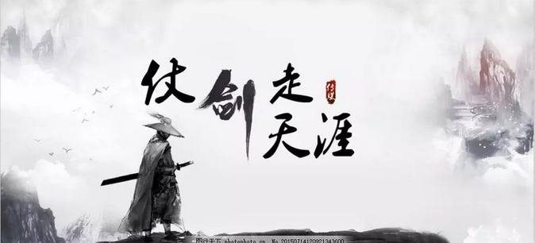
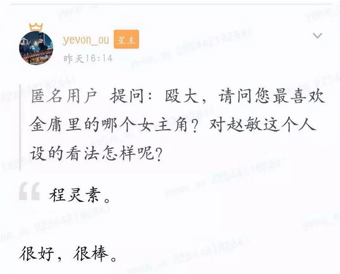

# 

**光明圣火何时熄 ~\#F2130~**

 

 

一）武侠

 

武侠是越来越没人看了。

 

昨天金庸去世，朋友圈刷爆。最让哥哥心境戳刀的，是某网友冷冷评论了一句："35岁以上撕心裂肺，30岁以下无人问津"。

唉，哥哥这是有多久没看武侠了。

 

 

我印象中，最后一本完美S级的作品，是赖魅客的《武林旧事》。那还是2007年的事了。丫这书还写烂尾了。

 

此后，虽然金庸的影视作品，在"主流"电视台不停改编，热播。但它在90后，00后的人群中，毫无疑问已失去了热度。

 

 

曾经，我们奉为圭臬，99%人口无人不晓，街头巷尾通用暗号。乔峰，杨过，令狐冲，星爷语录。

我们认为"永恒的经典"。血液一样与生俱来。

IP终究也会消散。老男人会被人遗忘，埋入历史的尘埃。

 

六大门派围攻光明顶，一定要灭了山上的圣火。

当世上最后一人，再也不记得金庸。这圣火也就涅灭了啊。

 

 

 

年轻人在看什么呢，在看"魔幻"。科幻/奇幻/魔幻/玄幻。

为什么看"魔幻"，不看武侠呢。

因为武侠已经Out，不够年轻人的重口味。

 

"武侠小说"有其天生、与生俱来的弱点。

武林中的大侠，无论武艺如何高超，剑法如何精妙。他终究是要"打"的。要靠肢体接触，挥拳把人打出去的。

哪怕你只用"一招"，你终究还是要用一招。

白天羽雪夜遇伏击。八十几名高手联手合围。他一刀砍死一个，蓄力只砍出四十七刀。力竭而死。

 

 

"神拳无敌归辛树"，江湖已是第一流的高手。

 

康熙点点头，说道："神拳无敌归辛树，却原来是这么个糟老头儿！咱们的人死伤了多少？"侍卫领班道："回皇上：反贼凶悍之极，侍卫殉职的三十多人，伤了四十来人。"

 

金庸如果晚生四十年，到今天来写网文。

那他一定不能大红。淹没在众多乡村写手之中。

 

 

 

为什么"武侠"的时代结束了。

因为今天已经是"魔法"时代。

中文世界的网络文学，几经迭代，迅速演化。

诸多用生命写作的青年高手，迅速找到了"观众的G点"。

 

如果说，2008年年代，还存在"纯武侠"作品。即使写"魔幻"，也是写"魔武双修"。

主人公同时精通魔法与武技。

而且默认训练到最后，魔导师和圣阶武士，战斗力是平等的。

 

但是到了2018年的网文时代，局面已经"一面倒"了。

90%，甚至99%的主人公，清一色全部都是"魔法师"。

 

 

 

魔法爽啊。

你一个武林高手，武功再强，杀人还需要一招。一天打1000个，也需要一千招。刀都卷边了。

 

而在现代"魔幻"作品中，动辄一个人要"单挑"一整只军队。

一位高阶魔法师，举手投足，毁灭数千人，上万人的方阵。直接影响战争的结局，那才叫Super
HERO。 

这样的话，"武技"就不大够用。要吹牛的话，一定得上"魔法"。

一旦大面积魔法发出，毁天灭地。火球术动辄砸几十人。禁咒魔法直接毁灭一座城市。

 

90后，00后，喜欢的是"爽文"。主角拥有毁天灭地，甚至摧毁整个位面的能力。

"纯武侠"时代，一去不复返。再也再也不可能复兴了。

 

 

 

二）魔幻

 

魔法并不是简单地，"将群伤扩大100倍"。

严格地说，"魔幻文学"和"武侠文学"，根本就是二回事。连血统都变掉的。

 

 

水库曾经有一篇文章《韩剧高贵，美剧低贱》\#F92。

被无数小美白歌颂，政治正确的"美剧"，在水库的眼里，却是"低贱的，幼稚的"。办公室最Low眼镜妹看的。

 

 

因为贯穿所有韩剧，浸润三千里大韩民国的，有一条主线："责任"。

韩剧里的人，无论他们走到哪里，他们都是儒教徒。

既然是儒教徒，就对家庭，对父母，对爱人，充满了责任。绝不是抛弃和放纵。

 

 

相应的，美剧真是贱货看的。观众素质：社会最底层的人格。

因为美剧的价值观背景是Liberal，无论是《老友记》《欲望都市》《Gossip
Girl》,所有所有的人，都在没心没肺的玩。

 

美国青年的价值观，"享乐第一"。

对社会，对家庭，对种族，对子女的责任，不存在的！

 

 

或许哥哥真是老了，我太老了，跟不上时代的步伐。

把我埋了吧。

 

"武侠"的世界，是韩剧。是"有止"的。

大侠的人品，哪怕你武功天下第一。依然有看不见的绳索绑着你，内心的道德约束你。

 

赵敏曾经逼得张无忌走投无路。立下三个誓言。

可是张无忌最窘迫的时候，依然坚持说道："不违背侠义道精神"。

这是底线，这是信仰。

哪怕我武功大成，也不会改变。

  

令狐冲学会吸星大法，反出华山。按说他已经和"华山派"恩断义绝。

少室山3V3，任我行向问天令狐冲 VS 方证左冷禅冲虚。

令狐冲从匾额后面翻出，纳头就拜。

哪怕岳不群武功，已经远远在他之下。"师道尊严"依然跪伏得抬不起头来。

 

"传统武侠"和"现代魔幻"的差异，其实是二个世界观的差异。

是"社交模式"的差异。

80后，和00后的差异。

 

 

最早的知名武侠，数王度庐的《卧虎藏龙》。

这里面的思维模型，玉娇龙的三观，放今天都已经快"看不懂"了。

 

金庸代表的，是80后整整一代人的三观。

对于这一世代，"礼貌和社交"依然十分重要。

大侠行走江湖，靠的是脸面，讲的是生意。

 

林震南曾不无得意的说：「从福建往南到广东，往北到浙江、江苏，这四省的基业，是你曾祖闯出来的。山东、河北、两湖、江西和广西六省的天下，却是你爹爹手里创的。」

 

大侠行走江湖，讲的是"江湖道义"。

你遵守江湖道义，则请茶喝酒。违反江湖道义，立刻寸步难行。

令狐冲反复困淆喝酒行为准则，就是找不准自己的定位。

 

 

 

而90后，00后看的"现代魔幻"，简直就是美剧肥宅快乐水。

 

你开始使用魔法，你就不遵循力量上限。

没有限制的力量，心法代差，1:NN都可以。

既然你这么能打，显然你不需要任何社交。独自修炼内心世界好了。

 

你是快乐的死肥宅，你不融入世界。

在你的心目中，你比全世界都大。

"魔幻"的世界，一点点喜怒哀乐，你就炸毁了人家的村庄桥梁。 

 

这种问题，如果换到了"魔幻"版本。

"老婆老婆，快出来看。有人虐主"。

"擦，还真有不怕掉粉的啊"。

"他想干嘛，求封号么"

 

 

 

三）贩卖善良

 

中华文明延续至今，"苟"的力量，无疑是极重要的一环。

无人仁人志士前仆后继，舍身忘己，才守护了家园宁静。

 

 

金庸是一个聪明的小贩。他的二把刷子，哥哥早已看穿。

金大侠虽然写的是"童话"。贩卖的，却是裹着糖衣的药丸。

 

(我不在乎，我喜欢吃糖。)

金庸的成就，绝不是让人知道了"九阴白骨爪""九阳神功"或者"九阴九阳"。武林和招式，全部都是表象。

 

金庸真正做的，是随着剧情的展开。慢慢揭示"武当七子"。彼此之间肝胆相照，手足情深。

公孙乾，风波恶，慷慨高歌，燕赵豪迈。

郭靖杨过前仆后继，保家卫国。

 

若，一去不回

便，一去不回

 

不知不觉，亿万读者中，出现了大量"苟"的人才。潜移默化的教育，十几年寒窗，抵不过二册"港台文学"。

v.qq.com/x/page/r05000edbad.html 

 

金庸为什么要这么做，这是一个迷。

因为一位世家子弟的善心，彻底改变了中国文艺的走向。

 

大师西去，索多玛雾意渐浓。

看着"魔幻文学"，下一个时代，10后\~20后，还能有那么多"苟"？吗？。

 

智慧是一种能力。

善良，却是一种选择。

善良比智慧更宝贵。

 

武侠的本质，并不是强大，而是"善良"。

爽文YY，拿着无上禁咒，四处轰人，这并不是"武侠精神"。

一些小人物，忠于内心《欢乐英雄》却是武侠精神。

 

没有金庸大师，持续为我们贩卖IP。

未来的下一世代，IP消散了怎么办。

"侠义精神"，被肥宅快乐水取代。"光明顶圣火"被遗忘、被灭了怎么办。

 

 

 

四）怀念金庸

 

我真心不想让光明顶的圣火熄灭。

武侠势微，魔幻横行，大势近在眼前。

 

我们这些老男人的理想，当年的想法和感动；

对于后辈来说，"武侠"或许仅仅是一个笑话。

 

 

有时候，我很希望再来一个金庸。文笔好视野好。

让我们这些老头子陈旧入土的"价值观"，再得到续命推广。

 

后来问了一圈，大家都说不可能。

"伏尔泰正在404房间"，练填字游戏呢。

 

 

 

（yevon\_ou\@163.com,2018年11月1日寅）
