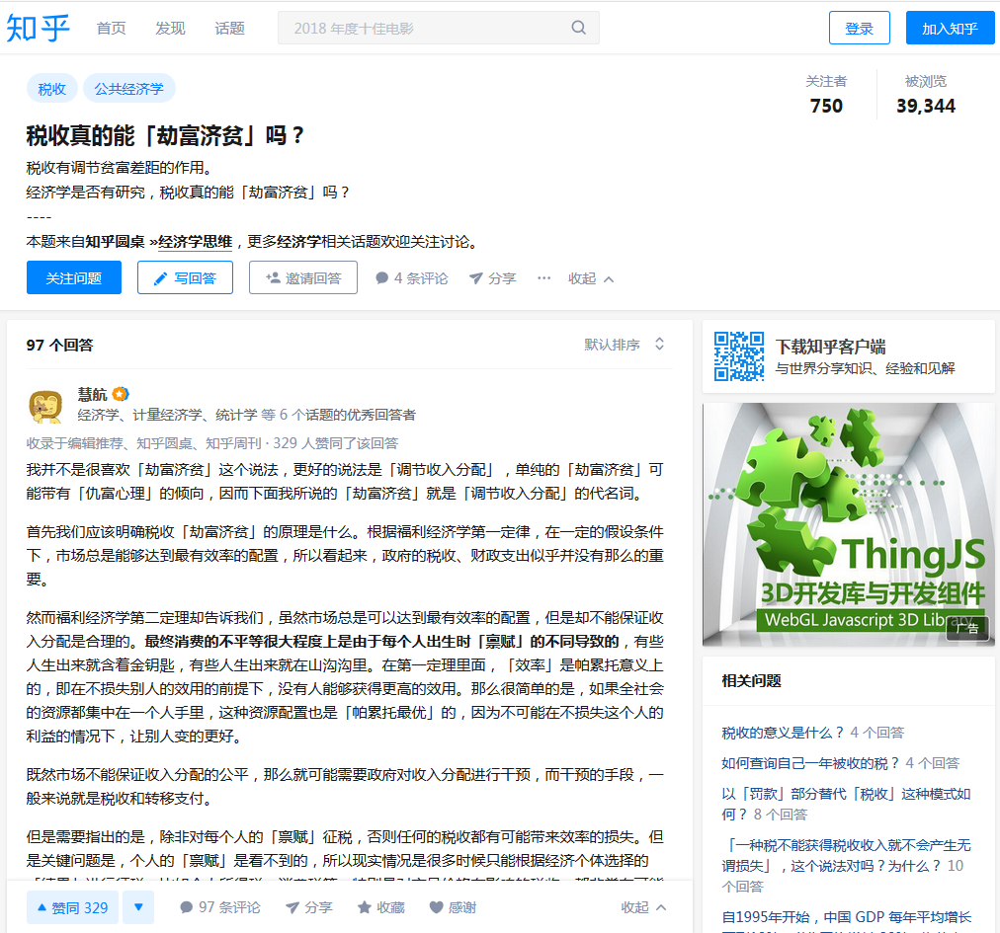

# \#F250税收真的能「劫富济贫」吗？

税收真的能「劫富济贫」吗？

就总体而言，知乎是一个 SB 弱智网站。

理工男聚集之处，水平处于"匠气"中游。你让他们谈一点机械，电子，天文

学知识，能惊得你目瞪口呆。

可一旦上升到"宗师"层次，则一无是处。

"匠气"不足奇。因为我们整个社会中游就是这个水平。

值得指出的是，"匠气"者，很多回答都是错误的。

真的到了宗师级别，则知乎目前绝大多数的"共识"和"结论"都是错误的。

大约 75%是错的，哪怕是纯科学。至少就我熟捻的领域是这样的。

今天无意中看到知乎一个帖子："税收真的能「劫富济贫」吗？"\[1\]

其中第一个回答:"慧航"的热门回帖，真心被恶心坏了。

一）福利学第一定律

"慧航"开篇明义地说：

"首先我们应该明确税收「劫富济贫」的原理是什么。根据福利经济学第一定

律，在一定的假设条件下，市场总是能够达到最有效率的配置，所以看起来，

政府的税收、财政支出似乎并没有那么的重要。"

光凭这段话，我们立即可以送上二个字："人渣"。

首先，不存在福利经济学。其次，不存在福利经济学第一定律。其三，你这个
定律是错误的。

税收不影响经济效率？你是猪么，你是 SB 么，你妈生你早产儿么。

TMD 要智商低到什么程度，才会以为"税收不影响经济"。

经济学的正确解释是什么呢。譬如这二天薛兆丰在北大讲"科斯定律"。百度

词条的通俗解释"无论初始条件如何，市场产出总是有效率的"。

这句话的意思是什么呢。假设一个 100 人的村庄，其中 99 人擅长农耕，只有 1

人是职业樵夫。

而整个村子里，只有一把斧头。

请问，这个村子的最终生产模式如何。答案是"99 人种地，樵夫去砍柴"。

无论这把斧子的初始产权在谁的手里。

无论斧子主人是张三李四王五郑六，他们必然会把斧子"借给"樵夫。而收取
租金。

所以总产出永远是"99 人种地，樵夫去砍柴"

而区别在哪里呢。假设这个村子的总产出是 1000 斤粮食\*99+500 斤柴。

则拥有斧子产权的那个农夫，能获得 1000 斤+150 斤柴。

其他农夫：1000 斤粮食

樵夫：350 斤柴

可见，科斯定律说的其实是"无论初始产权如何结构，总 GDP 不变"

但 GDP 生产的那些财富，变成了谁家的烧鸡肥肉牛排呢。就看产权走了。

即"总量不变，分配有变"。

因为经济学家都是悲天悯人的。我们关心的只是中国的总量 GDP，关心的只是

中华民族的繁荣富强伟大。

而真正"财富分配"在哪个家族手里，哪个权贵手里。其实我们是不关心的。

反正权贵也是中国人。

这才是科斯定理的精髓。

而 SB"慧航"的理解力呢，"匠人"们的水准和大师是远远不同的。理工男通

常情况只是社会渣一般的炮灰。

在渣滓低智商的理解力中，他理解成了"无论税收如何，GDP 总产出不变"。

注意，科斯定理讲的是："无论产权如何，GDP 总产出不变"。

SB 说的是："无论税收如何,GDP 产出不变"。他是错的，严重的错误。

税收结构变了，GDP 会削弱么。国家会懒惰腐败没落么，会的。

税收结果变了，中国会变成北朝鲜。穷得吃不上饭，穷到民不聊生么。会的。

如果一个村庄，99 个农民，一个樵夫，一把斧子。

但是上山砍柴的桥断了，要绕一个大圈子，GDP 总产出会降低么。会的。

如果路过悬崖，柴火每次要跌落-20%，GDP 会降低么。会的。

如果路上有一伙强盗，每次抢走货物-20%，GDP 会降低么。会的。

如果这伙强盗是 99 个村民假扮的，GDP 会降低么。还是会的。

这就是"环境变量"变化之后，导致 GDP 变化的例子。科斯定律讲的是"初始
产权不影响 GDP",而不是"环境变了，多一道悬崖不影响 GDP"。

有人或许对最后一条还有所疑虑。假如强盗是 99 个农夫假扮的呢。

GDP 还是会降低。因为人的"劳动欲望"不是无限刚性的。

如果我上山砍柴，每小时赚 200 元。那我可能愿意每天上山 10 小时。

可如果薪水将为 160 元，我或许每天上山 8 小时。剩下 2 小时宁愿享受"闲

暇"。

无论税率多高，工作热情不变，这样的人不存在。

人是可以选择闲暇的。哪怕在皮鞭下至少也可以选择脑力偷懒。

对生产者的任何抢劫，都会降低生产力。

说一句彻底的话，如果抢劫的税率达到了 100%，那就成了共产主义。这个时
候，全社会的 GDP 总产出不仅受损，而且会降到一个极可怕的低位，成为贫穷
落后的弱国。今天金三胖就是一个"个人所得税率 100%"的国家。

二）贫富分化

"慧航"说：

"福利经济学第二定理却告诉我们，虽然市场总是可以达到最有效率的配置，

但是却不能保证收入分配是合理的"。

你他妈的弱智啊，你妈生你早产儿啊。小学文凭陪睡换来的啊。象你这种 SB 怎

么从学校里面毕业的。

首先，不存在福利经济学。其次，不存在福利经济学第二定律。第三，他这条

话又说错了。

第一定律：正确解释"产权不影响 GDP 产出，而会影响收入分配"。

错误解释"分配不影响 GDP 产出"

第二定律：正确解释"市场导致收入分配合理"

错误解释"分配不影响 GDP 产出，市场导致收入不合理"

假如一个人生来就拥有万贯家财，一辈子吃利息就够了。

纯粹的市场经济，是会加剧，还是削弱这种趋势。

正确的回答，应该是削弱。市场才是最人道的。

SB 的回答，是加强。

假设一个村庄，99 个农夫，1 个樵夫，1 把斧头。

农夫张三拥有斧子，每天把斧头出借给樵夫。获得 0.3 人的收入。张家是村内

首富。

如果你受的是正统的经济学教育，真正的经济学教育，那么大师们会告诉你，
"初始财富不重要"，一点都不重要。

为什么，因为人类的财富增长得非常快。

假设最开始的时候，全村只有 1 把斧头，只有这一样固定资产。

可是随着时代发展，最终全村的财富会增长到 10000 倍。每一户家庭都拥有拖

拉机，割草机，稻谷机和冷藏仓库。

这时候，张家仍然比别人多拥有一把斧头。但是张三和李四的财富差异，已经

从 1：0

变成了 101:100

请问，这个时候张家和李家的财富差距，是扩大了还是缩小了。

从来没有任何研究认为市场经济扩大了贫富差距。

从未没有任何研究认为富者更富，贫者更贫。

从未没有任何研究认为富者更富，贫者更贫。

从未没有任何研究认为富者更富，贫者更贫。

重要的事情讲三遍。

市场经济的本身，是会使得"贫富差距"减少。使得 101:100，初始财富的差

异越来越不重要。

只有 SB，从小受马克思主义教育毒害，脑子里全是泥灰渣，根本不懂得独立思

考，Zombie 僵化宛如行尸走肉的理工男，才会相信什么教科书说的"富人更

富，贫者更贫"。

SB，哥哥能在这里回你贴。那是教你。是你几辈子也修不到的福气。

是你几辈子也修不到的福气，能有一个大师级的人物，来啪啪给你二个耳光，

一脚踹在地上，再踏断二根肋骨，告诉你你丫其实是个 SB。

"识迷途之未远，觉今是而昨非"。赶快跪下来磕二个响头认错才是应该。

SB，让你丫的还删哥哥评论。还什么"不善意回复"，滚你妈的大头蛋。

市场不需要"再分配"，市场本身就是最正义，最合理，最人道的。

只有政府教育，官方主导，毒教育，才会天天和你说"二次分配"。而恰恰是
"二次分配"，才是导致贫富分化，导致穷人跳楼，导致你丫没钱的最主要原 因。

听不懂了么。经济学是门大学问，好好找个明师学下去。

三）天诛

正确回答:"收入调节会影响 GDP，会削弱国力，会最终堕落象北朝鲜"。

正确回答："市场能带来最合理收入分配，政府调节反而导致贫富分化"。

给 SB 洗三观始终是最难的事。错误太多，欠账太多，要从小学语文重新教起。

实在是纠正不过来。

然后我们要讲第三层次的事情。"贫富分化"本身就是不值得追求的目标。

贫富分化是好事，贫富分化是天大的好事，贫富分化是我们追求的目标。

是不是觉得天塌下来了。一下子"九年义务制"教学都白读了。

我们从小的教科书，从来就没有教过你"贫富分化"。

我们的教科书，从一开始教你的就是"贫富分化是不好的"。

就好像"反革命"一样。我们的教科书，教你的是"反革命是不好的"。但从

来没让你思考过，这个词是不是贬义词。

你仔细想一想，教科书有跟你解释过贫富分化么。不，他从奴隶制一章开始，
直接就讲"于是奴隶主产生了贫富分化........."。

贫富分化一开始就打上标签是"不好的"。这是洗脑教育。

独立思考的人群，独立思考的知识分子，在任何一个社会，都是最稀缺的。

有没有人和你说过，贫富分化到底是不是好事。贫富分化究竟应该鼓励还是抑
制。更不要说"抛头颅，洒热血"去打击贫富分化了。

你真是当 50 年代共产主义好学生啊。

现在的欧洲，正在生衰老病。

你如果关心时政历史的话，目前欧洲最大的新闻是"难民潮"。难民潮背后，

则是西欧北欧的"圣母病"。

圣母病是一种病，癌症，绝症无治癌。短短的 50 年内，福利制度已经摧毁掉了

欧洲；

使得 OECD 遥遥领先的国力，在目前新崛起的势力面前优势无几。

欧洲白人曾经花 500 年建立起来的文明优势，被圣母子孙们 50 年内就败光了。

所谓的"圣母病"，就是"一个也不能少"。

对于每一个人，都要给他食物，医疗，住房，教育，养老保险，维持他最基本
的设施。没有人在街上饿死。

听起来很美妙？西欧一些国家，甚至真正做到了"没有贫富分化"。大企业

CEO 和低层蓝领收入相差不超过 3 倍。整个社会彻底扁平化。

可是结果呢，结果是灾难性的。

首先欧洲整体的衰弱，我们可以用"昏睡百年"形容。欧洲每一年的增长率都

不足 1%，基本几十年就在原地踏步。

更为恶劣的，是欧洲人口的钝化。

因为"福利制度"，所以底层人口就拼命地生。

如果你们关心学术的话，至少去拿二本《精子战争》《婴儿战争》看看。自然

界所有物种的竞争，无非都是血脉和遗传的竞争。

竞争有多种模式。粗略地可以分为"追求质量"和"追求数量"二种。前者如
德国人，后者如尼日利亚。

"福利社会"的结果，是使得"数量策略"获得了极大的优势。

如果政府可以掠夺勤劳"优质者"的收入，来补贴"低质量"人口。则低质多
量策略，无疑会获得极大的优势。

这就是最近的几十年，在欧洲美国的黑人，拉丁裔，伊斯兰人口急剧膨胀，膨
胀，膨胀，最终如癌细胞一样吞噬掉整个国家的例子。

当你看到一个黑人小孩饿死在街头，没有食物。不要去怜悯他，看着他死。

因为这本身是"一体二面"的事，他们拼命地生，每一代生 8 个。他们就必须

要死。

拼命地死，尽量地死，如果他们不死我们帮他死。

因为这样，才是符合天理，符合正义，符合男权社会。而不是"圣母逼"。

既行其事，必得其咎。

如果你不让黑人小孩饿死的话，下一代他们就是 64 人。再下一代就是 512 人。

折衷一点，"凡是领福利的，一律阉割"也行。

"贫富平均"本身就是一个不值得追求的目标。

真正正义的宗教是道教，老子说"天地不仁以万物为刍狗"，意思就是说事物
自有其规律。

不必去扭曲自然规律，而是要顺应规律。否则必遭天谴。

让富人多生。

让穷人饿死。

这才是天道。

（yevon\_ou\@163.com，2015 年 11 月 8 日晚）

\[1\]"税收真的能「劫富济贫」吗？"http://www.zhihu.com/question/36987616
