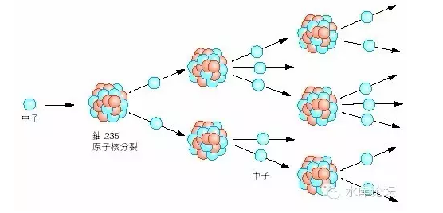
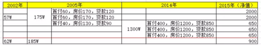

# 话说觉远大师，有一次从楞伽经夹缝中看到了一些小字。

 

 

一）链式反应

***\
***

***U+n→Ba+Kr+3n***

铀235+中子=随机碎片+三个中子

 

这个就是所谓的"链式反应"公式，1928年引起了极大的轰动。

这个公式的轰动之处，在于他的"输入物"和"输出物"是一样的。

 

好比我用硫酸和铜制造硫酸铜。在整个过程中，硫酸是不停消耗的。

等到硫酸耗尽了，化学反应也停止了。

 

而"链式反应"的神奇之处，在于他的输入物和输出物都是中子。

只要你输入一个中子，他就会变成2个，4个，8个，几百万个中子，最后变成大爆炸。

 

 

二）原子弹

 

从某些意义上讲，原子弹是全世界最简单的炸弹。

他既没有复杂的火控原理，也没有飞行部和弹头部。现在的航空导弹，简直就是一部计算机。

 

原子弹是全世界最简单的炸弹，他基本就是原材料。

你把二块U235，纯净的原材料铀，每一块大概汤碗这么大。直径不超过16.8cm

你将这二块铀按在一起，静等0.001秒。然后整个城市，以你为中心，就会彻底被汽化。

方圆30KM，由于太高的温度，会玻璃化。形成一个玻璃状的大圆坑。

方圆100KM，会有剧烈的冲击波。建筑会被摧毁。也就是苏州（92KM）还是不安全的，无锡就可以。

 

 

原子弹的原理至为简单。就是链式反应。

16.8cm被称为临界半径。他大概相当于中子飞过16.8cm，而不会撞上原子核的概率。

也就是说，如果一个铀"圆球"。他的半径超过了16.8cm，则球中发出的中子反应，它飞不出球壁，就会撞上产生第二次反应。

撞撞撞撞撞，1变2，2变4，4变8............于是就有了大爆炸。

 

 

所以原子弹的设计原理，就是二块纯净的铀235，分开放在弹头里。

当等弹头快落地，想要爆炸的时候，通过一个机械弹簧，把他们合在一起。

"砰"的就爆炸了。

 

而一些更大当量所谓"核极限"炸弹是怎样设计的呢。

那就是把4块，8块，乃至更多快，每一块不超过16.8cm的纯净铀原料。

通过精密的机械设施，同一时间撞在一起。

 

 

顺便说一句题外话，原子弹从理论上，是不可以"防守"的。

美国人曾经花费了极大的力气，构建"星球大战计划"。这个计划指的是深空防御，在国境外拦截并摧毁USSR的洲际导弹。

 

但是有另外一种，所谓"核手提箱"。则是完全无法守卫的。

因为原子弹和传统的火炮系统不同。他不需要一幢大楼这么大的设施，才能发射三式部开花弹。

 

原子弹只需要50kg的纯净铀，16.8cm大小的一块。装在手提箱里。

当二个手提箱，二块"分开小于，合并大于"的铀原料，碰在一起。他就爆炸了。

 

对于"核手提箱"的唯一防备方法，是外交斡旋，以及严格的边境审查。

但是边境是千疮百孔的。所以归根到底还是无法防的。

 

 

三）原子弹的制取

 

原子弹根本就应该归入"原材料初级工业"，听起来是不是有点很荒谬。

那么原子弹的瓶颈在哪里呢。

在于"纯净的大块铀"根本是一个造不起，极难获得的工业物资。

 

 

大铀矿一般是万吨数量级，听着很多，在工业上也就一点点。铀矿的分布，又是非常随机的，譬如中国主要在甘肃。许多小型国家，干脆就没有铀。

 

有了铀矿以后，难点在于铀235的提取。自然界的主流是U238，占99.27%，而真正有用的U235只有0.66%

但是铀235和铀238本是同位素，其化学性质完全类似。要分离铀，只能用物理学上的蛮办法。

 

二战时期，美国主要采取"气体扩散法"。

好比一根热管道泄漏蒸汽。因为铀235和铀238扩散速度有轻微不同。通过无数无数次扩散再扩散，提纯再提纯。最后才能获得一点点铀

 

而到了近代，主要采取了"超级离心机"。

它是指将铀矿加热到气化，然后放入超级超级强力离心机。让离心机高速旋转。U235会轻那么一点点。

 

 

这个方法有多贵呢。以一颗标准的核弹制取为例，他需要75000台最高档的离心机。每一台数十万美金。

这还仅仅是设备成本，你再想想75000台设备需要多少工人。要建多么大面积的营区厂房。还有安保成本，还有你想想电费......

 

所以原子弹虽然是一件没有技术含量的事。但是只有深度工业化的国家才造得起。因为纯净的原料U235难以获得。这基本就是倾国之力提炼那么几十公斤。

 

 

顺便说个故事，在2010年发生了著名的"伊朗离心机"事件。

当时的内贾德政府国际环境不用絮说。在此役声名赫赫的是"火焰病毒"。

 

当时，该病毒入侵伊朗核工厂网络，在短时间内将离心机的转速加快到8000转/分钟。这样转上几分钟，突然再下指令降到2转/分钟。

 

 

病毒的作用，由急速高转突然变成慢转。最后自然是导致了离心机的损坏。

不过损失也不太严重，在伊朗的约8000台离心机中。仅损坏了10台不到。

但是火焰病毒的结果，使得伊朗紧急叫停了离心机计划。并加入了病毒排查流程。为此耽搁了大量时间。

 

该病毒长达786K，由于低层硬件操作涉及到太多的防火墙。该病毒自带BIOS系统。直接以机器语言向SIEMENS高速离心机硬件端口进行读写。满满的数十万字全是代码。

事后找苦主，网络上并没有人出面认领。但一般认为只有Israel人才有如此技术水准。

 

 

四）激光萃取法

 

终奈何，技术的发展，是无法阻挡的。

 

时至21世纪之后，科学界又发现了"激光萃取法"。

其原理，是指将铀矿融化成液态。

然后用一束特定频率的激光，照射在液体表面。U235分子正好可以挣脱束缚，漂浮在空中。而U238不会。

 

当然，激光的频率和工作环境，你就不要问了。

这些都属于最高机密。哪怕如果您不幸知道了，您下半辈子就等着在四川山沟沟里过吧。再也别想出来了。

 

 

激光萃取法就"产量"而言，几乎是微不足道。完全是分子级别的。

但是这一行的重点是"效率"。

和75000台最高档最顶级的离心加速器相比，其费用几乎是微不足道的。而"能效比"更是千倍千万倍的上升。

 

我们相信，最晚到2100年，"激光萃取法"将会象3D打印一样普及。任何家庭在家里买个小米盒子，就可以操作。

到时候，"核手提箱"将可以在家庭作坊中制造。这才是天下大乱的日子。

 

 

五）炒楼业的链式反应

 

好了，你现在问我，这些玩意和炒楼有什么关系。

 

我们有如下图：

\
 这是示意的2002年同时买进的某小区A，B二套。

其中A套经过了"链式反应"，B套长期持有。

 

好了，你看一下二套的回报率相差多少倍。

你说炒家能不怨恨秀相么。

 

 

（yevon\_ou\@163.com，2016年4月13日）
