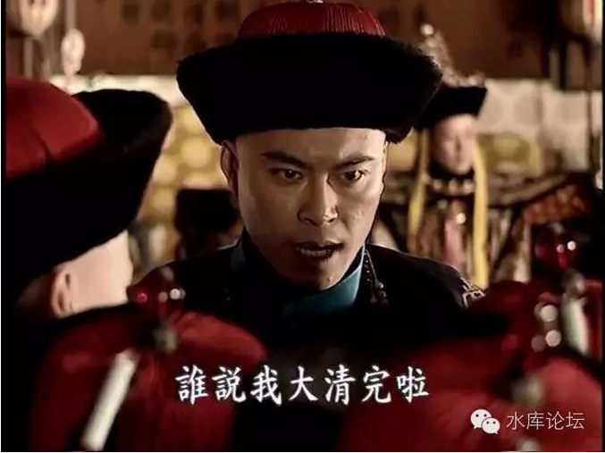
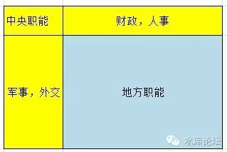
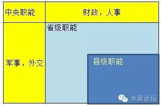

# 外藩的奥秘 \#F470

yevon\_ou [水库论坛](/) 2016-05-29

外藩的奥秘 ~\#F470~
===================

 

天下治安一统久矣，势必驯至分剖。然主威素重，风气未开，若非抽心一烂，则土崩瓦解之局不成。以烈度之，异日之祸必先根本颠仆，而后方州无主，人自为政，殆不出五十年矣。

 

 

这是1867年7月21日晚，曾国藩和幕僚赵烈文的一段对话。

这段对话非常非常有名。很多人都看过。译文可见链接。\[1\]

 

从政治学角度而言，整段话最重要的，是"主威素重"这四个字。

 

 

1861年曾国藩攻破南京，太平天国灭亡。

当时，就有人劝曾国藩。文正公兵势如此锐利，为何你不自己做皇帝。也不用再受慈禧太后的气。

 

曾国藩没有答应。

他从进南京城门的第一天起，就立即做了二件大事；

1）裁撤湘军。破京之日就是裁军之日

2）大建妓院。以秦淮河带动南京经济，以青楼业带动城市复苏。不出十年，"繁华依旧"。

 

 

曾国藩为什么不肯做反贼。关键就在于"主威素重"这四个字。

同治帝，仅仅是一个十岁小孩。"主威"当然谈不上。

"主威素重"的正确含义，是中央政权维持着对地方政权的绝对优势。

 

在政治学图谱上，"中央"和"地方"是绝对不同的二个含义。

"中央"绝对不是简单的三十一个省相加。

如图，黄色代表中央的权力。蓝色代表"地方"的权力。

三十一个省，全部的"军事，外交"权，全部抽离。集中到中央的手里。

 

 

一个南粤省委书记，名义上你掌管着超过印尼的GDP。

但事实情况是，"军事，外交"权力，是完全被抽离到中央。不归省委书记管的。

"财政，人事"权力，也有50%是被抽入中央。

你真实远远不如印尼总统权力大的。

 

 

更进一步，我们甚至还可以画出"国，省，县"的三级行政图。

一个县长，哪怕他能力再强。可是你职权全被部委抽光，你也是做不出什么伟绩的。

同样的道理，在"企业管理"中也是成立的。

你一家公司，不仅受"地区分公司"，亚太区CEO管辖。

同时你还要受总部"事业部"管辖。有各种产品经理线。

 

一个底层员工，无论你的能力多强。你既不能开发新产品，也不能颠覆新渠道。

你只能在公司授权范围内，维系维系老客户，规章流程螺丝钉。

"升模式"之前，你做不出成绩。

 

 

 

言归正传。这样的结构导致什么结果呢。

结果就是正常情况下，任何省委书记都无法挑战中央的权威。

你掌控下的GDP可能是全国的1/10，可是你能调度的资源只有中央1/100。

 

 

中国的大一统王朝，唐宋元明清。每一个王朝都持续数百年的时间。

对于大一统王朝来说，来自于内部的敌人，和来自外部的敌人一样危险。

 

唐朝最终灭亡，就是因为安史之乱打了八年。皇帝厌倦，士兵也没有战斗力。

等史朝义灭亡，还剩下河北三镇。

唐廷实在筋疲力尽。分封纳降维持了一个太平的局面。

 

这河北三镇，宛如病毒一般。逐渐逐渐地传染了他们身边的六镇。

然后再传染更外一圈。

更更外一圈。

最终唐王朝到处都是藩镇，到处都是军阀。唐亡于藩镇。

 

 

河北三镇，每一个都是一个省的规模。

只要有三个省没有削平，日积月累。整个唐王朝瓦解。

这种历史教训，大佬们都是看在眼里的。

 

所以，一个中央王朝想要维持，就必须维系"中央对地方的绝对优势"。

天子之威，要远高于督抚。

这不是一个数量级的。要横跨几十倍，上百倍，连军事反抗冒险的余地都不会有。

 

 

而"满清"后来是怎么灭亡的呢。

"太平天国"对于清廷是绝对致命的一击。清军的主力，是旗人率领的"江北大营""江南大营"。

 

可是这二处大营，在第一次反包围圈时就已经被踩平。破得干干净净。

女真人主力，如果和太平军打野战，那基本就是自杀。

 

面对这种情况，咸丰没有办法，只能允许各地征召"团练"。

由地方省政府，自己想办法，募兵成军。

 

 

洪秀全的"太平天国"，有一个极大的问题。

那就是他的首领"信基督教"。

 

你信也就信了。基督教没有带给你任何收益。相反的，洪秀全却把基督教的坏习惯，全部都学会了。

基督教是一神教。除了耶神之外再没有别的神。

 

所以太平军每到一地。必定把当地的孔庙焚毁。

把圣人颜回的像统统砸碎。

这就彻底得罪了曾国藩。

 

从政治上讲，大家都是汉人。可是洪秀全为何不能和曾文正言和呢。

因为你捣毁孔像，无事生非。断了统一战线的路。

 

 

说回正史。"太平天国"打了十年。最终曾国荃攻下雨花台，湘军勇踏进天王府。

在1861年时，"湘军"是全中国最能打的部队。最强大的武装力量。

 

以湖南一省之地，原本是动员不了，也供养不了这么大一支军队的。

"湘军"存粹是历史偶然机遇。因为战争而喂养大的怪兽。

 

当洪秀全被打倒。问题立刻随之而来："曾国藩会不会是下一个挑战者呢"。

中央政府还能不能对湖南省，保持绝对的压倒性优势呢。

于是就发生了篇首的那段对话。

 

 

事情的处理结果，曾国藩表现出了巨大的政治智慧。

同时，慈禧太后也是一个非常重要的角色。

 

慈禧在历史上，绝对是一个非常"异类"的太后。

不是教科书上写的"残暴",而是正史中的"仁慈"。

 

历朝历代君王，凡是皇帝，有一条不成文的规定"翻脸不认人"。

无论你对我有多少功勋，薄情寡意，一旦翻脸起来，宁可我负天下人。

 

而慈禧，偏偏是一个异类。

慈禧这个人，是认"人情账"的。

你对我有恩，我就一定要把恩报了。我才会动你。

任何帝王承诺的"我定好好待你"，慈禧全部都是当真的。而且会以女人的天真去执行。

 

这样的主子上哪找去！

你看慈禧朝后期，慈禧几乎获得了所有重臣大臣的一致交口称赞。老佛爷是真有威望，这个不是盖的。

 

 

曾国藩攻破南京之后，立刻进行裁军。

他把军队压缩在了一个清廷可以接受，但又不至于被忽视的尺寸。

同时，慈禧又是一个特例。没有发生"大清洗"。

 

这二件事的合力，造成了"湘军"作为一股政治力量。从此在晚清政坛扎根下去了。

如果你观察晚清史的话，基本上就是一部"各省"逐渐脱离中央掌控的过程。

 

太平天国的冲击，是第一轮。

此后，由于湘军的政治遗产，南方各省获得了很大的"自主权"。

老佛爷念人情，换来换去总保证你有六七个巡抚的二品。则南方永远掌握在"湘淮系"的手里。

同时，技术角度的进步，电报线和对英美列强的交涉，也对湘淮军的存活有利。

 

 

以上种种因素的发酵，就是1901年的"东南互保"。

东南互保发展到这一个地步，"主威素重"估计已经谈不上了。

有识之士都看懂了。

 

然后再过十年，"宣统帝"就像瓜熟蒂落一般的退位。

"辛亥革命"一声枪响，十八省纷纷宣布独立。这在过去是不可想象的事。

谁给了总督们这个权力，这个胆子，这个能力。

 

但其实这事是几十年积累的结果。

"主威素重"，随着军事/外交等权力，不再由中央抽取；

随着各省能拥有自己的军事/外交权力。"人事，财政"权力。

宣统最后一年，95%的税款被截留在地方。

 

"大一统王朝"走到这里，也就该咽气了。

 

 

2）以上我们写了2500字。或许可以学到一些知识，读到一些信息。

但其实这2500字都是白稿。都是废话。写二千五百字，是为了掩护下面的一千字：

 

-   平西王绝对没有机会!

 

几乎所有的民间小调，以及类似于《枪声》之类的地摊文学。都说当年平西王红歌已旺，气势已成。入常只是分分钟的事。

 

 

这样的说法，只能说明你彻底不懂政治，不懂历史，就是文盲。

平西王绝对没有机会。

从他的第一天开始，他就没有一丝一毫的机会。

 

完全不明白，平西王的幕僚，怎么会给他出这样一个馊主意的。

或许正说明他的不学无术，胸无点墨。同时身边的也都是狷狂之人，毛躁小人。

 

 

平西王做的是什么。他事实上[竖立了另外一种标准，来反逼中央]。

你说你唱红歌唱得很好，唱红歌唱得很旺。由此露了一把脸，希望给你升职提干。

 

错了，错了，全错了。

"升职提干"的标准是什么。组织部下发的守则中，KPI都写得清清楚楚。

-   包括GDP，招商引资，进出口，失业率，税收，环境污染，科教民生等等。

 

哪头猪告诉你，KPI中包含"唱红歌"了。

唱红歌根本就不是一个指标，中央从来就没有说过。

 

 

你说唱红歌，红歌是你"竖立"的标准。

这是大忌，大忌，大忌。

 

中国所有的事，归根到底就是一句话，"紧密团结在D中央周围"。

"标准"只能由中央制定。

只能由组织部指定。

只能由领袖制定。

否则你就是反\~中央。

 

 

你今天说"红歌唱得好可以升官"。那是你自说自话。

如果得到鼓励了。明天是不是邻省一个书记，"孤寡老人全部得到救济"应该升官。

后天是不是邻省一个书记"环境保护尽善尽美"，然后要求升官。

 

如果地方政府，诸省可以否定中央的"标准"。

自行提出自己的"各省标准"。

岂不是天下大乱。

 

 

当时竞争者，有不厚和大海二个人。

看似大海不骄不躁，慢吞吞地搞"腾笼换鸟"，科技创新。效果暂且不说。

全然没有不厚的"明星新锐"，一举一动都是新闻热点。

 

你以为大海傻呀。错，大海的政治智慧，远远超出不厚二百倍。

因为大海所做的一切，全部都是"D中央"框架之内。

 

你让我提高第三产业比重，我就提高第三产业比重。

你让我压缩过剩产能，我就压缩过剩产能。

事情办得好庸暂且不说。我是100%贴近D中央的工作路线的。标准版试卷。

 

 

什么叫"团结"。团结就是政治官员第一素质。

在任何一个组织内，忠诚永远是第一位的。忠诚比能力更宝贵。

"紧跟当中央"就是政治干部的第一评语。

帝君没说唱红歌，谁让你唱的！

 

 

你想入常，你必须按照中央给你的板子做。你不能随意刷副本。

"煽动民意，倒逼中央"，光这八个字，就是诛心的死罪。

 

 

不厚的路完全走偏了。如果一个人，能发明新"标准"，逼求入常的话。

则以后"入常"就会成为野心家的博弈场。会有一个又一个诸侯，提出各种新的玩法。

只能中央命令地方，不能地方命令中央。

否则就是亡D。

 

 

虽然历史不能重来，谁也无法预言未发生的事。

但是只要TG内部的"大佬们"没有死光。国字级的"政治家"们没有死光。

不厚一点机会也没有。

 

 

 

（不署名了，2016年5月29日子）

 

 

 

[\[1\]]《历史总是重演·赵文烈与曾国藩的对话》http://tieba.baidu.com/p/2566421995
