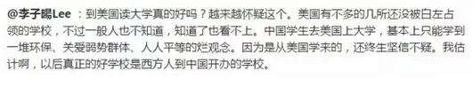
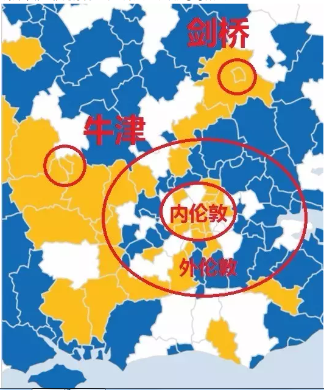

# 美国的大脑生病了（上）\#F490

原创： yevon\_ou [水库论坛](/) 2016-06-28

美国的大脑生病了（上） ~\#F490~

信仰的腐败，是最大的腐败

 

 

一）大脑

 

美国的宪法，制订于1787年。

 

在当时，美利坚合众国面临的最主要危险，是"暴君"。

美国国父们日夜焦虑的，是国家可能沦于一个独裁者手中，暴君权力最终不受控制，伤害到整个合众国。

 

所以美国立法的原则，是"三权分立"。

行政权，立法权，司法权，三足鼎立。权力层层牵制，互为掣肘。从而避免了欧亚大陆随处可见的"大独裁者"。

 

 

但是，时间是最厉害的腐蚀剂。美国宪法，是人类文明史上设计得最精巧，最先进的制度；

可是随着250年的演变。整座宪法大厦，也终于出现缝隙了。

 

目前最主要的一个现实威胁，"美国的大脑"生病了。

 

 

 

咦，美国不是"三权分立"么。什么时候又出来一个"大脑"，变成四权了呢。

因为很多人没有理解"政治"的本意。

 

当人类组成一个社会，首先第一步要解决的，是"如何运转"的问题。

或者说是"决策仲裁过程"。

或者说是"秩序"。

 

决定了社会底层秩序，宗教覆盖其上。然后才是法律，风俗，礼仪。

好比中国古代是"等级制"，则儒教覆盖其上。然后才是忠孝仁义。

此段内容，在《[论儒·法·禅宗·基督自治及道教的复兴](http://mp.weixin.qq.com/s?__biz=MzAxNTMxMTc0MA==&mid=211128132&idx=1&sn=ca586ee1556e5e43c9949624294e49e6&scene=21#wechat_redirect)》\#F10（多文本，需展开）中有详细解释。因此不再赘述。

 

 

思想是最有力量的武器。

因为思想界最终决定了"什么是对，什么是错"。

 

有一些高官类似于总统，总理，看似权力无限，威风八面。

但其实我们看"君王"的形势规则。君王也是遵循一套伦理规则的。

 

好比雍正。雍正算得上铁腕暴君了吧，但雍正的标准是"忠君"。

不忠不听话的你可以杀。但是忠君听话（至少表面做足），皇帝就不能杀。杀了人心不服。

 

同样道理，Barrack Obama被誉为全世界"最有权势"的人。

但是他的"权势"，必须符合美国主流价值观。

 

譬如说，奥巴马你可以抱起小女孩，小狗小猫，亲吻一阵。

但是如果你逮着一只哈士奇，暴打一顿，总统可能就有麻烦了............

 

 

而如何确立"价值观"，何对何错。

这件事归"思想界"管。

 

要不要动物保护主义。能不能吃狗肉。"玉林荔枝狗肉节"，总统能不能过去捧场，顺带再吃一盅。

这事归"思想界"管。

 

 

"学术界"：包括大学教授，律师，学生，宗教人士，意见领袖，还有各种各样的大嗓门。

 

"学术界"被誉为美国的大脑。

人文学科的各类大佬，经过充分的博弈，最终得出一个"科学的结论"。

总统其实并无选择。尤其是民选选票的总统，只能跟着"学术界"走。

 

 

除了学术界本身，"大脑"还有一个天然的盟友。

就是"美国的喉咙"，媒体界。

 

学术界+新闻界是一对黄金搭档。

从来都是学术界想出来的观点，背书认可。

然后新闻界觉得有意思，有价值，有意义。于是：

-   义愤填膺

-   一身正气

-   为国请命

自然会有新闻界的"正义"记者，去和政府死磕。

 

 

象"塘鹅暗杀令"，环境保护，女权平等，LGBT，这些事情其实全都是新闻人搞出来的。

没有"学术界"的认可，没有"媒体业"的大力支持。整个社会的"道德标准"根本不会被推进到今天这一步。

呃，我指的是，如此堕落。

 

 

 

二）言论自由

 

之前在《[什么是左翼，什么是右翼](http://mp.weixin.qq.com/s?__biz=MzAxNTMxMTc0MA==&mid=2651014622&idx=1&sn=7bf5c8ae5bb349fa570ba6068e8c7565&scene=21#wechat_redirect)》一文中，我们曾说到有一个词叫"进步主义"。

进步主义的意思，是时代在变，社会也需要变。

生产关系适应生产力。

 

但是，"如何适应"里面就有大文章了。

因为今年人类的生产力，超过之前任何一个年份。

目前的AI，互联网，生物科技，都是以前从来没有过的事情。

 

也就是你没有"经验"可以参考，也没有"教训"可以血泪。

在文明的长跑中，"先行者惩罚"是非常非常严重的。

 

 

在最前沿的情况下，"思想界"就面临一个问题。

思想界有可能犯错！

 

 

在一般的情况下，如果古典绅士那种"求实，内省，牺牲"精神并没有丧失沦丧。"思想界"是有可能自我修复的。

 

曾有一份调查，美国人和中国人的根本区别；

-   美国人最在乎：言论自由

-   中国人最在乎：秩序

 

中国人一般认为，只要秩序还在，那么再乱也乱不到哪去。

中央瓦解，才真是群雄纷起天下白骨了。

 

 

而美国人在乎的是"言论自由"。

言论自由保护的其实就是"大脑"。只要言论自由存在，"思想界"永远是可以自我修复的。

也就是说，言论自由=追求真理，二者是等义词。

 

 

 

三）言论自由的bug

 

在这个时候，美国的宪法《第一修正案》犯了一个致命的错误，有了bug。

 

美国宪法第一修正案及其附加条例：

-   第一修正案：保护言论自由、信仰自由、出版自由，以及集会的权利、抗议的权利和请愿的权利

-   附加条例：言论自由不包括政治言论、匿名言论、政治献金、淫秽色情，毁谤污蔑和校园言论等

 

 

中国人有一句老话叫做"画蛇添足"。说得真是再痛心疾首不过了。

如果我们要讨论言论自由，有一个著名的佯谬。

 

佯谬：言论自由是否也包括"反自由言论"。

好比西方的大学，自诩为最"言论自由"的地方。但是你到大学里，宣扬古拉格，宣扬集中营，宣扬秘密警察，宣扬新闻恐怖，宣扬把所有不听话的统统塞上断头台。

可以不可以？

 

在这个问题上，现代西方国家的回答是"No"，不允许。

十分遗憾，正确答案应该是"Yes",允许。

 

 

言论自由真正不能容许的，是"反逻辑"的言论。

如果言论自由是正确的，你为什么要怕辩论呢!

 

 

如果大学里你在倡导"言论自由"。旁边跑过来一个人，大谈"法西斯主义"，大谈让人民闭嘴。

正确的做法是什么。

正确的做法是放马过来，大家辩论啊！

 

我对"言论自由"有足够的信心，我相信它是上帝的律令，文明前进的标尺。

既然是真的，你为什么要怕辩论呢。

既然对方是错的，你为什么担心辩论场不能赢呢。

我坚信对方用任何理由都是驳不倒的。

 

 

"言论自由"真正不能容纳的，是"反逻辑"的言论。

任何一个人，如果没有讲道理讲逻辑的能力，那才是立刻把他踢出。SB不用浪费辩论时间，大家很忙的。

 

因此"共铲主义，法西斯主义，xx主义，xx主义"，这些都不应该是言论自由的"禁止名单"。

你搞这些东西，是画蛇添足，是做死。

 

 

报应是很快的。报应马上就来了。

西方人吃的第一个苦头，发现他们很快就不能说"Negro"，不仅仅Black不能说，而且"黑人成绩较差""黑人犯罪率"较高。这些事也不能说了。

 

因为据说黑人感觉"受到了侮辱"。

真是奇怪哉了。我这是阐述事实，难道哥白尼不发表日心说，太阳就绕地球转了？

 

 

而African打压"言论自由"的呢，他们用的就是"修正案"，感觉受到了"侮辱"。

黑人只不过是美国政坛上的第一波。紧接着，LGBT又来了。

LGBT后面，绿色恐怖主义又来了。猫狗慈爱教又来了。老墨来了，艾滋病来了。

最后，大杀器"穆斯林"来了。

 

 

猫狗慈爱教的"政治正确"呢。你不能说吃狗肉。

猫猫狗狗多可爱呀，你不能吃它。

如果你吃狗呢，"我感觉受了侮辱"。

 

LGBT呢，"我感觉受了侮辱"。

女权主义呢，"我感觉受了侮辱"。

穆斯林呢，"我们们们们感觉受了侮辱"。

 

 

这些全部都是滥用"宪法第一修正案例外权"的特例。

最终，就导致西方世界黑人，墨西哥人，LGBT，女权，绿色环保，猫狗党，艾滋病，残疾人，穆斯林。

哪一个都得罪不起，哪一个都是大爷。

 

这些事情合力的结果，就是"政治正确"。简称PC。

 

 

 

四）大脑病了

 

当充分的"言论自由"时，大脑是具有"自我修复"功能的。

但是当言论功能被阉割，大脑就不能"自我修复"。

 

换言之，目前大家都知道穆斯林，黑人泛滥，多生孩子领福利，是错的。是对国家的重大伤害。

可是"政治正确"，分分钟抄水表喝咖啡。欧美人士哆若寒蝉，不敢出声。

只有我们中国人，隔着太平洋，眼看灯塔国堕落。心急如焚。

"大脑病了"，是怎么一种症状呢。类似于传染病。

不知不觉，抬头一望，欧美的"政治正确"已经超过了30年。整整一代半人。而欧洲大陆，也彻底沦入了《论高等收入国家陷阱》~\#F480~

 

"大脑病了"，白左扎根于"学术界+媒体界"。

而白左们的传染源，也集中于这二个区域。

 

 

我们如果看世界政治图谱。

-   美国共和党的基本盘，是南部十五州。自从小布什时代开始，十五州就没有丢过。每次都是全取。十五个农业州"红脖"。

-   而民主党的基本盘，主要是纽约+加州。California是"深蓝"。从二战之后，一共只丢过一次。

这二个州虽然不大，可是人口众多。仅加州就54张选举人票。所以民主党的底仓还要更强一点。

 

 

而如果我们再细入看的话，共和党的支持者，主要都是"农民"，美国意义上的乡村歌手，小城镇人。基督教的保留人群。

而民主党的支持者，是"大城市"。所有外来移民聚集+高校人群+领福利人口，基本都聚集在人口200W以上的大城市中。

 

 

尤其是你深入行业内部，凡是大学教授，凡是媒体业，几乎一面倒95%以上是投票给民主党的。[\[1\]]

民主党所做的一些政策，类似于；

-   让世界充满爱

-   同性恋结婚

-   全民医疗保险

-   重税和穷人福利

-   环保和猫狗怜爱

-   女权

-   穆斯林

 

这些东西，根本就是"白左"搞出来的!

所以白左看民主党，真是贴心如意。希拉里桑德斯都被誉为"圣人"了。

 

 

而另一方面，我们看近期的英国脱欧。

先是一张大的"全国图"。

图中黄色代表"Stay"，蓝色代表"Leave"。

 

（苏格兰另述）

这张图，就更夸张得离谱了。我们看过去，就是一个又一个的"圈"。

纽卡，约克，利物浦，雷斯特，Cardiff，巴斯，伦敦.........

基本上，都市都是"Stay"

乡村都是"Leave"。

难道英国闹城乡分裂?

 

我们再看一张大伦敦区的细图。里面的信息更明显。

在"大伦敦区"，真正涂黄色的，是"内伦敦"，也就是移民最多，最"国际化"的地区。

另外则是"剑桥+牛津"。

 

这说明什么呢，说明：白左=大都市+学术圈

 

 

备注：苏格兰如微博。

五）树根

 

英国"脱欧"公投后，冬川豆写了大量的文章；

上帝保佑女王陛下。永远不要怀疑上帝的智慧和公义。

 

英格兰已经证明自己仍然活着，只是太多的花叶招来了太多的飞虫。知识分子负责输出的，就是这些飞虫。菲利普·拉金（PhilipLarkin）依恋的约克郡乡民才是英格兰，其余不过是浮云而已。

 

绿色代表文明的根部，不断补充和替代自然凋零的花和叶，在文明仍然有生命的时候，他们代表文明的未来。根部不死，花果总会复活。文明的死亡，总是根部的死亡。花果虽在，很快就会被死亡追上。朱利安时代的希腊文化、托勒密时代的埃及文化就是这样死亡的。只要愚夫愚妇相信圣母，波兰就永远不会灭亡。草根总会给人愚昧的印象，因为文明的种子是依靠广义宗教保护的。理性的精确度是随着时间延长而递减的，因此聪明人等价于自取灭亡者。聪明人不知道自己存在的目的，只是为沉默的根部做广告或挡镰刀。知识分子只能看到朝生暮死的花叶，越是强调实证就越是看不见真正重要的地方。

刘仲敬

2016年6月24日

 

 

 

目前美国的情况，基本上就是"亡国"的前兆。

 

如图，当6月12日美国史上最严重（穆斯林）枪击案发生后，有人贴出的三位候选人言论对比。截取日期是6月6日。

武德是第一品德。显然其中二位就是娘炮。而且还在舔穆斯林的x沟。

 

 

摆在美国面前，目前有二条路。

1）继续深化"白左"，福利社会穆斯林移民黑人淹没

2）全面改革

 

其中第一条道路，就是吸干"白人男性"的血。

因为穆斯林和黑人，都是不干活，不上班的。

 

他们来美国的生存策略，就是拼命地生孩子。然后伸手向政府要补贴。

另外做一些黑活，地下黑市，不用交钱的买卖。总体收入也不错。

 

而"穆斯林福利"的所有支出，全部都压在了"纳税人"身上。

美国的纳税人，主要就是白人。亲者痛，仇者快。

 

奥观海当政八年，有许多人怀疑他是"穆斯林"。打入敌人心脏内部的优秀同志。

因为Obama的政策实在很不合理。他基本就是吸白人的血，养活了黑人老墨和穆斯林。兄弟亲人般的友情。

而且肿瘤越来越大，简直快要癌扩散的趋势。

 

 

在目前的总统大选中，如果Hillary获胜，她已经旗帜鲜明地说清了"Forward"。

她要继承奥巴马的国策，深化福利，深化民族"平等"。

更可怕的是，希拉里竞选纲略，承诺"引进1500W新移民"。光这一条，已经把很多人吓尿了。

 

 

而Trump意味着"全面改革"。

美国的国父先贤，绝非庸类。

 

对于美国的Founder Father来说，他们肯定不会只设计一层"保护伞"的。

第一层的保护伞，是言论自由。只要言论自由还在，你能当着黑人的面骂Negro，美利坚就不会垮。

 

而如果免疫系统失灵，第一层防护网无效呢。

美国人还有第二层保护措施，"反智主义"。

 

美国几乎是所有的大国之中，"反智主义"最严重，草根情怀最深刻的国家。

你看美国的神话传说（好莱坞制作），给儿童们灌输的世界观。

 

几乎所有"拯救世界"的英雄，从来没有高学历戴眼镜的哈佛文气男。

"拯救世界"的，从来都是平民小胖子，既不聪明也不英俊。

 

中国如果你要当政治局委员，你至少先做省委书记。没有这个"资历"，你是绝无可能"孚众望"的。

而在美国大选中，克林顿最多只做过300W人口的小州州长。

Trump则根本没有从政经历。

 

 

美国人的"政治理念"中，对于领导人最大的观点是"德"。

也就是你的**三观要正**。信仰要正确。路线要正确。指路要正确。

至于干活的人，下面有得是人才。

 

美国国父们设计的第二条防线，就是"草根文化"。

如上图冬川豆，哪怕上层精英枝叶都烂了，但只要草根还在，他们还能选举Trump上去。

 

 

因为"上层精英"容易犯错误。他们太沉溺于"普世价值"人类大同的伟大事业。而丝毫不看自己的实力。

而"底层人士"很多都是农夫，面包师，快递清洁员。一天不上班就没有工资。

 

农夫每天睁开眼，就要去铲二个小时牛粪。他深刻地知道，不铲牛粪，牛粪就会堆得满地都是。

你跟他说"珍爱穆斯林"，珍爱你妈个鬼啊。要不赏你二勺牛粪吃吃。

 

越是底层，越是接近生存竞争。

越是接近生存竞争，越是容易理解"上帝律法"。

不劳作者不得食。

 

 

 

六）败局

 

如果你要说美国大选，谁会赢，不确定。

如果Hillary赢了，美国基本就算完了。直线下落的悬崖。

 

如果Trump赢，他依然面临沉疴的局面。积毒太深。

如图，这是美国的人口趋势。

即使不算"新加入"的穆斯林移民，Hispanic墨西哥人口，正在以每年1million的速度，跨入美国选坛。

 

即使Trump赢了这次，八年之后，他也是非输不可。

因为人口差距太大了。当人口变成了40%:60%以后，共和党再怎么努力，也是非输不可。

 

共和党要赢的唯一办法，只有在八年之内，"彻底废除民主制度"。

但你考虑一下现实基础，就知道这事概率无限接近于0.

 

而八年之后，"人口基数"进一步逆转。共和党就更加没有机会。

我想来想去，八年之内，Trump能推动Texas独立，就已算是为美国保留最后火苗了。

 

 

（未完待续）

 

 

（yevon\_ou\@163.com，2016年6月27日晚）

 

 

[\[1\]]这里要推荐一篇非常非常重要的著作《学术界的左倾已到了何种程度？》建议无论如何要看一下。http://weibo.com/p/1001603980139833768101
