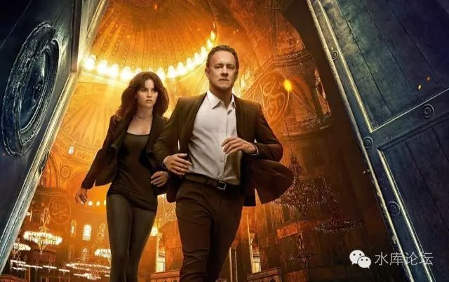
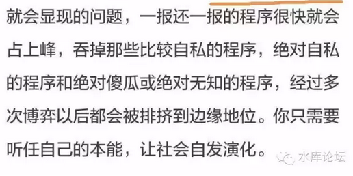
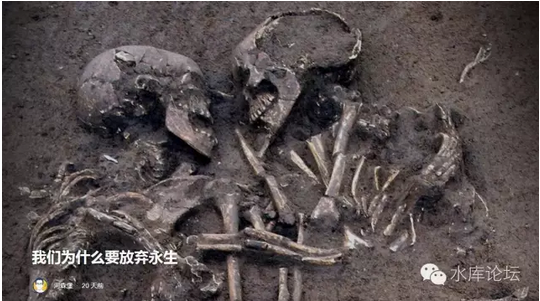
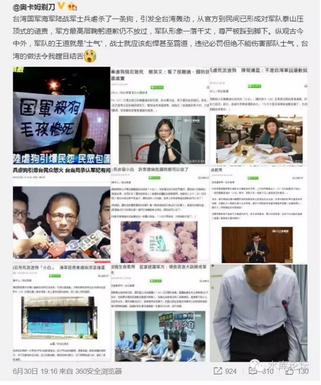
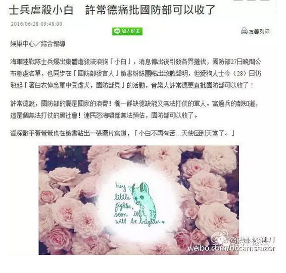
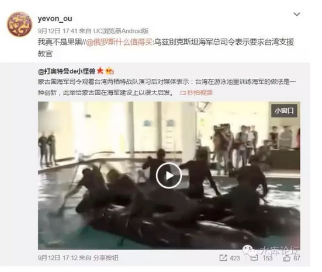
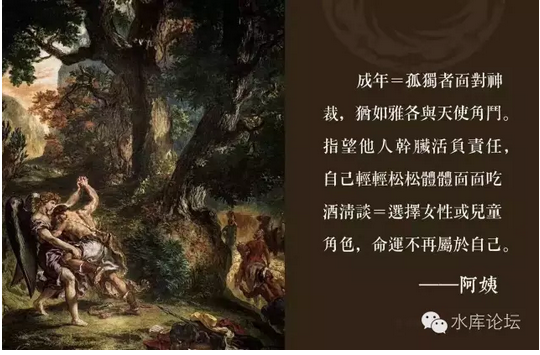

# 但丁密码 \#F700

原创： yevon\_ou [水库论坛](/) 2016-10-31

但丁密码 ~\#F700~

国之大事，唯祀与戎。[\[1\]]

 

 

一）人口素质

 

首先强调一下，我们是"马基雅弗利"主义者。

 

马基雅弗利主义的意思，是我们脑袋里没有那么多"条条框框"。凡事任何话题都是可以讨论的。

而绝对不会象"白左"一样，动辄叫你闭嘴。思想禁锢到哪里都是禁区，就差宗教火刑柱了。

砸到小猫小狗就不好了，哪怕砸坏花花草草也不环保呀。

 

 

马基雅弗利主义者相信，对于真理的探讨。应该是全方位自由的。

任何一个发散性的思想都应该被允许，任何一个教条都应该被怀疑。

我们从一个最简单的教条："活下去"开始。所谓第一公理。[\[2\]]

除此之外，再也没有任何公理。

 

 

在电影《但丁密码》中，他开篇明义，讲了；

-   "人类花了一万年，才达到10亿人口规模"。

-   再花了100年，达到20亿。

-   再花了50年，达到40亿（1970年）。

-   目前正冲击80亿

 

 

这样的思想，学术界称之为："极端环保主义"或者"环保恐怖主义"。[\[3\]]

其最极端的流派，视"在整个生态圈中，人类是唯一不被需要的"。

本末倒置。甚至主张说，为了保护地球，而把整个人类杀光。

这是闲话。岔过不提。

 

 

今天我们想说的，是另外一个概念。"人口质量"的概念。

人类花了一万年的时间，才达到了10亿人口。

而工业革命之后不到200年，已经有了近80亿人口。

有一件事情被忽略了。"工业革命之后的人口质量"。

 

 

在漫长的中古史中，人口周期性的灭绝。我们翻开《资治通鉴》，常常看见"岁大饥，人相食"。[\[4\]]

很多人注视着中古社会"周期性"的王朝崩溃。每当一个王朝开国之际，战乱刚刚停息，人口稀少，百废待兴。

而此后人人逐渐增加，进入中段盛世。

最后人口大量增加，超过土地的承载能力。同时300年的王朝顽疾也积弊丛生。最终导致"大一统"王朝覆灭。天下战乱，人口再死掉80%

 

甚至有人用"人口/土地"画出了一条红线。每当土地承载能力接近警戒线，则容易导致流民和天灾。叛乱二脚羊人命不值钱。

王位便坐得不稳。

 

 

这些都是学术界史观主流的观点。但今天我们想补充的是："人口素质"。

当东汉崩溃，三国代立。隋末崩溃，唐代代立。明末崩溃，清廷代立。

 

在"人口灭绝"的同时，他还有一个Marketing角度的视角。

也就是你"细分"。把人口分为几类。他并不是同比例灭绝的。

 

 

 

如在《[我对人口学的粗浅理解
\#85](http://mp.weixin.qq.com/s?__biz=MzAxNTMxMTc0MA==&mid=400672544&idx=1&sn=01f56167286a157dcdf2226c6a58573e&scene=21#wechat_redirect)》一文所写的。一旦战争来临，第一批死的是什么。

是老人，尤其是高龄老人。

 

80岁以上的老人，几乎没有任何逃难生存的机会。尤其是目前一些依赖医疗机构，本身靠呼吸机维持的老人。更是经不得任何风浪。

他们的死，无声无息。宛如寒风中熄灭的烛火。

 

 

第二批死的是什么，是圣母。

在和平的年代，砍掉一棵树都算是大事。香港坚尼地城为了13颗大树，环保组织不依不饶，硬是把地铁拖延了五年。

 

可是在战争时期呢，谁还在意一棵树！《冒牌大英雄》中，田行健地毯式轰炸，轰隆隆一排排炸过去。命都没有了，谁在意地上有多少大坑，谁在意死了花花草草小动物。

 

在平时，圣母婊们眼泪汪汪。残疾人，乞讨者，小猫小狗，智障，这些东西都需要尊重让路。

可是一旦到了战争年代，没有了铁血男人的保护，圣母自己都要被拉进军营"安拉阿胡阿克巴"。

 

 

第三批死的呢，是懦弱的人。

很多人都看过著名的"萨拉热窝围城记" [\[5\]]

又名《一个活过南斯拉夫内战的人所发表的动荡时期求生实录》[\[6\]]

可见，在末世"战乱"时期，生存竞争是极为残酷的。

 

 

我们的生活中，需要很多种品德。除了"温顺，文雅，听话"之外。

还有"武德，勇敢，狡诈，智慧，残忍，忍耐，背叛"。

伟大领袖斯大林在《君主论》的扉页上题词：

"软弱、懒惰与愚蠢是恶德。余者都是美德"[\[7\]]

 

 

遗憾的是，在和平年代，我们往往过度强调于前者。而忽略了后者。

在和平年代，什么样的孩子最容易受到老师表扬。

毫无疑问是"温顺，文雅，听话"。

你上课乖乖巧巧，不打不闹也不乱跑。老师提问，主动红领巾举手回答问题，蠢得象只鹌鹑。

这样的"三好学生"，老师反而更为喜欢。因为最好带。

 

 

这就形成了"逆向淘汰"。和平的时期越是长久，民众血液中的"武德"成分越少。

你永远都是最乖的孩子，越是听话乖顺的孩子越容易得到提拔。如果时长日久，和平长达二百年，三百年。则绵羊大泛滥。

"逆向淘汰"的结果，则全社会只剩下一群温文尔雅的人。长于繁殖力，而对血淋狮爪毫无抵抗力。

 

 

你如果说你的"天赋技能"是暗杀。最有天分的事情，是在夜间潜行。然后可以毫无声息地用一根铁丝，割破敌人的喉咙。

但是这样的"天赋技能"。在和平时期毫无用处呀。

 

你高数又不好，高考只能考个三本。最后进纺织工厂做技工，穷困潦倒一生。

若生逢在混乱年代，难保就是武藏杀手之星。

 

 

继"老年人，圣母"之后，战争的第三轮淘汰者，是"绵羊"怯懦者。

娘炮：和平时期，你有着社会秩序文明保护。而混乱时期，你就无情地被撕碎。

 

 

 

二）血洗的进化作用

 

在罗森的《风姿物语》中，他虚构了这样一个场景。

"远古战争中，大魔王被打伤并击退。人类进入了长达2000年的漫长和平。由三贤者守护"。

 

而在这2000年中，人类并没有享受到"自由自在，无忧无虑"的生活。

相反的，二千年中，战乱，硝烟，争斗，屠杀，阴谋，从来就没有停过。

人类时刻处于生存竞争，宛如活在地狱之中。

 

到最后溯源寻找黑手，人类所有的战乱，幕后[竟然是"三贤者"挑动的]。

为什么。

因为长期的和平，并不利于人类的安全。如果人类长期耽于和平，只会昏庸失去武德。

而等到下一次"大魔王苏醒"时，就会如绵羊肉鸡，一败涂地。

 

所以"三贤者"刻意保持着"一定烈度"的武力冲突。

使得人类世界在发展生产力的同时，也不断锻炼着武技。天阶地域高手层出不穷。有所磨炼，才能面对大魔王复苏。

 

 

 

如果你看我们现实中的人类世界，道理其实是一样的。

每当王朝末期，三国隋唐，人口丧失80%

但他其实不是平均等比例地失去人口的，而是"最强壮的人活了下来"。

 

虽然这个"最强壮的"定义仍有分歧，但是就总体概率论来说，那些"最勇敢，最聪明，最坚毅"的人活了下来。

哪怕你如"萨拉热窝围城记"，主人公并不是一个战士，而是一个平民。

 

但是清晰地判断周围环境，团结地聚拢家人，节俭地分配物资，创新地发掘黑市交易道路，勇敢地开枪，智慧地自制煤油灯。

这些全部都是能力。全部都是值得歌颂的能力。

 

"才"不仅仅是读书，不仅仅是高考。不仅仅是体制内。

当我们讨论王朝周期性的人口"增长\-\--屠杀灭绝\-\--增长\-\-\--屠杀灭绝"时。

其实人口仅仅是一条线，不可忽略还有另外一条主线。即人口质量的"增长\-\--增长\-\--增长\-\--增长"。

 

 

推荐知乎上一篇专栏，瘟疫，灾荒，屠杀，死亡《天启四骑士》的最后一篇。

《我们为什么要放弃永生》

https://zhuanlan.zhihu.com/p/22879351

 

三）草莓心

 

好了，你说了那么多。到底想表达什么意思呢。

答：你不觉得我们身边的社会中，SB太多了点么。

  

你见过看别人打3D《QUAKE》，吓得躲在桌子底下哭出声么。男的。

我见过。

 

 

因为14岁的时候上学被同学欺负，于是便开始不上学，之后「顺理成章」地成为了家里蹲一族。这一蹲，就是40年。

北村五郎出生于1961年，正好是日本经济快速上升期的开始。那一时期的失业人口相当少，所以他成为家里蹲一族，其实是很罕见的。从小在奶奶和姑妈的照顾下长大，而父母都忙于自己家族的事业，很少过问他的事情。

进入80年代后，日本的房地产业开始急剧升温。他的父母趁那时地价稍涨，便在东京涉谷买了一块5000平米的地皮。时至今日，从涉谷最繁华地段出发，步行不到10分钟，就可以看到他家的那块地：闹市中突然出现在眼前的一块被绿茵覆盖的庭院，院子里有两栋楼，分别供他和父母居住。

他24岁的时候，家里给他娶了个老婆。然而当妻子发现他是个家里蹲后，便坚决跟他离婚了。从此他自己住在那幢2层小楼里，足不出户。父母住在他的隔壁，只有每周去他的厨房里，给冰箱里堆满冷冻食品的时候，才能跟他聊上两句。

但是10年前，他母亲去世后，他的抑郁症表现突然被家人发现：一周一周地不起床，家里从不开灯，而且原本跟家人的对话，也减少到了几乎没有的程度。80多岁的父亲每周悄悄去探望他一次，在门口放上他最爱吃的鳗鱼饭就离开。直到5年前，他父亲实在无法独立生活，于是便住进了养老院。而他，也被送进了残疾人疗养院。

 

说起来简简单单，但这么一段话就几乎说完了他从14岁到54岁的人生轨迹\...

 

 

第二个人是匿名在2ch上的一个网友，比北村更厉害，他蹲了45年。

 

A先生毕业于早稻田大学。22岁那年，因为找工作不顺利，没能进入自己一直向往的外资律所，他选择了在家「充电」。然而除了最初的几个月，他还能认真地准备公务员考试以外，之后的日子他便陷入了一个循环：

 

先是有特别想看的电视节目，他最初选择录像之后等到第二天再看。但随即一想，反正时间都是自己支配，还不如看直播，于是干脆就把学习时间让出来，专心追剧追综艺。但是随着对电视节目越来越感兴趣，往往会想看同一时段的不同频道的节目，于是他便一边看一边录像。因为第二天要重看录像带，所以学习的时间也就越来越少。

 

慢慢地，他开始找到了每天必看的几个时间段的节目。最初是在学习之中作为休息，停下来看电视，但逐渐看电视的时间越来越多，学习的时间变得支离破碎。这样一来，他索性把一周中某一天的时间全拿来看电视，而安慰自己在之后学一整天，便可以补回进度。这样的「电视日」从每周两天，逐渐增加到每周五天------
只要电视有节目便会一直坐在电视前，每天18个小时。可想而知，这样的结果就是公务员考试必然落榜。

 

落榜之后的A先生，嘴上安慰自己要来年再战，但他却在看电视的过程中迷上了给综艺节目和杂志投稿。他让家里给他买来各种杂志，写各种段子和小故事投稿给这些栏目，之后便期待着被电视节目和杂志专题选中。一个月一个月地等待着，就这样，一转眼过了30年。

 

他从大约2000年起便开始上网，随后发现了在网络上有更加广阔的空间。他最为热衷的，就是在网上批判各种社会现象：女孩子援助交际他去骂，父母生下小孩不管他去骂，中国人在日本买东西他去骂，老人占用社会资源他去骂，他国抗议日本首相参拜靖国神社他去骂，日本生育率低他去骂，体育明星买豪车他去骂\...\....
基本论调就是「外国人滚出日本」「长此以往日本要完」「你们花的都是别人的钱」「哈哈哈哈这个SB」等等，并且自称「为了让日本回到黄金时代而努力的青年右翼」。

 

然而他气势汹汹来表达自己「政见」的这些事情，其实与他的现实生活毫无关系。甚至说，这些事情其实已经跟他的人生无关了。

 

2012年年初，他在网上开始写自己这四十几年的家里蹲经历。与他之前那种「旗帜鲜明」的网上言论不同，他经常会在网上写着写着东西，开始痛哭流涕。原因也很简单：他已经走到了人生的暮年，却一事无成，甚至连能留下美好回忆的经历都完全没有过。他一心一意地去给电视、杂志投稿，去时事新闻和娱乐版块评价事件，其实仅仅是希望在自己蜗居的这间房子之外，能够获得些许的存在感。

 

尽管几乎没有人回应他的那些评论，但只要能够看到有人跟他的看法基本一致，他也就似乎得到了安慰：「这些人其实都是会支持我的。」

 

然而人是无法永远活在这个虚拟的平静里的。他一生没有任何收入，养老保险全靠身为小学老师和公司职员的父母替他缴纳。15年前，接近80岁的双亲为了照顾已经50岁的他，没有选择住进养老院，而是在家里请了个护工。8年前父亲去世，如今母亲病危，65岁的他似乎根本看不到未来的方向：除了依靠养老保险以外，他只能将父母买下的这所房子卖掉，才能够维持他请护工照顾自己的养老准备。

 

而他也不准备住进养老院：在那里每个人都是在社会上工作了几十年退休才住进养老院的，自己想必跟这些人完全没有共同语言。而且习惯了衣来伸手饭来张口的生活的他，在现实中完全没有一个朋友。就这样孤独地老死，似乎是他唯一的结局。

 

所以他会痛哭流涕，因为之前几十年的生活，其实对他来说似乎只是一转眼的事情，却再也没有重来一遍的机会了。

 

 

俗话说，日本出宅男。有了"御宅族"，还有"食草男"。

如果到了台湾，则是"玻璃心"和"草莓心"。

 

说到这个玻璃心，哎哟我的妈呀，http://weibo.com/1820201245/DCF9t6vO5

 

据说台军对海军进行了全面的改革。最新的不伤害猫猫狗狗的做法，是在游泳池里训练。http://weibo.com/1853047530/E7WHthey0

同样道理，昔日的"日不落帝国"。目前已经改名叫了腐国。

病情更严重的，则是在大西洋另一侧。http://weibo.com/1853047530/EeJWgvrps

有时候我们会觉得很奇怪。

[为什么，为什么我们这个世界，变成这样了。]

 

原因非常简单，因为停止了正向淘汰。

 

 

 

四）长久的和平

 

各位，1945\~2015，在人类漫长的六千年文明史上，是极为罕见，极为罕见，极为罕见的一段日子。

 

在这一段约70年的岁月里。"人类没有大型的战争"。

如果算全人口中卷入战乱的国家，可能连1%的人口份额都没到。

这是远古，中古，近代，从来没有过的事。

 

 

"长久的和平"其背后，是美国这个"世界警察"。

美利坚这个怪胎。依Manifest Destiny而建立。昭昭天命，承担着上帝的愿想。

所以美国提供了"公共安全"，哪怕是亏本的义务警察服务。

 

 

在过去七十年，虽然左翼媒体一直抨击美国。甚至说局部冲突战争屠杀难免。

但是我们必须看到，"大国无战役"。

地球上前六大国家，相当于之后所有国家人口总和。而大国之间，1945年之后就再没有大仗。[\[8\]]

 

 

这就导致"长久的和平"。父辈祖辈们难以理解的和平。

长久的和平，带来很多好处。其一就是生产力和人口的增长。你翻开《枪炮、病菌与钢铁》，工业革命早在19世纪就已经萌芽。

可是"工业革命的普及"，却是1945年二战之后的事。

 

一直到我们的幼年，1980年代，中国政府孜孜以求的依然是"工业化，现代化"。依然担心的是工业产能的不足。

和今天十亿钢产量宛如隔世。

 

 

全球经济从1945年之后迅猛发展，虽然没有大规模的"发明"[\[9\]]。但是工业化普遍展开，从欧洲一隅渐渐覆盖到了亚洲四小龙，再到了中国。

同时，亚非拉受惠于医药，电力，自来水的普及。人口急剧增长。

 

目前非洲即将有第二个"人口一亿"的国家：埃塞俄比亚。

而非洲老大，石油国家尼日利亚已经有了1.9亿人口。甚至很多人认为，30年内尼日利亚的国力会超过英国。

如果没有外力干预，尼日利亚很可能统一全非洲。

 

 

"长久的和平"一个从来没有被人提起过的负作用。

则是"人口没有被筛选过"。

 

目前白左的"政治正确"，已经到了匪夷所思的地步。

那群蠢货"拿火腿肠喂狗"，喂得眼泪汪汪。而丝毫不顾及猪的感受。

 

 

白左们的态度是："每一条生命都是无价之宝"。

在欧美社会，只要你生下来。你就享有无穷无尽的福利，就享有肯定可以活下去的能力。

 

这导致的结果，是"繁殖质量"急剧恶化。

自然界自有因果。原本你看见极为残酷的"弱肉强食"，其实都是生命的必需。

你看见狼吃羊，狼吃兔子，兔子啃草皮。

但事实的真相是，如果没有狼。兔子就会把整篇草原荒漠化。反而造成生态大灾难。[\[10\]]

 

天地不仁以万物为刍狗。

同样道理，杀人难道就不是正义之必须么。

 

 

 

如果按照欧洲人传统标准，平均智商为100，而非洲人的平均数值是91。

中国人是108.

 

其背后的解释，在于中国很早就有了科举制。读书好的人有更大的几率占据社会资源。

考虑到正式科举，要到贞观年间"天下才士尽入我彀矣"，迄今不过1500年，约80代人的更替。

进化的速度，实在快得惊人！

 

 

 

在漫长的中古时代，"残忍，灭绝和屠杀"无所不在。

中国3000年历史，始终有约1/3的男性，是娶不上老婆的。

血统，从来都不是人均一个，而是集束化的。地主家生几个，长工家一个也没有。

 

地主家的丫鬟玩腻了，赏赐给长工，就已经算是莫大的恩典。

传下去的血脉，也不一定知道是谁的。

包括是你，你祖上也大概率是地主家生的。没什么可反情绪化亲。

 

 

大约98%的汉族人，起源于7000年前的三个男性。

BC4800、BC4500和BC3400的三位王，各自拥有众多的儿子，儿子再拥有众多的孙子。构成了今天13亿中国人的共同始祖。

"血脉源于一系"

 

汉族的血统极为纯正。在汉族向南方扩张的过程中，基本是把"九苗"杀光的。因此DNA中没有混血。

参考阅读：《汉族到底是一个独立的民族还是多民族融合而成的混血民族？》[\[11\]]

《科学证实中华文明有七千年历史》[\[12\]]

《我的祖先是如何从非洲蹭到中国来的？》[\[13\]]

 

 

"生存竞争"极为残酷。

 

在中国古代的几乎每一代人，都经历了异常残酷的"生存竞争"。

几乎在每一代人之间，都只有最坚强的人才可以活下来。

这才是"中华民族"优秀的原因。

 

 

 

但是21cn，我们目前的社会不是这样的。

营养，食物，医疗的极大丰富。尤其是和平，使得"生存门槛"被大大降低了。

 

当无穷无尽的内陆省份农民来到我们的大城市，我们可以清晰地看到，"书香门第"不复存在。

在大城市里面，也出现了各种稀奇古怪的事物。甚至完全违背进化论的物种。我们对此的唯一解释，是没有经过"生存竞争"的淘汰。包括但不限于；

 

-   LGBT

-   御宅族

-   圣母婊

-   草莓心，玻璃心

-   伪娘

-   药娘 [\[14\]]

-   秀色、冰恋、慕残 [\[15\]]

 

我们这个世界怎么了，到处只剩下娘炮，纯爷们哪去了！

 

\*
参考阅读：《今年的超女都决出20强了，打开一看这画风，我以为切错台了》[\[16\]]

 

 

 

五）变革的未来

 

好了，你究竟想表达什么。

我想说，"和平不会持续"。

 

 

目前的全球史，又走向了一个节点式的路径。

影响中排名第二的，是中国的工业化崛起。

影响历史第一的，仍然是美国的衰弱。

 

 

最近的20年，美国走向急剧的衰弱。从1980年"黄金时代"结束以后，美利坚就病危不断。

尤其是Barrack Obama八年，几乎是癌症上升，直落深渊。

 

 

若是将美利坚和欧洲，英国，日本等"猪队友"放在一起的话，则相对大家都渣，差别还不大。

但是你看看中国，看看印度的崛起，看看穆斯林的扩张。

拉美的经济总量，已经由USA的1/5，上升至1/3.

甚至一直衰的非洲，目前也出现了整合迹象。有可能会出几个现代化的非洲大国。更糟糕的，还是伊斯兰色的。

 

 

（美国的国力占全球19%，军费却占50%）

美利坚目前的军费，仍然占全球50%以上。拥有全球12艘重型航母中的12艘。

但是在"穷兵黩武"的背面，则是美国经济的败落。

 

自从比尔克林顿就任总统以来，在全球化趋势的推动下，美国政府的财政收入日趋窘迫。一方面，随着产业的全球化外迁，美国政府曾经的重要税源的公司税迅速锐减，根据美国国会预算局的报告，仅2003年，美国的公司税相比上年度就锐减了11.1%，到了2015年，曾经占据美国联邦税收总额近乎半壁江山的公司税收已经下跌到仅仅10%左右；另一方面，随着资本的全球流通，以及避税体系的完善，美国超级富豪的合法避税已经蔚然成风，这严重损害了美国政府的财收能力。

 

[（据美国税收政策中心（Tax Policy
Center）2016年公布的数据预计，美国前1%的富人平均个人收入在210万美元以上，他们交的个人所得税占到个人所得税税收总量的43.6%。美国前0.1%的富人只有115000户，他们的平均收入在940万美元以上，他们所交的个人所得税占个人所得税总量的20%以上。但随着避税体系的完善，来自富人的税务征收近十几年来正逐渐减少）]

 

在财收能力锐减的情况下，美国政府不得不依靠更多的类债性税收（如社会保障与医疗保险）来弥补财政亏空。根据美国财政部2015年8月的报告，美国的联邦政府的社保性税收已经从不足10%剧增到30%以上------但这无异于寅吃卯粮，同时也意味着随着财收的减少，美国的社保类征税将持续增加。\[17\]

 

 

这是"末期帝国"的典型特征。

先有人民，后有经济，再有军事。这个次序绝对不能乱。

 

最怕的就是内里已经腐朽，财源已经糜烂，却依然维持着庞大的常备军规模。

如果这支军队，不是用于"发财"的用途，不是对外掠夺。

那简直就是福寿膏晚期。

历史上的西班牙，拜占庭，奥斯曼，乃至于俄罗斯，都是死于这种死法。

从目前的情况看，哪怕中国不加紧军备竞赛。仅仅靠美利坚自身的腐朽滑落。

30年之内，"二战后和平体系"就会彻底崩塌。美国再也无力维持西太平洋的世界警察。

希拉里当选快的话，2040年就够了。

 

《三体》之中，有恒纪元和乱纪元的说法。如果历史不开玩笑，那我和你说，"恒纪元"快结束了。

我们无法预测未来；

但是按照任何一个标准，"二战后国际和平"体系都不可维持。

 

 

我并不赞同《但丁密码》中Zobrist的观点，道教徒要谦卑。

"神罚，清洗"这种事应该由神做。而不是由人做。人不可僭越为神。

 

但是我同意《但丁密码》的结论。从目前来说，1945\~2015长久的和平，在人类历史上是不存在的。

我们的城市人口，从来没有清洗过。那么天道恢恢，她总是要清洗的。

如果哪一天人口失去-50%，你不要惊讶。

天之道。在游泳池里训练海军，是不正常的。

娘炮和草莓心们，不灭绝才是不正常的。[\[18\]]

 

 

 

（yevon\_ou\@163.com，2016年10月31日午）

 

 

 

 

 

\[1\]水库上有《国之大事，唯祀与戎》这篇文章。不过和本篇关系不大。http://www.shuiku.net/forum.php?mod=viewthread&tid=9166

\[2\]马基雅弗利是需要"第一公理"的。因为你完全没有第一公理，你就成了虚无主义。

而活下去的原因，基于"人择定理"。

问：为什么要活下去。

答：傻孩子，否则的话，就没人问这个问题了。

\[3\]推荐阅读《译言网 \| 罗克韦尔之反环保主义者宣言》https://www.douban.com/group/topic/34303776/

\[4\] https://www.zhihu.com/question/22895828/answer/119509930

\[5\]《萨拉热窝围城记》http://weibo.com/p/1001603910899206348336?mod=zwenzhang

\[6\]《一个活过南斯拉夫内战的人所发表的动荡时期求生实录》https://www.douban.com/group/topic/76332522/

\[7\]《伊斯兰为什么干不过西方文明？》https://www.zhihu.com/question/51716222/answer/128568272

\[8\]唯一的例外是韩战。但《剑桥现代史》认为韩战时中国不算大国。

\[9\]能进入《文明》科技树的，估计只有航天，电视，互联网

\[10\]参考阅读《麦夸里岛和机智的人类》http://songshuhui.net/archives/82319/

\[11\]《汉族到底是一个独立的民族还是多民族融合而成的混血民族？》https://www.zhihu.com/question/34474844/answer/83310621

\[12\]《科学证实中华文明有七千年历史》http://mp.weixin.qq.com/s?\_\_biz=MzA5NDAxMzY0OQ==&mid=2651675918&idx=1&sn=5291a3bd1cbf37a1a556ad0689543317&scene=1&srcid=0923cPzGwaH7X1bgjV2YS6JG\#rd

\[13\]《我的祖先是如何从非洲蹭到中国来的？》http://mp.weixin.qq.com/s?\_\_biz=MzA3OTgzMzUzOA==&amp;mid=400118462&amp;idx=1&amp;sn=68fa4af7e687874305ca9a093bf4d699&amp;scene=1&amp;srcid=1026OEp9Ocq3vgbpavsEASgT\#rd

\[14\]《当一个药娘的伴侣是什么样的体验？》https://www.zhihu.com/question/33432428

\[15\] https://www.zhihu.com/question/29874865

\[16\]《今年的超女都决出20强了，打开一看这画风，我以为切错台了》http://news.gmw.cn/2016-07/23/content\_21101119.htm

\[17\]引自王陶陶《无论谁当选伟大的美国都将滑向衰亡》http://mp.weixin.qq.com/s?\_\_biz=MzAxNTc4MTAwMg==&mid=2651147586&idx=1&sn=fcf0d0329df098671754b4faeabd912f&chksm=800f30a7b778b9b1c4df86e6e32d8cd4a4aebd7c7d7491c377bca4aba414ba0372185df28407&scene=0\#rd

\[18\]最后一手MTV《纯爷们》，送给曾哥。http://v.qq.com/x/page/6LoU8He9pmK.html
