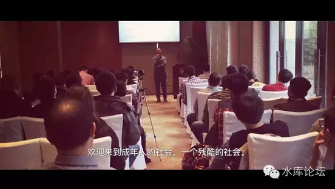

# 裸条没有外部性 \#F760

原创： yevon\_ou [水库论坛](/) 2016-12-07

 裸条没有外部性 ~\#F760~
==================================================================================================================

有产权的才能叫"外部性"。

没产权仅仅是屌丝的"不满"。

 

 

 

一）惠子

 

首先，我们要讲一个"伤心的"短故事。

 

话说山口百惠嫁给了三浦友和，隔壁的屌丝伤透了心。

 

 

对于屌丝来说，这简直和"天塌下来"没什么二样。

山口百惠她怎么可以嫁人呢。这么美丽，这么柔和，心中的女神形象，她怎么可以嫁人呢。

怎么可以以后就作为三浦友和一人的妻子，不可远观，不可亵玩。相夫教子闭门不出。

屌丝感觉受到了十万点的伤害。

 

 

如果按照今天糟糕的学术圈语境，立刻就会有人跳出来，指出这是一个"外部性"效应。

山口百惠和三浦友和的结婚，并不是他们二个人的事。也要考虑到社会的影响。也要考虑到千千万屌丝上街的抗议。女明星要流淌道德的血液。

 

（贵知很Low）按照知乎上的某些语义逻辑，接下来就要"禁止"二位的结婚。要考虑到社会的影响。并非所有你情我愿的事情，对社会的总"幸福度"贡献都是正值。

 

而事实情况呢，现代人都知道，这是一段笑谈。

山口百惠当然有权力嫁给三浦友和，孩子都生了好几个了。

 

 

 

那么，问题出在哪里呢。

问题出在于，对"外部性"的理解之上。

 

在知乎这种SB弱智的论坛上，文盲们对于"外部性"的理解，停留在"凡是使宝宝不开心了，就是不好的"。

山口百惠嫁给了三浦友和，反对。

山口百惠嫁给木村拓哉，反对。

山口百惠嫁给梁朝伟，反对。

山口百惠嫁给吴彦祖，反对。

反正只要山口百惠不是嫁给你肥屌丝张黑牛，统统都是反对。

 

你反对个鬼啊，你有资格反对么。

 

 

可是知乎体不是这样想的。更极端一点，假设对于张黑牛这个人来说"和山口百惠结婚"就是他人生的唯一目的，唯一快活。

那么对于张黑牛来说，目前我们所奉行的自由结婚"制度"，无疑是极端邪恶的。

 

你再换一种制度，他还是不满意。

你再换一种制度，他还是不满意。

除非你的制度，是把"山口百惠嫁给张黑牛"，否则他统统永远都不满意。

他天天挥舞着铁锹闹事。非要砸烂掉你们这万恶的旧社会。

 

最具有嘲讽意义的，在美国，台湾，他还是真的这样去做了。

于是，国之不国。

 

 

 

二）不满

 

屌丝们没能区分一个至关重要的问题。他们没有分清楚"不满"和"外部性"。

-   你可以对很多事情表示不满

-   但只有少数事你[有资格]阻止

 

我还对KFC甜筒丧心病狂涨到6.5元不满呢。

但难道我可以强制要求KFC恢复到2009年的2元么。

 

 

[知乎回帖：]

不考虑外部性么？首先这借债这件事对借债人以后会产生什么样的影响，对整个社会的价值趋向会产生什么样的影响。或者说在提出dT\>0的时候把足够多的因素内生化了么？仅仅就靠一个借债人借钱必然有正收益，否则不会去做这么一个强假设，就敢假定收益必然为正，就敢支撑与日常直观相反的论点，人是理性的么？[\[1\]]

 

 

在知乎上，"不满"和"外部性"这二个概念。其实是被混用了。

如"女大学生裸条"事件，屌丝知乎男纷纷表示了不满。

 

因为"廉价优质媳妇"供应被切断了。

知乎男梦寐以求的，是

-   媳妇读了一个体面的高学历

-   省吃俭用一分钱不用

-   冰清玉洁什么人也不碰

-   被粉刺青春痘屌丝一撩就中

-   任劳任怨做牛做马

-   吃饭不上桌子

 

而现在呢，"廉价女大学生"供应，事实上是被切断了。

知乎男就象是被夹了尾巴，跳起来了。

 

 

而半桶水SB文盲大学生引用的学术术语："外部性"。

你具有外部性么。你没有。

 

-   "外部性"得那女人是你童养媳。你5岁时就买断了她的人生。

-   人家女大学生和你非亲非故，你就没有产权。

-   女大学生做啥事，关你屁事

 

 

当然，我知道整件事让知乎男很不爽。

不爽你就表达出来。就好像我看见KFC甜筒卖6.5元我也很不爽。

 

但"不满"仅仅代表一种情绪。它没有任何权力。

我们的社会，从来不以"完事如意"完美化作为追求的目标。你注定遇见很多事不如意，残缺，损耗。

 

但这是正常的。

因为我们生活在成年人的世界。

 

 

 

三）成年人的世界

 

欢迎来到成年人的世界

一个残酷的世界

成年人的世界，注定是一个不完美、残酷、充满遗憾的世界。

任何一个入世的，务实的人才。他看待世界的本质，一定是黑暗如铁的。

 

我们知道，不可能让所有人满意。

在奥派的世界观里，反对派的"不满"是永恒存在的。

 

 

最简单的一个道理，山口百惠应该嫁给谁。

无论嫁给谁，都会大大地伤粉丝的心。

难保会有几个狂热死忠粉无心工作，甚至割脉。

GDP下降。

 

 

那么，奥派的世界观，是否应该对此类"不满"让步，并试图创建更完美的世界呢。

不可能的。

我们清楚的知道，山口百惠总是要嫁人的。你不能让人家做一辈子老姑娘。

 

 

奥派给出的答案，是山口百惠可以"自由"地选择。选择权归于女性自身。

她想嫁给谁，就可以嫁给谁。

这样，依然会使得千千万粉丝伤心。

但这已经是最好的方法了。

我们并不能做到每个人都满意的社会。我们只能说"最好的办法"。

 

 

 

目前台湾社会有一种弊病。称之为妈宝也好，称之为中二病也好。

总之就是温室里的花朵，心智尚未成熟。

 

譬如在一些台湾年轻人的眼里，政治制度应该是"完美无缺"的。不应该有任何违背拂逆他们意愿的事情。

他们是完美主义者。人生的意念中不存在遗憾，妥协，残缺。

而一旦政府无法满足他们的所有愿望，他们就不断地抗议，冲击，闹事。以为民主可以带来幸福。

 

 

政府是不可能满足你所有的愿望的。

就好比山口百惠只有一个，嫁给谁好呢。

如果"不是嫁给你"，你就要闹。那么这事注定没完没了。

 

同样道理，企业的提干，竞赛的金牌，社会的衣食无忧，名额总是有限的。

如果你达不到"钱多事少离家近，数钱数到手抽筋"的境界你就不停地闹。

则整个社会注定是无法消停的。

 

 

这样一股思想，我们称之为"民粹主义"。

民粹目前已经毁掉了美国，台湾。

即将毁灭香港。

 

 

 

四）不满和外部性

 

王健林前年买了一幢西班牙古建筑。

这是一幢充满了艺术风情的古物。如果秉承着"修旧如旧"的原则，把他修缮维护成现代风格。再加以全面的内部高科技改造。

则该建筑，可以改建成一座高档酒店。并带动数千个就业岗位。

 

原业主欣然将物业出售。高达十几亿的交易。

全部的产权过户，法律流程也已完成。

可是，最终这个单子却没有做成。

因为这个时候，有一个西班牙人。他不是任何利益相关者，也不是原始继承人。他纯粹就是一个路人甲。

 

他就是觉得"很惋惜"。一幢西班牙风情的历史文化建筑，落到了中国人手里。而且还要用于充满了铜臭味的商业性用途。

他认为该类改建交易业务充满了"外部性"，并试图让政府阻止。

 

于是他组织了一个请愿团体。他们没有任何产权。

他们仅仅是西班牙人，秉承着"保护西班牙文化"的旗号。

最终搜集了七万多个签名。

 

凭靠着这七万多个签名，他成功地使得"西班牙政府"暂停了酒店的改建建设。

王老板十几个亿的投资投入，刹时就悬在半空中。[\[2\]]

就因为一个完全不相干的人跳出来，声称"外部性"。

 

 

这件事情的结果呢，是万达集团彻底完全退出西班牙市场。

而且王老板发出公告，"一个没有法治文明，野蛮人的国家不要去投资"。

西班牙完蛋了，你们等着劣等民族吧。

 

我们有坚实的理由相信，以后不会再有人想去西班牙投资了。

因为这政策风险飙得无限高。随便哪个"利益不相干"的人，跳出来高举"外部性"的大旗，就可以伤害到十几亿产权人的真金白银。

 

什么几千个就业岗位。什么服务和税收。都统统见鬼去吧。

西班牙就不配有文明。让你们保护历史建筑去。再过几十年，西班牙还要更加贫穷破乱不堪。

目前西班牙年轻人失业率50%

 

 

 

今天我们借着知乎"裸条"事件，并牵涉出"不满"和"外部性"的概念。

是因为这件事十分之重要。

文明与兴旺，腐朽与衰败。关键看信仰的不同，对正义的追求。

 

 

"不满"就是"不满"，不满绝对不是外部性。

你有权力不满。回家拿卷纸巾自己解决哭去。

 

但是"不满"，绝对不可以影响干涉到产权人的行为。

绝对不可以伤害自由。

绝对不可以因为你看不惯，抱怨"世风日下"。而强制要求别人穿黑布蒙面纱。

 

对于"民粹主义"，要坚决打压。一定要把这股歪风刹住。

往后退后一步，就是悬崖和无底深渊。

 

女大学生卖淫也好，裸照也好。

PX项目也好，磁悬浮也好。

 

如果科学家证明PX对3KM之外的居民无害，就应该坚决建设。

无论多少个居民上街，他们没有申述权。就应该坚决镇压。

软弱才是市长的耻辱。

 

 

 

如果你还不明白"不满"和"外部性"的区别。不明白基于"产权"的重要性。

不明白这是一场生与死的搏斗，退后一步就是文明的深渊万劫不复。

那么，我给你看一条今天的热点微博。

最完美地解释了：什么叫"不满"，什么叫"外部性"。\[3\]

http://weibo.com/3732568017/EkKtvqCCj

（yevon\_ou\@163.com，2016年12月6日晚）

 

 

 

 

\[1\]《如何看待人文经济学会这篇关于"裸条"的文章？》https://www.zhihu.com/question/53288315/answer/134507591

[\[2\]]《王健林否认"被像狗一样对待"，但他在西班牙确实遇到了麻烦》http://stock.sohu.com/20160128/n436227889.shtml

《王健林决定放弃西班牙项目当地官员称努力挽留》http://news.sohu.com/20160208/n437116611.shtml

[\[3\]] [http://weibo.com/3732568017/EkKtvqCCj]
