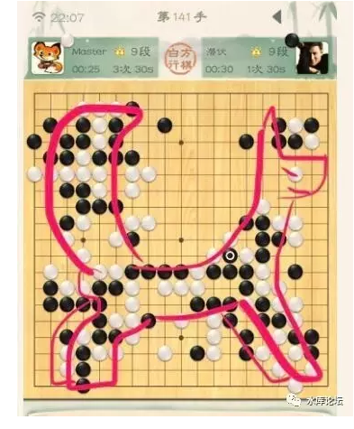

# Master不是人工智能 \#F830

原创： yevon\_ou [水库论坛](/) 2017-01-05

 Master不是人工智能 ~\#F830~
=======================================================================================================================

人工智能第一定律：

 

任何能用算法描述的，人类最终都会输给电脑。

 

\-\-\-\-\--yevon\_ou

 

 

 

> 一）阿西莫夫三定律

 

这二天最热的新闻，大概是机器人Master大屠人类诸围棋高手了。

2016.12.29一名神秘的账号Master登录弈城网，狂胜59场，屠尽人类一切围棋九段。

 

有人悲观地说，李世石2016.03胜了一局，可能是人类"最后一次"战胜棋脑了。

1月4日，Google公开宣布，Master就是AlphaGo 2.0

 
想必，各大舆论媒体，关于AI的报导又会铺天盖地。

舆论媒体小编，兴致勃勃地至少灌几百篇"AI时代"的注水文。

股票市场大涨，谷歌和其他AI概念股，会有不错的涨幅。

我们想说的是，"以上全错"。

 

 

为了讲清楚这个概念，我们先要从"人工智能之父"Assimov说起。

阿西莫夫是"科幻小说"作家。不是科学家。

他在1950年代提出了著名的"机器人三定律"，并影响了整整一代人。

 

> 1)     机器人不得伤害人，也不得见人受到伤害而袖手旁观。
>
> 2)     机器人应服从人的一切命令，但不得违反第一定律。
>
> 3)     机器人应保护自身的安全，但不得违反第一、第二定律。

 

 

就好比我们都是听"王菲演唱会"长大的。今天统治西方的那群人，主流工程师，主流科技精英，也都是看《阿西莫夫科幻小说》长大的。

 

阿西莫夫提出了"机器人三定律"，当时仅仅1950年。二极管还没有取代晶体管。可以说整个计算机工业都不存在。

而"机器人三定律"，宛如思想钢印一样，从此刻在了整整一代西方人的脑海里。被誉为"人工智能的圣经"。以及AI的发展方向。

 

在阿西莫夫的历年著作中，他多次"自设场景"，挑战"机器人三定律"。

而最终的结果，总是逻辑获得胜利。故事大团圆。

"机器人三定律"经历了重重挑战。最终仍然屹立不倒。

 

 

我们要说的是：

 

机器人三定律是彻头彻尾错误的。

是大毒草和神经病。

误导了整个西方的科技发展方向。

 

 

 

> 二）机器人第一定律

 

阿西莫夫"机器人三定律"根本毫无道理。[毫无可操作性。毫无逻辑性]。

 

 

什么叫"不得伤害人类"。不得伤害人类这个定语，即使连人类自身，也分辨不清。

我给你开一道处方药，有一定的副作用。但是药效也属于概率50%的治愈可能。

请问，这是不是"伤害人类"。该不该让你喝药，该不该强迫他人喝药。

 

关于"伤害人类"这个判断，实在太复杂，太缺乏"可操作性"。

西方人在这里跌入一个大坑。

他们太注重于人工智能的["道德伦理性"，一开始就是从哲学的角度考虑AI]，最终步子太大几十年一无所成。

 

 

 

真正的定律是什么，真正的定律应该是：

 

机器人第一定律：凡是能用算法描述的，人类最终都会输给电脑。

 

\-\-\-\-\--yevon\_ou

 

 

如果你不幸是文科生，或者年龄超过50岁。则你可能不了解"算法"二个字的涵义。

"算法"是计算机业内术语。指你整个的解决方法，一整套解题思路。

 

 

基础科学已经证明，CPU一切指令，可以分解为三类：

-   顺序

-   分叉（IF......THEN......）

-   循环（WHILE......WEND......）

 

所谓"算法"指的是，把一个现实中的问题，分解成计算机可以识别的"顺序，分叉，循环"指令。

 

 

 

解决同一件事，有很多种方法。譬如"排序"。就有插值排序法，快速排序法，交换排序法等等。

算法的优劣，一般有二种评价方法；

 

-   时间复杂性，O（n）,随着样本N的增大，所要消耗的时间成比例增长。

-   空间复杂性，S（n）,随着样本N的增大，所需要的计算机内存比例增长。

 

 

如果你关心这方面的知识，可以买一些计算机科学的入门书。十分粗浅。

高二水平就可以了。

 

 

 

> 三）算法

 

1997年，IBM公司的"深蓝"计算机。正式击败世界棋王：加里·卡斯帕罗夫。

当时，这件事也是引起了轰动。

几乎是吹得没边了。滥竽充数心灵鸡汤都出版了许多本。

 

而如果你"踏踏实实"，仔细研究一下这件事的话。

"深蓝"的源代码一共有多少。

 

答案是，一共才2000行字左右。

按照一个程序员一天写10行。一个20人的腾讯团队，十天就可以写完。

 

 

 

因为"深蓝"的算法简单之至。他其实是"穷举算法"。

也就是说，"深蓝"本身，对整个国际象棋世界一无所知。

 

他就是"穷举"。就是内存大。

当每一步国际象棋，十六枚棋子若是有50个分岔的话。

则我就50\^10，十次方。

我就仗着内存大。和你蛮算。

 

 

其中，"国王"的定价是1000，皇后9，车5，马和象3，小兵1。

每一个分叉算法中，取"棋力差"最悬殊的。

棋力相等的。选"控制格"最多的。

 

所以，"深蓝"虽然被吹得神乎其神。

但其实他的"算法"是非常简单的。非常单薄的。

甚至说，我国际象棋只要改了一个规则，你整个的算法就要重写的。

 

 

 

同样道理，"Master"是怎么回事呢。

"国际象棋"被屠掉以后。中日韩的围棋选手，还心存侥幸。

 

 

"围棋"的生存优势，是围棋的棋盘特别大。有19\*19=361格。

因此每一步下棋，就有361\^10，N次方的变化。

这对于计算机是一笔巨大的负担。

要达到"深蓝"级的彻底穷举，需要多得多的云计算，服务器并联。

 

可是在AlphaGo的对阵中，他改进了算法。

增加了"价值网络"的算法。也就是对整条分叉树进行预判，如果觉得亏子，直接就不展开了。

象虚竹这样"置之于死地而后生"的情况，就不会发生了。

 

 

 

AlphaGo的算法，要比"深蓝"复杂一点。

肯定不止2000行。估计在5000\~10000行之间。

 

Still，在IT史上，10000行的代码算一个大工程么。

根本算不上。

微软的WindowsNT有2000 0000行代码。

 

 

 

> 四）算法理解

 

任何一个能够用算法描述的事情，人类最终必将输给电脑。

 

 

前二天我在京东买了一个"人工智能"的神器。只花了9.5元。

他彻底秒掉了99.9999999%的人类。堪称AI界的绝对里程碑。

 

人类进化了几万年的文明，曾经一度养活了几万人，几十万人的会计"书算"业。

在这个神器面前溃不成军，一败涂地。

 

 

 

我想说的是，各位目前对AI的成就和分析，偏离了一个基本的常识。

 

-   你不能基于人类的视角，评论一项AI突破是否伟大。

-   你应该基于"算法"的视角。评论一项AI突破是否伟大。

 

AlphaGo击败围棋，虽然在人类史上喧嚣一时。

可是就算法而言，却幼稚初级。不值一提。

可能还比不上《Starcraft》《文明》中的电脑智慧。

（下一项科技突破，或许是图像识别。或者全视频人脸识别。）

 

 

 

这个9.5元的计算器。站在人类的角度，无疑是极其伟大。

穿越回17世纪的话，再怎么看都是神器。

 

可是站在AI史上的话，计算器其实是最简单的东西。

全部内容二行代码就行了。

 

再难一点，是"五子棋"。可能要200行代码。

再难一点，是"国际象棋"。2000行代码。

再难一点，是"围棋"。5000行代码

 

 

再难一点，估计是"自动驾驶"。目前据说已经写了200 0000行代码。

因为"自动驾驶"的本身算法并不难。

 

学过开车的人都知道，"驾驶"真是很简单的技巧。

无非就是左转，右转，刹车。

中等智商就能开车。

 

 

而谷歌和百度的"无人驾驶"之所以迟迟不能发布成品。

主要是Exceptional。

中文翻译为"例外"。

 

 

譬如说，你开车开到一半。前面冲出一只野猫怎么办。

按照标准流程，高速公路应该是干净的。突然有几个土坑怎么办。

天上掉下来一个冰箱怎么办。

 

 

现代的航空业，"自动飞行"已经到了极其先进"久经考验"的地步。

几乎所有的航空公司，都号称"自动飞行"可以帮你飞二万英里。只有"起飞/降落"的时候还需要人力辅助。

 

可是航空公司毫无办法，机长的工资为310元/小时，副机长150元/小时。

你飞一条国际航线，12个小时，机长的工资就是4000元。

 

 

 

驾驶员如此之昂贵，号称超过"同等体重黄金"。

那航空公司为什么不取消驾驶员，完全使用"自动飞行"。

 

因为还是不能避免Exceptional。

假设如电影《Sully》萨利机长一样，一起飞就被鸟撞穿了双翼。接下来应该如何危机处理。

航空公司赔不起呀！

 

 

 

我们看"自动驾驶""自动飞行"。

其和"棋类游戏"的区别在于，他们是在一个Open的环境中运行的。

 

对于Open的环境，Exceptional就无穷无尽。

超出程序所知，超出电脑所知的区域无穷无尽。"自动驾驶"的AI惴惴不安，美国的律师如此厉害；

谷歌公司赔不起啊。

 

 

 

> 五）结语

 

所有能够用算法描述的事情，人类最终必将输给电脑。

 

 

这条才是《机器人第一定律》。

我们人类必须很清楚地认识到了这一点。

 

在人类和机器人的"大较量"之中，关键看"算法"。

只要能用算法描述，必输。

关键就看一件件件纷纷扰扰的事，怎样被天才程序员归纳成算法。

 

 

 

有了算法，该领域人类就一定会失败。时间早晚。

算法越精妙，算法越逻辑。则超越的时间越早。

 

好比AlphaGo，使用了"穷举+预判"算法，而不是深蓝简单粗暴的"穷举"算法。

时间复杂度，空间复杂度，大大缩减。节约CPU资源。

因此把"击败围棋"的时间提早了十几年。

 

 

但是，迄今为止，人类对于"算法"的研究，还处于十分初级的阶段。

仅限于部分"封闭的，简单估值"的棋类游戏。

仍然是2000行，20000行代码。而不是2亿行，20亿行.........

 

 

这离真实的，纷纷攘攘的现实世界，还有无穷无尽的距离。

象《终结者3》这样的独立机器人，在有生之年或许都不会出现。

 

按照业内一般的划分，目前的AI人工智能，仅仅处于"细胞级"。

下一个世代，下一个30年，拼尽全力或许希望可以达到"昆虫级"。

那些热炒AI，夸大AI的资本炒作，恐怕要失望了。

 

 

而至于人工智能的"终极成就"呢。

终极成就则是，AI可以自己判断解决问题。自己写出"算法"。

到了那一天，人类就真的没戏了。

 

 

 

（yevon\_ou\@163.com，2016年1月5日早）

  

\* 别问我\#F820在哪里，这不是还没写么。打游戏。
