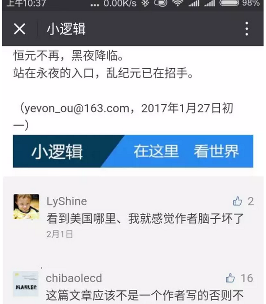
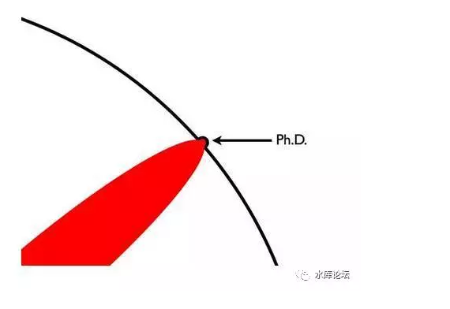
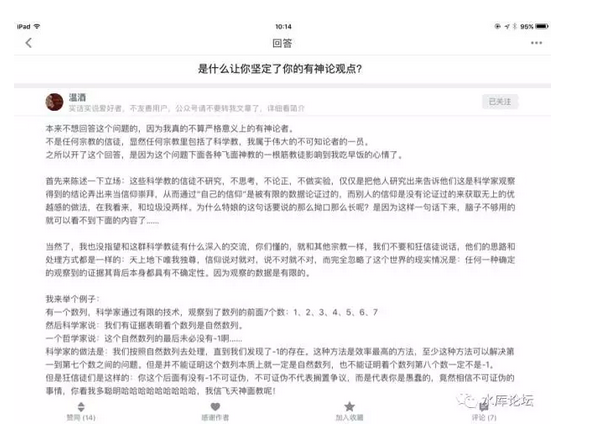

# 于虚空中开辟圣堂

 

 

一）有神

 

今天早上看到一个帖子，十分有趣。不妨拿来一说。

https://www.zhihu.com/question/47443659/answer/145103685

 

 

"道可道，非桓道"

呃，哥哥可是虔信的道教徒呢。

 

 

 

二）浅信者

 

从道义上讲，对世界的认知，大致可以分为几个层次。

 

Lv1：什么是认知？

俺们都是草履虫，三叶虫，单细胞生物。

连大脑都没进化出呢。你和我说呀，什么是认知。

 

譬如说，前天晚上花了一个时辰看《垫底辣妹》。

里面的日本小姑娘，连东南西北啥意思都不知道。

让她画日本地图，画了一个鸡蛋。

凡是在网上被哥哥骂"草履虫"的，归入这一个级别。

 

 

Lv2：浅信者

脑容量极其有限。只能接受标语口号式的道理。

思想钢印，缺乏拓展能力。

 

 

前二天写的《恒纪元与乱纪元》，怕喝咖啡，就没群发。也不可以留言。

但是有别的网站发了，看到读者留言。

 

对于某些三线小粉红而言，"诋毁美国"并污蔑美国快要完了，美国被穆斯林和"政治正确"玩死；

对于她们来说，这是不可想象的言论和事。

她们的思想"三观"，还停留在80年代。父母们吓破胆跪舔的洋人。

 

 

 

在传统意义上，内地三线小县城。当地人的"三观"是这样的：好好读书，出国留洋读个大学。

在USA申请奖学金，然后打工刷盘子，争取早日拿到绿卡。

"留学，出国，绿卡"被誉为人生三大成就。

 

 

错了，错了，大错特错，不是这样的。

"美国时代"早在80年代就已经结束了。城里人早不兴了。

可能90年代初早期留学还划算。但是1999年及之后，中国工业化开始，去美国的人悔得肠子都清了。

你拼死拼活也赚不到\$1m美金，还不如紧握京沪一套老房子。

 

在三里屯，老外早就退化成了White Trash。

在新天地，老外根本勾搭不到对象。找个洋女婿，在25年前是荣耀。在今天，丈母娘就要冷冰冰地问"吃低保伐"。[\[1\]]

 

 

而那些"三线小城市"小粉红，是不知道这些的。

如果你混一些比较Low的网站，例如知乎，天涯，豆瓣。

你会发现，在整个社团上"人的思维"转变是极其缓慢的。

 

群众运动，趋势的转变是极其缓慢的。

启动也慢，刹车也很慢。

 

 

 

世界可能早已经天翻地覆。事移时异。

可是她们的三观"套路"，还停留在二十年前。

 

1980年代，沿海北京上海的人都在忙出国。

2015年代，出国早就不热了。而内地小三线县城的人还在学样。

 

1979年恢复高考，凡是能上大学的，都成了国家干部。

2000年以后，国家不包分配了。"大学生"含金量急剧降低。扩招之后，更是地位等同于民工。

可是底层人士，他们的"反应"是极为迟钝的。迄今为止，他们仍然在倾家荡产地投资教育。甚至买天价学区房，以为进了名牌小学就有未来。

 

 

 

扯得远了，回归正题。作为"浅信者"她们的特点是什么呢。

特点就是脑容量[极其低下]，只有64K。只能记得住一些口号式的简单判断法。

 

你让它们学"逻辑辩证法"。

既可以这样，也可能那样。在坚信科学实验的同时也要心怀怀疑地探索真理，在笃信房价泡沫的同时也要看清微观上的宏观调控促进大涨作用。

对不起............您这话实在太长了，理解不了。

 

 

 

对于我们目前这个社会而言，"绿教"侵袭西北。计划经济侵袭东北。

而"基督教"的势力也很可观，席卷河南河北安徽。号称60000000会员。

全球第一基督教大国是中国。基督教的基本盘，是"农寡老妇"。农村孤寡老年妇女。

 

你有时候会惊异地发现，"信教"的人特别虔诚。而且特别有宗教优越感。所谓的"红卫乒"，全部都是低脑容量者。

[因为他们脑子不好使，才会傻得信菩萨]。

关于这一段，已经有《从一碗回汉拉面说起》\#F600，不再赘述。

 

 

 

三）科学教

 

Lv3：科学教

我对自然科学，数理化定律，怀着99.9999%信任。

但也不妨碍我怀有0.0001%的怀疑感。如果有新的实验，推翻现有物理定律的话。

 

 

受过高等教育，高素质的人才，属于第三档"科学素养"。

所谓科学的精神，思辨，务实，求是。

是18世纪的科学启蒙，导致了21世纪现代文明。

我们所吃的面包，牛奶，电视机，火车飞机，无不依赖科学昌盛。

 

 

科学最最被人诟病，质疑的，其实是一句话："你代表最终真理么"。

 

好比说，18世纪医生最主要的手段，是"放血疗法"。

当时认为，人的身体主要由体液，血，粘液，黑胆汁和黄胆汁组成。分别对应空气，水，土和火。

如果"火气太旺"，就要放掉一些血。病人就会好。

 

后来研究证明，"放血疗法"毫无任何事实依据。但在当时，却是科学主流。

乔治·华盛顿死于放血疗法。

 

 

又比如说，"吃维生素补营养"几乎成了我们从小到大的信仰。

没事买二瓶维生素嚼着玩，反正也不贵。

一直到昨天，这仍然是"主流科学"，是显学。

 

可是随着更多的科学研究，上周利维坦转了一篇《破灭的维生素神话》[\[2\]]

其中说，多吃维生素对身体没有任何好处。

甚至会加速新陈代谢，使得你更快老化。

 

 

 

令人尴尬的是，这样的"乌龙"事件，在科学的历史上还真不少。

远的如牛顿力学被爱因斯坦取代，近的譬如说"空腔发动机"眼看又是一场革命。

正因为科学家们闹了太多次的乌龙。因此有人质疑："我们要不要当你的小白鼠"。

 

例如说，目前社会上对"转基因"的质疑。

转基因的黄金大米，从任何一切科学论文逻辑推理，它都是好的。绝对没有任何问题。

 

可民众就是不信。

民众怀疑的是："科学史上乌龙事件太多了"。

哪怕连科学家，科学家自己也是不信的。至少1000年以后你回头来看，按那时科技水平，今天我们所做的一切99.999%是愚蠢的。

 

 

 

另外一种对策，则是"厌倦"了的民众，懒人直接跳到了尽头。

世界上为什么会有宗教，会有邪教，会有原教旨主义者。

他们直接声称，已经获得了"终极真理"。

 

 

你科学不是号称在"否定之否定之否定"中匍匐前行么。

人类每一次的科技跨越，都是对中世纪知识的颠覆。都是对已知文明世界的一点点突破。

 

《画个圈圈告诉你本科、硕士、博士的区别》[\[3\]]

 

但是宗教领袖嘲笑这样的勤恳踏实。

他们宣称，不需要中间的步骤，直接就带你去到"最高境界"终极真理。

方法，自然是"神启"。

 

拿本书作为"启示录"。昨夜睡觉时神灵告诉我的。

你直接照做就行。反正科学家改来改去，改到最后一定和我的一样。

 

 

你以为这些骗术仅限于基教，绿教神棍么。哈哈哈，看看中国佛教界新倡出的话：

当科学家千辛万苦爬到山顶时，发现佛陀已经在那里等他2500年了。

 
再重复一下，凡是信教的，都是低脑容量人士。

 

 

 

四）科学的反击

 

那么，针对宗教的质疑，科学是怎样反击的。

-   "科学教徒"是如何成为主流的。

-   转基因，如何进入千家万户。

-   科学无法说服神棍，但科学依然是国际正道。为什么。

 

（世界宗教信仰人数排名）

Atheism（科学）相对于其他宗教的一个压倒性优势。

在于科学独有的：务实

 

 

你的父母爱人，生了重病，你心急如焚。

在这个时候，求神拜佛，求菩萨拜湿婆，有用么。没有用。

唯一有用的，是赶紧送医院。

 

你的国家缺衣少食，贫弱不堪。你想要吃饱喝足，超市货物堆积如山。

求神拜佛有用么。

没用。得靠工厂生产，卡车运输，计算机管理。

 

哪怕一些嘴上冠冕堂皇的"宗教领袖"。你问他们，神灵显灵么。他们心里清楚明镜得很。

 

 

讲一个真实的笑话。

1969年wenge时期，协和医院的老教授们，都作为"反动学术权威"关在牛棚里。

可是有一天，突然被人逮起来。换身衣服，赶紧去看诊。

 

为啥呢，首长病了！

你看，别看平时"xxx万岁"喊得欢。赤脚医生横行，专家住牛棚。

可是一旦首长生病了，该找谁救命。

首长们清楚得很呢。

 

 

回到我们第一页的主题。

 

在温酒先生的这一个回复中，他举了1234567这个例子。

下一个数字，会不会是8.

不确定，但大概率是8.

 

 

这就是"科学"的精神。

好比一辆火车在开，已经开了七个小时。下一小时，火车是会继续开，还是会"飞到天上"。

 

怀疑论者说："不确定，凡事皆有可能"。

但是"科学教"们会说，"极大概率，继续向前开"。

 

 

这就是科学的意义。

科学不是终极正确，不保证100%火车继续运行。难保破开虚空，跳进来一个修真者。

但科学保证99.99999%可能性。反正我坐到现在，次次准点，修真者一个也没见。

 

信奉科学，使得这个世界可以运转。

 

 

 

五）哲学的精神

 

好了，我们终于来到Lv4了。

 

在进入Lv4之前，我们先要休息一下。调整一下深呼吸。

看一段短文，调节节奏，准备待会的冲击。

 

Lv4：哲学的态度

四阶讲的是什么，当然是招牌评语：以上全错

 

嗯，以上全错。

包括Lv3科学教，全错。错得离谱。

 

那些受高等教育，有着严格的"科学素养"，甚至可以被称之为"科学家"的人群。

在我们眼里，也和茕茕虫孓没什么二样。

 

 

 

我们再回忆一下。"科学教"的立论基础，科学针对于野生宗教的优势是什么：科学带来财富。

 

Q：科学带来财富

A：富你麻痹

Q：人类需要生存

A：存你麻痹

Q：讨论问题，需要客观

A：观你麻痹

Q：咦，你这人怎么不讲逻辑

A：逻你麻痹

Q：做人做事，总得需要一些共同的基础。话才能说得下去嘛。

A：基你麻痹

双方就共同关心的话题进行了深入交谈。

 

 

 

"科学"教的第一段基础，因为科学，才有了我们这个物质世界。才有了彩电冰箱，俺中午才能吃大排面。没有煤炭俺连猪肉都吃不起。

 

可是，在一个"哲学家"的眼里。第一句话就是不对的。

大排面，你确定我们不是生存在一个Matrix之类"虚拟"的空间之中么。

你确定我们感官的一切，不是靠代码幻化出来的么。

 

 

当我们以前上中学时，课堂里教授的是"唯物主义"观。

老师得意洋洋地说，"唯心和唯物是不用争议的。最简单一个问题：没有大脑，你拿什么思考呢"。

 

俺不屑地白眼翻翻。

这彻底反映了马克思主义者的无知，无耻，无脑。

哪头猪告诉你，思考一定要经过大脑的。难道我们不可能生活在一个Matrix里面，一切都是编出来骗你的。

 

 

象这种"我们生活的世界，是不是一个真实的世界"。

"现实是3D的，还是2D的"[\[4\]]

"量子平行世界存在么"。

"宏观宇宙和介米世界是宏对称么"[\[5\]]

 

\[注4\]：人类目前的宏观尺度，假设在1米的数量级。

而"测不准原理"的普朗克常数，是10\^-32

根据测不准原理，R和1/R是等价的。

 

也就是说，到了极极极小尺度，10\^-64的时候。

在这么微观小的尺度里，能量，时间，又会恢复到宏观力学的大小。

星际舰，战列舰，一样可以建造。

 

人类对于"细分粒子"的探索是有极限的。

极限就是10\^-32数量级。（目前大约到了10\^-16，夸克级）

再进一步细分的话，核子就不是"越切越小"，而是越切越大了。

每一次切割为2，粒子的重量反而会大一倍。

 

好了，现在问题来了。

我们的人类，究竟是生活在1米的宏观世界。

还是生活在10\^-64的极微观世界内呢。

 

 

这一系列的问题，都是拥有"科学素养"的高中生们，永远都不会接触的问题。

以你大脑的条条框框，你是很难理解"时空"的本质的。

 

当你把一切都颠覆。

一切既有概念，全部都不是思想之牢笼。真实之世界，无比幻想。

您就进入了哲学的范畴。

 

 

所谓哲学，就是"立论"的基础都没有的。

连世界都未必存在，谈何世界观。

 

 

有了这第一个"脑洞"理解，后面的Q&A顺势读下去。就好懂得多了。

Q：人类需要生存

A：存你麻痹

 

"人类需要生存"这句话难道就一定对了么。

为什么人类不该追求速死。

 

难保你是被困在一个"无限循环"的游戏当中。不停地转世投胎。

一定要通过一个某种"特殊"的死亡方法，你才可以脱困而出。

离开Matrix，醒来[现实]生活中神级文明的一个高贵的外星人。

 

 

你不要小看这棵"追求毁灭"长歪掉的哲学树。

在人类历史上，它形成了一个庞大的体系。即"暗黑系"。

 

 

 

Q：讨论问题，需要客观

A：观你麻痹

Q：咦，你这人怎么不讲逻辑

A：逻你麻痹

 

更深一点层次的"怀疑论"，则是干脆连"逻辑"都怀疑了。

逻辑被誉为古希腊思想皇冠上的明珠，万物之规则。

 

而更深层次的怀疑，则是"逻辑"本身的客观正义性。

掌控我们的，难道一定是"永恒与时光之龙"。

难道不可以是"混乱与混沌之神"么。[\[6\]]

宇宙中，难道没有依靠混沌而存在伟大存在么。[\[7\]]

 

 

 

Q：做人做事，总得需要一些共同的基础。话才能说得下去嘛。

A：基你麻痹

 

最后，来到于哲学讨论最重要的一个原点：基石。

什么叫哲学。

为什么哲学可以凌驾于科学之上，并称之为终极智慧。

 

因为哲学的出发点，是没有公理。

科学的出发点，是至少有一条公理。

 

 

思者无疆。对于哲学来说，他是没有"框框"的。

什么都可以想，什么都可以破。是一个无穷大的领域，而不是一个子集。

 

而对于科学来说，他至少要"一条公理"。

有了第一公理，道生一，一生二，二生三，三生万物。

任何科学，都仅仅是知识的一个"子集"。

 

 

比如说，几何学。

我们都知道，平面几何基于"五大公理"。从公理出发，衍生出了整座几何学大厦。

 

其中，第五公理"平行线"公理，是有争议的。

后人修改了一下。

"二条平行线"，构建了球面几何。

"零条平行线"，构建了黎曼几何。

 

 

所有研究"几何"学者，所谓四点共圆，椭圆双曲线；在哲学家的眼里，一文不值。

都是枝末细节。

哲学家研究的是"我去哪再搞五大公理，可以搞又一门新学科"。

"凭什么公理可以推断定理，定理可以推断定律"。

"世界上的学科，都可以内卷化为公理么"

"公理之间，有什么联系"。

"有比公理更底层的么"。

"逻辑是什么，逻辑的先验性是什么"。

"先验性是什么"

 

 

哲学之难，在于他研究的是["公理之前"的事。]

在知识的茫茫大海之中，你没有锚，没有地基，也没有切入点方向。

 

你研究几何，是地面上已经搭好了五个桩子。可以受力。你只需要沿着桩基一层层往上盖。盖房容易。

而研究哲学，堪称是"在虚空中开辟圣堂"。

 

[\[8\]]

 

六）结语

 

为什么突然想起了说"哲学"这个话题呢。

因为有些人做学问，十分容易。

 

 

做学问容易的人，往往是因为他们手里已经有一本"红宝书"。

有可能是《mzd语录》，也有可能是《政治正确》。

 

这本书越是厚，越是详尽。则他的判断人生越是容易，越是不用动脑。

看看一个行为是否清蒸，翻翻《古L经》即可。

判断一个人是否希特勒或者特朗普，翻翻"政治正确"评分手册即可。[\[9\]]

 

 

但问题是，你手中这本《手册》越是厚，你接触的世界，其实越小。

你越是模范正确，你越是固步自封。

西方白左深陷于"政治正确"的大坑。是因为他们爬得已经太高。再也找不到原入口，也不知道应该从哪一楼开始修改改正。

 

 

 

而我们的治学方法，和"翻书字典"型的学者不同。

众所周知，我们出身成长于一个Communism的国家。

从小到大，老师就给我们洗脑教育。

 

从"社会主义接班人"到"烈士的鲜血染红的"。

再到"勤勤恳恳老黄牛"，到"认真上班死工资"。

从"老娘舅好帮子盐水瓶"，到"脑白金高博特e租宝"

坑中有坑，简直数之不尽。

 

这导致的结果，几乎我们很小的时候。一进小学，老人就循循善诱"娃呀，学校里都是骗你的"。

所以我们始终都怀有狐疑之心，对"政治正确"并没有全盘接受。

 

 

但是副作用也是巨大的。

怀疑的结果，是我们也不知道哪句话是真的。

你说计划经济不好，市场经济好。可是接着又有凯恩斯说，"自由经济是不行的，还得靠政府来走出萧条"。

 

等你阅读了奥派之后，你知道，大萧条就是凯恩斯搞出来的。

可是你接着又遇见了"奥派无政资"。

象谭叔这样的人，认为应该彻底取消政府。连暴力也可以外包。

你隐隐觉得不对，但对自己的解决方案，也并不是100%有把握。

 

 

 

治学的道路，宛如行走在广袤无边的大海上。彷徨不知道方向。

你竭尽全力，也不过使自己的理论更自洽了一点。

循环贯通，自成体系。

 

这个时候，其实你是极度渴望"真理"的。

真理，给我一句"绝对正确"的话，哪怕只要一句，也可以使我的思考量减轻90%。

 

因为只要有一句"绝对正确"的话，无论是神灵或者伟人说的。[\[10\]]

以后我治学的时候，遇到分歧，就直接用这句话试。象试金石一样，立知对错。

哪怕不关联的，绕几个圈子，总能检测验证上。

 

 

只要一句"绝对正确"的话，你就在知识的海洋中，有了第一块踏板。

以后，繁衍盘旋，很快你就可以搭出一幢大楼。

 

可惜，并没有。

 

哲学的逻辑，就是"公理之前"。在哲学的世界中，是没有"地基"的。任何人为的基石，都是伪经。

-   红卫乒们挥舞着《红宝书》，结果造成了大灾难。

-   白左小清新们信奉"政治正确"，结果造成了欧洲文明灭绝。

 

 

怀疑思辨一切的精神，才是哲学。

哲学答，思你麻痹。

 

 

 

（yevon\_ou\@163.com，2017年2月8日午）\[11\]

 

 

  

[\[1\]]中国女人已成为全球第二难娶的女性，仅次于韩国。很多外籍男士表示，拍拖容易，但几乎没可能过得了女方家属这一关。刨去港澳台，中国涉外婚姻不足0.1%

[\[2\]]《破灭的维生素神话》http://mt.sohu.com/view/d20170202/125349465\_550944.shtml

[\[3\]]《画个圈圈告诉你本科、硕士、博士的区别》http://mt.sohu.com/20160918/n468600768.shtml

[\[4\]]人类文明所生存的这个世界，其实是2D的。因为1 m³中，可容纳的原子数量有限。一旦超过临界值，整个空间就会塌方。并塌陷成一个黑洞。

黑洞只有面。从这个角度讲，其实描述空间只要（x，y）二个自由值就可以了。空间是二维的。

[\[5\]]人类目前的宏观尺度，假设在1米的数量级。

而"测不准原理"的普朗克常数，是10\^-32

根据测不准原理，R和1/R是等价的。

 

也就是说，到了极极极小尺度，10\^-64的时候。

在这么微观小的尺度里，能量，时间，又会恢复到宏观力学的大小。

星际舰，战列舰，一样可以建造。

 

人类对于"细分粒子"的探索是有极限的。

极限就是10\^-32数量级。（目前大约到了10\^-16，夸克级）

再进一步细分的话，核子就不是"越切越小"，而是越切越大了。

每一次切割为2，粒子的重量反而会大一倍。

 

好了，现在问题来了。

我们的人类，究竟是生活在1米的宏观世界。

还是生活在10\^-64的极微观世界内呢。

[\[6\]]永恒与时光之龙来自于《罪恶之城》，混乱与混沌之神来自于《魔法学徒》。

[\[7\]]据说，已经论证出生存于恒星内部，生命在微秒级。依靠电磁涨落，熵突变而存在的伟大文明。

[\[8\]]温酒说他不是"无神论者"，太Low，那是Lv3做的事。真正的Lv4，应该是"不可知论"者。

[\[9\]]推荐阅读一个帖子《日本人死脑筋摘抄集》https://zhuanlan.zhihu.com/p/25106900

[\[10\]] Yevon\_ou说了一句：dT\>0，大概率对。

\[11\]说一段著名的哲学段子："上帝可不可以造一块他也举不起的石头"。

答案是，可以啊。

上帝可以造一块他也举不动的石头，上帝依然是全知全能的。

咦，你这不是睁着眼说瞎话么。逻辑矛盾呀。

对啊，既然是上帝，他当然就不用遵循"因果律"。

哪头猪告诉你，逻辑是优先于上帝的存在。
