# 功夫财经现场会问答

***前言***

本篇文章是欧神、王福重在 2018 年 12 月 16
日北京功夫财经线下活动上的正式演讲结束后的问答环节，城市天际在第一时间拿到了录音稿并进行了整理。为方便阅读，对部分口语语气词进行了修正，调整了部分语序以方便书面阅读，同时更正了部分语病以符合汉语使用规范。

昨天我们推送了这次欧神演讲的正文，还没有阅读的朋友请点击下面的链接阅读。

[**[欧神：你对真正的格局一无所知 \|
城市天际]**](http://mp.weixin.qq.com/s?__biz=MzUxNjY3NTc2Ng==&mid=2247486345&idx=1&sn=b722362f945db96bf3bfd1bc8190d324&chksm=f9a28a50ced50346b312d0fdad6f098a2114df0227a60710eaa9c655c875e963b26b0b8402a1&scene=21#wechat_redirect)

***目录***

-   1  大面积低单价

-   2  大师兄说话一言九鼎

-   3  产权年限对价格没有影响

-   4  为什么是柬埔寨

-   5  干大事

-   6  海南岛一无是处

-   7  抛还是不抛 这是个问题

-   8  学者斗学者

-   9  横琴和前海看好谁

-   10  这可不能乱讲

***正文***

**1  大面积低单价**

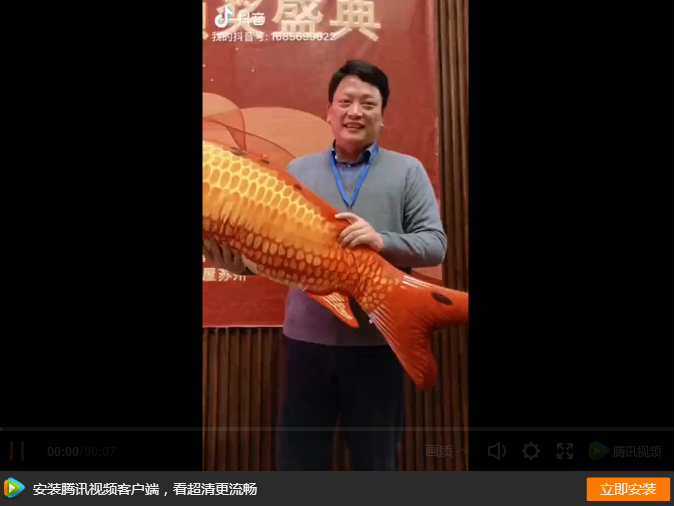

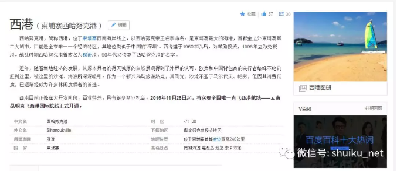

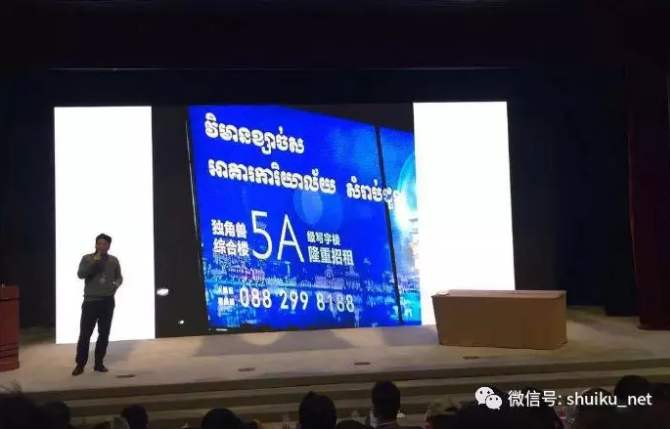

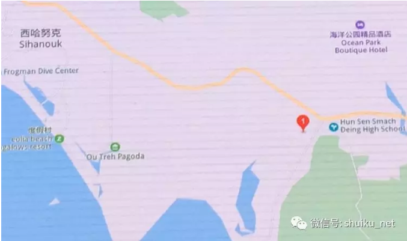

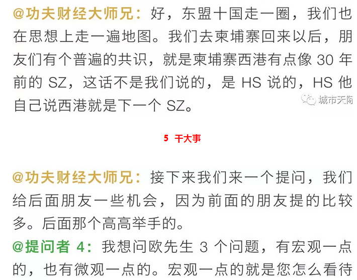

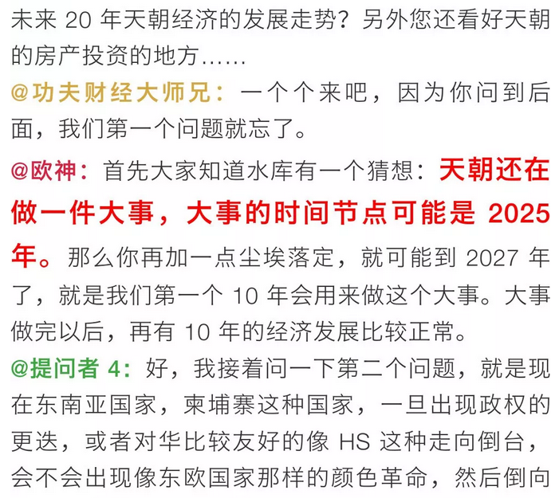

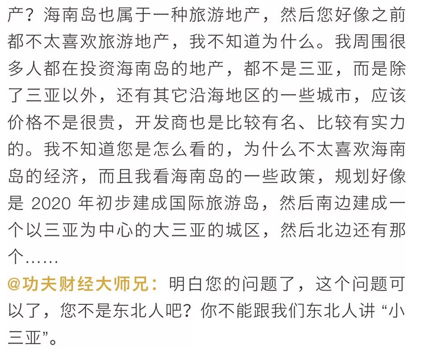

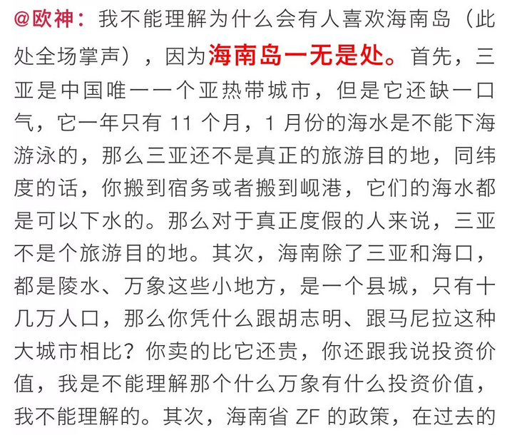

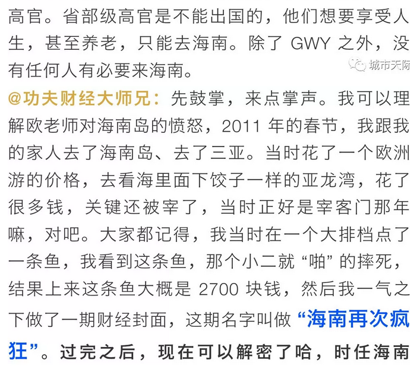

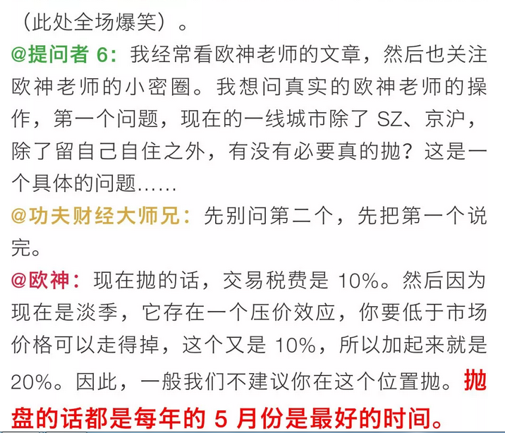

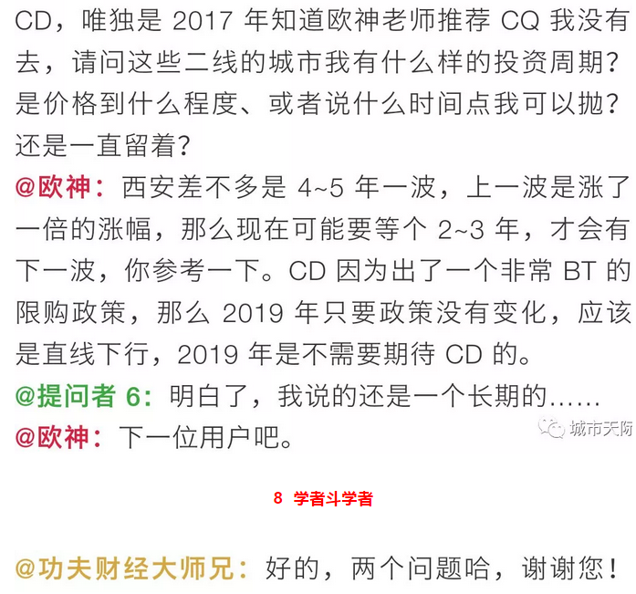

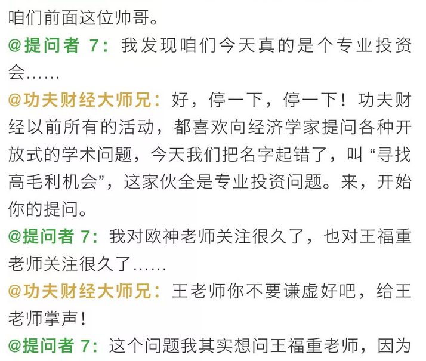

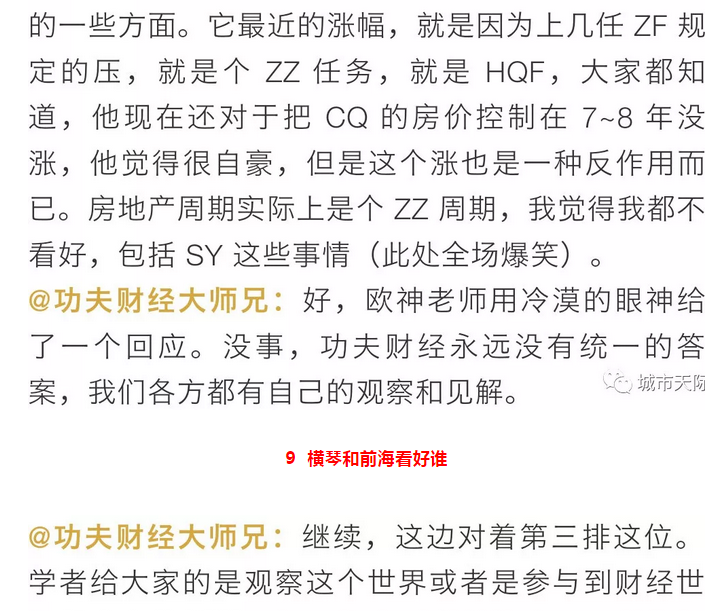

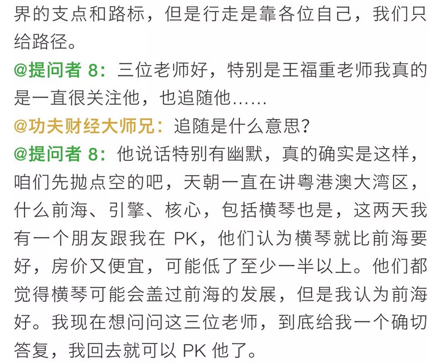

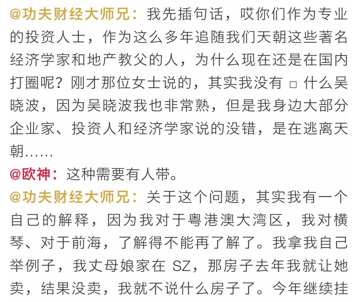

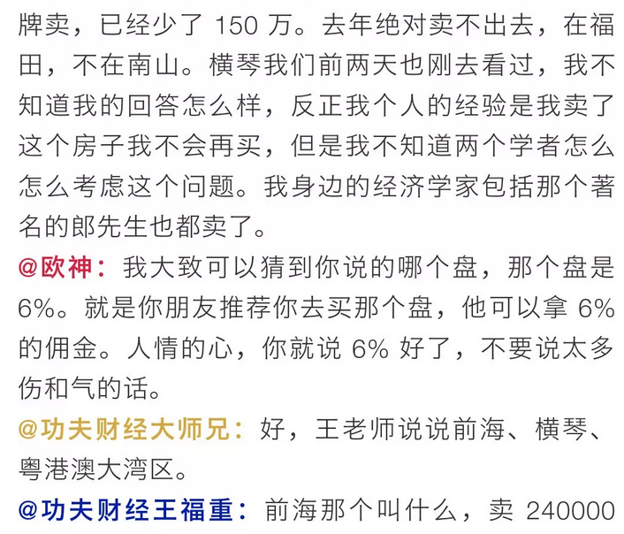

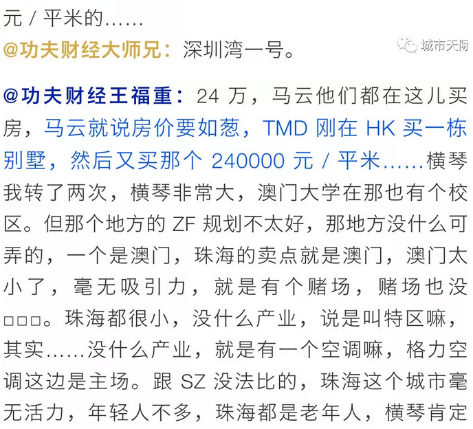

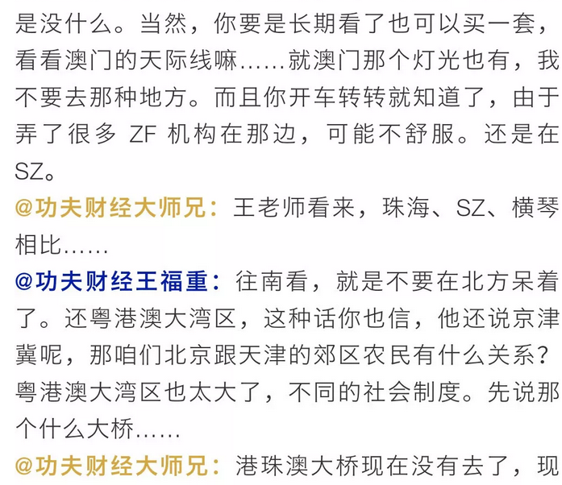

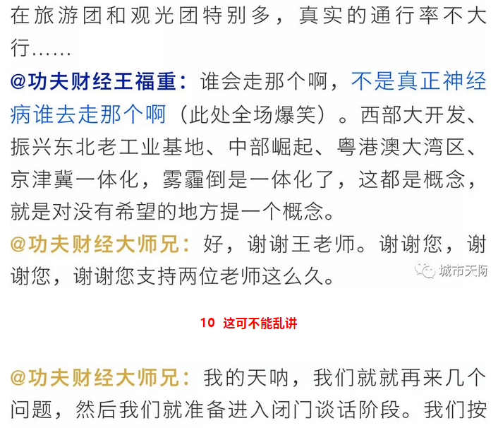

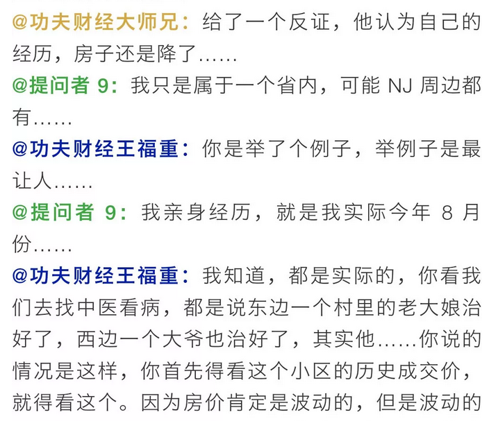

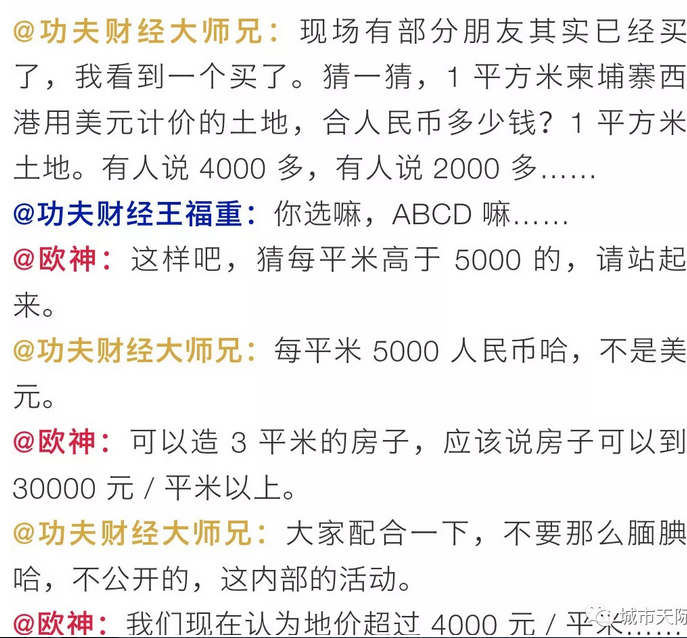

