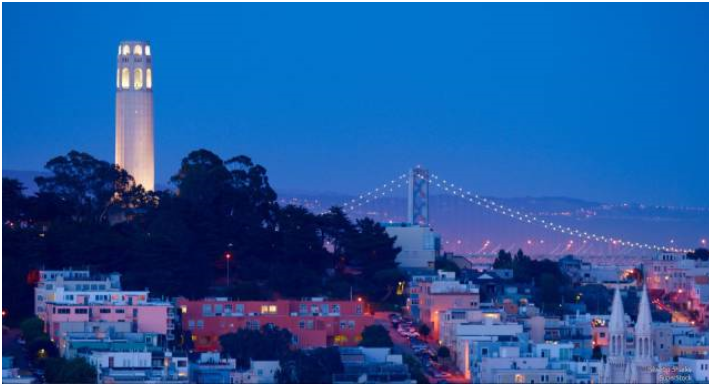
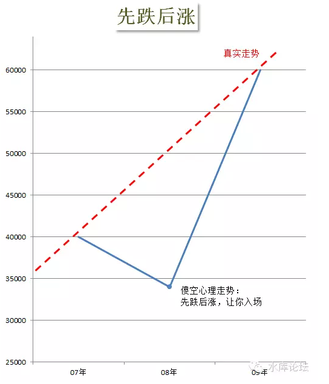
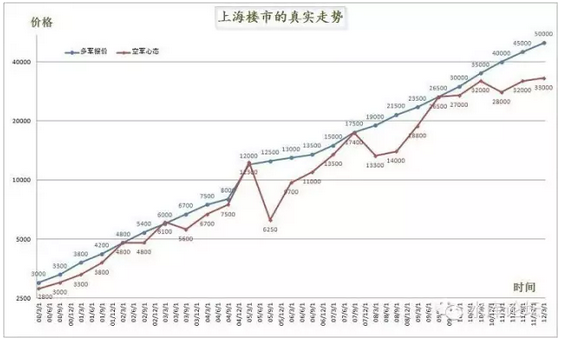
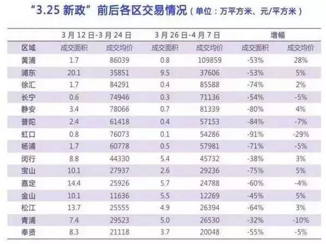
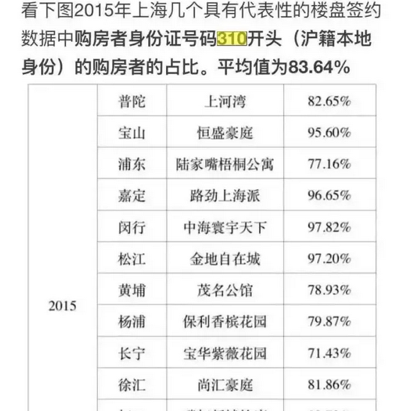
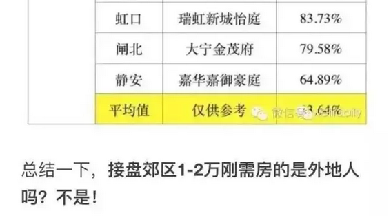

# 上海楼市的真实走势（四）\-\-\--观望 \#1030

原创： yevon\_ou [水库论坛](/) 2016-04-24

上海楼市的真实走势（四）\-\-\--观望 ~\#1030~

观望，观望你妈个头啊。

 

 

一)长多所以短多

 

（上一篇写不下本节了）

 

傻空这种动物，如果你研究他们的行为喜好。有一些颇为有趣的现象。

譬如说，傻空很喜欢说的一句话，"房价从长远来看是好的，十年后肯定比现在贵。但是目前太高了，应该回调15%"。

 

 

在《上海楼市的真实走势》整个图表之中，虽然说16年涨了16倍，平均每4年翻翻；

但是另一方面，他有几个连线"钉子"。

譬如03，05，07，09，13，15，都是大年。这几年都有大量成交，价格都做实的。

 

2009有大量成交，价格做实。2007有大量成交，价格做实。

09价格=07价格 \* 150%

 

在二个价格做实之间，非要有人说，"08年是有-15%下跌的，然后再涨上去"。

这是怎样一种心态，怎样一种屌丝情结，实在一件颇为有趣的事。

 

 

我们要讲的，是一个非常基本的道理："长多必然短多"。

好比一套房子，周边有地铁大商场规划，本身品质也不错。预期未来等全部建起来，终有一天会卖到50000元/平米的。

请问，你今天去卖，会挂到什么价位。

 

 

答案是45000元/平米。留给下家的空间不足10%。

为什么会有这种状况，因为在中国的"无风险收益几乎为零"。

 

事实上，除了房子，你几乎就想不到什么可以投资的。

-   储蓄，定存，只有微不足道3%以下回报。

-   股票，基金，渣都不剩。

-   p2p，算了吧。

 

 

中国人的忍耐力是极为坚毅的。一套房子，如果曾经"刷"出过某个价位，他们就绝不肯低于这个价位抛。

另一方面，如果中国人对某项资产有信心。他就可以极长时间的等待忍耐。

因为在中国，"时间"是几乎不值钱的。你哪怕摒住死捂十年，"无风险收益"是极少的。不存在争夺时间的现象。

 

 

很多人喜欢用股市的例子来做对比。

股市为什么会有巨幅波动，因为股市一直徘徊在二个长期目标之间：

A．中国企业未来会有万亿市值。如微软苹果6000亿美金。

B．中国企业一文不值，股票就是废纸。

 

股市为什么会上下波动，因为股民们始终在这二个"长远目标"之间摇摆不定。

假设你明确告诉股民，"中国联通"未来会成为GE一样的集团，有几千亿的估值。

那么中国股民大都愿意以坚定的信念捏住股票，怎么洗也洗不出来。

反正百姓只要有3%的回报就战胜储蓄了。

 

但问题是什么呢，股民们前一秒还在想"买入\-\--持有"，只有"股票终究有希望"，定期定存长远会有收获。

下一秒，则是公司造假，永不分红。象yevon\_ou这样的人冷冷戳上一句："从长远看股价600点"，一文不值。

 

趋势是最终的力量。

如果最终是涨的，那么我今天无论如何怎样买进都是对的。

如果最终是废纸，那么我今天无论如何怎样买进都是错的。

关键是对趋势的选择。

 

 

说回对房地产市场的分析。房地产市场的问题是，至少99%的人相信，"从长远看，房子总是涨的"。至少北京上海总有价值。

长多必然短多。

从中国人的国民性，只要我相信"长远看涨"。那我无论如何不肯贱卖的。

 

贱卖干什么呢，到外面兜一圈再买回来？

-   外面做什么生意能有回报，无风险利率才3%你知道么。

-   交易成本有多高，你知道么。

 

 

所以我们看多军这条蓝线，他是一条一路向上的线。"只涨不跌"你知道么。

你如果是"长线看好"，[你不会有回调的]。只会有涨得快和涨得慢的区别。

它必须是只涨不跌的。只涨不跌才符合"长多所以短多"的逻辑。

 

傻空们很喜欢说："房价从长远看是好的，但目前需要回调-15%"。

回调-15%干什么，给你买入么？

-   你是白痴就直说。

 

 

 

二)市场向上，傻空向下

 

"宏观调控"对于"上海楼市的真实走势"造成的一个重大影响，是"观望"。

包括这次0325调控。

我们看回这张走势曲线。

他有几次巨大的"红蓝差距"。红线和蓝线差最远的时候，都是刚发动调控的时候。

 

 

每一次发动"宏观调控"，譬如05年加营业税。卖出要5.55%的税。

营业税一加，稍微懂点经济学，房东中有文化有知识的，都知道这是"惩罚卖出"，房价非得涨不可。

 

 

可是市场上的傻空，泯泯大众不是这样想的。

2005.12我接到一个电话，原本五月卖20000的房子，诚意买家问我，我说现在要28000元/㎡。

买家大吃一惊，说那你这不是"逆势上涨"么。

 

 

我发现中国的编辑媒体，特别喜欢用"逆势"这个词。搜一搜几十万词条。

05年也是"逆势上涨"，06年也是逆势上涨，07年也是逆势上涨，08年也是逆势上涨.........

逆了好几年，房价逆上去了二三倍。

 

我倒是奇怪了，你这个"大势"到底是向上，还是向下。

我明明是"顺势上涨"好么。

 

 

说回房地产的正题。每一次"宏观调控"，无非加税加交易成本，只能使房价更高。

所以每一次增税，房东无一例外，"蓝线要求上涨"。

 

可是傻空是"中二病"的，傻空对于每一次调控的解读，都是"下跌"。

表现为"红线下跌"。

 

 

三)观望

 

让房东最为头疼的，不仅仅是宏观调控带来的"吃毒药涨内力"。还有每次调控之后，漫长的"观望期"。

 

买卖之间，是一种博弈。卖家要求涨价，买家要求降价。

在过去的十六年中，傻空一共投降了十六次。

 

 

但是，既然是博弈，就不可避免要有"拉锯"。

每当一次新的"政策"出台，傻空的第一反应是"跌-20%"，表现为红线巨大向下缺口。

 

这显然是违反事实的。因为宏观调控，所以房价飞涨。傻空不能违背科学。

但是多空又是分歧的。你这个报出了120%的价位，傻空心理是80%。于是就产生了观望和拉锯。

"观望"这段时间，要维持6\~12个月。

六到十二个月，是傻空幻想破灭必需的时刻。

 

 

他们本以为500W的房子会跌到400W。可是十二个月之后，500W的房子变成了700W。

所以他们匆匆忙忙在"06下跌，08下跌"之后，又再叠加了一个["第二年暴涨70%"]

三观，至于这样的世界观如何之不合逻辑，傻空是不讲逻辑的。

 

 

但是，这样的"不进行交易"的事，对所有人都是非常痛苦的。

"观望"，对所有人都是不利的。

 

上海楼市的增长速度，大约是每个月1%\~1.5%。其中前半截涨得快，近年来涨速已越来越慢。[\[1\]]

但是，无论如何，如果你今天不买房，12个月以后我+12%价格是要加上去的。

 

你乖乖地不买房子，非要观望。

观望，观望；

观望你妈个头啊。

 

每一次"宏观调控"之后，傻空就会给自己一个理由："政府出手了，马上下跌了"。

于是男朋友对女朋友说，又多了一个理由。再观望一阵子，再坚持最后几个月。

KFS就要挺不住了，别死在了1949年的前夕。

 

 

这一观望，就是十二个月。一般要到下一个"春节红包效应"。购房的心才又蠢蠢欲动。

然后外出看了一圈，发现房价还是那个样。跌也跌不下去。

于是死心了，准备买房了。

房东又跳价了。

 

观望，观望你妈个头呀。

拖久十二个月，你也不利。我也不利。

你多拖一年买房，房东至少多加你+112%的价格。

 

房东其实不想赚你这个钱，因为没有杠杆。

房东其实希望你今年就100%的价格买进，房东需要链式反应。[\[2\]]

 

 

 

四)卖房

 

写到这个话题，是因为昨天晚上一位好友的长电话。

 

好友是浦东三林齐河路的房子，他说同类网站上有挂970W的。

他问我，如果计划在六个月之内用钱的话，挂什么价格比较好。

 

我直接回答说，走不掉。图1：

我们来看这个表。

0325"新政"之后，如预期的一样，价格只有轻微的波动。房东是不降价的。

但是成交量跌得非常厉害。

 

 

我们继续看这个表，图2：

和普通人想象的不一样。普通人总以为"外地人是购房的主体"。

而事实情况呢，外地人有许多社会底层，买不起房。尤其是中区西区。

上海人购房占83.64%

 

或者说，0325新政中最主要的一条："外地人二转五"。其实没多大实质影响力。也不会对购房资格造成巨大影响。

 

但图1中成交量跌得非常厉害。

造成这事的，不是实质影响，而是心里影响。是"观望"情绪。

 

 

每次一个新政策出台，都会导致市场的"观望情绪"。

减息，减存款准备金之类利好政策还好说。

但一旦是"利空"政策，任何傻空都先会在心里打一个问号"会跌多少"。

 

 

具体该跌多少，傻空是算不出来的。他们的智商没到水库的层次。

傻空唯一可以做的，是"观望"。

通过观察市场的走向，能走到哪一个价位，他们就接受这个价位。这一观望，又是6\~12个月。

 

 

在"观望"阶段，**你降价出售是无效的**。

你譬如原价970的房子，降到了870，你是非常诚意卖的，让利一百万了。

 

可是傻空不是这样想的。傻空们的想法是：

-   你降价870，说明这是宏观调控的威力。你就应该降价。

-   因为降价了，所以降价了。降价了说明还要再降。

 

 

所以降价这种事，对于你"加快销售"是一点效果都没有的。

傻空们不会领你这份情，无论你降到什么价位，降了还要降。

你哪怕970降到870，降到770，降到670。

傻空也只会以为"宏观调控之下，理应如此"。

 

你如果要降到傻空都以为"实在太笋了，不能够再不买了"。

那可得非常非常之低才行。

譬如，270W你接受么。

 

因为，降价无效。

所以，房东从不降价。

 

耗着耗着呗，我也卖不掉，你也买不进，政府也收不到税。

一晃又是一年。

 

 

 

（yevon\_ou\@163.com,2016年4月23日午）

[\[1\]]这个有专题再展开讲述。

[\[2\]]见\#F360
