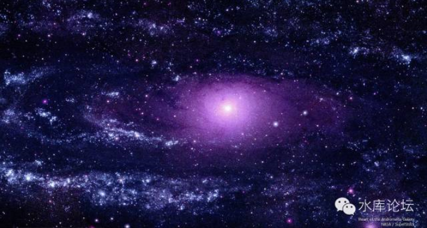
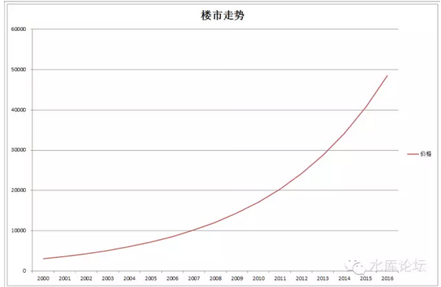
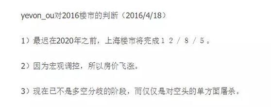
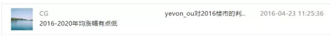
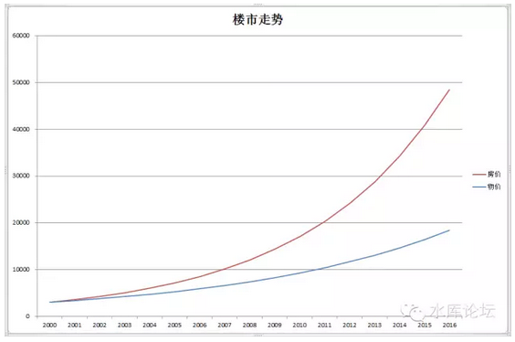
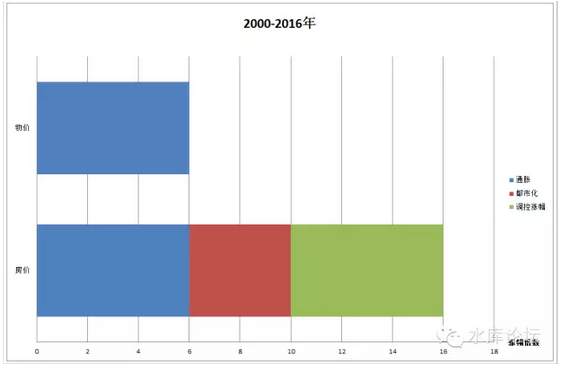
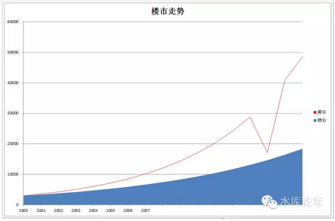
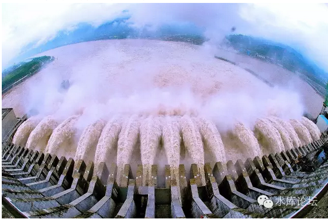
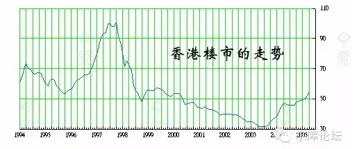

# 京沪楼市何时见顶（上） \#1050

原创： yevon\_ou [水库论坛](/) 2016-04-26

京沪楼市何时见顶（上） ~\#1050~

再好的市场，也抵抗不过贪婪。

 

 

一）天空

 

写完了《[上海楼市的真实走势](http://mp.weixin.qq.com/s?__biz=MzAxNTMxMTc0MA==&mid=2651014555&idx=1&sn=272361d995b88bc6fd75598930665fc7&scene=21#wechat_redirect)》数篇后，我们知道，京沪楼市，他其实是一个"只涨不跌"的走势。

 

(示意图。不精确)

在过去的十六年中，楼市大概涨了16倍。或者说，平均4年翻翻。

再结合《yevon\_ou对2016楼市的判断》：

于是就有了如下的回复：

对于多军而言，尤其是新晋多军，急着掘入门的第一桶金。他们希望的是"楼市涨得越快越好"。下个四年至少也要涨一倍。甚至更多。

 

而对于空军，还有诸多观望者，他们其实想要问的另一个问题。

"何时才是尽头，天空才是尽头"？

 

 

二）涨幅

 

我们要说的是，以上二者的说法都不对。

为什么，因为京沪楼市有"隐患"。

如示意图2.

 

"房价"为何会上涨。这是从2003年第一次大涨之后，多空讨论不休十几年的事。

当时的空军领袖说，"看来看去，除了滥发纸币一条，其余都不支持房价上涨"。

 

 

社会的生产力肯定是不断进步的。任何一件物品的制造成本，现在肯定比五年前低。

科技更先进，机器更大型，材料更密致，施工更合理。科技本身就在导致成本不断降低。

 

而一件商品，从"制成后"还能够不断地"升值"。甚至升上几倍，几十倍。

那除了货币注水，没有别的解释了。

毕竟，价格=房子/人民币含金量

 

但是，我们看回示意图2。在图中蓝线代表"物价"。物价涨得并没有房价高。

 

在过去16年，房价涨了16倍。

但是物价指数，基本上是"改革开放迄今，36年涨了64倍"。

每一届12年4倍。

每6年翻翻

每年12%

 

你对比一下的话，（京沪）房价是每4年翻翻。每年19%

而物价是每六年翻翻，每年12%

这其中就有一个缺口。

 

 

按照正常的比值，假如房价跟随物价上涨，纯粹是一个货币现象。

-   房价十六年应该涨了6倍

 

 

6倍，而不是16倍。那么，这额外多出来的倍数去哪里了呢。

我们想了很久，绞尽脑汁，用了各种理由和借口，去圆这个"理论漏洞"。

\
如示意图3。

 

在过去的2000\~2016年，正常的物价涨幅应该是6倍。

但是，房价的涨幅是16倍。

在16倍中，正常的涨幅应该是10倍。还有额外的60%是因为秀相的"宏观调控"。

 

因为宏观调控，所以房价飞涨。宏观调控导致了额外的+60%涨幅。

这件事，我们在之前的《[吃毒药涨内力 ~\#950~](http://mp.weixin.qq.com/s?__biz=MzAxNTMxMTc0MA==&mid=403530885&idx=1&sn=53c615c338024587afaa293a9f90eb23&scene=21#wechat_redirect)》中已经说过了。

 

 

但是，你还是有一块是不能解释的。就是图中的红色部分。

红色部分，还有+60%的涨幅。

这一段的解释，或许是"大城市化"。也就是过去十六年中，由于秀相的"国进民退"，全国资源大量集中于政治特权性城市。

 

所以导致了中心城市人口，资金，产业，投资的高度密集。

四线城市萧条，地级市失血，省会半梦半醒，而一线城市狂飙。

 

 

三）安全区域

 

在所有的涨幅中，只有"货币增发"原始的这6倍是可靠的。其余都会遭受攻击。

 

 

很多人都在问，"房价何时下跌"。其实这是一个伪命题。

因为他包含了二个部分；

1）房价永不下跌

2）涨得过分了，就会下跌。

 

譬如说，我们继续看示意图4

其中蓝色的区域。指的是跟随物价12%年速度上涨。

你可以理解为"安全区"。

 

 

理论上，房价也是物价。房价一定是随着物价，一起和RMB通胀的。

假设门口的包子，从2元/个，涨到3元，再涨到5元，那房价没有可能不涨的。

不可能发生1个包子换1套房子的。

我们观察图形。你可以认为，红线永远在"蓝色区域"上方。

 

 

但是，房价是可能下跌的。

什么时候下跌，就是房价远远超过了物价的涨幅。譬如物价涨了6倍，而房价涨了16倍。

这个时候，房价曲线出现一个向下的缺口。是完全可能的。

 

 

你再好的产品，把价格拉高5倍，再跌20%，也是完全可能的。

你再大的牛市，买了CEO盘，然后下跌20%，也是完全可以的。

说到底，再好的市场，也抵不过无尽的贪婪。

 

 

四）贪婪率

 

香港人有句老话。叫做"输时间不输金钱"。

 

 

意思是在漫长的1950\~2016整整三代人的寿命中，甚至是香港整个城市的生命中。

"你持有资产，只会输时间，不会输金钱"。

 

这句话乍一看，是十分嚣张的。和财上海的"京沪永远涨"一样，完全不讲道理。

但是我们换一个角度讲，假设"这届人民不行"。接下来的36年内，我们还一直保持着人民不行的样子。

 

在之前的改革开放36年，1980\~2016，中国的物价一共是涨了64倍左右。

之后的36年，如果再涨64倍。房价会到什么位置。

答案是8\*64 = 500 0000元/平米左右。

 

注1：目前韩国的房价，就是500 0000 WON/平米。大韩民国68年。

注2：会不会如下图。请参见《[从来不存在四万亿](http://mp.weixin.qq.com/s?__biz=MzAxNTMxMTc0MA==&mid=402462125&idx=1&sn=96c9bf7fb36eb23369a7ee03104bcef7&scene=21#wechat_redirect)》\#850.

 

 

假如2050年的房价是5000000元/平米的话，那么无论你今天买的是5W，8W，12W单价，谈贵贱都是毫无意义的。

无论你哪个价位买的，都还能翻NN倍。

 

那么，我们为什么还要谈论"京沪楼市何时见顶"呢。

因为目标是500万元/平米，但当中会有反复。

如果你短时间冲太高了。就会有回落。

 

好了，现在问题来了。

-   到哪一个价位会回落

-   会回落多少

 

 

为了解释这个情况，我们引进一个叫做"贪婪率"的指标。

其具体定义，是"红线/蓝线"。

 

好比2000年末，朱镕基执政末期。那是最健康的时代。房租回报有约6\~7%，实业强劲，刚加入WTO。

我们认为，当时的"价格/价值"是1，是完全没有泡沫的。

 

此后，"房价"升了16倍，"物价"升了6倍。

到2016年初，这个比值大概是：16/6 = 2.66

 

 

在一个年涨幅12%的市场中，你要沽空，那是风险非常大的事情。轻度泡沫是不会破的。

你一定要泡沫足够丰厚，才值得你一试。或者象某些人绝望地说"我这辈子再也看不见5500点了"。

 

请问，"贪婪率"到多少时，市场会发生大幅波动。京沪楼市会见顶？

 

 

五）估算

 

我认为是4\~5倍。

 

这是基于几种估算看法。

首先，中国的资产价格，普遍都"严重高估"。

 

中国可用于民间投资的机会特别特别地稀少，相对而言，中国的资产特别地"昂贵"。远远和欧美国家估值体系不同。

中国的股市，是全世界P/E最贵的。

中国的VC，也是全世界最疯狂的。

 

 

如果按最本源的"现金流贴现法"，中国股市的估值大约是600点，市净率PB=0.3\~0.5。[\[1\]]

长期以来，中国股市都维持着五倍以上的虚高估值。

 

中国的股市，最高曾到过6124点。最近则长期维持在2900点左右。

从股市的泡沫看，中国资产可以最高冲到10倍泡沫，而长期维持着5倍左右泡沫。

 

 

其次，我们用第二种估算法。即时间估算法。

中国的纸币泛滥速度，大约是每12年四倍。

 

 

谈"输时间不输金钱"，其实我们可以把泡沫换算成时间。

假设你买入一项资产，虚高了30\~40%。

 

换算成时间，这就是"二年"。曾经以为蠢不可及的CEO盘，买入也就套二年。

二年之后，你这价就是市价。

四年之后，你获利30\~40%

 

 

可见，哪怕你买入一项非常糟糕的资产。在通货膨胀的大环境下，也能秒杀现金。

如果你草率地仅是输了二年时间，99%人完全都扛得住。

 

那么，如果你这些资产"非常非常非常"糟糕。糟糕到哪怕连你都输时间输不起了。它得有多糟糕呢。

我们草率地估算，大约是12年。

 

 

12年，是香港楼市套牢的跨度。

如果你看回香港房东的话，大约"浪费"了十二年的时间，十二年的人生，十二年的青春。

12年之后，房价终于脱离了蟹货。

 

 

如果以"12年耐心"为估算的话，则十二年的通涨一共是400%

也就是市场可以接受比价值高400%的泡沫。

 

 

六）战术

 

上海房子其实不值那么多钱，不值100000/平米。

对于这件事，多军都心知肚明。无论房租，同类，细分，跨省，新区，等等众多指标都显示背离。以后我们会讲到。

 

 

但是，"虚高"和"会不会"涨，绝对是二个概念。

按照欧美同类对比，A股大概只值600点。但他今天扔在上串下跳。每天还在讨论涨停板赚钱。

 

在过去的十六年，我们连续押了16把大。赚到盆满钵满。

如果你要问2017，2018年，估计我们仍然是押大。

"虚高"和"涨不涨"绝对是二码事。

 

 

京沪楼市的唯一问题，是涨得太快。透支了几年涨幅。

但这绝不意味着明年就不涨了。从各种具体细微之处可见，明年仍是大涨年。

 

因为除了战略判断之外，你还有战术判断。

楼市如果真的到顶，崩溃之前会有大量战术迹象，会有各种细节端倪。

 

战术是什么。京沪到底可以涨到哪一个价位见顶。

下篇再讲。

 

 

（yevon\_ou\@163.com，2016年4月25日晚）

 

 

 

 

[\[1\] ]见股市三篇
