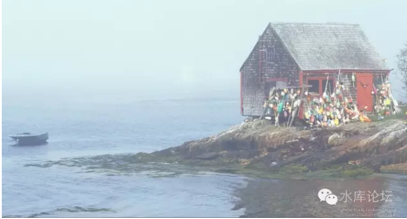
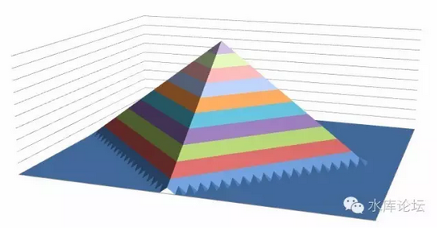
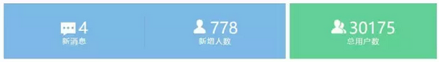

# 泡沫分水岭 \#1080

原创： yevon\_ou [[水库论坛]](/) 2016-05-19

泡沫分水岭 ~\#1080~

十万之后，玩法不同。

 

 

一）市场情绪

 

做股票的人，永远也搞不懂一个问题："加5.55%营业税，为什么房价会涨"？

这个问题，他们是割掉屁股也想不明白的。

 

 

做股票的人，都知道"印花税事件"。

印花税从0.1%加到0.2%，那是超级大利空。历史上的所谓"半夜鸡叫"。

印花税从0.1%加到0.3%，利空空空空空。很多人要跳楼了。

印花税从0.1%加到0.5%，股市就崩盘了。直接跌到1000点。

 

这是十几年炒股的血汗教训，做股票的人印象深刻。

所以当秀相第一次提出"5.55%营业税"，几乎99.99999%股市经验第一反应就是"要大跌了"。

只有yevon\_ou坚持不懈地大喊："要涨，暴涨"。

为什么？

 

 

为什么，因为他们搞错了一个阶段。"泡沫前"和"泡沫后"阶段不同。

 

好比你去收购一家公司，按照PE=6和PE=8，这当中差30%的估值。

你要深刻认真地计算融资财务成本，合并税务成本，削减分支机构及合并产能所产生的协同效应。政府加息或者补贴的定量计算。

 

但是，如果你收购的是一家PE=600的公司呢？

负责任的和你说，以上所有的定量计算，全都算不过来了。因为他的计算就是负值。一家亏损的公司，估值300亿，你怎么算投资回报率？

 

在这个时候，唯一重要的，或许就是"市场情绪"了。

没错。就是市场情绪，当你100倍PE买进时，你可以转手卖给200倍的，再卖给300倍的。最后卖给3000倍"市梦率"的最后一棒。

只要这个游戏可以玩下去。"暴风影音"任何一个价格都是合理的。

 

 

做股票的人永远不明白一点。他们手中的股票，只值600点。

中国股市从1989年诞生的第一天起，就是500%的泡沫。而且在其整个生命周期中，泡沫从未消减过。

其延续三十年，[时间之长，长到人类已经忘记]什么才是"正常"的估值。

正常的估值，象中国这样的Emerge Market，就是PB=0.3，PE=6

 

你买进股票的唯一目的，就是卖出

 

任何一个倡导"股市价值投资"的人，都不能否认这一点。几乎没有任何人，拿股票是吃红利的。全都是靠涨跌资本利得。

这样的情况下，股市"基本面"已经不重要了。涨跌最重要是看"市场情绪"，而不是你又开了多少分店。

印花税自然跌。

 

 

但是相对而言，2006年的房价是没有泡沫的。

京沪大约12000元/平米的样子，那就是低估，低估，低估。

 

所以房东的底气是很足的。你加5%的营业税，那你就出105%的"到手价"来买。

爱买不买，不买还涨。

持有房产的唯一目的，不是卖出。

 

 

二）泡沫分水岭

 

如果以2000\~2026的这廿六年做一个分界。则中线划在2013年。

-   我们可以认为2000\~2013是没有泡沫的，是"价值回归"。

-   2013\~2026是有泡沫的。但是还没有破。

 

为什么要特意这样地写，这样分类呢。

因为在"泡沫前"和"泡沫后"，游戏玩法不同。

 

在泡沫前，京沪楼市不到一万的时候，我们是坚定的"价值投资"。誓与北京共存亡。

你无论加多少的税，楼价都是打不下去的。我反正是10000到手，税费你付，爱买不买。

 

 

但是，当郊环楼价突破8W，当政府只能靠"严控供地"来维持这个市场时。

我们相信这个市场是博傻的。周浦8W买进的唯一目的，是指望有一个傻瓜出9W。

你是不愿意出800W买一套房子，并且在周浦那个地方住一辈子的。

你知道800W在内地省份，可以买多少生活用品么。

 

 

当房价涨了100倍，涨到250000元/平米，涨到年房租仅有0.5%，涨到和A股股市一样泡沫时。

届时政府再出什么乱七八糟的政策，风吹草动，市场就有可能崩溃。

因为你是投机，不是自住需求。

 

 

"泡沫"本身不是一个贬义词。"泡沫"更不代表不涨。

2017\~2018有极大的概率，仍是一个看涨年。

 

我们只想告诉各位，在"泡沫后"时代，游戏规则是不同的。

当PE=6，和PE=600时，游戏规则是不一样的。

2013\~2026和2000\~2013的游戏规则是不一样的。

切不可刻舟求剑。

 

 

我们毫不怀疑，在某一任市长的手里。他一定可以把房价控制住的。

当房价3000元/平米的时候，无论你出怎样的政策，房价就是涨涨涨，怎么也压不住。

可是到了某一年，终有一年。还是这几招，房价大跌。

 

并不是市长变了。而是房价变了。

 

 

三）以点带面

 

"泡沫时代"的游戏规则如何，我直接回答你说："不知道"。

 

好比股市中，明天哪个版块会涨。光伏，新经济，物联网，哪一类军工概念股会受益？

我直接和你说，"不知道"。

 

因为股票已经脱离了基本面。无论你的赢利多少，你也支撑不起50倍的PE。

这时候，你要说哪支涨，哪支跌，那有且仅有一个因素："[庄家的想法]"。

 

 

 

在楼市中，道理也是一样的。

正常的物价涨幅，是每年12%，十六年六倍。

京沪深楼市的涨幅，是每年19%，十六年十六倍。

 

上海楼市涨到今天，各种细节揭露的"[不健康]"，已经比比皆是。完全遮掩不住。

楼市目前的格局，你可以用"帐篷式"价格体系来描述。

\
如图的这个价格顶点，就是"周浦"8W。

 

横向的，你如果用其他物业：酒店式公寓，商铺，写字楼，工业厂房和住宅做比较。

你会发现，上海除了"住宅"特别贵。其他东西都不贵。"住宅市场"几乎是一个孤峰。

 

纵向的，如果你用一手和二手做比较，新区和旧区做比较，板式和蝶式做比较。你会发现除了"新区的一手的品牌KFS新建板楼"，其他也都不贵。

"帐篷式"价格体系，反映在图表中。就是一柱孤峰。你会发现，除了这一块地皮，几乎其他任何资产都不太贵。

 

 

中国人有一句老话，"木秀于林，风必摧之"。

任何一个价格的"孤峰"，你都是不持久的。都是很大危险的。

 

那么"孤峰"是怎样出来的呢。

你问我，股市中300元的股票，"暴风影音"是怎么出来的；

答案是一个兴风作浪的庄家。和一群跟风的散户，才能搞得出来。

 

楼市中也是一样。周浦8W，是一个无良的庄家，和一群特别喜欢买"一手盘"。

非处不入。处房情结"智商税"交得血淋林的码农白领在支付的。

 

 

楼市如果在"市场经济"合理阶段，无泡沫阶段，他的整个价格体系应该是"平"的。

彻底平坦的。就如每一个纯市场经济理论都告诉你，股市应该是没有套利空间的。

 

随着泡沫的深入，"孤峰"会越来越多。当股市越是泡沫，老庄股越多。

而"孤峰"会从哪个版块冒出来，这是完全无法预料的。在股市中，你无法预测庄家喜欢操作哪支股票。

2013\~2026是"后泡沫"时代。后泡沫时代的玩法截然不同。整个楼市，会越来越接近股市游戏规则。而不是价值投资规则。

以投机和博傻为主。

 

 

当年"科网股"泡沫时，一些毫无价值的.Com公司卖到了数百亿美金。

这相当于"无中生有"的财富，任何一个投资科网股的美国人都赚得盆满钵满。并进而嘲笑那些蓝筹股的老古董。

 

这其实是很无奈的事情。今天我们依然坚持以这样的眼光看楼市。

整个浦东一文不值。出了小陆以外的地区，全部都是鸟不拉屎，不适合人类居住。

 

但既然有人愿意8W买周浦，并住在一望无际的田野中。并指望着周浦8W再涨到16W。那你还能说什么。

 

"泡沫时代"就是群魔乱舞。反正都高估五倍了，具体炒哪支股票，主要看庄家的喜好。而不是盈利的基本面。

无趣，无趣。

 

 

 

四）为什么写这些

 

水库微信号，从2015年除夕夜开始连载。

 

从我们写第一篇文章开始，就不停地有读者留言："为什么写这些"。

在任何一个市场，"赚钱秘诀"都是不传之秘，核心干货。

父传子，传子不传女，秘学渊源惯例是不外传的。

 

 

写水库这个微信号，一个原因是渊博的太多，理解的人太少。

你空负纬地之才，整天带娃奶瓶。别人也不知道你俯视云霄。

 

另一方面，炒楼这一行，主要考"心力"。

哪怕我把秘诀告诉你，你也完不成的。不怕多一个竞争对手。

 

截至2016.5.19今天上午，"水库"微信订阅号终于突破了30175人。

\
每一篇文章，基本维持在10000以上阅读。其中核心用户，大约4000人。

也就是我们最多只有4000个追随者。其中能做事实干的，1/10都不到。

京沪那么大，市场那么大。不怕多二个竞争者。

"大众化"就不行了。

 

 

最后一个原因，是楼市明显进入"下半场"了。

如果说2000\~2013是"价值投资"。物有所值，无论调控和你死磕。

则2013\~2026，逐步进入了"投机下半场"。

古典时代已经结束。

 

 

下半场是泡沫场。

"炒楼的"和"炒股的"距离最终将拉开100倍以上。只不过在最后的倍数，楼市也是泡沫。

但泡沫不代表不涨。进入"泡沫年代"之后，楼市还能涨很多年。纯以投机和博傻驱动，还能创很多很多新高。

 

 

我只是觉得恶心。

为什么我要玩这么脏的游戏。

 

 

 

（yevon\_ou\@163.com，2016年5月19日午）
