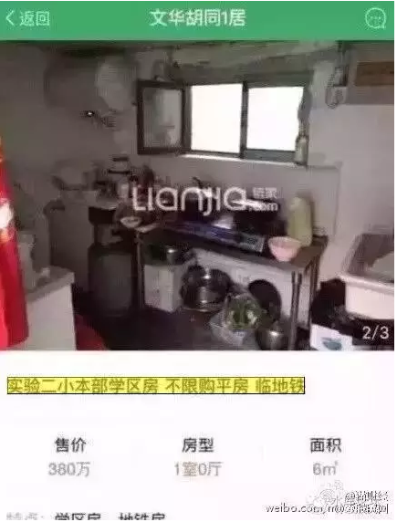
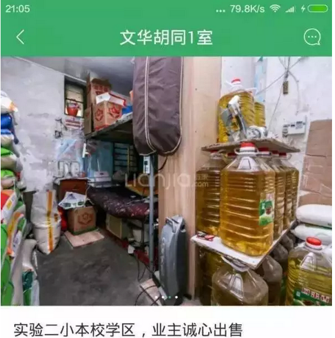
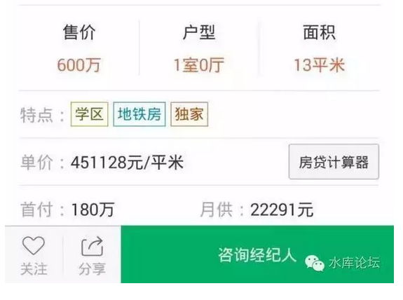

# 假设调控取消 \#1100 
--------------------

原创： yevon\_ou [[水库论坛]](/)
2016-05-23

假设调控取消 ~\#1100~
=====================

 

如果没有宏观调控，则房价应该呈现螺旋式下跌走势。

 

（续上篇《[[赔率胜负手
\#1090]](http://mp.weixin.qq.com/s?__biz=MzAxNTMxMTc0MA==&mid=2651014657&idx=1&sn=5a4d72386bd4ea262087457aea9a6230&scene=21#wechat_redirect)》）

 

 

一）螺旋式下跌

 

假设明天政府彻底地取消"宏观调控"，限购限贷营业税什么乱七八糟的事都不要搞。

契税直接降到0.75%，再加上不到一个点的中介费，回到2003AD高宗晚年标准。

那么，房价最有可能的走势，是"螺旋式下跌"。

 

 

绝大多数屌丝对于"放开调控"的理解。屌丝们普遍认为"放开调控"是[利好]，会引来一波抢购热潮。

抢购会带来价格上涨，涨幅估计在15\~20%左右。

 

他们是对的。对于屌丝心理的估计，完全正确。

屌丝们唯一没想到的，他们永远也学不会去体谅的"房东的感受"。

 

更高的价格，必然会带来更多的供应。

而"取消营业税"这件事，带来的是数倍的房东供应。

 

 

北京上海一年的开发量，大约是存量的3%。

只要存量态度的轻微变动，海啸就足以将供求关系淹没。

 

 

二）贫穷的房东

 

屌丝的问题，永远是目中无人。

他们自以为是天之骄子，平时又是独生子女。眼睛里根本没有别人，也根本学不会将心比心。站在别人的角度想问题。

 

 

你譬如北京的房价吧。北京一套天价学区房，动辄400W的总价。

可是，有一个问题。你有没有想过。

这户房子的户主，是怎么样的人？

 

 

你如果看照片中的锅碗瓢勺，还有主人的生活质量和品味。那破损的水泥窗，囤空酱油瓶子。

结论只有一个：海淀区群众大妈。

 

 

这样的房子主人，可能生于1950\~1960年，现在已经有60\~70岁高龄。正在领退休工资。

她们可能在社会底层度过了一生。纺织女工保安大叔。榨菜咸菜，是她们省钱主要的早餐。

 

在她们的一辈子，工资都没有超出过3500元/月的希望。每一次"退休工人加工资"，为了加28元还是32元，可以吵上几个来回。

她们一辈子的积蓄，不可能超过30W元人民币。省吃俭用，缝缝补补又三年。

对于小辈，拉扯成人已属不易。反目成仇是常有的事，缘由可能就是多吃了二筷鱼。

典型的都市贫民一个样本。

 

 

好了，我现在就问你一句话，"**她们为什么不卖房**"。

你一套400W的学区房，哪怕要交掉20%的税，到手还有320W。

 

你知道对于这辈子没见过30W存款的老太，320W是多么大的一笔巨款么？

拿着这320W，她可以在内地山清水秀的小城市，类似于蓬莱，威海，钦州，北海。

花50W买一套房子。花5W元请一个保姆。拿100W给小辈们分了花花。

 

她可以过上"村里首富"，类似于"王侯"般的生活。

她吃了一辈子的苦，现在可以山珍海味，温泉酒店。假设一年30W的话，每天就是1000元。

足够花得老太幸福得晕过去。

 

 

更糟糕的是，该老太可能还没有子女！

如果你说学区房是为了小孩子读书的话，老太的子女可能都已经成年了。又或者不在小学年龄段。

学区房对她是完全没有自用价值的。

俺是从来不相信财上海什么胡说八道的。

请问，你给我一个理由，为什么老太不卖房！

 

 

幸福生活在招手，幸福生活就在眼前。

你苦了一辈子，存款不过30W。只要把房子卖了，你就能有320W。

为什么不卖!

难道房子对你的价值，对你的意义，就那么重要么。难道区区6平米的房子，对你情感上的拘縻，比花园海滨温泉佣人贵妇人老佛爷更重要么。

 

答案肯定是否定的。

老太太不肯卖房子，有且仅有一个原因。"明天卖，赚更多"。

海淀区那么多的房子，纯粹是因为抛盘少。它才能维持那么高的价格。论总市值，肯定是不值的。

 

卖房要交80W的税。我没事去交80W的税干什么。

你要这样想，我不卖，我就是400W的资产在手里。而且明天还可能升值，可能是按400W+10%的速度在升值。

 

"赔率胜负手"已经分析过。在"高税率"下卖房。是一件高度风险的事。

人生最悲惨的，就是1000W的房子卖了，到手800W。转眼房子1300W了。

三）解锁

 

为什么要说"降税"，解开宏观调控的枷锁呢。

 

因为当"取消调控"后的最初三月，价格是可能涨15\~20%的。屌丝们冲出来的购买力。

但是，这个120%的价格，可能就是顶点了。在非常长的一段时间内，他都是最高点。有货赶紧抛。

 

 

任何分析，如果你不考虑房东的感受，那你就是在耍流氓。

当"卖出无税"的环境下，房东就会卖出。

这个是净卖出。在你之前所有一切一切的分析中，全部都没有净卖出。所以你的分析都是错误的。

 

什么叫净卖出。净卖出就是一个北京老奶奶，[她卖了房子，她住到山东去了]。

一个卖家，卖了房子，永久性地搬到别的城市。

老人，穷人，社会底层，永久性地离开北京。净供应。

净卖出就是你把三房卖了，换二房住。

 

只有净卖出才可以抑制房价。其他调来调去的都是太极拳。

 

 

目前房地产市场的现实，是"物非所值"。

本身价格已经贵过价值。

仅仅因为宏观调控，所以房价飞涨。在1:50的赔率下，大家都锁死了，谁也不敢抛。囚徒困境。

 

但如果你"卖出无税"，则会有大量的供应，大量的抛盘。

你没理由不抛啊。上海一套房子，动辄10W单价，1000W单套。

你知道1000W，如果拿来花，对人的人生有多大改变么。

 

 

-   你知道1000W，意味着多少春暖花开，面朝大海。

-   你知道1000W，意味着多少花开花散，水落桃源。

-   你知道1000W，意味着多少琴棋书画，闲情逸致。

你没有理由不抛的。尤其是当你有二套以上房子。哪怕对于一个白领，"享受人生"这也是一个巨大的诱惑。

 

你今天不抛的唯一原因，是1000W房子卖了，交200W的税。你不想交这税，想看看还有没有更好的机会。Over.

 

 

好了，让我们来看看"螺旋式下跌"的路径。

价值规律是永远有效的。房价其实不值得10W一平米，一套房子也不值得你用1000W的欢笑来换。

因为宏观调控，所以房价飞涨。

 

"假设取消调控"，价值规律是非常非常强大有效的。

最初的三个月，房价涨15%，因为屌丝的愚蠢狂热。

第四个月开始，房价下跌，因为房东的抛盘。任何不涉及房东的分析都是耍流氓。

第六七八个月，房价继续下跌。房东的套现抛盘是止不住的。

第二年，房价继续下跌。

第三年，房价继续下跌。

............

 

 

房东目前是"囚徒困境"。在1:50的赔率下，谁也不敢抛。

我也不敢抛。

因为宏观调控，所以房价飞涨。

 

 

四）经济学家

 

我大概花了整整四年的时间，来炒200倍杠杆"外汇保证金"。

到最后得出一个结论，"俺完全不擅长这事"。

 

是的，不擅长。

尽管我是少数几个4年后还活着的人。但我清楚地认识到，"不擅长"。

观察K线图，预测走势，这事我没灵感。不擅长，没天分。

 

此后的岁月，你怎么赚钱呢。

答案至为简单："做你擅长的事"。

 

 

俺擅长什么，擅长经济学。尤其擅长奥地利自由主义经济学。

这对其他学系，都造成了碾轧式的代差优势。

 

当秀相开始"宏观调控"时，几乎所有人都在喊"看跌，看跌"。只有我一个人在喊：

因为宏观调控，所以房价飞涨。

因为宏观调控，所以房价飞涨。

因为宏观调控，所以房价飞涨。

 

结果呢。房价连续涨了十几年。赚得盆满钵满。

为什么，关键就在于别人不懂"经济学"。

而你懂。这才是核心优势。

相信真理必有回报。

 

 

而如果房地产政策完全回复到2003年"高宗末期"时代，没有那么多*扭曲\~扭曲\~扭曲*的话。

你的财富，绝不会如今天这么多。

因为在K线图的战斗中，你并不比别人多优势。

 

为什么会有贫富分化，那些试图"抑制"贫富分化的政策，才在制造贫富分化。

 

 

 

五）结语

 

从《[[宏观调控卷 \-\-\-\--序章
\#660]](http://mp.weixin.qq.com/s?__biz=MzAxNTMxMTc0MA==&mid=401416191&idx=1&sn=069148f5226f13f51e08597f87d15d22&scene=21#wechat_redirect)》到本篇《假设调控取消
\#1100》，从篇幅上讲，一共是45篇。

 

我们详详细细地分析了宏观调控的：

-   起因

-   方法

-   灾难后果

-   泡沫

-   宿命

 

里里外外，几乎把这个话题说烂了。

宏观调控，对所有的人都是不利的。尽快取消最好。

科学尚未普及。

 

同时，我们对于"宏观调控"这个话题，也有感到厌倦。不仅是写的人厌倦，读者也感到厌倦。

我们希望尽快开始下面篇章。

 

 

第一卷并没有写完。下面至少还有三个大的主题；

《历史和轶事》卷

《下一站·天后》

《卖出》

但是，我们不准备磨了。几篇之后，就准备跳开写Section 2，一个全新的领域。

 

 

另一方面，Section 1写到最后的篇章，实在是很累的。

任何学科都是这样，先易后难。

 

你如果看\#1xx字头的文章，很明显最初几篇非常浅，非常浅显易懂。

而越到后面，涉及的卷帙场景越大。内容逐渐深奥，写起来也耗费心力。

 

作者也需要休息。所以我们先写Section 2.

Section
2前几篇，将会非常浅显易懂。你们看得也容易，我写得也容易。一挥而就，二三个小时就能写一篇。

楼主不缺钱，不求粉。甚至也不屑写阅读量很高的新闻。

 

 

哦，最后有人问，为什么要说"几篇之后，开写Section2"。

因为按照惯例，肯定还有一篇。

把整个"宏观调控卷"，全部都颠覆掉。

 

 

 

（yevon\_ou\@163.com，2016年5月23日暮）
