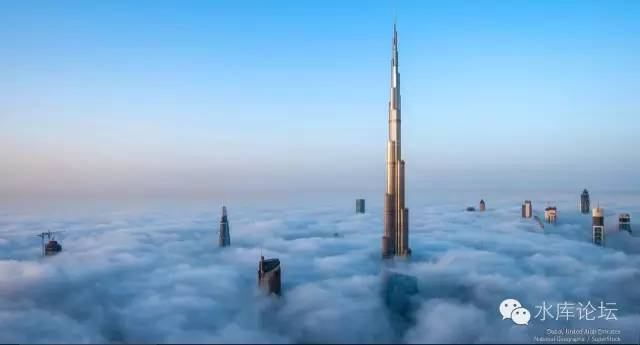

# 不征房产税，凭什么为什么 \#1120

原创： yevon\_ou [水库论坛](/) 2016-05-28

不征房产税，凭什么为什么 ~\#1120~

 

错误的舆论：

-   "土地不是私有的"

-   "要开人大了，改法律土地私有。然后就可以开征物业税了"。

-   "虽然要征物业税，但是土地变私有的了。我想房东也是乐意的"。

 

正确的逻辑：

-   世界上根本不存在"财产税"。

-   没有土地才需要交税，有了土地才不用交税。"正向"资产。

-   能保护你的，是宪法。而不是投机取巧。

 

 

 

一）社会契约论

 

18世纪，卢梭提出了"社会契约论"。

 

之前的二千多年，都是农业社会。实行的是"绝对君主制"。皇帝拥有无限的权力。

到了工业革命之后，需要一种新的社会组织方式，以及生产力理论基础。

 

 

"社会契约论"是现代社会的运转基石。几乎所有的[现代化文明国家]，都依赖于此。

"社会契约论"讲的是，全社会依靠一系列的"契约"而运行。

-   无代表权不纳税，国王不可以随便征税。

-   "风能进，雨能进，国王不能进"

-   三权分立。五族共和。

-   罗伯特议事法则。

 

这里面，对每一类人群都进行了约束。无论是国王，贵族，人民。

你一间茅草屋，再卑贱的贱民；

但是"风能进，雨能进，国王不能进"。

 

 

二）产权

 

随着"社会契约论"而来的，是"产权"。

 

因为你要签订契约，你首先要界定"你我"。

哪些是你的，哪些是我的。

有了"你我"，就有了"产权"。

 

 

虽然经济学的各大流派不同。但有一点大家是共识的。"产权"永远是第一位的。

人只有为自己争取利益时，才有最大的激励能动性。

凡是大锅饭，一定偷懒的。

 

产权是现代化一切分工合作的基础。有了清晰的产权，才能签订合同，才能结算分帐。

工业和商业社会，千千万万数不胜数的上下游采购销售，人力劳务。其背后都是"合同"，都是产权，都是契约。

离开了合同，现代社会一天也活不下去。

 

没有了"合同"，则一切工商业活动都无法展开。

整个社会的生产力，会徘徊在非常低的水平。

类似于北朝鲜或者非洲黑叔叔饥饿贫穷。

 

 

三）财产税

 

好了，现在我们可以立即推导出，所谓的"财产税"不存在。

-   世界上不存在"因为你拥有财产而需要交税"的说法。

-   世界上只有"根据财产金额而计算税"的说法。

 

中国的文科生小编，非常地文盲。

他们既没有学过任何真正的知识，类似于白痴一样。

却又忍不住指点江山，对什么都要评论。

 

 

世界上根本不存在"拥有财产而要交税"的说法。

因为财产本身是"产权"。

你的，我的，划分得清清楚楚。

政府的，民间的，划分得清清楚楚。

 

如果你说"财产交税"的话，这就等于侵犯了产权。

我就无法界定，哪些才是"我真正拥有的"。

 

"产权"制度混乱了以后。整个社会就无法运行。

首先就没有人干活了。如果你可以抢劫我的话，中国会迅速地沦为北朝鲜。

 

其次整个社会都没法签订上下游合同了。我不知道你会不会价外加价，谁敢和你做生意。

好比你在饭店里吃了一碗饭，付了20元。

你刚想离开，被店员拉住了。"客官，请再付20"。

你又付了20，"客官，请再付40"。

你又付了40，"客官，请再付80"。

............这事是没完没底的。

 

 

什么叫做合同。合同就是执行完了之后，权利义务划分清楚。二不相欠。

"财产税"本身是和"产权"概念冲突的。无法存在于现代社会。

 

"付了20，再付20，再付20，再付20"。

"财产税"就其自身而言，也是根本逻辑不自洽的。

 

 

 

四）契前税

 

接着有人问，"不对呀，生活中有买了再付费的例子"。

你买了房子，还要付物业管理费。

你买了汽车，还要付"车船使用税"。

这些人的诸类提法，只能说明他们全部都是"法盲"。

为什么，因为他们提的全部都是"契前税"。

 

 

我和你签订一笔合同。

在签合同之前，你和我说，先付一笔首期，逐月还有维护开支。

OK，没有问题。我权衡考虑之后，觉得可以接受。

所以这是一份双方有益的合约。是一份"公平"的合约。

 

 

而秀相政府在2011年推行的是什么呢。是"契后税"。

也就是合同已经签完了。拎着货物走了。民事行为已经结束。

秀相突然追了上去，让你加钱。

那就是非常邪恶，青岛大虾，哈尔滨鲱鱼，天下大乱了。

 

 

你说电话当年有初装费，以后每个月还有月费。

OK，没有问题。我愿意装，是我已经充分考虑了收益风险。

 

可是你不能搞"契后税"。这不是苛捐杂税，也不是税率的问题。

契后税哪怕搞0.01元，也是越界。

也是天下大乱。

 

 

你要问"天下大乱"定量地意味多大风险溢价。

银行门口，卖理财的，有"保本"和"不保本"二种。

二者利率差多少倍。

购买人群差多少倍。

江湖地位差多少倍。

你自己看看就知道了。

这是一条红线，底线，生死线。

 

 

 

五）利益和实质

 

理论上，全英国所有的土地，全部都是英女王的。

Real Estate本意是Royal Estate。

 

 

可是，这个有影响么。完全没有任何影响。

英国土地居民，需要交税给英女王么。哪怕每人交1英镑，也比她现在总收入4300W英镑要高。

答案是，不需要交钱。

 

 

所以这是完全没有任何意义的。管你土地是谁的，俺不在乎。

俺只在乎俺这房产证，转手能卖80W英镑。

 

对于中国，道理也是相同的。

名义只是虚相。利益才是实质。

 

文盲现象无处不在。譬如下面这个回帖。

我完全不明白，为什么中国有一群弱智智障儿童，不知道什么时候开始流行以下说法：

-   "土地不是私有的"

-   "要开人大了，改法律土地私有。然后就可以开征物业税了"。

-   "虽然要征物业税，但是土地变私有的了。我想房东也是乐意的"。

 

 

关于财产税的说法，你完全说反了。

类似于中国香港地区：

-   私人土地，不需要交地租税

-   政府土地，需要交地租税

-   产权不清，不需要交地租税

 

土地不是你的，你才需要交税！

只有能带来"正向"收益的，才能被称之为"资产"。才值得你掏钱去买。

 

 

否则的话，你设想一下，假设有一个国度；

-   "私家土地"，需要交税。

-   "不含土地"，不需要交税。

 

yevon\_ou走进了商店。

"老板，给我二打不含土地的房子"

"带地权的80W套，不带地权的100W/套"。

"不含土地的，谢谢"。

"私家土地的就是垃圾，呸，谁要啊"。

 

 

名称只是虚相，利益才是根本。

谁在乎"土地主人"究竟是谁。

我们只在乎"该项物业"能带来多少收益。出租自住转让，三大利益。

 

你说"土地主人"。

对不起，我不要呀。

你送给我，我还不肯接受呢。

你要你拿去好了，爱交税你去。

虚名毫无意义，利益之争才是血淋杀戮战场。

 

 

在中国和美国"土地制度"区别上。

-   中国才是"完全产权"，私有土地。因为中国房东可以100%拥有收益。

-   美国是"残缺产权"，地权不完整。美国房东每年要交\$3000给联邦政府。

 

中国房子就应该比美国贵133%以上。

美国房地产，呸，垃圾。 

 

 

更进一步说，17世纪，法兰西征收"人头税"。

但是有钱人，可以买一张"免税卡"。价格相当于20年的税收，你买了之后，就不需要再交税。

 

请问，这种"免税卡"是不是财产。是不是SB嘴中的"财产税"。

究竟是拥有卡的人，应该交税。

还是没有卡的人，应该交税？

 

 

 

六）宪法

 

错误的舆论：

-   "土地不是私有的"

-   "要开人大了，改法律土地私有。然后就可以开征物业税了"。

-   "虽然要征物业税，但是土地变私有的了。我想房东也是乐意的"。

 

正确的逻辑：

-   世界上根本不存在"财产税"。

-   没有土地才需要交税，有了土地就不用交税。"正向"资产。

-   能保护你的，是宪法。而不是投机取巧。

 

 

哥哥每天看四五个小时楼市信息。不停地看见文盲法盲们辩论；

"因为土地不是私有的，所以不能征物业税"。

 

SB，房产证总是你的吧。

我开征"房产证持有税"好了，每年1W。

什么，房产证遗失了。那还有"房产证中央电脑登记税"。不要挑战笔杆子的能力好么。

 

 

之前社会上对于"房产税"的分析，几乎全盘都是错误的。

关于目标，方法，困难，全部都是错的。

逻辑层层反。几乎读不下去。

 

这所有谬误的集大成者，是《南方周末》在2010年发表的一篇《征收房产税·凭什么为什么》[\[1\]]

这篇文章，因为《财经》等杂志转载。获得了极大的阅读量。

 

但是他整篇都是错误的。

文中说了屌丝如何苦，屌丝如何穷，屌丝买不起房子。

最后得出的结论，问房东征物业税。

技术难题是，土地非私有。

 

 

实在是看不下去，整篇文章从立论，到方法，到困难，几乎所有的分析都是错误的。

-   土地非私有，完全可以开征"房产证持有税"。

-   错误的错误，在于"持有税"的说法不存在。

-   错误的错误的错误，房东没责任付钱养活你。

 

 

从《南方周末》《财经》等邪恶媒体，我们完全可以看到左翼文青是如何毒害这个国家的。

幸好中国没有搞民主制度。否则这股流毒害死了欧洲，害死了美国，害死了美丽岛。蠢蠢又想害中国。

 

 

为什么不能开征房产税。

因为房东不是你爹，房东没义务养活你。

因为按劳分配。你想要更好的生活，你就应该去劳动。

 

因为宪法！

因为宪政和法制，保障着善良人不受屌丝的侵害，不受抢劫的侵害。

因为宪政和法制。

因为善良，正义，光辉！

 

南方周末，你这个不要脸的寄生虫！

 

 

（yevon\_ou\@163.com，2016年5月27日午，《宏观调控卷》完）[\[2\]]
