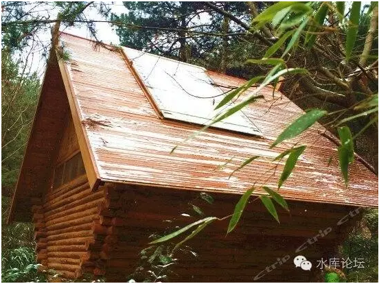
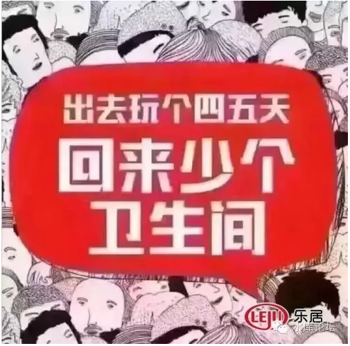
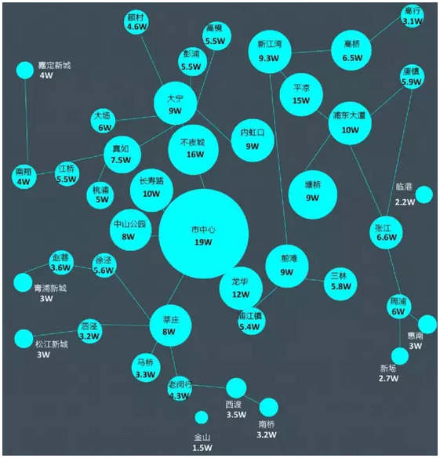
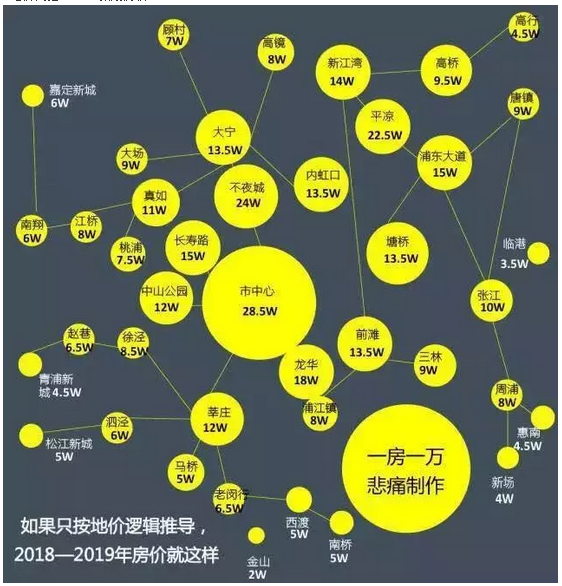
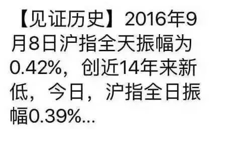
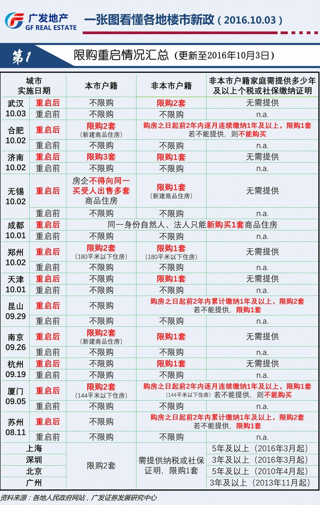
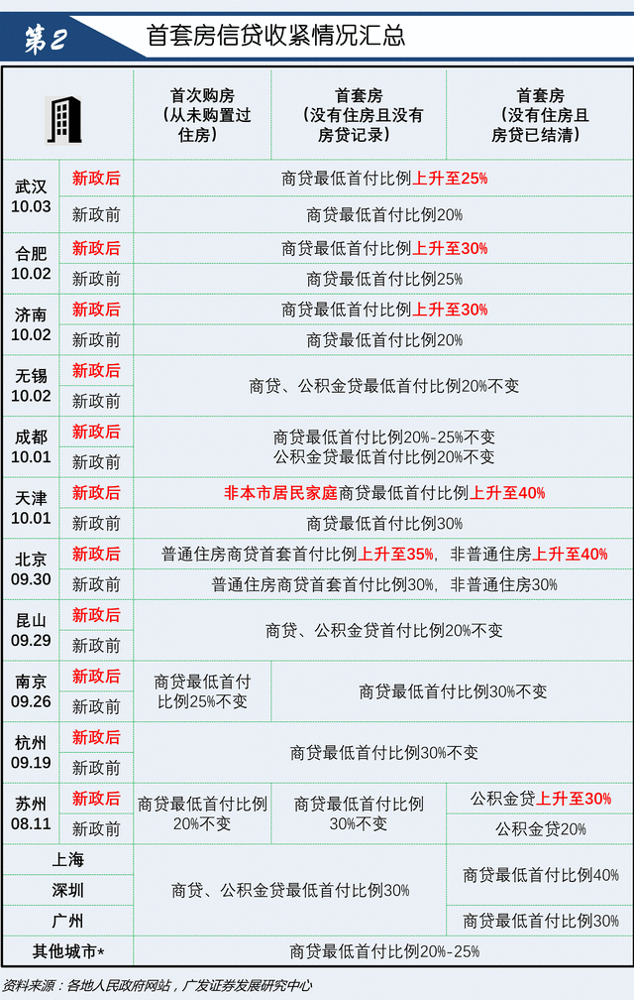
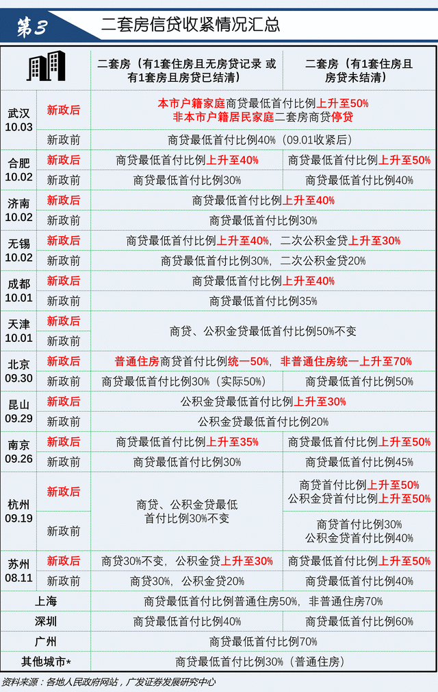

# 2016.10月调控政策的分析 \#1125

原创： yevon\_ou [水库论坛](/) 2016-10-07

 2016.10月调控政策的分析 ~\#1125~
==============================================================================================================================================================================================================================================================================

 

日光之下，并无新事。已行的事，后必再行。

                                               ------《旧约·传道书》

 

 

一）秦岭

 

话说十一哥哥躲在秦岭的大山里面。森林里的小木屋，夜里透过玻璃看星星。一颗二颗三颗四颗，数得好不快活。

对于上海的房地产网签系统，它在10.1\~10.8是不办公的。所以您不用费心去猜什么政策。

无论什么政策，您都是束手待屠的羔羊。丝毫办法没有，只能眼睁睁地等着政策变化。

 

于是，朋友圈就刷爆了如下图画。

有了Wifi毕竟不能隐居人生。朋友圈群情纷纷，都快要被"十二城限购"刷爆屏了。所以我们额外补一篇，谈谈本轮政策的分析。

二）地王拍卖

 

对于本轮"限购调控"，我们有二种分析范式。计划经济的和市场经济的。

我们先来讲计划经济。如果篇幅够，再讲市场经济的视角。

 

从计划经济的角度讲，高层可谓"高瞻远瞩"。

 

 

上海楼市，从2015.09\~2016.03，也就是A股市场崩溃了之后，经历了一场非常大的牛市。

一般估算，涨幅在30\~50%，最强的板块有+50%，较弱的板块也有+30%

 

 

按照"炒楼业"的传统，以及我们十几年的经验之谈。楼市涨"+50%"并不算是新闻。历史上也有了许多次。

基本每次"单数年"+50%的涨幅之后，双数年是比较疲软的。

 

 

因为市场需要盘整，购买力跟不上。

而消费者的心理也需要"再教育"。你明明400W的东西，一下子就跳价到600W了。

房东跳价我就不接，我就是[咽不下]这口气！

 

通常双数年要盘整整整一年。一直等到"观望期"结束。

消费者眼看看抵抗无望，而且房价整整一年都盘旋在600W的水平线上。

于是他们觉得600W是"市场价"。觉得房东没有欺负他。这才肯入场接货。

 

 

但是2016年的行情，截然不同。

上海上一轮的跨年行情，以2016.03.25为分界线。

"325新政"之后，社保二升五，市场急剧转冷。看房者寥寥。

炒家内部普遍认为要进入新一轮冰河僵持期。要一二年才可以恢复。

 

 

但是，在这样的情况下，2016.05.18随着"周浦拍地"，顿时又爆发了波澜壮阔的大行情。[\[1\]]

你要知道，在5月18日时，周浦地王是没有依据的！

 

在当时，上海楼价并不高。大概仅勉强维持一个7/5/3的格局。周浦的二手房报价普遍在30000左右。

实际能成交的二手房价格，不会超过23000\~25000。

 

 

不仅仅周浦"基本面"不贵。而且市区也不贵。

普通老城区的核心地段，南卢湾北静安一般持续在60000元/m的价格。

如果你不说老城区，光说浦东。则小陆家嘴，实际成交也就在80000/m左右。而且这个价格今天也是八万。

 

所以"周浦地王"是非常没有道理的。简直可以说KFS疯了。

 

 

"周浦"疯了还仅仅是第一步。紧接着又拍了三四块标志性的土地。

譬如说顾村，青浦，徐泾，奉贤等远郊地块。

略靠近市区，外环边缘的凉城，更拍到了惊人的120000/m保本价。

这一系列的"后续地王"，彻底确立了"郊区8W，市区15W，市中心25W"的未来预期地位。

 

(地价倒推，2018预期房价。图片出处：一房一万)

(地价倒推，2019预期房价)

  

三）地王的影响

 

3.25是收紧打压。而仅仅到了5.18就爆发了"地王行情"。

地王拍卖的结果，是整个市场又被拉高了+50%。

 

 

周浦之前挂牌价30000，实际能成交价大约在23000左右。

可是"地王"行情一出来，挂牌价立即升到了45000\~50000，房东都杀红了眼。

 

南卢湾本来价格持续在60000左右。一下子就拔高到了80000/m。

莘庄50000-\>70000

大宁75000-\>100000

金沙江路50000-\>70000

............

 

 

房东在马不停蹄涨完了第一个+50%之后，立刻开始又涨了第二个+50%

这在楼市历史上，是从来没有过的事情。

 

也让所有的分析师，老鸟们都跌破了眼镜。

只不过因为我们的"方向是正确"的。头寸建立在Long
Only上面，所以哪怕估错了力度，我们依然是胜利者。

 

 

9.24在北京参加了一场"地王研讨会"。是20家最重要的地产商，大家关起门来谈一谈，对于"地王"的感受。

会议研讨的结果，颇为出人意料；

 

-   KFS表示，对于地王有巨大的"忍受度"。

-   因为KFS有一整个团队需要养活，有巨大的前置成本。所以维持最小规模的开发量是必须的。

-   当地王很贵时，就减少一点开发量。土地便宜时，就增加一点开发面积。总体弹性在33%：100%左右。

 

 

市场上一般认为，对于地王有"阴谋论"的解读。甚至有人认为，地王的出现，在于官商勾结。私底下有"出让金返还"，"利率补贴"，"赠送容积率"等暗箱操作。

这些阴谋论有很多的逻辑缺陷。因为"暗室"只能一对一。当你有27家KFS参与一块土地拍卖时，你是很难保持所有人"口风紧"的。

 

 

而通过对KFS的了解，我们发现KFS其实更接近那些"来料加工"的老板。

原材料本身的价格是不重要的，反正是贵进贵出。成本摊在消费者的头上。

煤价贵上几倍，发电厂可能也仅削减几个班组。

更何况还有人事和官帽上的考虑。

 

几乎所有的KFS都表示，在定价时完全不受周边二手房的掣肘！

 

 

政府只要减少土地供应量。

就可以轻易地将地价推高几倍。

 

 

 

四）引爆地王行情

 

按照一些内部人士的说法，高层认为中国股市"不堪大用"。

 

众所周知，2015年的GDP数据非常难看。几乎所有的实体经济，都陷入了严重的萧条。

2015年唯一的亮点，是金融业的增长。而金融业，增长又集中于"证券"。

 

从2015年春天起，A股市场的"日成交量"就超过了12000亿人民币。

这个金额，超过了NYSE，超过了Nasdaq，是香港市场的二十倍。

全球有史以来第一。

 

股票的交易量高，则券商的"佣金"相应增高。印花税，ipo承销费用，基金销售和理财，等等各种佣金性收入水涨船高。这些都算是"第三产业"产值。

 

2015年的"A股牛市"，带来了2015年金融业GDP大丰收，使得难看的国民报表有了一丝血色。

 

 

众所周知，中国A股是一个巨大的垃圾场。如果扣除银行股，则剩余股票平均市盈率50倍以上。

而按照中国企业的治理规范，道德品质。

参照国际市场Emerge Market的平均估值。

中国A股的合理估值，PE=5不会超过五倍！

 

也就是说，中国A股的合理估值在600点左右。

目前被人为炒上去了虚高五倍。

 

 

所以高层认为"股市不堪大用"。

因为随着股市规模的越来越大，你就需要更多更肥的韭菜滋润给养。

骗子太多，傻子不够用了。

 

象近期"十一"限购政策出台之后，股票从业人员摩拳擦掌，日夜期盼资金再流到股市中去。

流去股市干什么，50倍市盈率的股票帮你解套？

别开玩笑了。你的合理估值就是5倍。

甚至3倍。

甚至0.5倍。

PE的0.5倍。在香港市场就是这么玩的。

炒股票根本被人看不起，下九流。

 

 

言归正传，随着去年2015.07.04"股市泡沫"的破灭，至今变成了一个僵尸般的存在。

国家队目前手持20%的总市值在里面。连"违法做空"都喊出来了。

无趣无趣，这个市场也就只能扶扶贫用了。

 

 

但是，2016年的GDP数字，依然很难看。

实业依然不振，中小企业被《劳动合同法》逼得纷纷破产。

而左翼记者的人渣行为，使得富士康，三星，苹果制造纷纷搬离中国。

 

当2016年GDP数据实在太差。

"房地产"这个夜壶，救命稻草终于粉墨登场。

 

 

 

"地王"不一定是密室阴谋。

在"处房情结""5.65%营业税"等诸多合力之下。几乎所有KFS都认为，消费者只买一手房。

买一手房本身就是山瑞，收点智商税也合理。

政府只需要简单地"减少土地供应"，就可以把地价拉高几倍。

 

地价拉高之后，有几个好处；

1）原有的物业，房东们全部都升值了。

2）原有的库存，显得更为廉价。

3）随着清库存，银行和地方债也都解套了。

 

 

 

库存之所以难清，98%的原因在于"消费者心理"。

人类的心理，是一条巨大的橡皮筋。狂热的时期，和冷静的时期，其购买欲望可以相差十几倍，几十倍。

 

许多省会城市的房子，原本高压库存，使尽办法促销也卖不动。

那是消费者认为"买了赔钱"。

一旦消费情绪改变，消费者认为"买了赚钱"。则你哪怕十倍的库存，也可以倾夜之间消化殆尽。如果消费者被Educate面粉比面包贵，库存就好清多了。

 

 

学Marketing的人，一直对"消费者心理"深怀深深的敬畏。

人类简单的情绪波动，当放大到十万万人时，会引发剧烈的价格波动。乃至天翻地覆的估值差异。

简单点说，无论6100点，还是1600点，你买的都是同一支股票。

 

 

按照"计划经济"的叙事范式，则整件事再清晰不过了。

1）在北京上海引爆地王

2）地王直接翻三倍价格。引爆京沪楼市恐慌性行情。

3）北上限购

4）引爆南京地王，诱发恐慌性抢购行情

5）南京限购

6）引爆合肥，杭州，武汉地王。恐慌性抢购行情

7）合肥杭州武汉限购

8）引导资金进入三四线城市

 

站在"计划经济"高层领导的视野，他简直就象是"全国一盘棋"。打一桌很大很大的麻将，一切尽在掌握。

 

 

 

首先把上海周浦炒到8W，则市中心25/15/8

这就是一个巨大的"势能"。能量势必向四周溢散。再分布到环京，临深，南京杭州合肥。

 

将省会城市引爆。"消费者心理"是一件奇妙的事情。

你什么事情也不用做，只要把房价拉高+60%

所谓的"购买需求"，疯狂的买盘，一下子全冒出来了。

好像这些资金10000元/m的时候都在睡觉，到了20000/m时突然饥不可耐地抢房子了。

 

然后强二线和省会城市再限购。

进一步把资金和购买力再压缩到三四线城市。

只要有了"赚钱效应"，不怕县城里的房子没人抢。

 

 

于是；

-   房地产库存都被清掉

-   今年的GDP很好

-   银行和地方债风险解除

 

从"计划经济高层"的角度看，这简直太完美，太鸿韬伟略，太BiBiWC了！

 

 

 

五）会跌么

 

下面罗列一些数据。比较长，有四五张图。懒得看的可直接往下拉。

 

原文在：《最详细！一张图看懂各地楼市新政》

http://bj.house.sina.com.cn/news/2016-10-04/21456189067823781032698.shtml

接着回答一个各位最关心的问题："会跌么"？

 

 

这个问题，如果你看懂了"计划经济高层"的解构范式，则它根本就不是问题。

让我们再想一想，整体逻辑的运作玩法；

1）拉高京沪深

2）一线城市限购，逼资金去二线

3）拉高南京合肥杭州

4）二线城市限购，逼资金去三线

 

 

在这样的情况下，一线城市的"标杆"作用，是非常非常重要的！

你只有一线城市很高很高，才能衬托出二线的便宜。

 

如果上海楼市崩盘，跌回到大前年的5/3/2，那么你让南京怎么办。

 

武汉光谷的口号是，"衔接深圳产业转移"。

如果深圳楼市崩盘，劳动力成本降到很低很低，你让武汉怎么办。

 

 

 

"二朵乌云"，价格体系既然已经形成。如果一线崩盘，你让南京杭州合肥怎么办。

如果二线城市崩盘了，你让三线城市怎么办。

还要不要去库存，还要不要化解三四线城市的房地产压力了？

 

 

你不仅仅不能"降价"，不能崩盘。你还需要做出一副"气势如虹"，压也压不住的味道。

一线城市不仅仅要保持价格的"标杆"，同时还要保持"赚钱效应"的标杆。

 

 

"京沪永远涨",你必须让全国人民相信，京沪楼市好得不能再好。供不应求。

纯粹是因为"政府限制"，限购限贷，不得已才买二线蓝筹。才会买南京杭州。

 

你必须让全国人民深深地相信三件事；

1）京沪很贵

2）京沪永远涨

3）纯粹是买不到

 

相信了这三件事，才有了三线城市的春天。才有了房地产去库存的全国一盘棋。

所以2016.10.06，其实是房地产最确定的时期，"必涨"。

 

京沪一定涨！无论政府嘴上怎么说，身体却做出了最实诚的动作。

当你牛市的时候，政府会装腔作势搞出各种"限购调控"。

但京沪[哪怕有一丝一毫的摇摇欲坠，哪怕一丝一毫的疲软不稳]。政府比谁都操心，比谁都更暗中托力。

 

"标杆"不能倒，涨幅可以商榷。但"涨"是最确定无疑的事！！

 

 

 

六）结语

 

好了，以上是建立于"计划经济"高层的俯视视角。全国一盘棋，所谓移兵如棋，打一局很大很大的麻将。

唯一确信的是，2016年的[GDP]，随着房价大涨和房地产火爆，估计不会太差了。

 

 

我们说到，分析范式，分为"计划经济"和"市场经济"二种。

眼看看[计划经济]也写了近4300字，字数够了。

"市场经济"不如不写。写了还会被封贴和喝咖啡。

 

 

反正关于市场经济，我们要表达的事，大家都知道，也只用四个字就够了。

"以上全错"

 

 

 

（yevon\_ou\@163.com，2016年10月7日午）

 

 

 

[\[1\]]《上海周浦再出地王：保本售价7.9万/平房价直追香港》http://finance.qq.com/a/20160518/047983.htm
