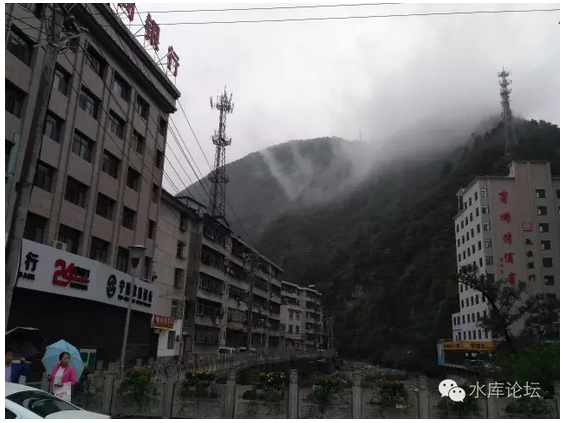
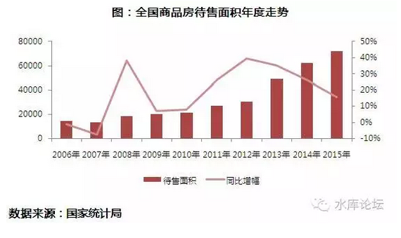
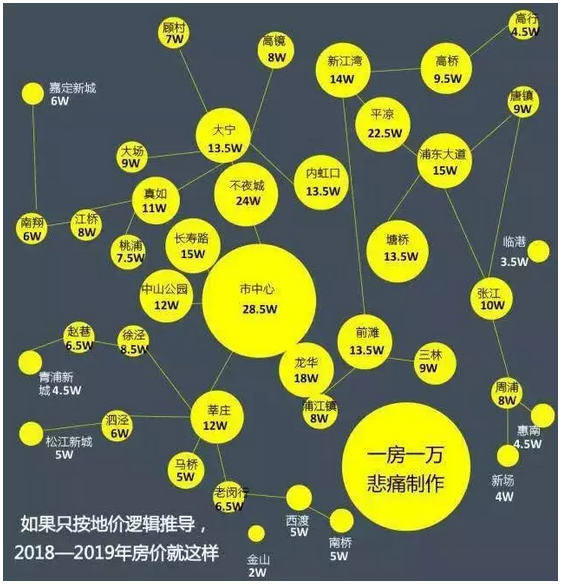
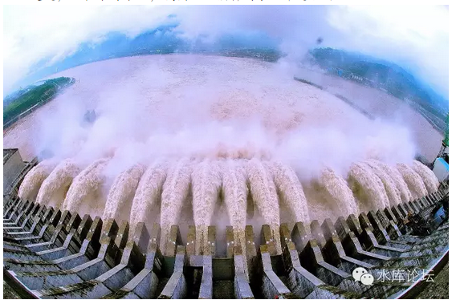

# 人民不是死猪

 

 

一）计划经济

 

在中国历史上，曾有人获得比今日首辅更大得多的权力。

 

对于上位者来说，所谓"法律"的约束是不存在的。"体制"的约束也不存在，甚至连官僚系统的反噬都不是问题。

更进一步，连神灵和祖宗的约束也不存在。

对于独栽者来说，他是至高无上的。拥有一切的权力。

 

 

可是他"执政"的结果，却是非常地糟糕。按照官方体面的说法，至少也是"国民经济濒临崩溃的边缘"。

一直到东方红，圣人出。太宗主政，搞了几十年的"改革开放"，才有今天的好日子过。

 

 

\#1125写2016.10月的[["楼市新政"分析]](http://mp.weixin.qq.com/s?__biz=MzAxNTMxMTc0MA==&mid=2651015111&idx=1&sn=d0b7624581f5eee7eb9c78399dc592e1&chksm=807211d4b70598c29760e22f443a3c1ed2528bda55904001aea7247c7b35252169b877ff5c4d&scene=21#wechat_redirect)，是基于"计划经济"的立场。

在上篇中，当政者是一个遥遥在上的上帝视角，通过"有形的手"，步下一个大局，打了好一桌麻将。

将全国的闲散资金驱赶进三四线市场，化解了"房地产库存"，为地方债和银行贷款解套。

既拉高了GDP，也化解了潜在的金融风险。

 

 

计划经济的问题是，他看待世界的态度，是"静态的，无机的，死板的"。

无机的，就好像做无机化学实验一样。

 

计划经济看待社会，整个十三亿人民，人民营营碌碌，便宛如木头人一样愚蠢，石头人一样呆板。

所以计划经济者可以用"计划"，可以用手腕，宛如驱赶牛羊一样，驱使着亿兆人民按照自己的心意行事。

 

人民不是死猪！

 

 

事实的真相，绝对不是这样的。

正确的"三观"，看待人口，绝对不会是一个静态的统计数字。

人民比狐狸还狡猾，人民比泥鳅还灵活，人民比毒蛇还残忍。

 

"社会"是活的，这就是计划经济失败的原因。

 

 

 

二）社会的反击

 

假设一个农民，一年耕地可以出产1500斤粮食。

上交25%作为皇粮，他自己吃饭和繁殖用完其他的。

 

假设我把税率提高到80%，并且每个月只给他25斤的口粮。

那岂不是每一个农民可以产出1200斤粮食"税收"。只要几年就能完成工业化原始积累？

 

 

这就是当年m的如意算盘，中国最早的计划经济。

可是实施的结果呢，任敏公社就是一场大灾难。

 

一个农民，当他面临25%的税率的时候，他可以耕地产出1500斤粮食。

可是当"边际税率"高达80%的时候，他的产出降到了只有500斤。

400斤交税，100斤吃饭。接着就是大饥荒。

 

这是1958年切实发生在山西的事情，愤怒的农民把土地"深犁"到6米深的深土层，完全没有任何有机质。

你不是要搞人民公社么，那就大家一起捣蛋。

 

 

人民从来都不是"死猪"。

人民是活的。

 

当你一条政策执行，必然发生"上有政策，下有对策"。

移花接木。重压之下，生存之道。

其博弈的结局，轻则"经念歪了"，重则南辕北辙。

 

绝大部分的"计划经济"政策，根本达不到"理论效果"。

因为人民是活的，会根据你的政策调整自己的策略。人民比油条还溜滑。

计划经济一定会失败，只有基于"人性"的市场经济才会成功。

 

 

 

三）去库存

 

"去库存"本身就是一个伪概念。

 

"去库存"指的是什么。指生产商生产了消费者不需要的产品，导致产品滞销。产业结构不合理。

 

 

"库存"应该怎么处理。标准的经济学教科书，给出了再明确不过的答案；

"谁造孽，谁买单"。

 

 

 

如果我是一个三四线城市的KFS，我在无人问津的山野兴建了豪华别墅。（例如李亚P）

则我就应该亏损。

房子卖不出去，就应该折价卖。

 

原本2000W的别墅，你就应该降价。降价到500W，200W，20W，2W

等到你价格降到位，房子自然卖得掉。

如果真心降到了2W/套也没人买。那你出租给农户，做养鸡场。

 

 

但有一点原则，是非常坚强，绝对不可以违背的。"[谁造孽，谁买单"]。

商人应该是盈亏核算的中心，赢的时候固然不要仇富痛骂富商，输的时候也不必怜悯施加援手。

 

 

而行政"去库存"导致什么结果呢。

如果你的肆意妄为，有政府妈妈统一兜售，有央行妈妈灌水买单。

那我下次何不玩大一点。

 

造房子就是GDP。一个地方官员想要出政绩，只要大规模地举债"建新城，造新楼"就可以了。

而新城新楼造好了，房子卖不出去。完全没有人气鸟不拉屎，怎么办。

 

没关系，到老大那里去哭诉。

让老大帮你"去库存"。

 

 

 

有些城市是永久性的废弃了。永远的没有希望了。

人口都流出了。农业社会不复存在，"小村庄小城镇"也就没有存在的必要了。

 

在这种城市开发地产，无论多少，都是浪费。

 

(陕西省宁陕县。一个河谷中的县城。令人感到绝望。整个城市完全没有存在的必要。)

如果库存轻易可以去化。

则只能导致下次更严重的"建城运动"。更严重的产能过剩。更不负责任的肆意供应。

NO PAIN NO GAIN，没有破产血泪的下岗史都是耍流氓。

我们有充足的理由相信，2016年的"全国库存"，最多只有一个-10%左右的下降。

而2017\~2018，库存还会反弹。甚至还会远远超过2015高位。

 

"计划经济"去库存，你并不能真正去除库存。

只能让有私心的官员，在三四线城市兴建更多的房屋。

 

 

 

四）价格泡沫

2015年上海楼市涨了约+50%

在股市崩溃，大小非解禁的大前提下，这个涨幅勉勉强强还说得过去。再静稳一二年，也可以盘整消化得了。

 

但是，2016年的"地王狂潮"，直接把土地基准价拉高了三倍。

按照"新地王"反推，2019年建成之后，整一个就是25/15/8的格局。

 

"去库存大麻将"更为糟糕的，是他[祸害了]上海。

 

 

 

我们必需要明确地指出一点，这个价位是站不住的。

当然我们认同上海的房价，迟早涨到30W/平米。但这个日期应该是2030年，而不是2020年。

 

即使按照每年+14%的纸币印刷速度，平均每五年"底部"夯实一倍。

250000/m依然不是喊口号就可以达到的。

至少不是在2020年。

 

 

政府现在把牌玩得这么大。真到了揭盅的时候，他能怎么办呢。

地王你炒高了三倍价格。真到了楼市开盘的时候，周浦8W怎么卖呢。

 

如果说"处房情结"，KFS开盘还不成问题的话。

任何一套房子，最终都要流入二手市场。到时候8W接周浦的肉猪们，又是怎样一个表情呢。

 

价格是一级一级比出来的，歧视链是一节一节连下去的。有逆袭但是没有颠覆。最终"炒新"热点风潮过去，整个价格还是呈梯次状的。

 

现在你强拉上海房价。

你有没有想过怎么收场。

 

 

当你撒了一个慌，你就必须再撒100个慌来圆谎。

当你扭曲了一个价格，你就必须再扭曲100个价格来配套。

 

你无端端的把上海预期房价锚定在了25/15/8，以后会遭遇非常多的麻烦事。

以后还得出政策，一个个打补丁。

后患无穷。

 

 

 

五）限购的不道德性

 

限购是不道德的。

 

在《[[车匪路霸话限购]](http://mp.weixin.qq.com/s?__biz=MzAxNTMxMTc0MA==&mid=402835543&idx=1&sn=b7c0ec5309db06b424238e35fef26710&scene=21#wechat_redirect)》一文中，我们说到，限购是极度不道德的。

好比我一套房子，说好了500W卖给门口的李四。

可是村里的二流子，癞皮狗王五非得要求300W卖给他。

 

"限购"的意思，就是财产权没有卖到"最高的价格"。

其本质，是对财产所有人的一种抢劫。和车匪路霸，强买强卖无异。

 

 

"限购"对一个城市的隐形伤害是难以言喻，无可估量的。

政府动辄，肆意地，狂妄地，重启限购。意味着这一个城市对"私有产权"毫不保护。

进一步来说，这个城市的价值也是褪色的。

 

 

而且"限购"本身会改变消费者的预期。

对于房主来说，考虑到"卖出就不能买进""卖出卖不到最高价"，会减少市场上的挂牌量。价格进一步没有洗平。

对于地方政府来说，限购之后，它就必须减少"土地出让面积"。否则地价就会大崩盘。因为买家减少。

而"减少土地出让"会导致市场上可出租房源减少，这反而更推高房价。

 

 

就总体而言，限购不增加一寸一厘的房产供应。纯粹在"分配"上做文章。

分配，又怎能使得整个社会更富裕。

限购对城市是[[饮鸩止渴]](http://mp.weixin.qq.com/s?__biz=MzAxNTMxMTc0MA==&mid=402854868&idx=1&sn=46c893bb972c51ffe6d51c28eeafe9c7&scene=21#wechat_redirect)毒药，又怎能作为"先进经验"推广。而且还作为"大杀器"的政策储备。

 

 

 

六）计划经济的反噬

 

张维迎近期有一场和林毅夫的大讨论。

其背后的实质，是计划经济和市场经济的大讨论。

 

张维迎认为，"一切产业政策都是错误的"。

你看似一场"宏图伟计"，一场巨大的计划。但其实你完全建立于自己的"规划"。而忽略了人性的"反抗"。

则你最终必然非失败不可。

 

只有基于人性的"市场经济"才是可持续长久的。

 

 

 

说起到"2016去库存"这一盘大麻将。

表面上，规划者似乎魁梧巨人，无所不能。但实际上，他任何一个目标都无法达到。

全是错误。简直就是挖了一个坑，等着你往里跳。

 

2016能否把资金逼进三四线城市，能否把三四线库存清掉。

我不清楚。（说实话）也并不关心。

 

但令人担心的副作用，是在这样"计划经济"的大旗下。短期内，诸多城市都累积了200%的涨幅。

包括但不限于南京，合肥，杭州，武汉，郑州，福州，苏州，甚至上海。

 

 

 

眼下，三四线的库存很有可能死灰复燃。恶性反弹。

而你一手创造了一连串"翻倍城市"。

 

在这些城市中，价格没有夯实。一二手没有充分换手，筹码没有充分洗干净。

价格几乎就是硬拉上去的。三四个月，一手房价就能翻倍。

 

请问，你留下了一连串的100000/m的城市，一连串60000/m的城市。

你准备如何收场？

 

 

只有在市场经济下，该破产的破产。

该改养鸡场的，改成养鸡场。

血泪下岗史，这样才是王道。吸取教训才会健康。

 

计划经济创造的麻烦，简直比他解决的麻烦还要多。

"政府不是解决麻烦，政府就是麻烦本身"\-\-\-\-\-- 美国总统·里根

 

 

在可预见的将来，最迟2018\~2019，今天硬拉上去的一批"十万六万"城市，就会给我们制造非常多的麻烦。

等地王开盘了，您是卖呢，还是不卖呢。

 

 

到时候，难保又是严重的"库存积压，高价滞销"。

然后，又会迎合要求政府出手，要求政府救市。《[[既得利益集团]](http://mp.weixin.qq.com/s?__biz=MzAxNTMxMTc0MA==&mid=2651014536&idx=1&sn=6d9e3de7db49560874e8433029599246&scene=21#wechat_redirect)》的能量是极大的。

 

 

也就是说，就在今时今日，我们已经预料到了二年之后的：

（yevon\_ou\@163.com，2016年10月7日晚）
