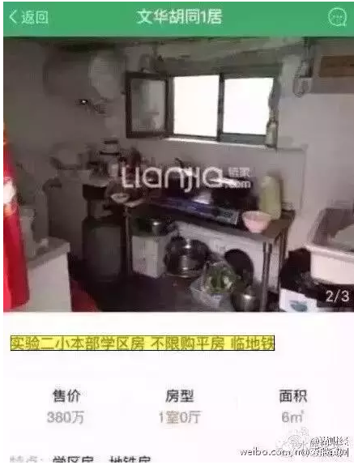
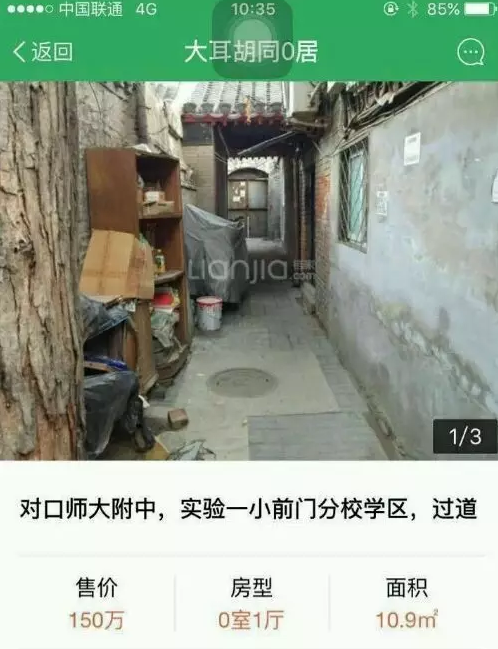
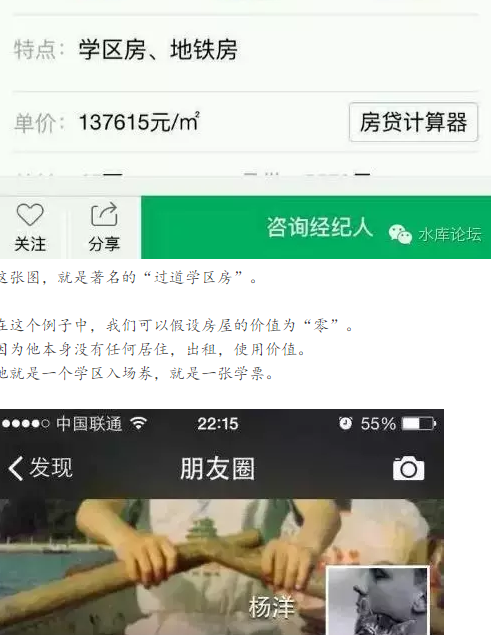
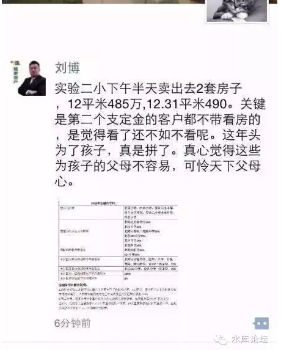
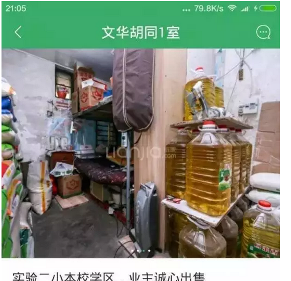
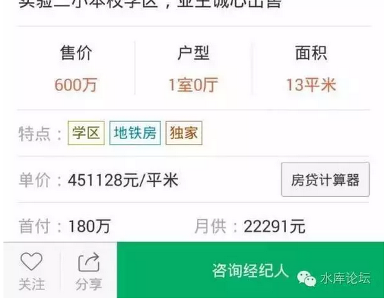
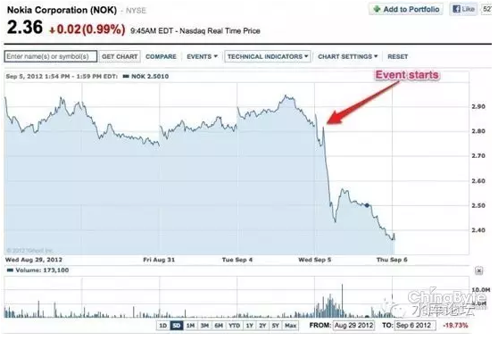

# 学区房的大风险 \#1130

原创： yevon\_ou [水库论坛](/) 2016-07-22

学区房的大风险 ~\#1130~
===================================================================================================================

相比收益，我们更关心：断崖式的归零风险。

 

 

一）学区房

 

2013年水库有个旧贴《我为什么不买学区房》

http://www.shuiku.net/forum.php?mod=viewthread&tid=3543

 

这是一个很奇特的帖子，有400多个回复。其特点是，主贴是空的。

因为哥哥启了个头，就去磕瓜子了。

 

回来一看，回复极其热烈。

于是就开始回回帖，接着就开始吵架。吵架吵了400多楼，道理基本都说清楚了。主贴也不用写了。

 

今天有空，回头继续写\#1130，讲讲学区房的来龙去脉。

 

 

二）学区房是什么

 

学区房是什么。在很多人的理解中，学区房意味着：

"房子，顺便还能读好学校"。

 

上次和几个北京人聊天，他们觉得北京人的态度，就是一茬子钱赚二茬子活。

凡事都要"多功能"。

仿佛多功能就是赚到似的。

 

而事实上这个观点是错误的。

世界上的事情，无非是"一分价钱一分货"，从来没有白吃的午餐。

你如果具有二份功能，你就付了二份的钱。市场是有效的，不会白送白给。

 

 

而学区房真正的意义呢。学区房="房子+学票"。

好比一个地区，普遍的二房是300万/套。而带学区的房子要贵一点，要500万/套。

那么，你买一套学区房。其实就是"300W房子+200W学票"。

 

 

 

三）学票有多贵

 

学票有多贵。这个问题一下子没法反应。很多人说价值混杂在一起，无法拆分。

 

但是我们可以举几个特例。如图。

\

\

通过这些北京的信息，我们可以看出，"学票"是有定价的。

因为对口的小学不同，学票的定价，有150W，300W，450W等各档。

 

这也同时解答了一个问题。

"学区房要买小"。

 

 

因为学区房的价值，无非是一张学票。

你150W的学票，平摊到50平米，每平米可以因此涨价30000元/m。

可是如果你是100平米二居，摊下来仅15000元/m

如果你是500平米别墅，差异仅3000元/m

有些KFS打着"学区房"的招牌，大户型比周边楼盘贵2\~3W，那就是坑了。

 

 

再比如说下例。

和6平米300W的房子相比。这户老奶奶多了7个平米。

可是你多出来的7平米，也要按照￥450,000/m来卖二百多万。

这就不合理了。

 

你当别人傻瓜了。

 

 

 

四）投资

 

我们可以按照"拆骨法"，把学区房的价值拆成"房子+学票"。

其中，学票的价值是固定的。

不会随室内面积大小而变化。

 

北京是一个比较学区房崇拜的城市，北京的"学票"，经过拆骨法折算后，价值大约在300万元/张左右。

上海浦东是200万/张。

浦西人看不起学票。

 

 

现在就回到了我们的话题，《我为什么不买学区房》

众所周知，水库是炒房子的。房地产是我们的主业，对于房产的研究伴随我们朝夕生活，每天想上十七八次。

 

但是，职业炒家为什么不买学区房呢。

因为当你买学区房，其实你并不是在投资"房子"。

 

 

当你花500W买了一套学区房。其实你是花了300W买了房子+200W学票。

然后，你要祈祷投资升值。

 

投资升值怎么办，例如500W的房子涨到1000W了。

这个时候，你再用拆骨法去看。600W房产+400W学票。

不仅仅房价要翻倍，而且学票价格也需要翻倍。

 

 

好了，现在问题来了；

-   到底是房产涨得快，还是学票涨得快

-   学票长线保值增值么

-   你对学票有研究么

我们的回答，是三个"No，No，No"

 

 

首先，我们是职业炒家，不是教育局干部。

我们恪守着"隔行如隔山，不熟不做"的铁律。

 

你说学票blablabla，很好，我听着。

可是这行我们不碰。隔行如隔山，跨界的成本代价是非常非常高昂的。

我们宁可不做。你就给我"非学区"房产够了。

我们喜欢[非学区]房产，不要任何[溢价]，就如同我们喜欢非品牌KFS一样。

 

 

蠢女人买房子，总是买最好的房子。总以为"职业炒家"手中都是顶级豪宅。总以为买好房子才是NB的人。

不是的。在《[职业炒家](http://mp.weixin.qq.com/s?__biz=MzAxNTMxMTc0MA==&mid=208229262&idx=1&sn=bf236451dda8c5f47620067476120db7&scene=21#wechat_redirect)》一文中，我们说得清楚。我们买[最易升值]的房子，而不是[最好的房子]。

很大情况下是老破小。

 

蠢女人总是以为，买房就要买最NB的房子。学区房就是一种最强功能的房子。

不是的。在职业炒家的眼里，只有升得快不快。风险和潜力。

你这一样是贵妇病。

要做减法，而不是加法。

 

 

然后，如果一定让我对学区房投资说二句的话。谨慎跨界的嘀咕：

我对"学票"的价值走势完全不看好。

 

 

 

五）学票的软肋

 

从"价值"的角度说，所谓"学区房"无非是父母的一个梦。

在父母心目中，它的描述是这样的：

"读了名牌幼儿园，才能读名牌小学，才能读重点中学，才能读重点高中，才能读重点大学。才能以优异的成绩毕业，进外企当白领，做机关做公务员，光宗耀祖"。

 

 

如果你切得细一点。他的逻辑链是这样的；

1）我对口的是好学校

2）进了好学校就有好教育

3）有了好教育就有好工作

 

 

我们需要指出的是，这"三段论"逻辑。哪一段都不对。

我们现在看待学区房，就好比沙滩上的泥足巨人。

 

有人说，"咦，这几年学区房不是涨的么"。

"哪怕如你发帖2013年，迄今学区房仍然是涨的。甚至涨幅比非学区还要高"。

 

但是这些是没用的。

你无法从价值上说服我。

 

 

你无法从价值上说服我。给我一个可信的，可靠的，可预期的合乎逻辑的推论。

你无法让我信服，我买的东西是真有价值的。而不是"庞氏"。不是类似于P2P一样击鼓传花的东西。

 

因为我们的头寸实在太大。转身不易。

一套二套的小老鼠，你可以买学区房。抽身快。尤其是赤贫的年轻人，人生难得几回博。

"神州泰岳"只要二十个涨停板，你会也敢死队一样冲进去。反正捞现钞就是正义。

 

 

但是我们不同。我们的"头寸"太大了。

在做每一件事之前，首先考虑的是风险。上限多少无所谓，下限一定不能跌。尤其是不能断崖式的下跌。

 

而学区房的问题呢。学区房面临[断崖式]的下跌。

他的价值，很有可能归0的。

 

我们不赌博，从来不赌博。

我们不投机，从来不投机。

我们买入一项资产的理由，永远不会是："它去年涨了"。

 

 

 

六）教师

 

学区房的第一个问题，他的"激励机制"是不对的。

 

 

好比我是一个厨师，我有一道拿手菜"水晶虾仁"。

当年静安宾馆凭这道菜征服了上海上流社会。宾客如云。饭店赚到了大把的钱。

老板给厨师涨工资。

 

好比我是一个导演。连续几部戏票房大卖。

随着我水平越来越高超，导演的声望越来越高。明收入，潜收入，各项好处肥腴得天上人间。

 

这些都是"正激励"。

正激励的意思，是"做得好，加工资"。一个人可以拿到他的勤劳报酬。

 

 

而在"学区房"制度下呢。

学区房的受益者是房东！

 

好比我是一个特级教师。为了班里几个顽劣，而且愚钝的学生，那是耗费了心神。

如慈母般的关怀，好不容易让小朋友乖乖学习，天天向上。

杨千桦电影《可爱的你》

 

 

而结果呢；

结果你这成了名校。最美校长的名誉传遍了新界北区。

你周边附近的房子都成了"学区房"。房价纷纷升值。

房东发了大财。

 

而学校呢，老师呢，辛勤付出的老师呢。

没有，什么也没有，一分钱回报也没有。

 

 

所以他这个"激励机制"是不对的。

公立学校的老师，并没有激励，去关心学生，去培育学生，去营造自己的口碑。

钱都被房东赚了。

 

在西方社会，或者中国的私立学校。

校长赢利的主要手段是"收费"。好的私立学校要几十万一年，但是家长还愿意付这钱。

"高收费"的基础下，校长就有能力给教师发高工资。监督校工服务，改善学校设施。

 

 

可是在"公有制"制度下，学校是不收费的。

"好老师"的价值外溢到了房地产上面。

 

许多家长，对着清单目录，绞尽脑汁进了排名靠前的小学。

你以为你买定"学区房"，从此松了一口气，小孩子就能受到良好教育了？

 

不是的。你买的那一年，是该学校"教学质量"最好的一年。此后一路走下坡路。哪一年都比今年差。

因为老师没有激励。

公立学校，肯定是越办越差的。

 

 

七）教育局

 

接着你又问，"从整体而言，公立学校并不差。也能和私立平起平坐"。

 

 

这个说法是对的。你看国企也不差，也能和私企平起平坐。

这二年，国企甚至比私企混得更好。

 

可是这件事的背后是什么，是"资源投入"。

就好比国企 vs 私企。国企是肯定搞不好的，效率低下，人事腐败。

可是每过十年，中央突然就给你发了20亿。

 

鸟枪换炮，国企统统搬入了最好的政府办公大楼。

领导的奔驰，奥迪，纷纷买起来。

小兵们加几十级工资。

一夜之间抵得上你十年奋斗。

 

而这些钱哪来的，这钱可不是靠国企自己"赢利"赚来的。

是靠央行妈妈，亲妈注资的。

每过个十年左右任期，央妈妈就给你"增资扩股"。从90年代的1000W，到后来的一亿，十亿，百亿。

混国企系统的人都知道。

 

 

对于教育系统，他的原理是一样的。

"公立教育"肯定是完蛋的。里面的人事斗争，政工倾扎，编制内人员有1/3是老师就不错了。

可是每过十年，区教育局就会给你一笔大钱。让你鸟枪换炮，该修的全部修修，该换的全部世界一流水准。

 

 

在《[城市规划导论](http://mp.weixin.qq.com/s?__biz=MzAxNTMxMTc0MA==&mid=401002514&idx=1&sn=0f99070edf8ec7390c1c5b987f446f5b&scene=21#wechat_redirect)》一文中，我们说道，政府最喜欢开发什么样的地区。最喜欢兴建什么样的地铁。

答案是：政府持有空地最多的地区。

 

同样道理，政府会扶植怎样的学校。

答案是：新学校。

 

 

如果你花了大价钱，买入最昂贵最优质的"学区房"。并指望着自己的"名校"永葆青春。

你会失望地发现，小业主手里的学区房，越来越走下坡路。一直到十年之后的破破烂烂不堪。

 

而教育局拨重资，扶植打造郊区的新校。

因为地皮都在他手里。他可以"卖地"。

你手中的公立教育学区房，注定会一天天地烂下去。

 

《我为什么不买学区房》。我不是看不起学区房，我是不愿意趟这个浑水。

从任何一个角度看，你都难以说服我这是长期保值的资产。

 

 

 

八）教育局的黑暗

** **

作为一个世世代代混教育系统的家族来说，俺还要补充一句：

-   教育局，脏，真脏

-   教育系统，黑，真黑

（当然，由于哥哥这一系太铜臭味。快被开除书香名单了）

 

 

教育系统可以说是中国各部委中，最脏，最王八坑子的一个系统。

为什么，因为教育系统特别地"穷"。

穷，再加上一堆的知识分子。小鸡肚肠的事有多少，可想而知了。

 

 

在中国各大部委，受人受气绝不是相同的。

最开明，最舒畅的，肯定是和"钱"打交道的。无论是招商引资，还是外经贸，商务部。

凡是"做生意"的部委，日子都很滋润。人际关系也比较和谐，反正财帛花不完。

 

而最脏的，就是那些"又穷""又酸"的部委。

小鸡肚肠，王八绿豆眼，畜生嘴脸。

 

 

你"学区房"赚了那么多的钱，教育部那帮家伙眼睛都快要绿了。

中国的规矩是，一旦你赚了钱，权贵就要跳出来"改规则"。

 

你如果学区房能升值大几百万的话。

教育部如能按捺得住，打死我都不信。

 

 

他肯定会跳出来，用种种方法，把审批权抓到手里。

把"学区""学区房"的溢价，抓到教育部的手里。这是多大的一块肥肉啊。

 

虽然我不确定具体会发生些什么。

但是我对xxx的人品是确信无疑的。

 

 

 

九）有利益的地方，就有犯规

 

学票一文不值。

出xxxx钱，包进。联系电话：139xxxxxxxx

 

（本节略）

 

 

十）教育的贬值

 

我们回顾三大逻辑。

1）我对口的是好学校

2）进了好学校就有好教育

3）有了好教育就有好工作

 

一般来说，"地段生"是很受歧视的。

哪怕你进了名校，你和"条子生"也是分班的。会单独分配给你老师。而且老师往往很不给力。

毕竟学校没有收你好处，他凭什么用心教你。

"进个好学校，就有好教育"。这句话是要打个很深的购物折扣的。

 

 

进一步讲，"有了好教育，就有好工作"这话也不对。

简单点说，教育在贬值。

 

 

目前台北考大学的录取分数线是0.5分，满分650分。

按照马政府规定，写一个名字1分。

也就是你只要能写自己的名字"猪三弟"，你就能上湾湾的大学。

 

出现这种情况，一方面是台湾的扩招。大学的产能急剧增加。

另一方面则是人口数减少，baby数减少。

 

 

类似的情况，在中国，在上海，同样也在发生。或许都不用下代人20年。

因为"教育"其实是一种产业。和饭店没什么区别。

你只要资源投下去，"教育"的产能是可以不停扩张的。

而《[一夫一妻制多妾制](http://mp.weixin.qq.com/s?__biz=MzAxNTMxMTc0MA==&mid=2651014609&idx=1&sn=c67a85d4cd1dc6520d0ef2de303cd713&scene=21#wechat_redirect)》，人口的形势不乐观。

 

 

虽然官方不说，但"大学生"的含金量不停贬值。而且贬得一塌糊涂。

1979年恢复高考时，大学生是"国家干部"。

 

只要你有大学文凭，直接就给个县长科长之类的干起。

每个月国家还发粮油。上了吏部名单。

 

可是粮油早就不见了。2016年今时今日，上海的一本率早就超过了20%，大学生卖猪肉都上不了新闻了。

 

哪怕你不仅仅读大学，你还读"名校"。

可是复旦，交大，一样在扩招。复旦和交大的文凭，一样在注水。

更可怕的是连研究生，博士生都不值钱。

 

 

记得2004年，早在2004年，在ehome上和人吵架。

对方说："读最好的幼儿园，最好的小学，最好的中学，最好的大学"。

哥哥冷冷冲了一句，"然后和你一样，做毕业3000/月的屌丝小白领"。

 

"利出一孔"，但是这个渠已经塌了。

"万般皆下品，唯有读书高"的进士联盟已经崩塌了。

现代社会的竞争，已经越来越不是"文凭"之间的竞争。随着红二代和社会板结化，未来"东京大学"毕业的学员，只配去日资公司做个小职员。

 

 

我们知道，"学区房"是很贵的。

如果你单指单价的话，北京的"学区/非学区"可以贵到180%

上海的浦东"学区/非学区"可以贵到160%

 

许许多多的人都在骂房价贵。

可是他们再掏80%的钱出来买"学票"，却是完全政治正确。

 

 

你买一套房子，需要一生一世的积累，需要几代人的凑钱。能让你骂娘骂上几年。掀起滔天的民意巨潮。

可是你又怎么不骂学票贵。

你有没有想过，你花那么多钱买来的学票。真的值400万么。

 

-   你想过这400万投下去，最终只能培养一个月薪3000元的小职员么。

-   你想过这400万投下去，成本效益比完全不成收获么。

-   你想过这400万投下去，就是买了个假古董么。

 

 

我们对于"学票"的恐惧，在于学票本身不停的贬值趋势。

竞争的主战场不在这里。

"茴"字几种写法，"之乎者也"越来越不重要。复旦毕业不如科长小舅。

 

而且这个趋势目前还无可逆转。

 

 

（我甚至都没有说道：毒教育）

 

 

 

十一） 收费站

 

插播一条广告；

"你去买学区房，好好读书。我在前方的收费站等着你"。

 

欲知收费站是什么，请关注水库论坛。

 

 

十二） 伪学区

 

如果说前上述几年，还仅仅是对"学区房"的批判，对学区房价值的不放心。

则下面一节，真的让人哭笑不得了。

 

"浦东成功地以10%的学校，创造了全市90%学区房"

 

 

这是上海地区独有的现象。北京也没有这种笑料的。

你去浦东，找浦东的中介，你会发现无一处不是"学区"。

 

浦东遍地都是学区房，区重点第二第三排，到了中介嘴里，也能成为"一流学区"。

拜托，浦东连学校都没有。哪来的学区房。

浦东仅有的二所高中，进才建平，在上海也是不入流。

 

 

有些妈妈打着"为了孩子，不惜一切"的旗号。

这个旗号是彻底的唯心主义。话说到这份上，任何劝说都无意义。

但是，好歹，你买一所"真学区"。不要买"伪劣产品"好么。

 

还有很多妈妈举出"千帆教育网"。你脑子有病，呸。

千帆是什么，是教育局开的么，是国家正统么。不过就是个电商。

有什么公信力。你混千帆，只能说明你Low，下等人。

 

 

游戏的玩法，不是这样的游戏规则的。

"复旦附中"的学生，大约有50%的概率可以进复旦。也就是你中流即可。

而湖南省考入复旦，一共只有6个名额。

天差地远，不可计理。

 

所以进复旦的首要前提，是尽可能地进"复旦附中"。

进复旦附中的首要前提，是别买浦东的"伪学区房"。

这些道理，千帆永远也不会教会你的。

 

 

"学区房"这些东西，主要是移居上海的一些湖北，湖南妈妈们搞出来的。

因为在湖北省，湖南省，普通人很难\~几乎没有出头之路。

"科举"就显得特别地重要。

 

湖北，湖南妈妈们以她们的切身经历。自以为；

-   买了学区房就能上名校

-   上名校就能好教育

-   好教育就能好工作

 

其实这三句话哪一句都不正确。你只不过在挥霍你的工资，做无用功罢了。

然后再凭人口数量死堆。

 

 

而上海土著人，是根本不认可"学区房"概念的。

-   一方面，上海的小学差异并不大。并不存在明显的"第一梯队"。

-   上海人基本都有办法，"走后门"。

-   即使没办法。家门口的学校才是名校，徐汇第一，杨浦第二。

 

 

对于"占90%学区房"的浦东伪学区，上海人是完全不认可。也不会有人去买的。

这样你的客户群，就非常集中在一些YP妈妈。

这就是一个典型的小众市场。

 

学区房的买卖，目前看来是非常"庞氏"的。

他能够存在，能够升值，有且仅因为有人在"买"。

而你深入看使用价值，永恒价值，是千疮百孔的。

 

 

 

中国人的性格，坚毅不拔，而想象力不足。

很多人在争论，"学区""非学区"哪一个涨得更快。

计较二三个百分点的涨幅。

 

但其实这是毫无意义的。因为中国人缺乏想象力。

你真正需要担忧的，是"断崖式下跌"。

你如果看诺基亚的股价，他是瞬间跌到零的。而不是慢吞吞地和你分析什么市盈率。

同样的道理，也适合于"学区房"。

我们真正担心的，并不是学区房／非学区哪个涨得更快。盈利百分点。

 

我们真正担心的，是学区房"瞬间归零"的风险。

所谓你赚我息，我赚你本。

 

 

象那种6平米400W的学区房。很有可能就是最后一棒。

而他终究会有最后一棒的。

你处于一个"饱受攻击"的位置。随便哪一个文件出台，对你都是不利的。

 

十三） 结语

 

如果一套房子，既能给你舒适的生活享受，又能让你进一所不错的小学。

这无疑是一件好事。

 

我们真正关心的，是"溢价"。学区房相对于非学区的溢价；

-   到底是500W和300W，溢价200W

-   还是330W和300W，溢价30W

 

 

我们并不反对学区房，我们只反对："溢价过高"。

万事均有价，万物均有合理估值。

 

目前学区房的市场，主要由一些湖北，湖南的"高分低能"妈妈所主导。

她们掏出了自己的血汗工资，不惜血本堆砌在学区房上。并把价格砸高。

 

但是我们从功能，趋势，风险等各方面分析下去。我们认为"学票=房价80%"目前的估值，是站不住的。

按照这趋势再下去，"学票=京沪房价100%"，这可真的需要非常非常大的想象力......

 

学区房这玩意，连20年寿命都活不到。悲观一点的，乃认为10年就顶天了。这段时间，只够你塞二个小朋友。

-   世人总是说房价有泡沫，可其实房价N年都没泡沫。

-   世人总是说学区房无泡沫，学区房涨得快，要跌也不会跌学区的。可其实学区房才是一个断崖式大泡泡。

我们不买学区房。是非之地，君子裹足。

你始终无法说服我学票的"真实价值"何在。

谁爱买谁买，自有冒险家的乐园。你爱你去。

 

我们更担心的是学区房背后深不可测瞬间归零风险。

 

 

（yevon\_ou\@163.com，2016年7月20日午）

 

\* 最后利益披露一下。本人小孩就读于国际学校。

 

 

 

 

补充一下：

 

如果你有5000W净资产，组成部分是1000平米房子。则你晚上是睡得着觉的。

如果你有5000W净资产，但是是1000条最新款HERMES丝巾。你晚上是睡不着觉的。

 

假设你有5000W净资产，是十套北京房子。你晚上是睡得着觉的。

假设你有5000W净资产，但是十套"过道学区房"。你晚上是睡不着觉的。

这就是"资产质量"的区别。致某人。
