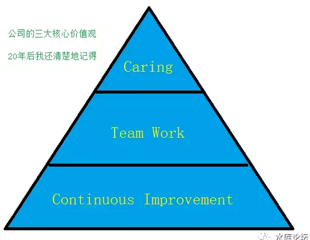

# 上海楼市往事（3）\#1160

原创： yevon\_ou [水库论坛](/) 2017-01-21

 上海楼市往事（3）~\#1160~
========================================================================================================================================================================================================================================================================

副标题：天下无敌的公司

时间：1998\~2001

 

风格与路径依赖

 

 

一）公司

 

很抱歉，第三篇依然是铺垫。和房产完全无关。

第四篇开始，才讲炒楼的入门。

 

 

在"水库论坛"目录中，有四篇文章是和房地产无关的。它们是：

 

-   [市场营销入门
    \#210](http://mp.weixin.qq.com/s?__biz=MzAxNTMxMTc0MA==&mid=208571927&idx=1&sn=532a563f3c6b835bd9b949d8b41d0a5d&scene=21#wechat_redirect)

-   [Re-Sale为什么这么难
    \#220](http://mp.weixin.qq.com/s?__biz=MzAxNTMxMTc0MA==&mid=208796137&idx=1&sn=1d714898a771193cb19e4c8ed9abee13&scene=21#wechat_redirect)

-   [如何运营一家企业
    \#230](http://mp.weixin.qq.com/s?__biz=MzAxNTMxMTc0MA==&mid=211491245&idx=1&sn=256db1fe70fd145ebcbe70b71748b9fb&scene=21#wechat_redirect)

-   [无中生有的高阶
    \#240](http://mp.weixin.qq.com/s?__biz=MzAxNTMxMTc0MA==&mid=211504453&idx=1&sn=ae38f511e21d91b7936b16407b8e5240&scene=21#wechat_redirect)

 

在职场的时候，我是做Marketing的。

"营销学"是我（前半生）所学精华。对于一个话痨而言，不把这些东西整理出来，睡觉也难眠。

 

因此原谅我，再用一篇的篇幅来唠叨。商场的手法和精华。

 

 

 

二）无敌

 

我以前任职的那家公司很牛，非常牛，号称"天下无敌"。

500名单位列497位。

 

 

这个公司的牛强之处在于，任何一类商品，任何一个行业。

只要我们公司挤进去了。

在"同时代，同科技"的前提下，我们的"成本"可以比你低-20%。最终逼得你无路可走。

任何行业。

 

 

任何行业。

只要我们去做了。我们就把成本，每年降低1%

二十年以后，就降了20%，成本是竞争对手的80%

 

那竞争对手就没得玩了。直接大棍子打死。

走自己的路，让对手无路可走。号称"天下无敌"。

 

 

而具体的做法，当然不是口炮这么简单。它主要是二条线，MET和MIP。

MET：Manufacture EfficiencyTechnology，工业效率科技

MIP：Margin Improvement Project，毛利提升计划

 

 

 

三）MET

 

首先说MET。MET指的是生产工艺流程之中，对成本的降低。

 

好比说有一个锅炉，以前每小时可以炼3缸药膏。现在经过改良配方，改良蒸汽压力，每小时可以炼制4缸药膏。[\[1\]]

 

那么这个"锅炉"的设备利用率就提高了。"折旧"就摊小了。"固定资产"投资就更少了。甚至连库存都少了。[\[2\]]

 

 

 

另一个例子，牙膏这种商品，在过去30年中，最重要的科技革命，当选为"底部灌装技术"。

以前膏体是正面灌进去的，现在都是底朝天，底部灌入。

 

"底部灌装"的优势在于，灌膏和安装喷口可以同时做。这就节约了生产的时间。[\[3\]]

哪怕这么一点点微不足道的改进，在生产上，也意味着更高的生产力。

 

 

MET的意义在于，在生产部，他就专门养了一批人。

这些人整天什么事也不干。就在那里奇思妙想。"怎样才可以把成本再降低一点"，再降低一点。

 

 

以前BMW生产一扇汽车车门，需要129个零件。

经过1950\~2000年的不断改进。最后只剩下19个零件。

它尽量铸造成合并件。这样不但减少了库存，而且使得组装更加容易。工人成本降低。

 

这个是什么，这就是高科技黑科技**真科技**啊！

 

 

 

四）中国企业的困境

 

在我之前的杂文中，有一篇《老婆喊我组装自行车》\#F390.

里面说，"凤凰牌"自行车，他的说明书从1950年代开始，就从来没有修改过。技术黑得象钳工手册。

 

而"产品"的设计，极其不合理。充斥着大量的钢丝和螺扣。

这些东西，还需要客户手工来安装。最重要的是，居然还装不好。很容易出岔子。

 

 

从80年代起，国门打开。中国货在国际市场上，就很容易给人一种"低质低价"的感觉。

是中国人的工艺不过关，是中国工人粗心懒惰么。

 

未必。其实法国人也很懒，意大利人也很懒。

哪怕英国美国，战斗机一样虚焊。

 

 

 

真正的问题，出在中国的企业，从计划经济苏联体制转变过来。

企业中根本就没有"产品经理"这一个职位。

 

产品经理就是负责画"自行车说明书"。负责设计自行车结构。

负责一体化，减化安装，重视客户友善度。

整天琢磨MET，每年使得企业制造成本下降1%的那个人。

 

 

中国传统的部门组织。对于"生产"看得很重，车间经理都是正职。

而对于"设计"看得很轻。对于MET则根本没有概念。

相当于当兵的没有总参谋部。

 

 

目前，仅在中国的BAT，小米，华为等民营企业，实现了先进的产品经理制度。

而在绝大多数的内地省份，尤其是国营企业。体制远未改革。

这才是"中国制造"和"西方设计"的核心差异。

 

 

 

五）第一次购买

 

说完了生产端，我们来说销售端。

与MET相对应的，在消费者这一头，则是MIP。

 

很多人都惊异，"产品都造出来了，如何进一步降低成本"。

答案是：偷天换日。

 

 

全世界所有的"品牌经理"，以快消品公司为首。

P&G的Markeing，几乎就是全商界的黄埔军校。

因为快消品公司对消费者心理的研究，已经到了毫米级的地步。

 

对于消费者来说，他有一个非常明显的现象："初次消费"门槛。

好比你尝试一个新品牌的洗发水。

第一次去某饭馆。

第一次去小店做指甲。

你是不是会"小心翼翼"，再三比较。甚至要上点评网站，看看商家的口碑和排名。

 

 

因为对于你的"第一次消费"，你是心里没底的。对于商家的服务品质一无所知。

它有可能非常令你失望，烧的菜非常非常难吃。

让你组织聚会丢尽了脸。

因此人类的"第一次"消费，会特别地小心。就象只多疑张望的狐狸。

 

绝大多数的人，外出聚餐，名单就那么十几家餐厅。

哪怕二家店就在隔壁。

一家吃100次，一家吃0次。

 

 

而对于"第二，第三"次消费。就没那么多的讲究。

因为你已经去过一次，熟悉大致有谱。

 

好比你买包饼干。尝过了，知道味道不算惊艳，但也大差不差。

反正能在货架上存活下来的，大家脚碰脚。

 

 

因此当你第二次购买时，警戒心就会大减。

当你第三第四次购买，浑浑噩噩如梦游。随手拿了扔进购物车。连价格都不看。

 

 

 

六）MIP

 

和"第一次购买"对应的，则是MIP。

 

-   第一次：你警惕，我惊艳

-   第二次：你放松，我保持

-   第三四次：你糊涂，我偷鸡 [\[4\]]

 

 

商场的竞争是极为激烈，极其惨烈的。

刺刀见血，拼到最后一寸红海，再也没有多余的利润。

 

因此商界是没有能力"提供"给你更好的产品的。

如果次次象"第一面"的质量，惊艳是惊艳，可没钱赚要亏本的。

 

 

 

具体的做法，秘诀是"第一批"和"第二批"给你不同的产品。

"上市装"和"成熟配方"，永远是二批配方。

 

新产品面世时，一定是处于它生命周期中最好的状态。用料不惜工本。

"六个月"之后，就开始改配方。

 

 

 

按照Marketing的规矩，从"上市装"到最终把产品做死掉。

MIP可能要有近30个版本之多。

你以为你在超市买的是同一件商品。其实每一个批次质量都不一样。

KFC的鸡也越来越难吃了。

 

 

每一次改动，都要做消费者调查。

盲测您觉得"这款"怎么样。和老款相比如何。会有多少客户流失。

 

换更差的原料，成本是下降的。

品质会有极极细微差别。但日积月累，消费者终有一天会感觉到的。

这时候就需要消费者调查。权衡得失。或换MIP路径。

 

 

因此哥哥在超市里，是向来不买"老款"的。那些上市很久的牌子。

 

 

 

七）有计划地丧失市场份额

 

和MIP相关的，则是"有秩序地丧失市场份额"。

 

 

好比我们公司，本来在美国市场是垄断的。份额70%以上。

可是1960年开始，P&G推出了最恐怖的竞争品牌：Crest

 

在之后的三十年中，Crest每年增长1%

我们每年丧失1%市场份额。[\[5\]]

当我进公司时，已经差不多是35%：35%

 

 

每天中午吃过午餐，全公司上至总经理，下至看门前台，大家一起去洗手间刷牙。

一天刷三次，保护牙齿。

清一色，人手一支Crest。绝没人用本公司自己产品。

为什么呢，最了解你的是敌人啊。

 

因为俺们公司MIP做得实在太多。这些事就是我操刀的，心知肚明。我自首，我坦白。

相比之下，Crest就厚道得多。MIP也做，天上一月，地上一年吧。

 

 

然并卵。谁是最伟大的公司，谁是大赢家，谁以公司而自豪。

当然是我们啊！碾轧。

 

 

中国人长期受的毒教育，形成了一种思维定势。

"市场份额"只能增加，不能减少。表忠心表决心永远都是"做大做强"。

 

哪怕公司要套现，要利润。那也是被"整体收购"。被别的公司整体买下。

而你产品"市场份额"呢，依然不变要"做大做强"。

 

 

这是极度错误的。全中国可说没有一家公司，专心致志，有计划有秩序地将自己"市场份额沽现"。

 

在过去30年中，P&G的份额，每年增长1%

我们每年丧失1%

然并卵。

 

在这个故事的背后，Crest一直是亏的。连续亏了三十年。所有的利润总和约为零。

而我们一直是赚钱的。甚至是华尔街最赚钱的公司之一。税后能保持着20%的净毛利。

股本回报率，股本红利可以排进前三。

 

 

事实的真相是，我们把"市场份额"卖给了你。你想要，你拿去。

而我们获得了20%的红利，并把它分给股东。

 

因为长期看，"市场份额"是一种很危险的资产。我们需要把它变现。

卖祖产卖了个好价钱。

 

 

 

Kodak曾经占据全球胶片市场的90%，最惨的时候富士不到10%

可是结果怎样。柯达一夜之间破产，巨无霸怪兽轰然倒地。整个胶片市场荡然无存。

 

科技时代的变迁，是会摧毁一个市场的。

想想PC，打印机，显示器，数码照相，当你千辛万苦占领一个市场时。整个市场却垮了。价格崩溃，份额最大的你受伤最深。[\[6\]]

 

 

既然如此，当年何必要花大钱，千辛万苦把"市场份额"抢到手。

趁高位，削减投入，带钱走人。把"市场份额"卖给竞争对手不好么。

 

仅从经营理念来讲，就甩国内企业十七八条街。

 

 

 

八）企业的灵魂

 

盛田道夫曾经说过，"凡事只怕认真"。

 

日本人培养管培生，他就让你擦马桶。用指定的洗洁精，指定的姿势，把同一个马桶擦七遍。

你不需要质疑桶圈早已无菌，你只需要认真擦七遍就可以了。

 

而一般的人只要擦到第二，第三遍。

他们就会东倒西歪，偷鸡偷懒。找借口找理由，再也不肯好好擦了。

 

这样的人，就可以甄别出来。

将来也不会有大的出息。

 

 

 

曾经有一段时间，我将"企业管理"想象得复杂无比。

你去市面上买几本书，动辄就是"管理"，加强管理，依靠管理。

而你将三百页看完，"管理是什么"还是一头雾水。

 

而在500强待过，你才知道"正规军"的洗礼。

管理就是"认真"。

 

 

 

从来不存在"一招鲜"，一个金点子，就可以销路大增一步登天。

"奋斗剧"都是骗人的。

 

真正的企业"管理"。他是由无数件琐碎的小事所组起来的。

锅炉每小时3锅变4锅。板材的厚度由6mm减少到5mm。新设一个RDC，节约区域的运费。

新找到二家供应商，对产品进行MIP，发掘自媒体广告渠道......

 

 

 

每一件事情，都仅仅是微不足道的改进。对我们20亿的生意，裨益可能只有几十万。

有一个笑话，说是AA航空的航空餐上，减了一枚酸黄瓜。每年就节省了几十万美金。

可是，这样的事情，我们每年要做50件。

从生产部，运输部，销售部，广告部，财务部，人事部，IT部，每一个部门都在持之以恒地"改善效率，降低成本"。

 

五十件累积，成本就下降1%

持续二十年，成本就下降20%

"管理"就是认真。

天底下本没有捷径，你一件件地去做。有心细如发的耐心，坚毅不拔的性格，你就能比同行们做得更好。

天下只有夕阳企业，没有夕阳行业。

我们进入任何一个行业，都能把别人干死掉。走自己的路，逼得别人无路可走。

 

 

我把这篇写出来，就是为了告诉各位这个道理。

 

 

 

九）路径依赖

 

也有人问，"你这公司这么NB，那为什么世界500强排名第497位，而不是更高啊"。

 

 

Good Question，因为这里面牵涉到一个严重的问题。

我打个比方，苹果手机，目前热卖的是iPhone7.

 

我们公司去做iPhone的话，肯定比苹果做得更好。

成本比苹果更低，每年一个点，二十年后iPhone7只要你的80%。

 

可问题是，二十年之后，你是在用iPhone14，iPhone28，还是更高。

或到那个时候，还有没有手机？

 

 

 

这就是区别。这家公司，是"成本导向型"的。核心竞争力是降低成本。

而这个世界，并不仅仅是成本导向型。还有"创新导向型"。

飞快地推出iPhone 8，9，10，并掠夺大量的利润。

二十年后，哪怕我把iPhone7的成本降到再低，又有何意义？

 

除非地球象《三体》一样把科技锁死了。那你才是无敌的呀。

 

 

 

我写这篇文章的意思，是告诉大家，人生的"路径依赖"是非常严重的。

当我还很年轻时，"建三观"时，我进了一家"成本导向型"公司。

这对我的一生，都造成了非常重要的影响。

 

总体而言，资本市场至少有几大流派；

1）成本导向型。坚持价值投资

2）趋势投资者。喜欢追涨杀跌

3）药单流

4）疯魔流

 

对于我来说，其实路已经"走死"掉。我永远都是成本型，大户型低单价。关注价格方面的安全边际。

你让我追涨杀跌，追热点，炒板块。对不起，俺学不会啊。

 

 

长江后浪推前浪，前浪死在沙滩上。

我的流派已经被锁死。而新人还可以改。

 

 

 

（yevon\_ou\@163.com，2017年1月20日晚）

 

 

 

[\[1\]] 伴随轻微的质量损失

[\[2\]] 因为"供货时间"的缩短，仅需要维持更小的库存

[\[3\]] 其实还有更美丽的膏体，和更少的气泡

[\[4\]] 传说中的"交往久了，渣男本色"

[\[5\]] 其实基于人口的图景。这个解释更为恐怖。因为老人死去，年青人成长。每年更换1%的人口。你可以理解为所有的老客户都是我的，所有的年轻人都是P&G的。

[\[6\]] 想想中国政府当年花大价钱，扶持国产胶卷厂商乐凯的闹剧。
