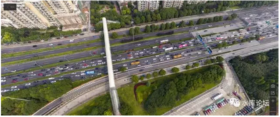

# 上海楼市往事（3）\#1160

原创： yevon\_ou [水库论坛](/) 2017-01-21

上海楼市往事（3）~\#1160~

副标题：入行

时间：2001年

 

人的一生，靠三次关键选择。

 

 

一）框架

 

人的一生，有起有伏。有成功有失败。

赢家和输家，差距数以百倍。

而他们本身"勤奋"并没有那么大倍数。

 

 

对于人来说，方向远远比努力更重要。

在《[列兵和阶层](http://mp.weixin.qq.com/s?__biz=MzAxNTMxMTc0MA==&mid=400767707&idx=1&sn=efe96aeaf2961d43ddf8718961c35994&scene=21#wechat_redirect)》一文所说的，赚钱关键看模式。

A7有A7的模式。

A8有A8的模式。

A9有A9的模式。

A10有A10的模式。

 

你在菜场划鳝丝。那么无论你比别人早起二个小时，晚睡二个小时，你的收入增加是有限的。

不如读个大学，出来就是白领。直接就是码农。

打工做得再好，不如做老板的。

老板做得再好，不如姓赵的。

 

你能获得多大的成就。关键不在于你本职事业做得多好。

而在你从事什么事业。

 

 

二）节点

 

那么，你是会当一个菜场划鳝丝的小贩。[\[1\]]

还是贩卖中国黄页的苦逼小业主。

还是当马云呢。

 

随着"框架"下一步而来的概念，则是"节点"。

在节点处，人生产生了分岔。

 

 

 

举例来说，你初中成绩放榜。

是退学跟舅舅跑长途呢，还是高中大学继续深造落户留在北京。

 

读的专业，是计算机码农的"通讯工程"。

还是分配去煤井矿山的"地质工程"。

 

嫁给A，还是嫁给B

 

卖房去美国留学；

还是极其倒霉地签证没办出来。于是北京房子不卖了.........

 

 

 

人生的抉择无处不在。当你决定了"卖房出国"那一刻起，那你在美国伯克利学院的成绩，其实是不重要的。命运已经被决定。

 

遗憾的是，绝大多数人是"平均"分配他们的时间精力和"关注度"的。

他们以为，认真用功读书，就是勤奋。

在实验室看书到午夜二点，就是勤奋。

 

而他们到了"人生大事"，却是轻率的，漫不经心的。

买一套数百万的房子，赌上十几年的收入。做决策的时间，花费准备调研时间，不超过5分钟。[\[2\]]

心中还惦记着下午的会议............ [\[3\]]

 

判断"轻重缓急"，本身就是一项极端重要的超级品质。

 

 

 

三）三搏

 

对于绝大多数的人，除了革命伟人。人一生中的"关键抉择"，或许就三次，最多。

搏对三次，就是人生赢家。远远处于同类巅峰。三次全输，标配Loser.

 

 

 

第一次，对所有人都是一样的。或许是读书。

 

第二次，对于男性来说，应该是"第一份工作"。

对于女性来说，应该是"结婚"。

 

工种是男性的第二次投胎。

结婚是女性的第二次投胎。

 

第三次：未知。

 

 

 

看清楚，这里写的是"工种"，而不是工作。

你的工种是什么，才是重要的。才是根本革命性的区别。

清华北大，还是野鸡大学，反而没那么所谓。

 

 

在职场，你一定要搞清楚一个规则。你父母不会教你的。

==\>"垂直变迁"是存在的。"横向变迁"是不存在的。

 

例如，你是一个刚入职的初级销售。升迁顺序为：

销售\--\>销售主任\--\>销售经理\--\>销售大区经理\--\>销售总监

 

你是一个刚入职的财务。升迁顺序为：

财务\--\>财务主任\--\>财务经理\--\>财务高级经理\--\>财务总监。

 

 

但是，我一个销售高级经理，改行想去当财务经理。可不可以。

不可以。

降一级，要求别太高。改行当财务主任，可不可以。

还是不可以。

除非"财务培训生"。

 

 

公司的路径，是极度清晰的。HR脑中的条条框框，也是极度死板的。

每个人都被敲了一个"印戳"。你是销售，你就永远是销售。

随着岁月磨砺，涨经验值。但涨的是"销售经验值"。绝不是财务经验值。

 

如果你跳槽，跳槽也没用。

"工作经验"永远是销售。

你的第一份工种，决定了你一辈子的工种。[\[4\]]

 

 

当记者就当记者，做报社就做报社。

做印刷就做印刷，做模具就做模具。

做家电就做家电，做汽车就做汽车。

做化工就做化工，做批发就做批发。

 

 

我们知道，有很多人在职场做得不如意。很不很不如意。

眼看外面互联网，大数据，AI，小米手机，各种各样的时代浪潮风起云涌。

弄潮儿和你无关。任何一个浪潮都和你无关。

你只能膜拜乔布斯，贾布斯，雷布斯。

 

 

你只能拿着20000\~30000的工资，躲缩在机关里，或者外企某一个角落办公座里。

外面的一切风起云涌，你只能看着。

而且还不涨工资！

 

这是一个大坑。

天地之大，尽多英雄豪杰。而且你和外企的一些人聊聊谈谈，发现他们智商极高。绝对不是蠢人。

可是他们却被"坑"困住了。哪怕再英雄十倍，也跳不出来。

 

 

因为在职场上，"横向变迁"其实是不存在的。

当一个新行业，新事业兴起。他们招收的，只能是市场上的新人。

 

你是一个"热轧钢"高级工程师，现在想改行做AI人工智能。

对不起，此路不通。

要么你就擦光经验值，从零开始。

 

你愿意擦光50\~60W年薪，从零做起么。当然不愿意。

因此转行请趁早，你只有工作的最初二三年可以浪费。

 

 

对于男人来说，最最最重要是你的"工种"。

工种是男人的第二次投胎。

你必需有足够的远见。预见到未来十至十五年的行业发展趋势。

 

大公司小公司并不重要，民营外企也不重要。名校985和野鸡大学更不重要。

当你选第一份工作，最最最需要关注的是"行业/工种"。

 

 

世界上只有一种人，是无视"工种"障碍的。

 

 

 

四）入行

 

闲话磕叨真是浪费篇幅。言归正题。

 

 

2001年时，小燕子赵薇正在和叶立培的儿子谈恋爱。

据说双方的父母都见过了，《房地产时报》贴出牵手在莘庄的照片。

 

这个叶立培，就是仲盛集团的老板。

他最主要的一个地产项目，是莘庄的"名都新城"

 

 

2001年末，一个很偶然的机会，我去到莘庄处理"名都新城"III的退款事宜。房价3500元/平米。

当时，某人下了500元的订金。突然觉得没有宣传的好，又说不想要了。

 

 

2001年，我深受"知音体"的毒害。在知音，它传播这样一种观点；

"要做就做到最好"

"老板关照你做一，你要把二三四都做好"

"暖男就要无微不至的关怀"。

 

 

因此呢，领导吩咐你退房。你仅仅"退订"是不够的。

拨一拨动一动，象个木头人一样索然无味。

 

身为暖男，如果名都新城不够笋。那你就要找到笋盘，推荐给老板。

老板只要露一点点想买房的意思，你就把前期手续全部做完，准备呈完善文档。跪在地上求她签个名字就行了。

 

更高的境界，应该是把钱都付了，直接房产证装信封。双手奉上。

可惜，当年我太穷。真的竭尽全力了，只能捧个人场。不能捧个钱场。

 

 

因此呢，名都新城顺利退房之后，你就继续找。

找莘庄周边附近的。看看有没有类似的，便宜的，性价比更高的。

看过了莲浦府邸，樱园，好世凤凰苑，地铁明珠苑，众众家园，闵富花园，团结花园............

 

从莘庄往后退一站路，是外环路站。外环路站主要是新梅。

新梅也是一个地标性楼盘。当年住户从地铁站出口，要绕行45分钟，兜圈子到南方商城，才能过马路。

后来新梅集团自己掏钱，修了一座天桥。横跨十车道沪闵路。过天桥只要2分钟。

 

叫好又叫座。

而天桥造价呢，一共只用了20万元人民币。

 
除了莘庄之外，进一步地拓展思维。莘庄是一号线地铁站终点，二号线终点站是张江。

那时候年轻人很穷，秉承着"越远越便宜"的思想，住到地铁终点站去。

莘庄看看，张江呢。

 

循着这个思路，又去看了张江，龙阳路，世纪公园，科技馆。

三号线：中山公园，新虹桥，遵义路。

 

 

我的本番职业是Marketing，但我看了这么多房子之后，只能说："越看越迷惑"。

看到最后，"名都新城"的事搁置了。

俺自己对房地产的兴趣却勾起来了。

 

因为在一个Marketing的眼中，上海的"楼市价格"实在很不均衡。

MKT是什么，MKT是一个刺刀见红的行业。

拍广告要拍27+3秒的。

份量永远不定100克，要定95克的。

 

 

但是我们回首"房地产业"，我被地产业的"无序，粗放"吓傻了。

当时的第一豪宅，CEO盘，世茂滨江花园。

2001年时，价格就要18000\~20000.

 

按照同一纬度，浦西这边，对应的大约是黄浦新苑。5000元/平米。

一套可以换四套。

2017年，十六年后，四比一变成了1：1

 

 

浦东重灾区。2001年时，名都新城3500，我已经觉得不笋了。

跑到张江的胡姬花园，5500/m。

当场扭头就走。

 

哪怕在莘庄板块内部，名都新城因为算"品牌盘"，开盘就比较贵3500。

同一月份在卖的，闵行本土开发商"闵富花园"2200\~2500.

莘建路有一个团结花园，尾盘2F只要1997元/平米。

 

2017十六年后的今天，他们的价差绝对没有这么大。

越便宜的涨得越快。

非品牌盘涨得更快。

 

 

当时九亭有一个奥林匹克花园，请了几个奥运冠军做广告。

招牌是"奥运健身"。小区里有不少健身设施。

售价7500元/平米。

 

 

在此后的三个月里面，我差不多看了近50个一手楼盘。

和不计其数的二手房。

越看越是迷惘。越看越是大胆。

 

在我眼里，上海楼市"价格体系"是极度混乱的。该贵的不贵，该便宜的不便宜。

不该贵的太贵，不该便宜的太便宜。

 

 

总体而言，用经济学的术语讲，这个市场充满了"套利机会"。

高抛低吸，我内环线卖得比你九亭外环线还便宜。或许可以赚钱吧。

 

这就是哥哥的"入行"经历。

从一开始，我真的只是想赚点差价。没想长持的。

 

 

 

五）结语

 

许多年后我回首往事，往事不胜唏嘘。

 

冬川豆曾经把一个国家的命运，归纳为"节点/路径"。一旦岔道口选择，剩下就只是走下去的问题。

攻占冬宫，只不过1000多人的队伍。而其影响和意义，远远超过了数百万军人殊死厮杀的库尔斯克坦克大会战。

 

 

对于个人，也是一样。

如果回到那个冬天，如果不是去退房，如果不是知音体，或许一切都会不同。

 

很多人总结命运，会提出很多很多"理由"。譬如；

-   精益求精的态度

-   对价格和商机的敏感

-   个人性格

 

 

我想说的是，他们说的都不对。

所谓"路径/节点"，其本身的意义就是"不确定性"。

 

如果你胜算极大，那就变成"路径"了。而不是节点。

"节点"定义就意味着混沌。

 

 

人的一生，总是会遇见三次搏命的。总有人输有人赢，有人得意有人失意。

因此我们的回答，答案只有一个：

"运气"

 

 

当你我会入炒楼这一行，人生抉择不同。纯粹是因为运气。

包括你关注水库论坛，也是因为运气。

 

 

 

（yevon\_ou\@163.com,2017年2月17日）

 

 

看了以后，是否感觉什么都没收获。

那我告诉你，碧云和徐泾卖同一个价。浦东党人已经哭得肺都干了。

 

上海楼市"尊卑混乱"，价格体系极度絮乱。

上一次是2001年，这一次就是2017年了。

 

 

[\[1\]]假如马云读初二的时候，和小流氓口角，被人打断了腿。他现在或许就在划鳝丝。

[\[2\]]按照美国的市场调查数据，"耐用消费品"通常指房产汽车，75%的购买者思考时间不足5分钟。和买可乐并没有太显著差异。

[\[3\]]见《[你的第一第二套房子 \#2580](http://mp.weixin.qq.com/s?__biz=MzAxNTMxMTc0MA==&mid=2651015157&idx=1&sn=7c2911db2032cbeba607fc8c70dc3e1b&chksm=807211e6b70598f03c1a5dd247dea26c3fd281ea1ee0f68f7d35e8c0efe892a3498925dd1ef9&scene=21#wechat_redirect)》

[\[4\]]一句骂人的话："一日IT，一世IT"
