# 近期分答问题荟萃 \#1220

原创： yevon\_ou [水库论坛](/) 2017-03-11

}
=============================================================================================================================================================================================================================================

近期分答问题荟萃 ~\#1220~
=========================

 

一）前言

 

从上一篇《ABC单》2月22日到现在，足足断更了17天。

最主要的原因是生病，我的身体一天不如一天，伤病缠身。

 

另外则是写了一个大卷《平等，自由，博爱，伪科学》卷。

整整八篇，卷秩浩大。

这种又属于"大篇"，写起来精雕细琢，波澜壮阔。实在是累坏了。

 

按惯例，\#F字头不推送。尤其二会期间，更不想喝咖啡。

有意者，可以发送\#F920获取。

 

 

今天我们写点雕虫小技，一挥而就。"术"永远是最受欢迎的。

顺便涨点粉，涨点钱槽。

（付费分答，666/题）

 

 

 

二）大势

 

我每天在分答上赚3000元，全国排名No.3。[\[1\]]

在回答房产类问题之前，我们首先有个"框架"。在框架的基础上，再针对每一个网友给出回答。

 

 

2017.03的框架是什么。我们要先看"大势"。

 

[北京：北京已经疯了。]

"北上深"三个城市，基本呈现风水轮流转的情况。上海的周期，大约是2年一轮，"涨平"。

而深圳北京，则是"三年一周期"，涨平平。

 

2015年9月深圳最先启动，大约六个月之内走完行情。涨了接近小一倍。

2016年1月上海接棒，在春节前后四五个月。普涨了+60%，部分地区翻倍。

而这二段行情中，北京一直是静默的。

 

 

风水轮流转，2017年春天属于北京。

北京目前正坐在火药桶上，房价以每个月5%的速度在上涨。你唯一要做的事情，是和时间赛跑。

参考阅读《2017年2月，北京楼市已癫狂。。。》[\[2\]]

 

 

所以，每天我接到很多咨询北京楼市的问题。

我一般的回复是："别犹豫纠结哪个楼盘好了"。

"尽快买，时间比选筹更重要。晚一个月，差5%弥补不过来"。

 

 

但是，还有部分傻空。会贴出这样的照片。

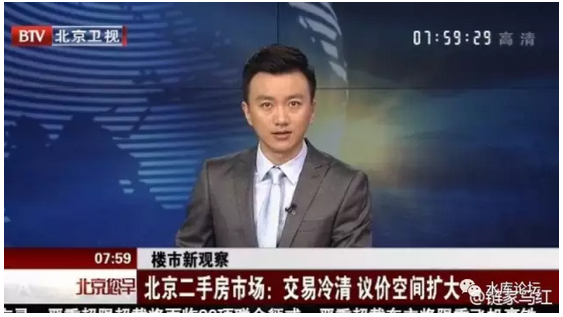
对于这样的咨询频道，俺只能瞠目结舌。

如果CCAV不说假话的话，那只能是俺买了个假电视机。

 

 

[上海：上海目前平稳。]

2016上海楼市，涨幅实在太猛。

一般认为2017属于温和盘整补涨的年份。之前落后的板块，会补涨。

 

上海楼市，平稳期是"换筹"的好时段。

觅盘淘笋，优化资产，精雕细作。

不需要竭力追涨。可以慢节奏，但也不要太慢慢。

 

 

[深圳：深圳是"北上深"的一个奇葩。]

深圳楼市最特殊之处，在于深圳可以"破限购"。

怎么破，入户！

 

在中国几乎所有的一线城市中，乃至一线+二线，深圳是唯一一个开放"户籍"大门的城市。

其入籍尺度之松，别说和北上的变态不能比。甚至比南京，杭州还要松。

 

因此很多内地省份，没有房票的人群。问到"破限购"，一线城市的选择。

我们一般的回答是深圳。

"天予弗取，反受其咎"，这么好的机会你不抢，以后可能门关了哭都来不及。

 

趁这千载难逢的机会，内地省份青壮年人士，应该尽可能尽快"移民"入户深圳。

或者把家中的户口，移一个过去。挂一个勾子。

进可攻，退可守。入户买房。

 

 

[重庆：大火燎油]

重庆我都不敢提了，《重庆卷》一共写了十篇。被网监删了五篇。

感觉背后有一双大眼在注视着。

 

重庆的涨幅，简直是一个奇迹。

去年8月，水库第一批群众入场时，建面在8000左右。

半年后3月，目前建面16000\~20000，而且还在疯涨。

 

第一批首付20%的人群，账面上已经有300\~500%的涨幅

 

重庆卷我只写了十篇。计划不再写了。

反正路已经指好了，"奇迹般"的钱也已经赚好了。俺不喝咖啡。

 

 

对于未来的岁月，目前重庆依然以每个月5%的速度在上涨。

而且"土著群众"被挑动了，觉醒了。900万人开始抢房子。

这是一件极其恐怖的事情。可以说重庆在普遍涨到"3/2/1"之前不会有任何阻力。

 

 

[武汉：武汉是中部一个热点]。

最近对武汉的关注问题也不少。分答客户询问水果湖。

"瓜田群"有专门的武汉破限购介绍。[\[3\]]

 

 

 

三）问题

 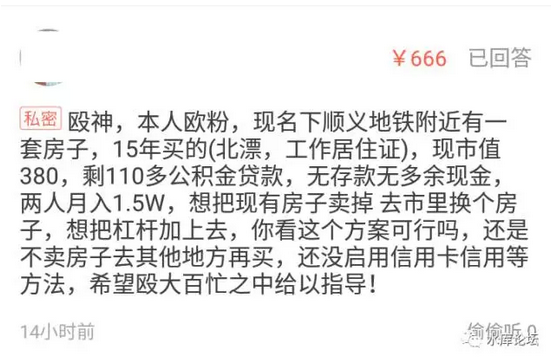
如图，问题一。

 

我的回答是：你目前换房，恐怕来不及。

因为目前北京，正处于一个极度上涨的迅猛期。而一般的交易流程，至少要四个月。

 

也就是你3月卖房，最快也要到7月拿钱。

你"卖出"的时候，是3月的价格。

你"买进"的时候，是7月的价格。

 

这里面"一进一出"，亏损可够大了。

所以"卖小换大"的策略不可行。要么就直接再买一套小的（环京），要么就只能观望了。

 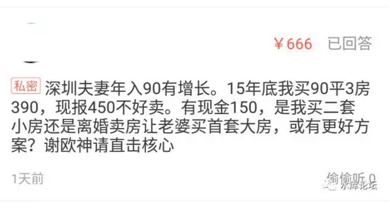
问题二：

 

答：2015年末买入，可能正好是"深圳行情"的末期。

因此，不必气馁。到2018年，或许深圳行情又来了。

 

另，我们一般是离婚后不卖小房，直接买大房的。

 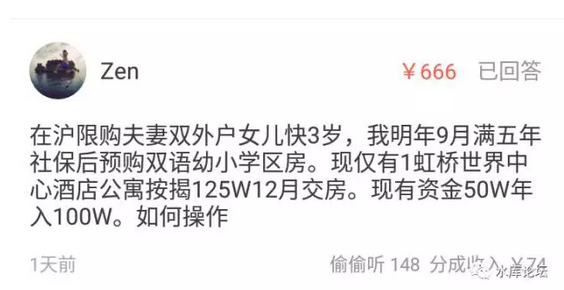
问题三；

 

我后来追问问了一下，确认作者的意思是："2018年9月"满社保五年再买。

 

这样的做法，是会有很大的风险的。

因为2017.3和2018.9绝对不是相同的价格。

 

上海楼市每一个周期，大约是24个月。

2016涨得太凶，2017一般认为是盘整年。

你最晚拖到2017.12圣诞节前后。再往后拖，就会有很大的风险。

 

难保三房变二房，二房变一房。

 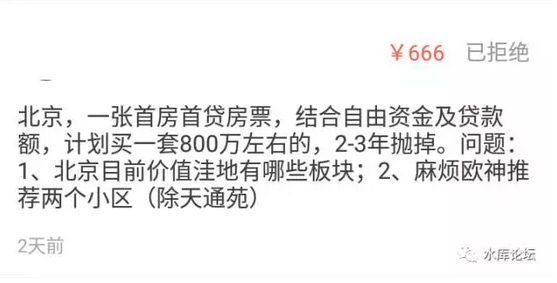
问题四；

 

这个问题，是非常惨痛地"拒绝"的。

全额退款。

退款备注为："北京800W无笋盘"。

 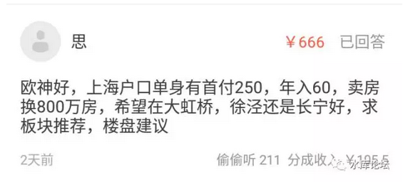
答：大虹桥目前大家都十分看好，普遍认为是"明日之星"。

2018\~2019的开发重点。

 

大虹桥主要分徐泾和华漕南二块。

 

就笋盘而言，目前主要是爱博12345，性价比比较高。

 

新虹桥雅苑，海天，属于高档楼盘。土豪自住适合，但回报率堪忧。

 

（海天顶楼，可以直接遥望陆家嘴三件套。感谢长公子提供照片）

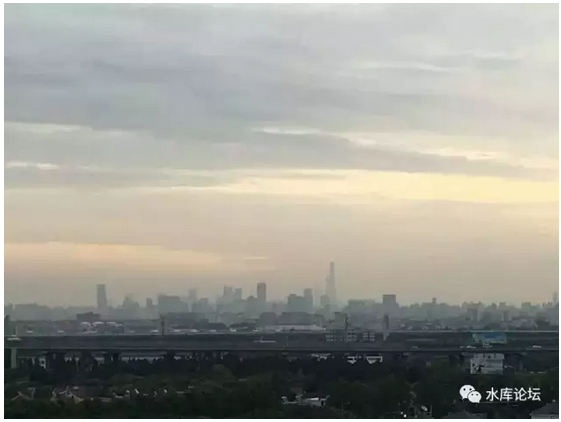
万科时一区，富力，仁恒西郊，都属于CEO盘。

价格贵得要命，品质还无出彩之处。不推荐。

 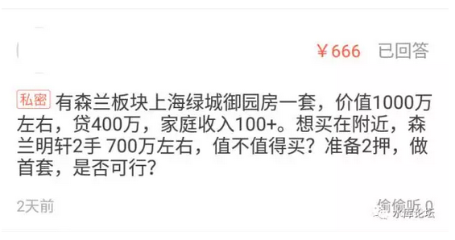
问题六；

 

答：我对森兰没兴趣。2011年"仁恒森兰雅苑"就以48000/m单价开盘，属于毫无涨幅的坑盘。

外高桥在上海版图上，是天涯海角一般被人遗忘的角落。除非在保税区上班，否则没有必要关注。

 

顺着杨高路往里开，到金桥/金高路一带附近。有一些别墅性价比很高。甚至比公寓还便宜。例如东源丽晶，阳光欧洲城。

 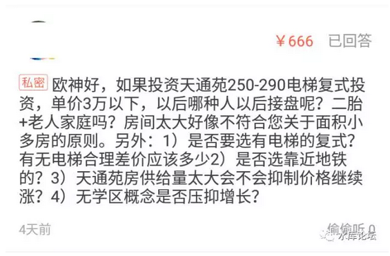
问题七；

 

答：1）我这个流派不是"面积小多房"派，而是"大面积低单价"流派。

 

我这流派的手法，是通过"资产组合包"搭配，长短搭配，大小搭配，远近搭配，达到筹码错开。

这样，我可以有一个很长的时间来卖房子。甚至一套房可以卖5年，8年。

 

在漫长的历史长河中，你总能慢慢的解决流动性问题。

只要时间足够久，总是可以找到适合类型的买家的。慢慢卖。

 

 

2）天通苑不便宜。目前"小二居"，120平米那种二房，也要卖到4\~4.2万。

而280平米的八房，"大户型"单价特别地低。可能只有2.7\~2.9万。

 

这是极其不正常的。你算一下总价，120\*42000=504W

280\*28000=784W

 

其实总价也就只差280W，算上三成首付，就更是小钱。

二百多万在北京算很多钱么。再过几年，二百万就换一个厮所。

 

3）任何高压线，楼层，景观，朝向，一切都可以换算成金钱。

在绝对的低价面前，其他都不足为虑。

 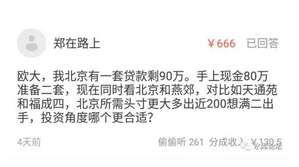
问题八；

 

答：福成四是个好房子，旁边别人都卖3.7万，他只要2.6万。

而且栋距很大，视野开阔。

 

问题是，同样的27000单价，买燕郊，干嘛不买天通苑？

 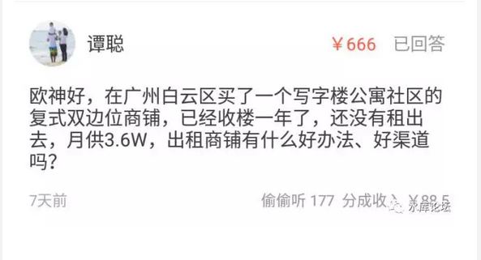
问题九；

 

答：你为什么要买这个铺呢。商铺如果租不出去，如果长期租不出去，那就只有一个可能："你买的是死铺"。

死铺是根本救不活的。你在战术上就错了。你正确的做法，应该是根本不要买这铺。

 

商铺的空置是很可怕的，如果住宅空置是一二个月，则商铺的空置可能是一年二年。动辄以年计。

 

追问）如何救命呢

 

答：住宅如果你租不掉，你打折，打八折七折，总是有人租的。肯定会有人不惜多走几步路，多爬几层楼，不会空置。

 

但是商铺不同，商铺租金一般占营业总支出的20%，客户是通盘考虑的。

如果你这个地方位置不佳，人流不足，生意都没有。

你商铺租金打八折七折，影响轻微。

 

 

一般业内老手遇到这种情况，都是"劈楼价"。

劈楼价，上限五折起。上手就打对折，只求出租。

下限就没底了。下限是零折，甚至有赠送一年二年房租的。

 

商铺另一个秘诀，是赶快把第一个客户迎进来。

只要客户开始装修了，进场了，消费者关系都建立起来。口碑老客户都有了。

做成"熟铺"，后面就是我牛了。

商铺第一个客户最重要。

 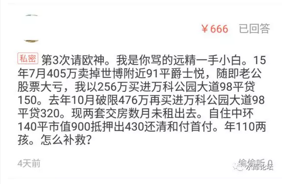
问题十；

 

答：你把世博内环的房子，按照45000/m卖掉。

转手48000/m，买进"郊环外"的万科房子。

一套换一套。

我也真是醉了..................

 

你这个情况，哪怕再给你一笔钱，你这个"远郊一手精装CEO"脾气不改掉的话，那也是白白让你烧钱的。

不如不折腾了。

 

追问）神也救不了我

 

答：贵妇流，我也救不了你............

 

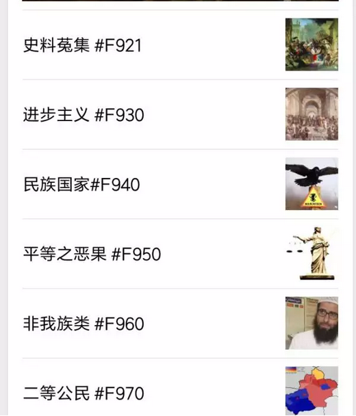

（yevon\_ou\@163.com，2017年3月11日午）

 

 

[\[1\]]房产类论收入，仅次于董藩，冯仑

[\[2\]]《2017年2月，北京楼市已癫狂。。。》https://baijiahao.baidu.com/po/feed/share?wfr=spider&for=pc&context=%7B%22sourceFrom%22%3A%22bjh%22%2C%22nid%22%3A%22news\_3302378473246016520%22%7D

[\[3\]]据说还有更猛的破限购方法。请关注"一亩瓜田"付费问答。
