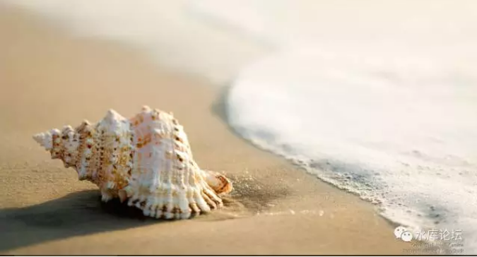
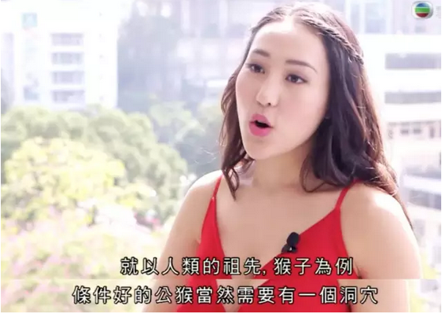
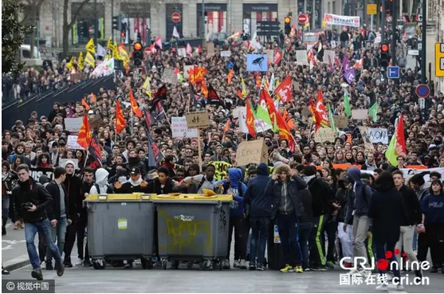

# 上海楼市往事（8）\#1240
-----------------------

原创： yevon\_ou [[水库论坛]](/) 2017-03-14

上海楼市往事（8）~\#1240~
=====================================================================================================================

 

副标题：隐士和江湖

时间：2002\~2003年

 

 

越过越好

 

 

一）前言

 

﹝承接上海楼市往事（7）﹞

 

最迟至2003年时，事情已显得极为明显。

 

朱相号称叫"国债总理"。每当政府缺钱时，他就发国债。千难万难绝不肯开动印钞机。因此他把市场利率拉得很高，资产价格很低。

 

而秀相不肯发国债这么辛苦而且又得罪人的事。《央行法》对他没什么束缚。因此M2必然狂飙。

二位交棒之际，M2=11万亿。

 

 

 

二）水底下的老克勒

 

2001年梁振英找到"上海实业"董事长，对他说：

"上海的唐楼~（老公房）~价值严重低估，我建议我们各拿三亿出来，在市场上扫掉5000套货源"。

"如果执行顺利的话，则再追加3亿"。

 

蔡董大为动心。左算右算，这笔生意大大地赚钱。

可是转念一想，party的干部。"炒房子"终究落人口实。官场上恐怕难以洗刷。

考虑再三，最后还是婉拒了。

 

 

 

很多年以后，我事后复盘。午夜深处，仔细想想这一切，总觉得水底下应该还有一股力量。

因为上海楼市在2002\~2005的涨势很不正常。

 

我2002.6年花57W买了一套房子，到2005.04卖掉175W。

扣除装修费4W，回报率正好是300%

 

 

我们知道，上海楼市十七年大约涨了十七倍。

但是这些倍数，并不是平均分布的。

大概第一个四年，就涨了三倍。

再花了六年，涨了三倍。

再花了六年，涨了二倍。

 

 

上海的2002，2003，2004年都是特大牛市。

三年三倍的话，房价大概以每年+40%的速度在上涨。每个月3%

当时的火爆程度，真的可以说日新月异。

完全无惮季节性影响，持续不断地涨。

 

 

而另一方面，房租在盘稳。

2002年俺刚入行时，住宅的租金回报有7%，商业的高达10%

此后2002\~2005房价连涨三年，租金的增幅却不多。最多不足+50%。

房价涨了三倍的结果，就是房租回报，跌到了仅有住宅3.5%/老公房5%

 

 

因此，2002\~2005冲进去买房子的人，绝对不是冲着租金回报的。

无论租金是多少，他们都非买不可。

我想来想去，这一定是避险资金。

 

 

秀相的白左倾向，是很多人都看得出来的。

因此2002\~2005"牛市中的牛市"，其实是一种避险需求。

 

 

有无数无数象我这样的人。发疯一样地把手里所有的子弹都打光。

把家庭财产中一切能收回的资金全部都打光。全部都换成砖头。

这属于"资产组合"的再配置，因而是一次性的。

如此"牛市中的牛市"，以后再也没有发生过。

 

 

那么，谁是这类"先知先觉"的人群呢。

肯定还有一股力量。

既然梁振英之类"基金/财团"并没有大规模建仓记载。那么唯一的可能，水底下还潜伏着一群老克勒。

 

上海是经济中心，昔日的远东大都市。

历史和文化底蕴还有，总有龙蛇难数。

 

 

 

三）隐士的世界

 

我为什么那么讨厌通货膨胀。讨厌一切"[[吃毒药长内力]](http://mp.weixin.qq.com/s?__biz=MzAxNTMxMTc0MA==&mid=403530885&idx=1&sn=53c615c338024587afaa293a9f90eb23&scene=21#wechat_redirect)"的事情。

因为通货膨胀，摧毁了中国人的道德。

 

 

许多人都会有一个梦。譬如在道教徒的心中，"采菊东篱下，悠然见南山。"

道教徒心中的理想世界，是小楼一夜听春雨。

觅一处竹楼，养几只小鸡。

红袖添香，举案齐眉。

Wifi，外卖，一应俱全。

 

我并没有什么政治野心，只想关起门来过我的小日子。

顺着水流逐筏而下，到山野间寻找神仙的踪迹。

 

 

而通货膨胀，把这一切都毁了！

很多人有没有想过，你从小到大的"隐士梦"。到了山野间，偶遇一个绝世高手。水平超过当世一切高手。

指点你几招，让你到红尘中一谱传奇。

列子御风而行。"隐士"过着神仙般的生活，出世孤立，却依然对红尘保持巨大的财富和影响力。

 

 

 

而在"通货膨胀"下，这一切都是不可能的。

你见过"穷得讨饭"的隐士么。

 

如果你当年携带了一笔"巨款"归隐，它可以支撑你多少年。

20W

200W

2000W

2.9亿？

 

前二天有一个家伙问我，"2.9亿是不是真的可以财务自由"。

我冷冷地瞪了他一眼，"一个包子200W，你可以买多少个"。

 

 

 

在"通货膨胀"的状态下，根本不存在"隐士"。根本不存在独立的生活。

你必须要搅进红尘中，你必须要纠缠进这个名利场。

哪怕你一笔赚到再多的钱，你也经不住每10年砍掉一个零，每20年砍掉二个零。

所有人都必须弄污脏手

人格之独立不复存在

 

因此"水底下的老克勒"，中国如果还存在隐士和高人。他们也一定是居住在大城市的。京沪。

你必须和红尘保持非常紧密的联络，必要时出手一二次。给自己的财富加个零。这样你才不会被时代淘汰。

 

只有通货紧缩的时代，才会存在隐士，高人。深山碧水找到大龙。

通货膨胀的年代，任何人都必须紧紧团结在中央周围。

 

 

 

四）大时代前的普通人

 

后人回顾2000\~2017年，往往称之为炒楼的"黄金时代"。

甚至可以说，"过去十七年中，只要你不买房，你做任何产业都是错的"。

 

 

但是，当这样一个"大时代"徐徐拉开序幕时。时代中的普通人在干什么。

答案是：他们懵懂无知。

 

 

2002年我察觉到不对。之后几乎一年的时间内，逐步将所有的钱全部都抽回来，尽力换成了砖头。

第一步是股市资金，股票逐渐减仓。

第二步是银行定存，费尽口舌转成活期。

第三步是一些放出去的钱。对塑料铅桶小厂的投资。

第四笔是一些外汇，原本准备出国的钱。不顾所有人的诧异也换成了本币。

 

到了2003年末之前，除了一些生活资金，我手里95%都是房子了。

全仓，满仓，极重仓，在楼市起飞的前夜。

 

唯一可惜的是，2003年的整体大环境，"金融配套"水平远远不如今天。

在当年，几乎只有"按揭"贷款。今日眼花缭乱的一切手法，在当时都不存在。

 

"第三个负号"，负现金，负现金流，负本金流。

当年只能勉勉强强做到了零现金。

 

（划重点：2003年打光了所有子弹现金。这条线以后有展开说明）

 

 

 

我的家族，世代都是教书匠。

教书这一行，它有一百个好。就是有一个缺点：没钱，实在没钱。

到了祖宗这一代，实在是穷得苦了，实在是穷得怨了。所以立下规矩，"不许做（穷）教书匠"。

后代子孙自谋出路去吧，最好做个财迷。

不过"好为人师"的习性，却是骨子里传下来了。磕叨简直话痨。

 

 

2003年等我建完仓后，俺就忍不住，和周围的人说；

"买房子好啊，我看房子要大涨"。

"最新的土地拍卖，面粉已经贵过面包价了（2003年）"

"政府最新宣布，要减少土地供应"。

 

 

说这些话的效果呢，就是完全无效。

除了家族二支近支，其他再也没有人买房了。

 

 

 

许许多年以后我复盘，仔细回想当年的情况。我总结觉得当时的人，是被长期的"通货紧缩"现象蒙蔽了。

高宗/朱相的时代，可能是中国人最漫长的通货紧缩。生产力迅猛发展，消费者最幸福的时代。

 

"通货紧缩"的意思，你不需要很努力。

身边的科技，自然会进步，会降价。

 

 

就好比今天我们也不怎么努力。

但"微信"突然出现了，把我们的生活和交流，整理得简单无比。真好玩。

 

"京东"也突然出现了。随之而来的，还有强大无比的物流网络。

你只要敲敲键盘鼠标，"一日三送"，下午就送货上门。

 

你需要做什么么？你什么也不需要奋斗。

时代在推动着你。时代的进步，使得普通人也越过越好。

 

 

 

因为高宗/朱相长期的幸福生活，使得普通人产生了一种幻觉。

"未来的日子，不会比今天差"。

"买房子，不如下午去做头发"。

 

 

你在他们耳边狂吼，"快买房啊"。

"不买房你会死啊，没楼没高潮"。

"买不起房子，不能住在北京"

"买不起房子，没有妹纸，没有ZMN"

 
这一些"苦难"的话语，对于当时的"普通人"来说。

他们表示难以理解。

难道生活，不是天生必然应该越过越好的么。[\[1\]]

 

 

[我们知道，秀相其实是和朱相非常不同的人。]

你的生活，并不注定越变越好。

 

（生活并不一定越过越好，21CN法国年轻人可能是第一个[生活水准]低于其父辈的世代。图为失业者游荇）

五）结语

 

在幸福的治下，每个人都过得差不多。

在不幸的治下，生存技能才会逐渐显现威力。

 

 

很多人都有"家学"。家学是独立思考，以及对威权的深深怀疑。

我们知道，Freedom is not free。

每天下午去烫个头发，然后生活就会越变越好。这种事情并不必然发生。

 

同样道理，今天的恒纪元治世也并不永恒。

 

 

 

（yevon\_ou\@163.com，2017年3月14日子夜）
