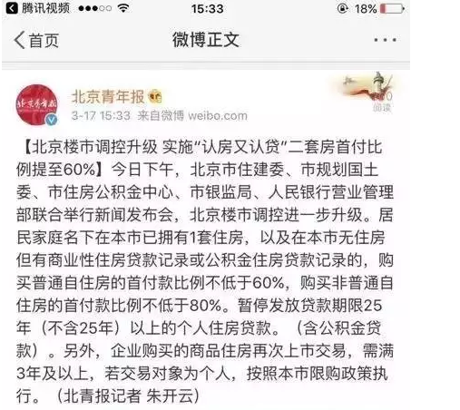
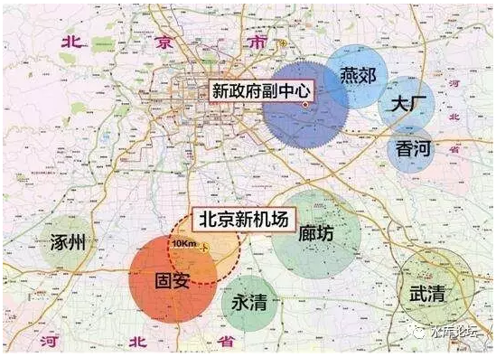
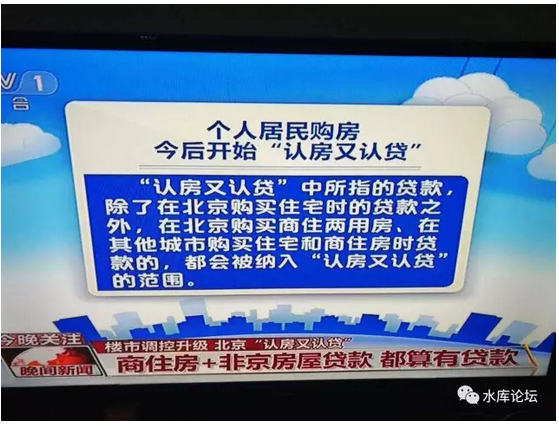

# 2017.03.17北京调控政策分析 \#1260

原创： yevon\_ou [水库论坛](/)

**水库论坛**

微信号 Shuiku-net

功能介绍 科学尚未普及

2017-03-18

2017.03.17北京调控政策分析 ~\#1260~

巨人耸动肩膀，蝼蚁粉身碎骨。

 

 

 

一）目的

 

人类作为灵长目动物存在，凡事皆先有目的，后有行为。

做任何事之前，尤其是大型的成组织的计划，一定是为了达成某一个目的。为了某一种利益。

 

最令我们困淆不解的。目的何在。

 

 

 

我们先来总结一下近期发生的事，一句话概括："北京在赶人"。

-   严控大城市人口

-   严控大城市供地

-   菜市场，批发市场，建材市场外迁

-   街头小贩扫荡

 

 

目前在北京开一家蛋糕坊，他会要求你不小于450平米的整体厨房。

而另一方面，北京不再审批任何新增工业用地。

其实就是把你往外面赶。

 

在北京的二环以内，有大量的菜市场，批发市场。

在提供极低廉生存成本的同时，又养活了大量的工作岗位。

但是北京目前在大规模拆迁和搬迁菜市场。二环内找一个菜场越来越难。

这实质是逼得"低端人群"无法生存。

抬高你的生存成本。逼得你活不下去离开北京。

 

 

对于这些政策，俺全部都不反对。

我只想问一个问题，如果是打大麻将的话，那么Objective是什么，目的是什么。

 

 

 

二）楼市

 

要分析北京的房地产市场，那真是天下最简单的事。

 

 

一方面，随着M2的*深度金融化内卷积自我繁殖衍化*[\[1\]]，天下财赋聚于北京。

在国内城市的竞争中，北京已经远远把上海，深圳抛在了后面。

北京是"超一线城市"。

 

我们知道，"人往高处走，水往低处流"。

一个城市有钱，有VC机会，有高收入码农岗位。有"北京梦"和一夜暴富的幻想。

自然会吸引全国青年人源源不断地北漂。

谁知道烤串的时候，会不会撞见马云呢。

 

 

 

另一方面，2017年的北京，处于一种十分"诡异"的状态。

北京正在"收缩"。

面对全国汹涌而来的年轻人，北京不是大肆扩张，迅速成长成五千万人口的超国际大都市。

 

相反的，北京在"收缩"。

包括但不限于收紧供地，打压商住，清理地下室。

 

 

 

我们知道，"供求关系"是最主要的经济学原理。

"需求"庞大。

"供应"收紧。

房价自然飞涨。逻辑极简单。

 

 

成年人的世界，凡事皆有目的。

你要说，大领导们不知道"供需"失衡么。肯定知道得清清楚楚。

在"房价飞涨"面前，有一个更重要的目标。

 

这个目标，使得他们哪怕"忍受"北京楼价飞涨。

忍受北漂们的唠叨和抱怨。

忍受GDP和生产力的损失。

忍受抵触不满和骂名。

也非得要完成不可。

 

 

这个目标，简单看是"降低北京人口"。

那么问题来了，为什么这个目标如此重要。有什么价值，值得么，台底下是什么。

呵呵，哥哥泡茶去了。

不喝咖啡。

 

 

 

三）利益分析

 

学Marketing的人，除了宏观分析。自然更喜欢微观分析。

你把市场切碎了，用放大镜看，分为几个群体。则受益面各自不同。

 

 

最大的赢家，是环京。

 

环京本身就是北京的"溢出"需求。

如果北京能住的话，是不会有人买到环京去的。

 

因为北京的"限购限贷"，而且不仅城八区，连远郊顺义怀柔都算进去了。

所以昌平顺义延庆无法发展，把购买力拱手让给了环京。

 

 

这次北京的"限购"升级。而环京并没有跟上。

对环京是一个巨大的利好。

尤其是燕郊的小火车，每天9元轰轰烈烈的进城。再喜感不过了。

 

 

 

第二个利益相关者，是商住。

"北京限购"原本对商住是一个巨大的利好。直到我们看到这条新闻。

 
第三个利益相关者，是外省。

对于"全国性"的买家，他们是在全中国布局的。

 

"北上深"，不仅仅一线城市可以买。

而且重庆，天津，南京，杭州等二线城市也可以买。

 

 

 

之前2016.11.28上海"认房又认贷"，购买力被逼去了北京不少。

如今北京的限购限贷升级，购买力如水，肯定又会逼到别的城市。

 

我们知道，昨天最大新闻是"北京"。

但其实昨晚纷纷扰扰，新闻还要多得多。广州，石家庄，郑州同时限购。只不过在京城人眼中，都算乡下了吧。

 

《北京石家庄广州郑州4城同日出台限购半月内16城加码》[\[2\]]

 

 

目前，全国"未限购"敞开让你买，而且城市要有潜力，有长远增长动力的，只剩下最后几个天堂。

要建仓就抓紧了。别等门关了，空流泪啊。

 

 

 

四）北京楼市

 

最后，回到我们普遍关心，核心的一个问题："北京楼市会不会跌，价格会怎么走"。

每一次类似调控出台，看空群众欢欣鼓舞。此类问题恨不得问个二百次。最好能听到一声爹。

 

有这个闲工夫，您上分答来问哥哥呀。

 

（付费问答，666/问题。房产类排中国第三）

 

 

你要知道一件事。"限购限贷"这种事，不增加一平米的楼市供应。其本质是"交易成本"。

天底下的事，只要你不增加供应。

长线来看，都是耍流氓。

 

 

 

若要我打比喻的话，"认房又认贷"象一块刹车片。

要知道，2017.1\~2月，北京楼市的涨幅是非常迅猛的。一般认为每周3%。

 

 

"调控之后"，相当于踩刹车。

原本迅猛狂飙的速度，有可能被刹下来了。按照惯性，或许还会滑行一段时间。预期可能还会有10%的惯性涨幅。

然后就被完全刹车止住了。

 

如果我们相信各城市之间可以参照的话，2016.11.28上海"认房又认"调控之后，市场急剧降温。

11月，12月，平均成交量仅有10000套左右。不足高峰期的三成。

但是价格呢，纹丝未动。

 

你什么时候见过踩刹车踩到倒车的。

调控从来没使楼市下跌过，不要用股市的眼光来看待楼市。

 

 

 

因为对于楼市，它有自己的特性。绝大多数的人，只有"一套多余房子"。

我们知道，做买卖，术语称做"薄利多销"。

 

什么时候要降价促销呢。当我需要"跑量"的时候。

好比我有1000套房子，有或者有1亿股股票。那我拿100套出来，"薄利多销"走走量掩护大部队。

 

但是对于楼市，尤其是二手房市场。

绝大多数的卖家，都只有"一套多余房子"。

 

薄利多销，您开什么玩笑呢。

我一共就一套。还多销呢。

 

 

 

当你只有"一套"的时候，你的游戏规则就变成了"吊起来卖"。慢慢卖，但一定要价格最大化。

如果外部的市场环境不好。那怎么办。慢慢熬呗。

 

我反正也不急，我和你"耗长命"。

绝大多数的西城，东城房产，其负债率都是零。房东成本低到可以忽略。

我反正不急。您小孩要上学，你急。

 

 

这段"对耗期"一般会至少持续9\~10个月。

然后市场慢慢启动，慢慢恢复冰封期。真的要买房，总有办法的。再说新韭菜也在源源不断进入市场。

(顺便说一句，交易量大幅下降。地方政府也坐不住，税少了)

 

 

因此我们对"调控"政策的定位，就是刹车片。

他可能使楼市减速，止步。一直到若干个月后重新启动。

但您见过刹车刹到倒车么，没有。

 

 

 

（yevon\_ou\@163.com，2017年3月18日午）

 

 

 

 

[\[1\]]俗称：印钞

[\[2\]]《北京石家庄广州郑州4城同日出台限购半月内16城加码》http://www.bosidata.com/news/F743827XU3.html
